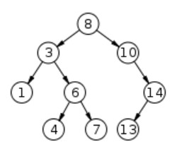
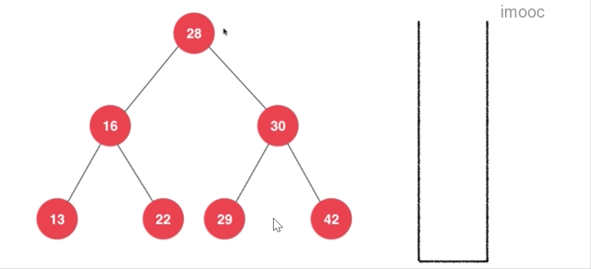
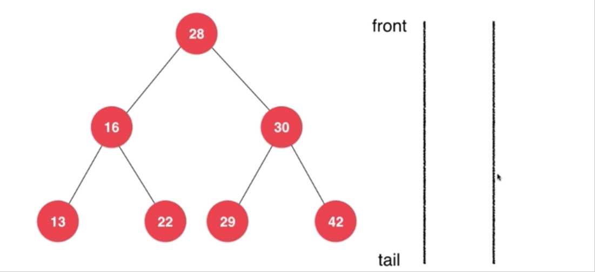

# 【树】二分搜索树（1）

<br/>

## 1、概念

<br/>

- 见 [【树】树](https://yyscyber.github.io/computer-basic/data-structures-and-algorithms/imooc/dsna-system-2021/6448bd2f-7836-4be6-bec9-90d6c1e09bb3) 中“2.2.3、二分搜索树”。
- 这里所使用的二分搜索树的定义为一般定义，即任何节点存储的内容大于其左子树的所有节点、小于其右子树的所有节点，不存在存储内容重复的节点。

---

## 2、Java 代码实现

<br/>

### 2.1、基本

- 因为二分搜索树的特点，要求节点中所储存的内容必须具有可比较性，所以在 Java 语言中，要求存储在树中的对象必须实现`java.lang.Comparable<T>`接口以实现“可比较性”。


```java
public class BinarySearchTree<E extends Comparable<E>> {

    /**
     * 节点
     */
    private class Node<E> {
        public E e;
        public Node<E> leftChild;
        public Node<E> rightChild;

        public Node() {
            this(null, null, null);
        }

        public Node(E e) {
            this(e, null, null);
        }

        public Node(E e, Node<E> leftChild, Node<E> rightChild) {
            this.e = e;
            this.leftChild = leftChild;
            this.rightChild = rightChild;
        }
    }

    /**
     * 根节点
     */
    private Node<E> root;

    /**
     * 节点数
     */
    private int size;

    public BinarySearchTree() {
        this.root = null;
        this.size = 0;
    }
    
    public int getSize() {
        return this.size;
    }

    public boolean isEmpty() {
        return size == 0;
    }

}
```


---

### 2.2、向二分搜索树中添加节点

#### 2.2.1、非递归实现


```java
public class BinarySearchTree<E extends Comparable<E>> {

    /**
     * 节点
     */
    private class Node<E> {
        public E e;
        public Node<E> leftChild;
        public Node<E> rightChild;

        public Node() {
            this(null, null, null);
        }

        public Node(E e) {
            this(e, null, null);
        }

        public Node(E e, Node<E> leftChild, Node<E> rightChild) {
            this.e = e;
            this.leftChild = leftChild;
            this.rightChild = rightChild;
        }
    }

    /**
     * 根节点
     */
    private Node<E> root;

    /**
     * 节点数
     */
    private int size;

    public BinarySearchTree() {
        this.root = null;
        this.size = 0;
    }

    public void add(E e) {
        if (e == null) {
            return;
        }

        if (root == null) {
            root = new Node<>(e);
            size++;
        } else {
            Node<E> newNode = new Node<>(e);

            Node<E> curNode = root;
            Node<E> preNode = curNode;

            while (curNode != null) {
                preNode = curNode;
                if (e.compareTo(curNode.e) == 0) {
                    break;
                } else if (e.compareTo(curNode.e) > 0) {
                    curNode = curNode.rightChild;
                } else {
                    curNode = curNode.leftChild;
                }
            }

            if (e.compareTo(preNode.e) == 0) {
                return;
            }
            
            if (e.compareTo(preNode.e) > 0) {
                preNode.rightChild = newNode;
            } else {
                preNode.leftChild = newNode;
            }
            size++;
        }
    }

    public int getSize() {
        return this.size;
    }

    public boolean isEmpty() {
        return size == 0;
    }

}
```


```java
public class BinarySearchTree<E extends Comparable<E>> {

    /**
     * 节点
     */
    private class Node<E> {
        public E e;
        public Node<E> leftChild;
        public Node<E> rightChild;

        public Node() {
            this(null, null, null);
        }

        public Node(E e) {
            this(e, null, null);
        }

        public Node(E e, Node<E> leftChild, Node<E> rightChild) {
            this.e = e;
            this.leftChild = leftChild;
            this.rightChild = rightChild;
        }
    }

    /**
     * 根节点
     */
    private Node<E> root;

    /**
     * 节点数
     */
    private int size;

    public BinarySearchTree() {
        this.root = null;
        this.size = 0;
    }

    public void add(E e) {
        if (e == null) {
            return;
        }
        if (root == null) {
            root = new Node<>(e);
            size++;
        } else {
            Node<E> curNode = root;
            while (true) {
                if (e.compareTo(curNode.e) == 0) {
                    break;
                } else if (e.compareTo(curNode.e) < 0) {
                    if (curNode.leftChild == null) {
                        curNode.leftChild = new Node<>(e);
                        size++;
                        break;
                    } else {
                        curNode = curNode.leftChild;
                    }
                } else {
                    if (curNode.rightChild == null) {
                        curNode.rightChild = new Node<>(e);
                        size++;
                        break;
                    } else {
                        curNode = curNode.rightChild;
                    }
                }
            }
        }
    }

    public int getSize() {
        return this.size;
    }

    public boolean isEmpty() {
        return size == 0;
    }

}
```


---

#### 2.2.2、递归实现


```java
public class BinarySearchTree<E extends Comparable<E>> {

    /**
     * 节点
     */
    private class Node<E> {
        public E e;
        public Node<E> leftChild;
        public Node<E> rightChild;

        public Node() {
            this(null, null, null);
        }

        public Node(E e) {
            this(e, null, null);
        }

        public Node(E e, Node<E> leftChild, Node<E> rightChild) {
            this.e = e;
            this.leftChild = leftChild;
            this.rightChild = rightChild;
        }
    }

    /**
     * 根节点
     */
    private Node<E> root;

    /**
     * 节点数
     */
    private int size;

    public BinarySearchTree() {
        this.root = null;
        this.size = 0;
    }

    /**
     * 向二分搜索树中插入元素 e，递归
     */
    public void add(E e) {
        if (e == null) {
            return;
        }
        // root 为 null 单独考虑
        if (root == null) {
            root = new Node<>(e);
            size++;
        } else {
            add(root, e);
        }
    }

    /**
     * 向以 node 为根的二分搜索树中插入元素 e，递归
     *
     * 在该方法中，node 一定是非空的
     */
    private void add(Node<E> node, E e) {
        if (e.compareTo(node.e) == 0) {
            return;
        }

        if (e.compareTo(node.e) < 0 && node.leftChild == null) {
            node.leftChild = new Node<>(e);
            size++;
            return;
        }

        if (e.compareTo(node.e) > 0 && node.rightChild == null) {
            node.rightChild = new Node<>(e);
            size++;
            return;
        }

        if (e.compareTo(node.e) < 0) {
            // e < node.e
            add(node.leftChild, e);
        } else {
            // e > node.e
            add(node.rightChild, e);
        }
    }

    public int getSize() {
        return this.size;
    }

    public boolean isEmpty() {
        return size == 0;
    }

}
```


```java
public class BinarySearchTree<E extends Comparable<E>> {

    /**
     * 节点
     */
    private class Node<E> {
        public E e;
        public Node<E> leftChild;
        public Node<E> rightChild;

        public Node() {
            this(null, null, null);
        }

        public Node(E e) {
            this(e, null, null);
        }

        public Node(E e, Node<E> leftChild, Node<E> rightChild) {
            this.e = e;
            this.leftChild = leftChild;
            this.rightChild = rightChild;
        }
    }

    /**
     * 根节点
     */
    private Node<E> root;

    /**
     * 节点数
     */
    private int size;

    public BinarySearchTree() {
        this.root = null;
        this.size = 0;
    }

    public void add(E e) {
        if (e == null) {
            return;
        }
        root = add(root, e);
    }

    /**
     * 向以 node 为根的二分搜索树中插入元素 e，递归
     * 返回插入新节点后二分搜索树的根
     *
     * node 可以为 null
     */
    private Node<E> add(Node<E> node, E e) {
        if (node == null) {
            size++;
            return new Node<>(e);
        } else {
            if (e.compareTo(node.e) == 0) {
                return null;
            } else if (e.compareTo(node.e) < 0) {
                node.leftChild = add(node.leftChild, e);
                return node;
            } else {
                node.rightChild = add(node.rightChild, e);
                return node;
            }
        }
    }

    public int getSize() {
        return this.size;
    }

    public boolean isEmpty() {
        return size == 0;
    }

}
```


---

### 2.3、在二分搜索树中是否包含某一节点

#### 2.3.1、非递归实现


```java
public class BinarySearchTree<E extends Comparable<E>> {

    /**
     * 节点
     */
    private class Node<E> {
        public E e;
        public Node<E> leftChild;
        public Node<E> rightChild;

        public Node() {
            this(null, null, null);
        }

        public Node(E e) {
            this(e, null, null);
        }

        public Node(E e, Node<E> leftChild, Node<E> rightChild) {
            this.e = e;
            this.leftChild = leftChild;
            this.rightChild = rightChild;
        }
    }

    /**
     * 根节点
     */
    private Node<E> root;

    /**
     * 节点数
     */
    private int size;

    public BinarySearchTree() {
        this.root = null;
        this.size = 0;
    }

    public void add(E e) {
        if (e == null) {
            return;
        }

        if (root == null) {
            root = new Node<>(e);
            size++;
        } else {
            Node<E> newNode = new Node<>(e);

            Node<E> curNode = root;
            Node<E> preNode = curNode;

            while (curNode != null) {
                preNode = curNode;
                if (e.compareTo(curNode.e) == 0) {
                    break;
                } else if (e.compareTo(curNode.e) > 0) {
                    curNode = curNode.rightChild;
                } else {
                    curNode = curNode.leftChild;
                }
            }

            if (e.compareTo(preNode.e) == 0) {
                return;
            }

            if (e.compareTo(preNode.e) > 0) {
                preNode.rightChild = newNode;
            } else {
                preNode.leftChild = newNode;
            }
            size++;
        }
    }

    public void add2(E e) {
        if (e == null) {
            return;
        }
        if (root == null) {
            root = new Node<>(e);
            size++;
        } else {
            Node<E> curNode = root;
            while (true) {
                if (e.compareTo(curNode.e) == 0) {
                    break;
                } else if (e.compareTo(curNode.e) < 0) {
                    if (curNode.leftChild == null) {
                        curNode.leftChild = new Node<>(e);
                        size++;
                        break;
                    } else {
                        curNode = curNode.leftChild;
                    }
                } else {
                    if (curNode.rightChild == null) {
                        curNode.rightChild = new Node<>(e);
                        size++;
                        break;
                    } else {
                        curNode = curNode.rightChild;
                    }
                }
            }
        }
    }

    /*
     * 在二分搜索树中是否包含某一节点
     */
    public boolean contains(E e) {
        if (e == null) {
            return true; // 这里根据实际确定返回 true 还是 false
        }

        if (root == null) {
            return false;
        }

        Node<E> node = root;
        boolean result = false;
        while (node != null) {
            if (e.compareTo(node.e) == 0) {
                result = true;
                break;
            } else if (e.compareTo(node.e) < 0) {
                node = node.leftChild;
            } else {
                node = node.rightChild;
            }
        }
        return result;
    }

    public int getSize() {
        return this.size;
    }

    public boolean isEmpty() {
        return size == 0;
    }

}
```


---

#### 2.3.2、递归实现


```java
public class BinarySearchTree<E extends Comparable<E>> {

    /**
     * 节点
     */
    private class Node<E> {
        public E e;
        public Node<E> leftChild;
        public Node<E> rightChild;

        public Node() {
            this(null, null, null);
        }

        public Node(E e) {
            this(e, null, null);
        }

        public Node(E e, Node<E> leftChild, Node<E> rightChild) {
            this.e = e;
            this.leftChild = leftChild;
            this.rightChild = rightChild;
        }
    }

    /**
     * 根节点
     */
    private Node<E> root;

    /**
     * 节点数
     */
    private int size;

    public BinarySearchTree() {
        this.root = null;
        this.size = 0;
    }

    /**
     * 向二分搜索树中插入元素 e，递归
     */
    public void add(E e) {
        if (e == null) {
            return;
        }
        // root 为 null 单独考虑
        if (root == null) {
            root = new Node<>(e);
            size++;
        } else {
            add(root, e);
        }
    }

    /**
     * 向以 node 为根的二分搜索树中插入元素 e，递归
     *
     * 在该方法中，node 一定是非空的
     */
    private void add(Node<E> node, E e) {
        if (e.compareTo(node.e) == 0) {
            return;
        }

        if (e.compareTo(node.e) < 0 && node.leftChild == null) {
            node.leftChild = new Node<>(e);
            size++;
            return;
        }

        if (e.compareTo(node.e) > 0 && node.rightChild == null) {
            node.rightChild = new Node<>(e);
            size++;
            return;
        }

        if (e.compareTo(node.e) < 0) {
            // e < node.e
            add(node.leftChild, e);
        } else {
            // e > node.e
            add(node.rightChild, e);
        }
    }

    public boolean contains(E e) {
        if (e == null) {
            return true;
        }
        return contains(root, e);
    }

    /*
     * 以 node 为根的二分搜索树中是否包含 e
     */
    private boolean contains(Node<E> node, E e) {
        if (node == null) {
            return false;
        }
        if (e.compareTo(node.e) == 0) {
            return true;
        } else if (e.compareTo(node.e) < 0) {
            return contains(node.leftChild, e);
        } else {
            return contains(node.rightChild, e);
        }
    }

    public int getSize() {
        return this.size;
    }

    public boolean isEmpty() {
        return size == 0;
    }

}
```


---

### 2.4、遍历

- 二叉树的常见的遍历方式：前（先）序遍历（Pre-order Traversal）、中序遍历（In-order Traversal）、后序遍历（Post-order Traversal）、层序（次）遍历（Level Traversal）。
- 前（先）序遍历：对于二叉树中的**任何**子树，遍历顺序是：根、左子树、右子树。
- 中序遍历：对于二叉树中的**任何**子树，遍历顺序是：左子树、根、右子树。
- 后序遍历：对于二叉树中的**任何**子树，遍历顺序是：左子树、右子树、根。
- 层序（次）遍历：按层遍历，层从顶向下，每层从左到右。





- 上图二叉树，前序遍历的结果是：`8, 3, 1, 6, 4, 7, 10, 14, 13`。
- 上图二叉树，中序遍历的结果是：`1, 3, 4, 6, 7, 8, 10, 13, 14`。
- 上图二叉树，后序遍历的结果是：`1, 4, 7, 6, 3, 13, 14, 10, 8`。
- 上图二叉树，层序遍历的结果是：`8, 3, 10, 1, 6, 14, 4, 7, 13`。


- 二分搜索树的中序遍历的结果，是有序的（由小到大）。


#### 2.4.1、前序遍历

##### 2.4.1.1、递归实现


```java
public class BinarySearchTree<E extends Comparable<E>> {

    /**
     * 节点
     */
    private class Node<E> {
        public E e;
        public Node<E> leftChild;
        public Node<E> rightChild;

        public Node() {
            this(null, null, null);
        }

        public Node(E e) {
            this(e, null, null);
        }

        public Node(E e, Node<E> leftChild, Node<E> rightChild) {
            this.e = e;
            this.leftChild = leftChild;
            this.rightChild = rightChild;
        }
    }

    /**
     * 根节点
     */
    private Node<E> root;

    /**
     * 节点数
     */
    private int size;

    public BinarySearchTree() {
        this.root = null;
        this.size = 0;
    }

    /**
     * 向二分搜索树中插入元素 e
     */
    public void add(E e) {
        if (e == null) {
            return;
        }
        // root 为 null 单独考虑
        if (root == null) {
            root = new Node<>(e);
            size++;
        } else {
            add(root, e);
        }
    }

    /**
     * 向以 node 为根的二分搜索树中插入元素 e，递归
     *
     * 在该方法中，node 一定是非空的
     */
    private void add(Node<E> node, E e) {
        if (e.compareTo(node.e) == 0) {
            return;
        }

        if (e.compareTo(node.e) < 0 && node.leftChild == null) {
            node.leftChild = new Node<>(e);
            size++;
            return;
        }

        if (e.compareTo(node.e) > 0 && node.rightChild == null) {
            node.rightChild = new Node<>(e);
            size++;
            return;
        }

        if (e.compareTo(node.e) < 0) {
            // e < node.e
            add(node.leftChild, e);
        } else {
            // e > node.e
            add(node.rightChild, e);
        }
    }

    public boolean contains(E e) {
        if (e == null) {
            return true;
        }
        return contains(root, e);
    }

    private boolean contains(Node<E> node, E e) {
        if (node == null) {
            return false;
        }
        if (e.compareTo(node.e) == 0) {
            return true;
        } else if (e.compareTo(node.e) < 0) {
            return contains(node.leftChild, e);
        } else {
            return contains(node.rightChild, e);
        }
    }

    /**
     * 前序遍历
     */
    public void preOrder() {
        preOrder(root);
    }

    /**
     * 前序遍历
     * 递归
     */
    private void preOrder(Node<E> node) {
        if (node == null) {
            return;
        }
        System.out.println(node.e);
        preOrder(node.leftChild);
        preOrder(node.rightChild);
    }

    public int getSize() {
        return this.size;
    }

    public boolean isEmpty() {
        return size == 0;
    }

}
```


```java
public class BinarySearchTree<E extends Comparable<E>> {

    /**
     * 节点
     */
    private class Node<E> {
        public E e;
        public Node<E> leftChild;
        public Node<E> rightChild;

        public Node() {
            this(null, null, null);
        }

        public Node(E e) {
            this(e, null, null);
        }

        public Node(E e, Node<E> leftChild, Node<E> rightChild) {
            this.e = e;
            this.leftChild = leftChild;
            this.rightChild = rightChild;
        }
    }

    /**
     * 根节点
     */
    private Node<E> root;

    /**
     * 节点数
     */
    private int size;

    public BinarySearchTree() {
        this.root = null;
        this.size = 0;
    }

    /**
     * 向二分搜索树中插入元素 e
     */
    public void add(E e) {
        if (e == null) {
            return;
        }
        // root 为 null 单独考虑
        if (root == null) {
            root = new Node<>(e);
            size++;
        } else {
            add(root, e);
        }
    }

    /**
     * 向以 node 为根的二分搜索树中插入元素 e，递归
     *
     * 在该方法中，node 一定是非空的
     */
    private void add(Node<E> node, E e) {
        if (e.compareTo(node.e) == 0) {
            return;
        }

        if (e.compareTo(node.e) < 0 && node.leftChild == null) {
            node.leftChild = new Node<>(e);
            size++;
            return;
        }

        if (e.compareTo(node.e) > 0 && node.rightChild == null) {
            node.rightChild = new Node<>(e);
            size++;
            return;
        }

        if (e.compareTo(node.e) < 0) {
            // e < node.e
            add(node.leftChild, e);
        } else {
            // e > node.e
            add(node.rightChild, e);
        }
    }

    public boolean contains(E e) {
        if (e == null) {
            return true;
        }
        return contains(root, e);
    }

    private boolean contains(Node<E> node, E e) {
        if (node == null) {
            return false;
        }
        if (e.compareTo(node.e) == 0) {
            return true;
        } else if (e.compareTo(node.e) < 0) {
            return contains(node.leftChild, e);
        } else {
            return contains(node.rightChild, e);
        }
    }

    /**
     * 前序遍历
     */
    public void preOrder() {
        preOrder(root);
    }

    /**
     * 前序遍历
     * 递归
     */
    private void preOrder2(Node<E> node) {
        if (node != null) {
            System.out.println(node.e);
            preOrder(node.leftChild);
            preOrder(node.rightChild);
        }
    }

    public int getSize() {
        return this.size;
    }

    public boolean isEmpty() {
        return size == 0;
    }

}
```


```java
import java.util.ArrayList;
import java.util.List;

public class BinarySearchTree<E extends Comparable<E>> {

    /**
     * 节点
     */
    private class Node<E> {
        public E e;
        public Node<E> leftChild;
        public Node<E> rightChild;

        public Node() {
            this(null, null, null);
        }

        public Node(E e) {
            this(e, null, null);
        }

        public Node(E e, Node<E> leftChild, Node<E> rightChild) {
            this.e = e;
            this.leftChild = leftChild;
            this.rightChild = rightChild;
        }
    }

    /**
     * 根节点
     */
    private Node<E> root;

    /**
     * 节点数
     */
    private int size;

    public BinarySearchTree() {
        this.root = null;
        this.size = 0;
    }

    /**
     * 向二分搜索树中插入元素 e
     */
    public void add(E e) {
        if (e == null) {
            return;
        }
        // root 为 null 单独考虑
        if (root == null) {
            root = new Node<>(e);
            size++;
        } else {
            add(root, e);
        }
    }

    /**
     * 向以 node 为根的二分搜索树中插入元素 e，递归
     *
     * 在该方法中，node 一定是非空的
     */
    private void add(Node<E> node, E e) {
        if (e.compareTo(node.e) == 0) {
            return;
        }

        if (e.compareTo(node.e) < 0 && node.leftChild == null) {
            node.leftChild = new Node<>(e);
            size++;
            return;
        }

        if (e.compareTo(node.e) > 0 && node.rightChild == null) {
            node.rightChild = new Node<>(e);
            size++;
            return;
        }

        if (e.compareTo(node.e) < 0) {
            // e < node.e
            add(node.leftChild, e);
        } else {
            // e > node.e
            add(node.rightChild, e);
        }
    }

    public boolean contains(E e) {
        if (e == null) {
            return true;
        }
        return contains(root, e);
    }

    private boolean contains(Node<E> node, E e) {
        if (node == null) {
            return false;
        }
        if (e.compareTo(node.e) == 0) {
            return true;
        } else if (e.compareTo(node.e) < 0) {
            return contains(node.leftChild, e);
        } else {
            return contains(node.rightChild, e);
        }
    }

    /**
     * 前序遍历
     */
    public void preOrder() {
        preOrder2(root);
    }

    public List<E> preOrder() {
        List<E> storage = new ArrayList<>();
        preOrder(root, storage);
        return storage;
    }

    /**
     * 前序遍历
     * 递归
     */
    private void preOrder(Node<E> node, List<E> storage) {
        if (node == null) {
            return;
        }
        storage.add(node.e);
        preOrder(node.leftChild, storage);
        preOrder(node.rightChild, storage);
    }

    public int getSize() {
        return this.size;
    }

    public boolean isEmpty() {
        return size == 0;
    }

}
```


---

##### 2.4.1.2、非递归实现

- 非递归实现方式不唯一，下面所示只是其中一种。





```java
import java.util.ArrayList;
import java.util.List;
import java.util.Stack;

public class BinarySearchTree<E extends Comparable<E>> {

    /**
     * 节点
     */
    private class Node<E> {
        public E e;
        public Node<E> leftChild;
        public Node<E> rightChild;

        public Node() {
            this(null, null, null);
        }

        public Node(E e) {
            this(e, null, null);
        }

        public Node(E e, Node<E> leftChild, Node<E> rightChild) {
            this.e = e;
            this.leftChild = leftChild;
            this.rightChild = rightChild;
        }
    }

    /**
     * 根节点
     */
    private Node<E> root;

    /**
     * 节点数
     */
    private int size;

    public BinarySearchTree() {
        this.root = null;
        this.size = 0;
    }

    public void add(E e) {
        if (e == null) {
            return;
        }

        if (root == null) {
            root = new Node<>(e);
            size++;
        } else {
            Node<E> newNode = new Node<>(e);

            Node<E> curNode = root;
            Node<E> preNode = curNode;

            while (curNode != null) {
                preNode = curNode;
                if (e.compareTo(curNode.e) == 0) {
                    break;
                } else if (e.compareTo(curNode.e) > 0) {
                    curNode = curNode.rightChild;
                } else {
                    curNode = curNode.leftChild;
                }
            }

            if (e.compareTo(preNode.e) == 0) {
                return;
            }

            if (e.compareTo(preNode.e) > 0) {
                preNode.rightChild = newNode;
            } else {
                preNode.leftChild = newNode;
            }
            size++;
        }
    }

    public void add2(E e) {
        if (e == null) {
            return;
        }
        if (root == null) {
            root = new Node<>(e);
            size++;
        } else {
            Node<E> curNode = root;
            while (true) {
                if (e.compareTo(curNode.e) == 0) {
                    break;
                } else if (e.compareTo(curNode.e) < 0) {
                    if (curNode.leftChild == null) {
                        curNode.leftChild = new Node<>(e);
                        size++;
                        break;
                    } else {
                        curNode = curNode.leftChild;
                    }
                } else {
                    if (curNode.rightChild == null) {
                        curNode.rightChild = new Node<>(e);
                        size++;
                        break;
                    } else {
                        curNode = curNode.rightChild;
                    }
                }
            }
        }
    }

    public boolean contains(E e) {
        if (e == null) {
            return true;
        }

        if (root == null) {
            return false;
        }

        Node<E> node = root;
        boolean result = false;
        while (node != null) {
            if (e.compareTo(node.e) == 0) {
                result = true;
                break;
            } else if (e.compareTo(node.e) < 0) {
                node = node.leftChild;
            } else {
                node = node.rightChild;
            }
        }
        return result;
    }

    /**
     * 前序遍历 非递归
     */
    public List<E> preOrder() {
        if (root == null) {
            return null;
        }

        List<E> result = new ArrayList<>();

        Node<E> cur = null;
        Stack<Node<E>> tempStack = new Stack<>();
        tempStack.push(root);
        while (!tempStack.isEmpty()) {
            cur = tempStack.pop();
            result.add(cur.e);
            if (cur.rightChild != null) {
                tempStack.push(cur.rightChild);
            }
            if (cur.leftChild != null) {
                tempStack.push(cur.leftChild);
            }
        }

        return result;
    }

    public int getSize() {
        return this.size;
    }

    public boolean isEmpty() {
        return size == 0;
    }

}
```


- 其他前序非递归实现方式：[参考：LeetCode](https://leetcode-cn.com/problems/binary-tree-preorder-traversal/solution/er-cha-shu-de-qian-xu-bian-li-by-leetcode-solution)

---

#### 2.4.2、中序遍历

##### 2.4.2.1、递归实现


```java
import java.util.ArrayList;
import java.util.List;

public class BinarySearchTree<E extends Comparable<E>> {

    /**
     * 节点
     */
    private class Node<E> {
        public E e;
        public Node<E> leftChild;
        public Node<E> rightChild;

        public Node() {
            this(null, null, null);
        }

        public Node(E e) {
            this(e, null, null);
        }

        public Node(E e, Node<E> leftChild, Node<E> rightChild) {
            this.e = e;
            this.leftChild = leftChild;
            this.rightChild = rightChild;
        }
    }

    /**
     * 根节点
     */
    private Node<E> root;

    /**
     * 节点数
     */
    private int size;

    public BinarySearchTree() {
        this.root = null;
        this.size = 0;
    }

    /**
     * 向二分搜索树中插入元素 e
     */
    public void add(E e) {
        if (e == null) {
            return;
        }
        // root 为 null 单独考虑
        if (root == null) {
            root = new Node<>(e);
            size++;
        } else {
            add(root, e);
        }
    }

    /**
     * 向以 node 为根的二分搜索树中插入元素 e，递归
     *
     * 在该方法中，node 一定是非空的
     */
    private void add(Node<E> node, E e) {
        if (e.compareTo(node.e) == 0) {
            return;
        }

        if (e.compareTo(node.e) < 0 && node.leftChild == null) {
            node.leftChild = new Node<>(e);
            size++;
            return;
        }

        if (e.compareTo(node.e) > 0 && node.rightChild == null) {
            node.rightChild = new Node<>(e);
            size++;
            return;
        }

        if (e.compareTo(node.e) < 0) {
            // e < node.e
            add(node.leftChild, e);
        } else {
            // e > node.e
            add(node.rightChild, e);
        }
    }

    public boolean contains(E e) {
        if (e == null) {
            return true;
        }
        return contains(root, e);
    }

    private boolean contains(Node<E> node, E e) {
        if (node == null) {
            return false;
        }
        if (e.compareTo(node.e) == 0) {
            return true;
        } else if (e.compareTo(node.e) < 0) {
            return contains(node.leftChild, e);
        } else {
            return contains(node.rightChild, e);
        }
    }

    /**
     * 前序遍历
     */
    public void preOrder() {
        preOrder(root);
    }

    /**
     * 前序遍历
     * 递归
     */
    private void preOrder(Node<E> node) {
        if (node == null) {
            return;
        }
        System.out.println(node.e);
        preOrder(node.leftChild);
        preOrder(node.rightChild);
    }
    
    /**
     * 中序遍历
     */
    public void inOrder() {
        inOrder(root);
    }

    /**
     * 中序遍历
     * 递归
     */
    private void inOrder(Node<E> node) {
        if (node == null) {
            return;
        }
        inOrder(node.leftChild);
        System.out.println(node.e);
        inOrder(node.rightChild);
    }

    public int getSize() {
        return this.size;
    }

    public boolean isEmpty() {
        return size == 0;
    }

}
```


```java
import java.util.ArrayList;
import java.util.List;

public class BinarySearchTree<E extends Comparable<E>> {

    /**
     * 节点
     */
    private class Node<E> {
        public E e;
        public Node<E> leftChild;
        public Node<E> rightChild;

        public Node() {
            this(null, null, null);
        }

        public Node(E e) {
            this(e, null, null);
        }

        public Node(E e, Node<E> leftChild, Node<E> rightChild) {
            this.e = e;
            this.leftChild = leftChild;
            this.rightChild = rightChild;
        }
    }

    /**
     * 根节点
     */
    private Node<E> root;

    /**
     * 节点数
     */
    private int size;

    public BinarySearchTree() {
        this.root = null;
        this.size = 0;
    }

    /**
     * 向二分搜索树中插入元素 e
     */
    public void add(E e) {
        if (e == null) {
            return;
        }
        // root 为 null 单独考虑
        if (root == null) {
            root = new Node<>(e);
            size++;
        } else {
            add(root, e);
        }
    }

    /**
     * 向以 node 为根的二分搜索树中插入元素 e，递归
     *
     * 在该方法中，node 一定是非空的
     */
    private void add(Node<E> node, E e) {
        if (e.compareTo(node.e) == 0) {
            return;
        }

        if (e.compareTo(node.e) < 0 && node.leftChild == null) {
            node.leftChild = new Node<>(e);
            size++;
            return;
        }

        if (e.compareTo(node.e) > 0 && node.rightChild == null) {
            node.rightChild = new Node<>(e);
            size++;
            return;
        }

        if (e.compareTo(node.e) < 0) {
            // e < node.e
            add(node.leftChild, e);
        } else {
            // e > node.e
            add(node.rightChild, e);
        }
    }

    public boolean contains(E e) {
        if (e == null) {
            return true;
        }
        return contains(root, e);
    }

    private boolean contains(Node<E> node, E e) {
        if (node == null) {
            return false;
        }
        if (e.compareTo(node.e) == 0) {
            return true;
        } else if (e.compareTo(node.e) < 0) {
            return contains(node.leftChild, e);
        } else {
            return contains(node.rightChild, e);
        }
    }

    /**
     * 前序遍历
     */
    public List<E> preOrder() {
        List<E> storage = new ArrayList<>();
        preOrder(root, storage);
        return storage;
    }

    /**
     * 前序遍历
     * 递归
     */
    private void preOrder(Node<E> node, List<E> storage) {
        if (node == null) {
            return;
        }
        storage.add(node.e);
        preOrder(node.leftChild, storage);
        preOrder(node.rightChild, storage);
    }

    /**
     * 中序遍历
     */
    public List<E> inOrder() {
        List<E> storage = new ArrayList<>();
        inOrder(root, storage);
        return storage;
    }
    
    /**
     * 中序遍历
     * 递归
     */
    private void inOrder(Node<E> node, List<E> storage) {
        if (node == null) {
            return;
        }
        inOrder(node.leftChild, storage);
        storage.add(node.e);
        inOrder(node.rightChild, storage);
    }

    public int getSize() {
        return this.size;
    }

    public boolean isEmpty() {
        return size == 0;
    }

}
```


---

##### 2.4.2.2、非递归实现

- [参考：中序非递归实现](https://blog.csdn.net/azl397985856/article/details/105591938)
- 非递归实现方式不唯一，下面所示只是其中一种。


```java
import java.util.*;

public class BinarySearchTree<E extends Comparable<E>> {

    /**
     * 节点
     */
    private class Node<E> {
        public E e;
        public Node<E> leftChild;
        public Node<E> rightChild;

        public Node() {
            this(null, null, null);
        }

        public Node(E e) {
            this(e, null, null);
        }

        public Node(E e, Node<E> leftChild, Node<E> rightChild) {
            this.e = e;
            this.leftChild = leftChild;
            this.rightChild = rightChild;
        }
    }

    /**
     * 根节点
     */
    private Node<E> root;

    /**
     * 节点数
     */
    private int size;

    public BinarySearchTree() {
        this.root = null;
        this.size = 0;
    }

    public void add(E e) {
        if (e == null) {
            return;
        }

        if (root == null) {
            root = new Node<>(e);
            size++;
        } else {
            Node<E> newNode = new Node<>(e);

            Node<E> curNode = root;
            Node<E> preNode = curNode;

            while (curNode != null) {
                preNode = curNode;
                if (e.compareTo(curNode.e) == 0) {
                    break;
                } else if (e.compareTo(curNode.e) > 0) {
                    curNode = curNode.rightChild;
                } else {
                    curNode = curNode.leftChild;
                }
            }

            if (e.compareTo(preNode.e) == 0) {
                return;
            }

            if (e.compareTo(preNode.e) > 0) {
                preNode.rightChild = newNode;
            } else {
                preNode.leftChild = newNode;
            }
            size++;
        }
    }

    public void add2(E e) {
        if (e == null) {
            return;
        }
        if (root == null) {
            root = new Node<>(e);
            size++;
        } else {
            Node<E> curNode = root;
            while (true) {
                if (e.compareTo(curNode.e) == 0) {
                    break;
                } else if (e.compareTo(curNode.e) < 0) {
                    if (curNode.leftChild == null) {
                        curNode.leftChild = new Node<>(e);
                        size++;
                        break;
                    } else {
                        curNode = curNode.leftChild;
                    }
                } else {
                    if (curNode.rightChild == null) {
                        curNode.rightChild = new Node<>(e);
                        size++;
                        break;
                    } else {
                        curNode = curNode.rightChild;
                    }
                }
            }
        }
    }

    public boolean contains(E e) {
        if (e == null) {
            return true;
        }

        if (root == null) {
            return false;
        }

        Node<E> node = root;
        boolean result = false;
        while (node != null) {
            if (e.compareTo(node.e) == 0) {
                result = true;
                break;
            } else if (e.compareTo(node.e) < 0) {
                node = node.leftChild;
            } else {
                node = node.rightChild;
            }
        }
        return result;
    }

    /**
     * 前序遍历 非递归
     */
    public List<E> preOrder() {
        if (root == null) {
            return null;
        }

        List<E> result = new ArrayList<>();

        Node<E> cur = null;
        Stack<Node<E>> tempStack = new Stack<>();
        tempStack.push(root);
        while (!tempStack.isEmpty()) {
            cur = tempStack.pop();
            result.add(cur.e);
            if (cur.rightChild != null) {
                tempStack.push(cur.rightChild);
            }
            if (cur.leftChild != null) {
                tempStack.push(cur.leftChild);
            }
        }

        return result;
    }

    /**
     * 中序遍历 非递归
     */
    public List<E> inOrder() {
        if (root == null) {
            return null;
        }

        List<E> result = new ArrayList<>();

        Stack<Node<E>> tempStack = new Stack<>();
        Node<E> cur = root;

        while (cur != null || !tempStack.isEmpty()) {
            // 1、左子树到底入栈
            while (cur != null) {
                tempStack.push(cur);
                cur = cur.leftChild;
            }
            // 2、出栈后右子树入栈
            if (!tempStack.isEmpty()) {
                cur = tempStack.pop();
                result.add(cur.e);
                cur = cur.rightChild;
            }
        }

        return result;
    }

    /**
     * 层序遍历 非递归
     */
    public List<E> levelOrder() {
        if (root == null) {
            return null;
        }

        List<E> result = new ArrayList<>();

        Queue<Node<E>> tempQueue = new LinkedList<>();
        tempQueue.add(root);
        Node<E> cur = null;
        while (!tempQueue.isEmpty()) {
            cur = tempQueue.remove();
            result.add(cur.e);
            if (cur.leftChild != null) {
                tempQueue.add(cur.leftChild);
            }
            if (cur.rightChild != null) {
                tempQueue.add(cur.rightChild);
            }
        }

        return result;
    }

    public int getSize() {
        return this.size;
    }

    public boolean isEmpty() {
        return size == 0;
    }

}
```


```java
    public List<E> inOrder2() {
        if (root == null) {
            return null;
        }

        List<E> result = new ArrayList<>();

        Stack<Node<E>> tempStack = new Stack<>();
        Node<E> cur = root;

        while (cur != null) {
            tempStack.push(cur);
            cur = cur.leftChild;
        }

        while (!tempStack.isEmpty()) {
            cur = tempStack.pop();
            result.add(cur.e);
            if (cur.rightChild != null) {
                cur = cur.rightChild;
                while (cur != null) {
                    tempStack.push(cur);
                    cur = cur.leftChild;
                }
            }
        }

        return result;
    }
```


- 其他中序非递归实现方式：[参考：LeetCode](https://leetcode-cn.com/problems/binary-tree-inorder-traversal/solution/er-cha-shu-de-zhong-xu-bian-li-by-leetcode-solutio)

---

#### 2.4.3、后序遍历

##### 2.4.3.1、递归实现


```java
public class BinarySearchTree<E extends Comparable<E>> {

    /**
     * 节点
     */
    private class Node<E> {
        public E e;
        public Node<E> leftChild;
        public Node<E> rightChild;

        public Node() {
            this(null, null, null);
        }

        public Node(E e) {
            this(e, null, null);
        }

        public Node(E e, Node<E> leftChild, Node<E> rightChild) {
            this.e = e;
            this.leftChild = leftChild;
            this.rightChild = rightChild;
        }
    }

    /**
     * 根节点
     */
    private Node<E> root;

    /**
     * 节点数
     */
    private int size;

    public BinarySearchTree() {
        this.root = null;
        this.size = 0;
    }

    /**
     * 向二分搜索树中插入元素 e
     */
    public void add(E e) {
        if (e == null) {
            return;
        }
        // root 为 null 单独考虑
        if (root == null) {
            root = new Node<>(e);
            size++;
        } else {
            add(root, e);
        }
    }

    /**
     * 向以 node 为根的二分搜索树中插入元素 e，递归
     *
     * 在该方法中，node 一定是非空的
     */
    private void add(Node<E> node, E e) {
        if (e.compareTo(node.e) == 0) {
            return;
        }

        if (e.compareTo(node.e) < 0 && node.leftChild == null) {
            node.leftChild = new Node<>(e);
            size++;
            return;
        }

        if (e.compareTo(node.e) > 0 && node.rightChild == null) {
            node.rightChild = new Node<>(e);
            size++;
            return;
        }

        if (e.compareTo(node.e) < 0) {
            // e < node.e
            add(node.leftChild, e);
        } else {
            // e > node.e
            add(node.rightChild, e);
        }
    }

    public boolean contains(E e) {
        if (e == null) {
            return true;
        }
        return contains(root, e);
    }

    private boolean contains(Node<E> node, E e) {
        if (node == null) {
            return false;
        }
        if (e.compareTo(node.e) == 0) {
            return true;
        } else if (e.compareTo(node.e) < 0) {
            return contains(node.leftChild, e);
        } else {
            return contains(node.rightChild, e);
        }
    }

    /**
     * 前序遍历
     */
    public void preOrder() {
        preOrder(root);
    }

    /**
     * 前序遍历
     * 递归
     */
    private void preOrder(Node<E> node) {
        if (node == null) {
            return;
        }
        System.out.println(node.e);
        preOrder(node.leftChild);
        preOrder(node.rightChild);
    }

    /**
     * 中序遍历
     */
    public void inOrder() {
        inOrder(root);
    }

    /**
     * 中序遍历
     * 递归
     */
    private void inOrder(Node<E> node) {
        if (node == null) {
            return;
        }
        inOrder(node.leftChild);
        System.out.println(node.e);
        inOrder(node.rightChild);
    }

    /**
     * 后序遍历
     */
    public void postOrder() {
        postOrder(root);
    }

    /**
     * 后序遍历
     * 递归
     */
    private void postOrder(Node<E> node) {
        if (node == null) {
            return;
        }
        postOrder(node.leftChild);
        postOrder(node.rightChild);
        System.out.println(node.e);
    }


    public int getSize() {
        return this.size;
    }

    public boolean isEmpty() {
        return size == 0;
    }

}
```


```java
import java.util.ArrayList;
import java.util.List;

public class BinarySearchTree<E extends Comparable<E>> {

    /**
     * 节点
     */
    private class Node<E> {
        public E e;
        public Node<E> leftChild;
        public Node<E> rightChild;

        public Node() {
            this(null, null, null);
        }

        public Node(E e) {
            this(e, null, null);
        }

        public Node(E e, Node<E> leftChild, Node<E> rightChild) {
            this.e = e;
            this.leftChild = leftChild;
            this.rightChild = rightChild;
        }
    }

    /**
     * 根节点
     */
    private Node<E> root;

    /**
     * 节点数
     */
    private int size;

    public BinarySearchTree() {
        this.root = null;
        this.size = 0;
    }

    /**
     * 向二分搜索树中插入元素 e
     */
    public void add(E e) {
        if (e == null) {
            return;
        }
        // root 为 null 单独考虑
        if (root == null) {
            root = new Node<>(e);
            size++;
        } else {
            add(root, e);
        }
    }

    /**
     * 向以 node 为根的二分搜索树中插入元素 e，递归
     *
     * 在该方法中，node 一定是非空的
     */
    private void add(Node<E> node, E e) {
        if (e.compareTo(node.e) == 0) {
            return;
        }

        if (e.compareTo(node.e) < 0 && node.leftChild == null) {
            node.leftChild = new Node<>(e);
            size++;
            return;
        }

        if (e.compareTo(node.e) > 0 && node.rightChild == null) {
            node.rightChild = new Node<>(e);
            size++;
            return;
        }

        if (e.compareTo(node.e) < 0) {
            // e < node.e
            add(node.leftChild, e);
        } else {
            // e > node.e
            add(node.rightChild, e);
        }
    }

    public boolean contains(E e) {
        if (e == null) {
            return true;
        }
        return contains(root, e);
    }

    private boolean contains(Node<E> node, E e) {
        if (node == null) {
            return false;
        }
        if (e.compareTo(node.e) == 0) {
            return true;
        } else if (e.compareTo(node.e) < 0) {
            return contains(node.leftChild, e);
        } else {
            return contains(node.rightChild, e);
        }
    }

    /**
     * 前序遍历
     */
    public List<E> preOrder() {
        List<E> storage = new ArrayList<>();
        preOrder(root, storage);
        return storage;
    }

    /**
     * 前序遍历
     * 递归
     */
    private void preOrder(Node<E> node, List<E> storage) {
        if (node == null) {
            return;
        }
        storage.add(node.e);
        preOrder(node.leftChild, storage);
        preOrder(node.rightChild, storage);
    }

    /**
     * 中序遍历
     */
    public List<E> inOrder() {
        List<E> storage = new ArrayList<>();
        inOrder(root, storage);
        return storage;
    }

    /**
     * 中序遍历
     * 递归
     */
    private void inOrder(Node<E> node, List<E> storage) {
        if (node == null) {
            return;
        }
        inOrder(node.leftChild, storage);
        storage.add(node.e);
        inOrder(node.rightChild, storage);
    }

    /**
     * 后序遍历
     */
    public List<E> postOrder() {
        List<E> storage = new ArrayList<>();
        postOrder(root, storage);
        return storage;
    }

    /**
     * 后序遍历
     * 递归
     */
    private void postOrder(Node<E> node, List<E> storage) {
        if (node == null) {
            return;
        }
        postOrder(node.leftChild, storage);
        postOrder(node.rightChild, storage);
        storage.add(node.e);
    }

    public int getSize() {
        return this.size;
    }

    public boolean isEmpty() {
        return size == 0;
    }

}
```


---

##### 2.4.3.2、非递归实现

- [参考：后序非递归实现](https://blog.csdn.net/wang_chaunwang/article/details/79896631)、[参考：后序非递归实现](https://blog.csdn.net/hpccph15/article/details/117473053)


- 实现方案1：先序变式，使用双栈。先序是“根、左、右”，然后先序变式为“根、右、左”。先序变式中出栈时，不将出栈元素直接输出，而是进入到另外一个栈中。等到最后，依次出栈的结果为“左、右、根”。


```java
import java.util.*;

public class BinarySearchTree<E extends Comparable<E>> {

    /**
     * 节点
     */
    private class Node<E> {
        public E e;
        public Node<E> leftChild;
        public Node<E> rightChild;

        public Node() {
            this(null, null, null);
        }

        public Node(E e) {
            this(e, null, null);
        }

        public Node(E e, Node<E> leftChild, Node<E> rightChild) {
            this.e = e;
            this.leftChild = leftChild;
            this.rightChild = rightChild;
        }
    }

    /**
     * 根节点
     */
    private Node<E> root;

    /**
     * 节点数
     */
    private int size;

    public BinarySearchTree() {
        this.root = null;
        this.size = 0;
    }

    public void add(E e) {
        if (e == null) {
            return;
        }

        if (root == null) {
            root = new Node<>(e);
            size++;
        } else {
            Node<E> newNode = new Node<>(e);

            Node<E> curNode = root;
            Node<E> preNode = curNode;

            while (curNode != null) {
                preNode = curNode;
                if (e.compareTo(curNode.e) == 0) {
                    break;
                } else if (e.compareTo(curNode.e) > 0) {
                    curNode = curNode.rightChild;
                } else {
                    curNode = curNode.leftChild;
                }
            }

            if (e.compareTo(preNode.e) == 0) {
                return;
            }

            if (e.compareTo(preNode.e) > 0) {
                preNode.rightChild = newNode;
            } else {
                preNode.leftChild = newNode;
            }
            size++;
        }
    }

    public void add2(E e) {
        if (e == null) {
            return;
        }
        if (root == null) {
            root = new Node<>(e);
            size++;
        } else {
            Node<E> curNode = root;
            while (true) {
                if (e.compareTo(curNode.e) == 0) {
                    break;
                } else if (e.compareTo(curNode.e) < 0) {
                    if (curNode.leftChild == null) {
                        curNode.leftChild = new Node<>(e);
                        size++;
                        break;
                    } else {
                        curNode = curNode.leftChild;
                    }
                } else {
                    if (curNode.rightChild == null) {
                        curNode.rightChild = new Node<>(e);
                        size++;
                        break;
                    } else {
                        curNode = curNode.rightChild;
                    }
                }
            }
        }
    }

    public boolean contains(E e) {
        if (e == null) {
            return true;
        }

        if (root == null) {
            return false;
        }

        Node<E> node = root;
        boolean result = false;
        while (node != null) {
            if (e.compareTo(node.e) == 0) {
                result = true;
                break;
            } else if (e.compareTo(node.e) < 0) {
                node = node.leftChild;
            } else {
                node = node.rightChild;
            }
        }
        return result;
    }

    /**
     * 前序遍历 非递归
     */
    public List<E> preOrder() {
        if (root == null) {
            return null;
        }

        List<E> result = new ArrayList<>();

        Node<E> cur = null;
        Stack<Node<E>> tempStack = new Stack<>();
        tempStack.push(root);
        while (!tempStack.isEmpty()) {
            cur = tempStack.pop();
            result.add(cur.e);
            if (cur.rightChild != null) {
                tempStack.push(cur.rightChild);
            }
            if (cur.leftChild != null) {
                tempStack.push(cur.leftChild);
            }
        }

        return result;
    }

    /**
     * 中序遍历 非递归
     */
    public List<E> inOrder() {
        if (root == null) {
            return null;
        }

        List<E> result = new ArrayList<>();

        Stack<Node<E>> tempStack = new Stack<>();
        Node<E> cur = root;

        while (cur != null || !tempStack.isEmpty()) {
            // 1、左子树到底入栈
            while (cur != null) {
                tempStack.push(cur);
                cur = cur.leftChild;
            }
            // 2、出栈后右子树入栈
            if (!tempStack.isEmpty()) {
                cur = tempStack.pop();
                result.add(cur.e);
                cur = cur.rightChild;
            }
        }

        return result;
    }

    /**
     * 后序遍历 非递归
     */
    public List<E> postOrder() {
        if (root == null) {
            return null;
        }

        List<E> result = new ArrayList<>();

        Stack<Node<E>> tempStack1 = new Stack<>();
        Stack<E> tempStack2 = new Stack<>();
        Node<E> cur = null;
        tempStack1.push(root);
        while (!tempStack1.isEmpty()) {
            cur = tempStack1.pop();
            tempStack2.push(cur.e);
            if (cur.leftChild != null) {
                tempStack1.push(cur.leftChild);
            }
            if (cur.rightChild != null) {
                tempStack1.push(cur.rightChild);
            }
        }

        while (!tempStack2.isEmpty()) {
            result.add(tempStack2.pop());
        }

        return result;
    }

    /**
     * 层序遍历 非递归
     */
    public List<E> levelOrder() {
        if (root == null) {
            return null;
        }

        List<E> result = new ArrayList<>();

        Queue<Node<E>> tempQueue = new LinkedList<>();
        tempQueue.add(root);
        Node<E> cur = null;
        while (!tempQueue.isEmpty()) {
            cur = tempQueue.remove();
            result.add(cur.e);
            if (cur.leftChild != null) {
                tempQueue.add(cur.leftChild);
            }
            if (cur.rightChild != null) {
                tempQueue.add(cur.rightChild);
            }
        }

        return result;
    }

    public int getSize() {
        return this.size;
    }

    public boolean isEmpty() {
        return size == 0;
    }

}
```


- 实现方案2：在中序遍历非递归实现基础上变化。中序遍历中，出栈即“遍历到了”，因为是“左、根、右”的顺序，但是后序是“左、右、根”的顺序，所以出栈后的需要进行判断是否还有右子树，如果还有右子树，出栈不代表“遍历到了”，还需进行处理。


```java
    public List<E> postOrder2() {
        if (root == null) {
            return null;
        }

        List<E> result = new ArrayList<>();

        Stack<Node<E>> tempStack = new Stack<>();
        Node<E> cur = root;
        Node<E> prior = null;

        while (cur != null) {
            tempStack.push(cur);
            cur = cur.leftChild;
        }

        while (!tempStack.isEmpty()) {
            cur = tempStack.pop();
            if (cur.rightChild == null) {
                result.add(cur.e);
                prior = cur;
            } else {
                if (cur.rightChild != prior) {
                    tempStack.push(cur);
                    cur = cur.rightChild;
                    while (cur != null) {
                        tempStack.push(cur);
                        cur = cur.leftChild;
                    }
                } else {
                    result.add(cur.e);
                    prior = cur;
                }
            }
        }

        return result;
    }
```


- 其他后序非递归实现方式：[参考：LeetCode](https://leetcode-cn.com/problems/binary-tree-postorder-traversal/solution/er-cha-shu-de-hou-xu-bian-li-by-leetcode-solution)

---

#### 2.4.4、层序遍历

- 层序遍历，非递归实现较为常见。





```java
import java.util.*;

public class BinarySearchTree<E extends Comparable<E>> {

    /**
     * 节点
     */
    private class Node<E> {
        public E e;
        public Node<E> leftChild;
        public Node<E> rightChild;

        public Node() {
            this(null, null, null);
        }

        public Node(E e) {
            this(e, null, null);
        }

        public Node(E e, Node<E> leftChild, Node<E> rightChild) {
            this.e = e;
            this.leftChild = leftChild;
            this.rightChild = rightChild;
        }
    }

    /**
     * 根节点
     */
    private Node<E> root;

    /**
     * 节点数
     */
    private int size;

    public BinarySearchTree() {
        this.root = null;
        this.size = 0;
    }

    public void add(E e) {
        if (e == null) {
            return;
        }

        if (root == null) {
            root = new Node<>(e);
            size++;
        } else {
            Node<E> newNode = new Node<>(e);

            Node<E> curNode = root;
            Node<E> preNode = curNode;

            while (curNode != null) {
                preNode = curNode;
                if (e.compareTo(curNode.e) == 0) {
                    break;
                } else if (e.compareTo(curNode.e) > 0) {
                    curNode = curNode.rightChild;
                } else {
                    curNode = curNode.leftChild;
                }
            }

            if (e.compareTo(preNode.e) == 0) {
                return;
            }

            if (e.compareTo(preNode.e) > 0) {
                preNode.rightChild = newNode;
            } else {
                preNode.leftChild = newNode;
            }
            size++;
        }
    }

    public void add2(E e) {
        if (e == null) {
            return;
        }
        if (root == null) {
            root = new Node<>(e);
            size++;
        } else {
            Node<E> curNode = root;
            while (true) {
                if (e.compareTo(curNode.e) == 0) {
                    break;
                } else if (e.compareTo(curNode.e) < 0) {
                    if (curNode.leftChild == null) {
                        curNode.leftChild = new Node<>(e);
                        size++;
                        break;
                    } else {
                        curNode = curNode.leftChild;
                    }
                } else {
                    if (curNode.rightChild == null) {
                        curNode.rightChild = new Node<>(e);
                        size++;
                        break;
                    } else {
                        curNode = curNode.rightChild;
                    }
                }
            }
        }
    }

    public boolean contains(E e) {
        if (e == null) {
            return true;
        }

        if (root == null) {
            return false;
        }

        Node<E> node = root;
        boolean result = false;
        while (node != null) {
            if (e.compareTo(node.e) == 0) {
                result = true;
                break;
            } else if (e.compareTo(node.e) < 0) {
                node = node.leftChild;
            } else {
                node = node.rightChild;
            }
        }
        return result;
    }

    /**
     * 前序遍历 非递归
     */
    public List<E> preOrder() {
        if (root == null) {
            return null;
        }

        List<E> result = new ArrayList<>();

        Node<E> cur = null;
        Stack<Node<E>> tempStack = new Stack<>();
        tempStack.push(root);
        while (!tempStack.isEmpty()) {
            cur = tempStack.pop();
            result.add(cur.e);
            if (cur.rightChild != null) {
                tempStack.push(cur.rightChild);
            }
            if (cur.leftChild != null) {
                tempStack.push(cur.leftChild);
            }
        }

        return result;
    }

    /**
     * 层序遍历 非递归
     */
    public List<E> levelOrder() {
        if (root == null) {
            return null;
        }

        List<E> result = new ArrayList<>();

        Queue<Node<E>> tempQueue = new LinkedList<>();
        tempQueue.add(root);
        Node<E> cur = null;
        while (!tempQueue.isEmpty()) {
            cur = tempQueue.remove();
            result.add(cur.e);
            if (cur.leftChild != null) {
                tempQueue.add(cur.leftChild);
            }
            if (cur.rightChild != null) {
                tempQueue.add(cur.rightChild);
            }
        }

        return result;
    }

    public int getSize() {
        return this.size;
    }

    public boolean isEmpty() {
        return size == 0;
    }

}
```