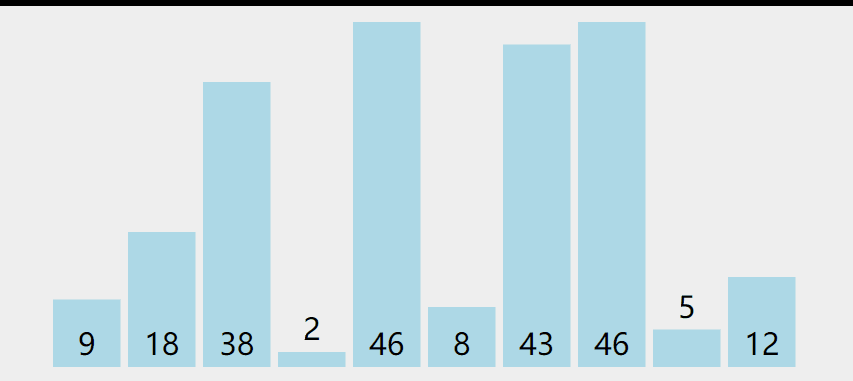

# 【排序】选择排序

<br/>

## 1、概述

<br/>

选择排序（Selection Sort），是最基本的排序算法之一。

---

## 2、思想

<br/>

- 选择排序的思想就是说每一次都将最大（对降序而言）或最小（对升序而言）的找出来（选择出来），然后放在最前面；不断重复这一过程，就能够完成最后的排序。
- 选择排序可以有“异地”和“就地（原地）”两种方式实现，一般情况下，我们所说的“选择排序”指的就是“就地选择排序”，因为“异地选择排序”实现起来并没有任何难度并且多数情况下没有必要多开辟空间。

---

## 3、动画演示

<br/>

- 初始的未排序的一组整数，将进行“升序”排序：


- 动画中，橙色表示“已经完成排序”、红色表示“当前被认定为最小的数”、绿色表示“遍历”





## 4、Java 代码实现

<br/>

- 对整数数组排序，就地排序


```java
public class SelectionSortInteger {

    private static final int DEFAULT_RANDOM_MIN = 0;

    private static final int DEFAULT_RANDOM_MAX = 100;

    private static final int DEFAULT_ARRAY_LENGTH = 10;

    /**
     * 随机生成一个数组
     *
     * @param length 数组长度
     * @param min 生成整数的最小值
     * @param max 生成整数的最大值
     * @return 数组
     */
    public static int[] generateIntegerArray(int length, int min, int max) {
        int tMin = (max <= min) ? DEFAULT_RANDOM_MIN : min;
        int tMax = (max <= min) ? DEFAULT_RANDOM_MAX : max;
        int tLength = (length > 0) ? length : DEFAULT_ARRAY_LENGTH;
        int[] arr = new int[tLength];
        for (int i = 0; i < tLength; i++) {
            arr[i] = getRandomInteger(tMin, tMax);
        }
        return arr;
    }

    /**
     * 打印数组
     *
     * 形式：[1, 2, 3, ...]
     *
     * @param arr 数组
     */
    public static void printArray(int[] arr) {
        StringBuilder sb = new StringBuilder("[");
        for (int i = 0; i < arr.length; i++) {
            sb.append(arr[i]);
            if (i != arr.length - 1) {
                sb.append(", ");
            }
        }
        sb.append("]");
        System.out.println(sb.toString());
    }

    /**
     * 生成指定范围的随机整数
     *
     * @param min 范围的最小值
     * @param max 范围的最大值
     * @return 随机数
     */
    private static int getRandomInteger(int min, int max) {
        return (int) (Math.random() * (max - min + 1) + min);
    }

    /**
     * 选择排序（就地）
     *
     * @param arr 数组
     * @param isAscending 是否升序
     */
    public static void selectionSort(int[] arr, boolean isAscending) {
        if (arr != null) {
            // 外层循环，遍历整个数组
            for (int i = 0; i < arr.length; i++) {
                // currentIndex 定义是：当前认定的数组中“最小”（对升序而言）或“最大”（对降序而言）元素的索引
                int currentIndex = i;
                // 内层循环，遍历局部
                // 自认定的位置即从 currentIndex 处向后遍历
                // 若发现一个元素比 currentIndex 处的元素小（对升序而言）或大（对降序而言），更新 currentIndex
                for (int j = i + 1; j < arr.length; j++) {
                    if (isAscending) {
                        if (arr[currentIndex] > arr[j]) {
                            currentIndex = j;
                        }
                    } else {
                        if (arr[currentIndex] < arr[j]) {
                            currentIndex = j;
                        }
                    }
                }
                // 经内层循环后，找到一个最小的或最大的元素，将其放到应该出现的位置
                // 也就是说此时索引 [0, i] 区间的元素完成了排序，后面的没有排序
                swap(arr, i, currentIndex);
            }
        }
    }

    /**
     * 数组中两个索引位置的数据交换
     *
     * @param arr 数组
     * @param i 索引
     * @param j 索引
     */
    private static void swap(int[] arr, int i, int j) {
        if (arr != null && i >= 0 && i < arr.length && j >= 0 && j < arr.length) {
            int temp = arr[i];
            arr[i] = arr[j];
            arr[j] = temp;
        }
    }

}
```


```java
public class Main {

    public static void main(String[] args) {
        int[] arr1 = SelectionSortInteger.generateIntegerArray(10, 0, 0);
        SelectionSortInteger.printArray(arr1);

        SelectionSortInteger.selectionSort(arr1, false);
        SelectionSortInteger.printArray(arr1);
    }

}

/*
	[21, 46, 100, 34, 24, 97, 72, 99, 66, 47]
	[100, 99, 97, 72, 66, 47, 46, 34, 24, 21]
*/
```


- 使用 Java 的泛型机制，对排序的数据种类进行拓展

```java
/**
 * 使用泛型方法
 */
public class SelectionSort {

    /**
     * 选择排序（就地）
     *
     * 必须具有可比性
     *
     * @param arr 数组
     * @param isAscending 是否升序
     */
    public static <E extends Comparable<E>> void selectionSort(E[] arr, boolean isAscending) {
        if (arr != null) {
            // 外层循环，遍历整个数组
            for (int i = 0; i < arr.length; i++) {
                // currentIndex 定义是：当前认定的数组中“最小”（对升序而言）或“最大”（对降序而言）元素的索引
                int currentIndex = i;
                // 内层循环，遍历局部
                // 自认定的位置即从 currentIndex 处向后遍历
                // 若发现一个元素比 currentIndex 处的元素小（对升序而言）或大（对降序而言），更新 currentIndex
                for (int j = i + 1; j < arr.length; j++) {
                    if (isAscending) {
                        // compareTo 返回值大于0 表示 当前对象“大于”参数对象
                        if (arr[currentIndex].compareTo(arr[j]) > 0) {
                            currentIndex = j;
                        }
                    } else {
                        // compareTo 返回值小于0 表示 当前对象“小于”参数对象
                        if (arr[currentIndex].compareTo(arr[j]) < 0) {
                            currentIndex = j;
                        }
                    }
                }
                // 经内层循环后，找到一个最小的或最大的元素，将其放到应该出现的位置
                // 也就是说此时索引 [0, i] 区间的元素完成了排序
                swap(arr, i, currentIndex);
            }
        }
    }

    /**
     * 打印数组
     *
     * @param arr 数组
     */
    public static <E> void printArray(E[] arr) {
        StringBuilder sb = new StringBuilder("[");
        for (int i = 0; i < arr.length; i++) {
            sb.append(arr[i]);
            if (i != arr.length - 1) {
                sb.append(", ");
            }
        }
        sb.append("]");
        System.out.println(sb.toString());
    }

    /**
     * 数组中两个索引位置的数据交换
     *
     * @param arr 数组
     * @param i 索引
     * @param j 索引
     */
    private static <E> void swap(E[] arr, int i, int j) {
        if (arr != null && i >= 0 && i < arr.length && j >= 0 && j < arr.length) {
            E temp = arr[i];
            arr[i] = arr[j];
            arr[j] = temp;
        }
    }

}
```


```java
import java.util.Objects;

public class Student implements Comparable<Student> {

    private String id;
    private String name;

    public Student() {
    }

    public Student(String id, String name) {
        this.id = id;
        this.name = name;
    }

    public String getId() {
        return id;
    }

    public void setId(String id) {
        this.id = id;
    }

    @Override
    public boolean equals(Object o) {
        if (this == o) {
            return true;
        }
        if (o == null || this.getClass() != o.getClass()) {
            return false;
        }
        Student student = (Student) o;
        return Objects.equals(id, student.id);
    }

    @Override
    public int hashCode() {
        return Objects.hash(id);
    }

    @Override
    public int compareTo(Student o) {
        if (this.equals(o)) {
            return 0;
        }
        if (o != null) {
            return this.id.compareTo(o.getId());
        } else {
            throw new IllegalArgumentException("Argument Null");
        }
    }

    @Override
    public String toString() {
        return "Student{" +
                "id='" + id + '\'' +
                ", name='" + name + '\'' +
                '}';
    }

}
```


```java
public class Main {

    public static void main(String[] args) {
        Student[] studentArr = new Student[5];

        studentArr[0] = new Student("1101", "张三");
        studentArr[1] = new Student("1000", "王五");
        studentArr[2] = new Student("1085", "王五");
        studentArr[3] = new Student("1021", "王五");
        studentArr[4] = new Student("1033", "王五");

        SelectionSort.printArray(studentArr);
        SelectionSort.selectionSort(studentArr, true);
        SelectionSort.printArray(studentArr);
    }

}

/*
    [Student{id='1101', name='张三'},
    Student{id='1000', name='王五'},
    Student{id='1085', name='王五'},
    Student{id='1021', name='王五'},
    Student{id='1033', name='王五'}]

    [Student{id='1000', name='王五'},
    Student{id='1021', name='王五'},
    Student{id='1033', name='王五'},
    Student{id='1085', name='王五'},
    Student{id='1101', name='张三'}]
*/
```


---

## 4、时间复杂度分析

<br/>

- 选择排序的时间复杂度是 $O(n^2)$
- 通过对不同数据规模的排序，从程序执行的大致时间上验证时间复杂度是否是上述时间复杂度


```java
public class SelectionSortInteger {

    private static final int DEFAULT_RANDOM_MIN = 0;

    private static final int DEFAULT_RANDOM_MAX = 100;

    private static final int DEFAULT_ARRAY_LENGTH = 10;

    /**
     * 随机生成一个数组
     *
     * @param length 数组长度
     * @param min 生成整数的最小值
     * @param max 生成整数的最大值
     * @return 数组
     */
    public static int[] generateIntegerArray(int length, int min, int max) {
        int tMin = (max <= min) ? DEFAULT_RANDOM_MIN : min;
        int tMax = (max <= min) ? DEFAULT_RANDOM_MAX : max;
        int tLength = (length > 0) ? length : DEFAULT_ARRAY_LENGTH;
        int[] arr = new int[tLength];
        for (int i = 0; i < tLength; i++) {
            arr[i] = getRandomInteger(tMin, tMax);
        }
        return arr;
    }

    /**
     * 打印数组
     *
     * 形式：[1, 2, 3, ...]
     *
     * @param arr 数组
     */
    public static void printArray(int[] arr) {
        StringBuilder sb = new StringBuilder("[");
        for (int i = 0; i < arr.length; i++) {
            sb.append(arr[i]);
            if (i != arr.length - 1) {
                sb.append(", ");
            }
        }
        sb.append("]");
        System.out.println(sb.toString());
    }

    /**
     * 生成指定范围的随机整数
     *
     * @param min 范围的最小值
     * @param max 范围的最大值
     * @return 随机数
     */
    private static int getRandomInteger(int min, int max) {
        return (int) (Math.random() * (max - min + 1) + min);
    }

    /**
     * 选择排序（就地）
     *
     * @param arr 数组
     * @param isAscending 是否升序
     */
    public static void selectionSort(int[] arr, boolean isAscending) {
        if (arr != null) {
            // 外层循环，遍历整个数组
            for (int i = 0; i < arr.length; i++) {
                // currentIndex 定义是：当前认定的数组中“最小”（对升序而言）或“最大”（对降序而言）元素的索引
                int currentIndex = i;
                // 内层循环，遍历局部
                // 自认定的位置即从 currentIndex 处向后遍历
                // 若发现一个元素比 currentIndex 处的元素小（对升序而言）或大（对降序而言），更新 currentIndex
                for (int j = i + 1; j < arr.length; j++) {
                    if (isAscending) {
                        if (arr[currentIndex] > arr[j]) {
                            currentIndex = j;
                        }
                    } else {
                        if (arr[currentIndex] < arr[j]) {
                            currentIndex = j;
                        }
                    }
                }
                // 经内层循环后，找到一个最小的或最大的元素，将其放到应该出现的位置
                // 也就是说此时索引 [0, i] 区间的元素完成了排序
                swap(arr, i, currentIndex);
            }
        }
    }

    /**
     * 数组中两个索引位置的数据交换
     *
     * @param arr 数组
     * @param i 索引
     * @param j 索引
     */
    private static void swap(int[] arr, int i, int j) {
        if (arr != null && i >= 0 && i < arr.length && j >= 0 && j < arr.length) {
            int temp = arr[i];
            arr[i] = arr[j];
            arr[j] = temp;
        }
    }

}
```


```java
public class Main {

    public static void main(String[] args) {
        int[] arr1 = SelectionSortInteger.generateIntegerArray(1000, 0, 100);

        int[] arr2 = SelectionSortInteger.generateIntegerArray(10000, 0, 100);

        long startTimeForArr1 = System.nanoTime(); // 单位是纳秒
        SelectionSortInteger.selectionSort(arr1, true);
        long endTimeForArr1 = System.nanoTime();

        long startTimeForArr2 = System.nanoTime();
        SelectionSortInteger.selectionSort(arr2, true);
        long endTimeForArr2 = System.nanoTime();

        System.out.println("排序 1000 个数字所花时间为：" + (endTimeForArr1 - startTimeForArr1) / 1000000000.0 + "s");
        System.out.println("排序 10000 个数字所花时间为：" + (endTimeForArr2 - startTimeForArr2) / 1000000000.0 + "s");
    }

}

/*
    排序 1000 个数字所花时间为：0.0034306s
    排序 10000 个数字所花时间为：0.0380853s
*/
```


从输出的结果可看出，当数据规模扩大为10倍的时候，所消耗的时间大体上需要扩大100倍，时间复杂度是$O(n^2)$。

- 时间复杂度$O(n^2)$是怎么来的？
考虑时间复杂度需要往最复杂的情况下考虑，但是对于选择排序而言，不论什么样的情况，耗时主体即循环中语句的执行次数都是一样的。
比如说将**已经是升序排列的5个数据**与**随机顺序的5个数据**使用选择排序按升序排列，循环中语句执行的次数都是$4+3+2+1+0=10$。
也就是说，如果数据规模为$n$，那么在选择排序的代码中循环中的语句执行的次数是$(n-1)+(n-2)+······+2+1+0=\frac{1}{2}n^2-\frac{1}{2}n$（等差数列求和），按照时间复杂度的定义（常数以及低阶可以忽略），时间复杂度为$O(n^2)$。

---

## 5、拓展

- 上面的选择排序，是从前向后进行的（排序过程中，前面的数据是完成排序的，后面数据的是未排序的），当然也可以从后向前进行。

```java
    public static <E extends Comparable<E>> void selectionSortTwo(E[] arr, boolean isAscending) {
        if (arr != null) {
            for (int i = arr.length - 1; i >= 0; i--) {
                int currentIndex = i;
                for (int j = i - 1; j >= 0; j--) {
                    if (isAscending) {
                        if (arr[currentIndex].compareTo(arr[j]) < 0) {
                            currentIndex = j;
                        }
                    } else {
                        if (arr[currentIndex].compareTo(arr[j]) > 0) {
                            currentIndex = j;
                        }
                    }
                }
                swap(arr, i, currentIndex);
            }
        }
    }
```
