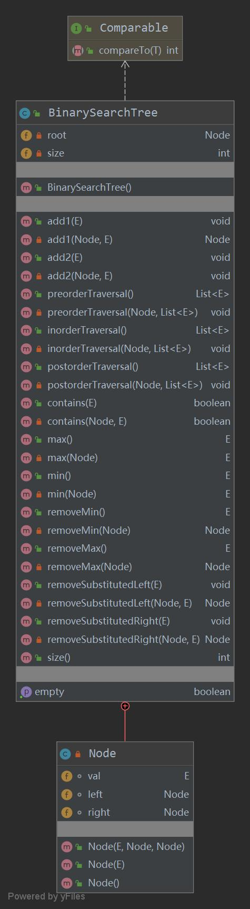

# 【树】二分搜索树（4）

<br/>

## 1、概述

<br/>

二分搜索树**基本**操作 Java **递归**实现，代码汇总。

- 向二分搜索树中添加一个节点；
- 前（先）序遍历；
- 中序遍历；
- 后序遍历；
- 判断当前二分搜索树中是否指定值的节点；
- 获取当前二分搜索树中的最大值；
- 获取当前二分搜索树中的最小值；
- 删除当前二分搜索树中的最大值的节点；
- 删除当前二分搜索树中的最小值的节点；
- 删除当前二分搜索树中指定值的节点；
- 获取当前二分搜索树中的节点数；
- 判断当前二分搜索树是否为空树

约定：二分搜索树中不包含重复的值以及`null`值，左小右大即中序遍历结果为升序序列。

---

## 2、Java 代码

<br/>




```java
import java.util.ArrayList;
import java.util.List;

/**
 * 二分搜索树
 *
 * 所有操作均为 递归
 */
public class BinarySearchTree<E extends Comparable<E>> {

    private class Node {
        E val;

        Node left;

        Node right;

        public Node(E val, Node left, Node right) {
            this.val = val;
            this.left = left;
            this.right = right;
        }

        public Node(E val) {
            this(val, null, null);
        }

        public Node() {
            this(null, null, null);
        }
    }

    private Node root;

    private int size;

    public BinarySearchTree() {
        this.root = null;
        this.size = 0;
    }

    /**
     * 向二分搜索树中添加节点
     *
     * 实现1
     *
     * @param val 值
     */
    public void add1(E val) {
        if (val == null) {
            throw new IllegalArgumentException("Value is null!");
        }
        root = add1(root, val);
    }

    /**
     * 向以 node 为根的二分搜索树中，添加值为 val 的节点
     *
     * @param node 当前二分搜索树的根
     * @param val 值
     * @return 添加节点后的二叉搜索树的根节点
     */
    private Node add1(Node node, E val) {
        if (node == null) {
            size++;
            return new Node(val);
        } else {
            if (val.compareTo(node.val) == 0) {
                throw new IllegalArgumentException("Duplicate Value!");
            } else if (val.compareTo(node.val) < 0) {
                node.left = add1(node.left, val);
                return node;
            } else {
                node.right = add1(node.right, val);
                return node;
            }
        }
    }

    /**
     * 向二分搜索树中添加节点
     *
     * 实现2
     *
     * @param val 值
     */
    public void add2(E val) {
        if (val == null) {
            throw new IllegalArgumentException("Value is null!");
        }
        if (root == null) {
            root = new Node(val);
            size++;
        } else {
            add2(root, val);
        }
    }

    /**
     * 向以 node 为根的二分搜索树中，添加值为 val 的节点
     *
     * @param node 当前二分搜索树的根，node 一定为非空
     * @param val 值
     */
    private void add2(Node node, E val) {
        if (val.compareTo(node.val) == 0) {
            throw new IllegalArgumentException("Duplicate Value!");
        }

        if (val.compareTo(node.val) < 0 && node.left == null) {
            node.left = new Node(val);
            size++;
            return;
        }

        if (val.compareTo(node.val) > 0 && node.right == null) {
            node.right = new Node(val);
            size++;
            return;
        }

        if (val.compareTo(node.val) < 0) {
            add2(node.left, val);
        } else {
            add2(node.right, val);
        }
    }

    /**
     * 先（前）序遍历
     *
     * @return null / list
     */
    public List<E> preorderTraversal() {
        if (root == null) {
            return null;
        }

        List<E> result = new ArrayList<>();
        preorderTraversal(root, result);
        return result;
    }

    private void preorderTraversal(Node node, List<E> result) {
        if (node == null) {
            return;
        }
        result.add(node.val);
        preorderTraversal(node.left, result);
        preorderTraversal(node.right, result);
    }

    /**
     * 中序遍历
     *
     * @return null / list
     */
    public List<E> inorderTraversal() {
        if (root == null) {
            return null;
        }

        List<E> result = new ArrayList<>();
        inorderTraversal(root, result);
        return result;
    }

    private void inorderTraversal(Node node, List<E> result) {
        if (node == null) {
            return;
        }
        inorderTraversal(node.left, result);
        result.add(node.val);
        inorderTraversal(node.right, result);
    }

    /**
     * 后序遍历
     *
     * @return null / list
     */
    public List<E> postorderTraversal() {
        if (root == null) {
            return null;
        }

        List<E> result = new ArrayList<>();
        postorderTraversal(root, result);
        return result;
    }

    private void postorderTraversal(Node node, List<E> result) {
        if (node == null) {
            return;
        }
        postorderTraversal(node.left, result);
        postorderTraversal(node.right, result);
        result.add(node.val);
    }

    /**
     * 当前二分搜索树中是否指定值的节点
     *
     * @param val 指定值
     * @return true / false
     */
    public boolean contains(E val) {
        return contains(root, val);
    }

    /**
     * 当前以 node 为根的二分搜索树中是否指定值的节点
     *
     * @param node 根节点
     * @param val 指定值
     * @return true / false
     */
    private boolean contains(Node node, E val) {
        if (node == null) {
            return false;
        }

        if (val.compareTo(node.val) == 0) {
            return true;
        } else if (val.compareTo(node.val) < 0) {
            return contains(node.left, val);
        } else {
            return contains(node.right, val);
        }
    }

    /**
     * 获取当前二分搜索树中的最大值
     *
     * @return exception / max value
     */
    public E max() {
        if (root == null) {
            throw new NullPointerException("Tree is empty!");
        }
        return max(root);
    }

    /**
     * 获取以 node 为根的二分搜索树中的最大值
     *
     * @param node 根节点
     * @return null / max value
     */
    private E max(Node node) {
        if (node == null) {
            return null;
        }

        if (node.right == null) {
            return node.val;
        }

        return max(node.right);
    }

    /**
     * 获取当前二分搜索树中的最小值
     *
     * @return exception / min value
     */
    public E min() {
        if (root == null) {
            throw new NullPointerException("Tree is empty!");
        }

        return min(root);
    }

    /**
     * 获取以 node 为根的二分搜索树中的最小值
     *
     * @param node 根节点
     * @return null / min value
     */
    private E min(Node node) {
        if (node == null) {
            return null;
        }

        if (node.left == null) {
            return node.val;
        }

        return min(node.left);
    }

    /**
     * 删除当前二分搜索树中的最小值的节点
     *
     * @return exception / min value
     */
    public E removeMin() {
        if (root == null) {
            throw new NullPointerException("Tree is empty!");
        }

        E min = min();
        root = removeMin(root);
        return min;
    }

    /**
     * 删除以 node 为根节点的二分搜索树中的最小值的节点
     *
     * @param node 根节点
     * @return 删除后，所形成新的根节点
     */
    private Node removeMin(Node node) {
        if (node == null) {
            return null;
        }

        if (node.left == null) {
            Node cur = node.right;
            node.right = null;
            size--;
            return cur;
        }

        node.left = removeMin(node.left);

        return node;
    }

    /**
     * 删除当前二分搜索树中的最大值的节点
     *
     * @return exception / max value
     */
    public E removeMax() {
        if (root == null) {
            throw new NullPointerException("Tree is empty!");
        }

        E max = max();
        root = removeMax(root);
        return max;
    }

    /**
     * 删除以 node 为根节点的二分搜索树中的最大值的节点
     *
     * @param node 根节点
     * @return 删除后，所形成新的根节点
     */
    private Node removeMax(Node node) {
        if (node == null) {
            return null;
        }

        if (node.right == null) {
            Node cur = node.left;
            node.left = null;
            size--;
            return cur;
        }

        node.right = removeMax(node.right);

        return node;
    }

    /**
     * 删除当前二分搜索树中指定值的节点
     *
     * 实现1
     * 删除既有左子树又有右子树的节点时，左子树的最大值作替换
     *
     * @param val 指定值
     */
    public void removeSubstitutedLeft(E val) {
        if (root == null) {
            throw new NullPointerException("Tree is empty!");
        }
        root = removeSubstitutedLeft(root, val);
    }

    /**
     * 删除以 node 为根节点的二分搜索树中指定值的节点
     *
     * 删除既有左子树又有右子树的节点时，左子树的最大值作替换
     *
     * @param node 根节点
     * @param val 指定值
     *
     * @return null / 删除后，得到新的根节点
     */
    private Node removeSubstitutedLeft(Node node, E val) {
        if (node == null) {
            return null;
        }

        if (val.compareTo(node.val) < 0) {
            node.left = removeSubstitutedLeft(node.left, val);
            return node;
        } else if (val.compareTo(node.val) > 0) {
            node.right = removeSubstitutedLeft(node.right, val);
            return node;
        } else {
            if (node.left == null) {
                Node cur = node.right;
                node.right = null;
                size--;
                return cur;
            }
            if (node.right == null) {
                Node cur = node.left;
                node.left = null;
                size--;
                return cur;
            }
            E max = max(node.left);
            node.left = removeMax(node.left);
            node.val = max;
            return node;
        }
    }

    /**
     * 删除当前二分搜索树中指定值的节点
     *
     * 实现2
     * 删除既有左子树又有右子树的节点时，右子树的最小值作替换
     *
     * @param val 指定值
     */
    public void removeSubstitutedRight(E val) {
        if (root == null) {
            throw new NullPointerException("Tree is empty!");
        }
        root = removeSubstitutedRight(root, val);
    }

    /**
     * 删除以 node 为根节点的二分搜索树中指定值的节点
     *
     * 删除既有左子树又有右子树的节点时，右子树的最小值作替换
     *
     * @param node 根节点
     * @param val 指定值
     *
     * @return null / 删除后，得到新的根节点
     */
    private Node removeSubstitutedRight(Node node, E val) {
        if (node == null) {
            return null;
        }

        if (val.compareTo(node.val) < 0) {
            node.left = removeSubstitutedLeft(node.left, val);
            return node;
        } else if (val.compareTo(node.val) > 0) {
            node.right = removeSubstitutedLeft(node.right, val);
            return node;
        } else {
            if (node.left == null) {
                Node cur = node.right;
                node.right = null;
                size--;
                return cur;
            }
            if (node.right == null) {
                Node cur = node.left;
                node.left = null;
                size--;
                return cur;
            }
            E min = min(node.right);
            node.right = removeMin(node.right);
            node.val = min;
            return node;
        }
    }

    public boolean isEmpty() {
        return this.size == 0;
    }

    public int size() {
        return this.size;
    }

}
```

