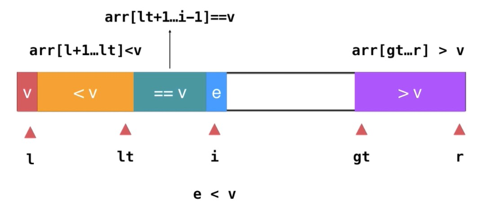

# 【排序】快速排序（2）

<br/>

[【排序】快速排序（1）](https://yyscyber.github.io/computer-basic/data-structures-and-algorithms/imooc/dsna-system-2021/d4bd01a7-170f-4f10-a4a1-4aef884260a4)

<br/>

## 5、优化

<br/>

### 5.2、多路快速排序

- 还有一种情况会使快速排序出现“退化”的情况（$O(n^2)$），那就是所有数据都是一样的。虽然情况比较“极端”，但是，在 partition 操作中可能会遇到这样的区间，我们希望这样的区间不出现，即使无法避免但在整个快速排序中出现的**越晚越好**。
- 下图中数组中的数据全是0，进行升序排序，处理与 pivot 相等的策略是“并入大于 pivot 的部分”。下图中所展示的是**经过第一次 partition 后**的情形，后续的还要**对紫色部分再进行 partition 操作**······，脑补一下，后续的 partition 只是进行着毫无意义的遍历操作。


同样的道理，即使采取的策略是“并入小于 pivot 的部分”，下图中所展示的是**经过第一次 partition 后**的情形，后续的还要**对橙色部分再进行 partition 操作**······


- 解决这一问题的策略就是将重复的数据在 partition 的过程中“打散”。而突破口便是在**如何处理与 pivot 相等的数据**。


#### 5.2.1、双路快速排序

- 双路快速排序算法，与之前的快速排序算法差别是在`partition`方法上。
- 之前的 partition 操作，确定 pivot 之后，只向后遍历即可，然后形成下图所示的情形：


“双路”的意思是在 partition 的操作中，**确定 pivot 后遍历是双向的**。下图是“双路”的一个图示：


可以看到，pivot 仍然是处在首位（随机选定后调整至首位），但是“双路”的遍历是“由两头向里”进行的。就升序而言，确保**小于或等于**的数据在“由前向后**遍历过**的区间中”，**大于或等于**的数据在“由后向前**遍历过**的区间中”。

双路快速排序的 partition 具体图解，升序为例：


> 1、确定 pivot 后，由两侧开始向内遍历。
>
> 假定，由前向后的遍历的索引变量由 i 表示，由后向前的遍历的索引变量由 j 表示


> 2、先看由前向后的遍历，在这个过程中，如果遍历到的数据**小于** pivot，继续向后遍历即可，因为这样就能确保小于 pivot 的数据保留在“被遍历过的区间中”。
>
> 如果遍历到的数据**等于**或**大于** pivot，暂时停止遍历。


> 3、再看由后向前的遍历，在这个过程中，如果遍历到的数据**大于** pivot，继续向前遍历即可，因为这样就能确保大于 pivot 的数据保留在“被遍历过的区间中”。
>
> 如果遍历到的数据**等于**或**小于** pivot，暂时停止遍历。


> 经过第2、3步后的情形是：
>
> 
>
> 


> 4、交换当前索引 i 和 j 两个位置的数据，形成的情形是：
>
> 
>
> 


> 疑问：为什么（步骤2、3）两侧等于 pivot 的时候也要停止遍历，然后经过步骤4进行位置的交换？
这样的目的是：尽可能使得重复的数据尽可能“分散”，避免出现开始所说的快速排序“退化”的情况。


> 5、重复2、3、4步骤，直到从两侧出发的“汇合”即 $j \geq i$


> 6、将 pivot 调整至两个区间中间的位置。
>
> partition 到此结束！


- 双路快速排序的 partition 方法实现：


> 先明确一些变量的含义：
>
> - $l$：区间的左边界索引，`arr[l]`为 pivot
> - $r$：区间的右边界索引
> - $i$：用于从前向后遍历的索引变量，初始值为 $l+1$
> - $j$：用于从后向前遍历的索引变量，初始值为 $r$
>
> 
>
> 升序，区间 $[l+1,i-1]$ 是**小于或等于** pivot 数据
>
> 升序，区间 $[j+1,r]$ 是**大于或等于** pivot 数据
>
> 降序，区间 $[l+1,i-1]$ 是**大于或等于** pivot 数据
>
> 降序，区间 $[j+1,r]$ 是**小于或等于** pivot 数据


```java
import java.util.Random;

public class Main {

    private static Random random = new Random();

    public static void main(String[] args) {
        int[] arr = RandomArray.generateIntegerArray(8, 1, 99);
        RandomArray.printArray(arr);

        int pivotIndex = partition(arr, 0, arr.length - 1, true);
        System.out.println(pivotIndex);
        RandomArray.printArray(arr);
    }

    private static int partition(int[] arr, int l, int r, boolean isAscending) {
        // 随机选定 pivot 并调整至索引 l 的位置
        int pivotInitIndex = getRandomInteger(l, r);
        int pivot = arr[pivotInitIndex];
        swap(arr, l, pivotInitIndex);

        int i = l + 1;
        int j = r;

        while (true) {
            if (isAscending) {
                while (i <= j && arr[i] < pivot) {
                    // 升序，小于 pivot 继续向后遍历，大于或等于暂停遍历
                    i++;
                }
                while (j >= i && arr[j] > pivot) {
                    // 升序，大于 pivot 继续向前遍历，小于或等于暂停遍历
                    j--;
                }
            } else {
                while (i <= j && arr[i] > pivot) {
                    // 降序，大于 pivot 继续向后遍历，小于或等于暂停遍历
                    i++;
                }
                while (j >= i && arr[j] < pivot) {
                    // 降序，小于 pivot 继续向前遍历，大于或等于暂停遍历
                    j--;
                }
            }

            // 终止遍历的条件（一定要在 swap 方法前判断是否要终止！！！）

            // i == j：说明此时 i 和 j 都是指向与 pivot 相等的同一个元素，这个时候循环没有必要再进行下去
            // i > j：两侧都已经完成遍历，这个时候循环没有必要再进行下去
            if (i >= j) {
                break;
            }

            // 交换遍历暂停位置的数据
            swap(arr, i, j);

            // 准备 继续遍历 或 完全终止遍历
            i++;
            j--;
        }

        // 将 pivot （arr[l]）调整至两个区间中间
        // “中间的位置”恰好是索引 j
        swap(arr, l, j);

        // 返回 pivot 的新位置的索引
        return j;
    }

    private static void swap(int[] arr, int i, int j) {
        int temp = arr[i];
        arr[i] = arr[j];
        arr[j] = temp;
    }

    private static int getRandomInteger(int min, int max) {
        // random.nextInt(max - min + 1) -> [0,max-min+1) -> [0,max-min]
        // min + random.nextInt(max - min + 1) -> [min,max+1) -> [min,max]
        return min + random.nextInt(max - min + 1);
    }

}
```


- 双路快速排序的实现：


```java
import java.util.Random;

public class QuickSort {

    private static Random random = new Random();

    /**
     * 防止该类被 new
     */
    private QuickSort() {}

    public static void quickSort(int[] arr, boolean isAscending) {
        quickSort(arr, 0, arr.length - 1, isAscending);
    }

    private static void quickSort(int[] arr, int l, int r, boolean isAscending) {
        if (l >= r) {
            return;
        }
        int pivotIndex = partition(arr, l, r, isAscending);
        quickSort(arr, l, pivotIndex - 1, isAscending);
        quickSort(arr, pivotIndex + 1, r, isAscending);
    }

    private static int partition(int[] arr, int l, int r, boolean isAscending) {
        int pivotInitIndex = getRandomInteger(l, r);
        int pivot = arr[pivotInitIndex];
        swap(arr, l, pivotInitIndex);

        int i = l + 1;
        int j = r;

        while (true) {
            if (isAscending) {
                while (i <= j && arr[i] < pivot) {
                    i++;
                }
                while (j >= i && arr[j] > pivot) {
                    j--;
                }
            } else {
                while (i <= j && arr[i] > pivot) {
                    i++;
                }
                while (j >= i && arr[j] < pivot) {
                    j--;
                }
            }

            if (i >= j) {
                break;
            }

            swap(arr, i, j);
            i++;
            j--;
        }

        swap(arr, l, j);

        return j;
    }

    private static void swap(int[] arr, int i, int j) {
        int temp = arr[i];
        arr[i] = arr[j];
        arr[j] = temp;
    }

    private static int getRandomInteger(int min, int max) {
        // random.nextInt(max - min + 1) -> [0,max-min+1) -> [0,max-min]
        // min + random.nextInt(max - min + 1) -> [min,max+1) -> [min,max]
        return min + random.nextInt(max - min + 1);
    }

}
```


```java
import java.util.Random;

public class QuickSort {

    private static Random random = new Random();

    private QuickSort() {}

    public static <E extends Comparable<E>> void quickSort(E[] arr, boolean isAscending) {
        quickSort(arr, 0, arr.length - 1, isAscending);
    }

    private static <E extends Comparable<E>> void quickSort(E[] arr, int l, int r, boolean isAscending) {
        if (l >= r) {
            return;
        }
        int pivotIndex = partition(arr, l, r, isAscending);
        quickSort(arr, l, pivotIndex - 1, isAscending);
        quickSort(arr, pivotIndex + 1, r, isAscending);
    }

    private static <E extends Comparable<E>> int partition(E[] arr, int l, int r, boolean isAscending) {
        int pivotInitIndex = getRandomInteger(l, r);
        E pivot = arr[pivotInitIndex];
        swap(arr, l, pivotInitIndex);

        int i = l + 1;
        int j = r;

        while (true) {
            if (isAscending) {
                while (i <= j && arr[i].compareTo(pivot) < 0) {
                    i++;
                }
                while (j >= i && arr[j].compareTo(pivot) > 0) {
                    j--;
                }
            } else {
                while (i <= j && arr[i].compareTo(pivot) > 0) {
                    i++;
                }
                while (j >= i && arr[j].compareTo(pivot) < 0) {
                    j--;
                }
            }

            if (i >= j) {
                break;
            }

            swap(arr, i, j);
            i++;
            j--;
        }

        swap(arr, l, j);

        return j;
    }

    private static <E> void swap(E[] arr, int i, int j) {
        E temp = arr[i];
        arr[i] = arr[j];
        arr[j] = temp;
    }

    private static int getRandomInteger(int min, int max) {
        // random.nextInt(max - min + 1) -> [0,max-min+1) -> [0,max-min]
        // min + random.nextInt(max - min + 1) -> [min,max+1) -> [min,max]
        return min + random.nextInt(max - min + 1);
    }
    
}
```


---

#### 5.2.2、三路快速排序

- 之前的双路快速排序的`partition`方法中是将与 pivot 相等的数据是分散到“大于”和“小于”这两个区间中的，这个时候，自然有一个想法，那就是为什么不单独设置一个“等于”的区间，如下图：


- 三路快速排序实际上就是在 partition 的过程中为**等于** pivot 的数据单独设立一个区间。
- 先明确一些变量的含义：


> - $l$：区间左侧边界索引，`arr[l]`为 pivot
> - $r$：区间右侧边界索引
> - $i$：从前向后遍历所用的索引变量，初始值为 $l+1$
> - $lt$（less than）：**升序**时，**小于** pivot 的区间**最后一个元素**的索引，初始值 $l$；
**降序**时，**小于** pivot 的区间**第一个元素**的索引，初始值 $r+1$
> - $gt$（greater than）：**升序**时，**大于** pivot 的区间的**第一个元素**的索引，初始值 $r+1$；
**降序**时，**大于** pivot 的区间的**最后一个元素**的索引。初始值 $l$


- 三路快速排序 partition 具体图解，以升序为例：


> 1、**与单路快速排序的 partition 操作一样，单向遍历即可；**
>
> **但是区间的分布上与双路的 partition 相似，但多了一个“等于 pivot 区间”**。


> 2、开始遍历，如果遍历到的数据与 pivot 相等，继续向后遍历（`i++`）相当于并入等于 pivot 的数据的区间：
>
> 
>
> 
>
> 
>
> 


> 3、如果遍历到的数据小于 pivot，将该数据与“小于 pivot 区间”的最后一个元素的后一个元素（即“等于 pivot 区间”的首个元素，索引为 $lt+1$）交换位置，维护 $lt$（`lt++`），继续遍历（`i++`）：
>
> 
>
> 
>
> 
>
> 


> 4、如果遍历到的数据大于 pivot，将该数据与“大于 pivot 区间”的首个元素的前一个元素（索引为 $gt-1$）交换位置，维护 $gt$（`gt--`）。
>
> 注意此时，$i$ 不用变化，因为交换过去的元素还没被遍历。
>
> 
>
> 
>
> 
>
> 


> 5、当 $i \geq gt$ 的时候，遍历终止。最终形成的局面：
>
> 
>
> 


> 6、将 pivot 调整到合适的位置，$l$与$lt$位置上的元素交换位置。此时，区间范围上略微出现点变化，$lt$成为“等于 pivot 区间”的首个元素：
>
> 
>
> 
>
> 
>
> partition 操作结束


- 实现 partition 方法，需要注意的是，与之前单路、双路中的`partition`方法的返回值只有1个就是 pivot 的最新位置的索引，通过这个索引能够获取到“大于（或等于）”、“小于（或等于）”两个区间的索引范围；但是三路的`partition`方法单凭一个 pivot 最新位置的索引，无法得到另外两个区间（“小于”和“大于”）的范围，要想得到这个范围，需要2个返回值，$lt$ 和 $gt$。


Java 中返回多个返回值的话，需要使用一些“手段”，下面所使用的是 Map：


```java
import java.util.HashMap;
import java.util.Map;
import java.util.Random;

public class Main {

    private static Random random = new Random();

    public static void main(String[] args) {
        int[] arr = RandomArray.generateIntegerArray(15, 0, 20);
        RandomArray.printArray(arr);

        System.out.println();

        Map<String, Integer> map = partition(arr, 0, arr.length - 1, false);
        System.out.println("lt: " + map.get("lt"));
        System.out.println("gt: " + map.get("gt"));
        RandomArray.printArray(arr);
    }

    private static Map<String, Integer> partition(int[] arr, int l, int r, boolean isAscending) {
        Map<String, Integer> map = new HashMap<>(2);

        int pivotInitIndex = getRandomInteger(l, r);
        int pivot = arr[pivotInitIndex];
        swap(arr, l, pivotInitIndex);

        int lt = -1;
        int gt = -1;

        int i = l + 1;

        if (isAscending) {
            // 升序

            // 升序时 lt 的初始值为 l，千万注意不是 l+1，必须要考虑到 i 遍历到的首个小于 pivot 的元素
            lt = l;
            // 升序时 gt 的初始值为 r+1，千万注意不是 r，必须要考虑到 i 遍历到的首个大于 pivot 的元素
            gt = r + 1;

            while (i < gt) {
                if (arr[i] == pivot) {
                    i++;
                } else if (arr[i] < pivot) {
                    lt++;
                    swap(arr, i, lt);
                    i++;
                } else {
                    gt--;
                    swap(arr, i, gt);
                }
            }

            // 调整 pivot 至合适的位置
            // [l,lt-1] < pivot
            // [lt,gt-1] = pivot
            // [gt,r] > pivot
            swap(arr, l, lt);

            // 为了便于后续编码，返回值是 lt-1 而不是 lt
            // 这样的话，需要递归操作的区间直接就是 [l,lt], [gt,r]
            map.put("lt", lt - 1);
            map.put("gt", gt);
        } else {
            // 降序

            // 降序时 gt 的初始值为 l，千万注意不是 l+1，必须要考虑到 i 遍历到的首个大于 pivot 的元素
            gt = l;
            // 降序时 lt 的初始值为 r+1，千万注意不是 r，必须要考虑到 i 遍历到的首个小于 pivot 的元素
            lt = r + 1;

            while (i < lt) {
                if (arr[i] == pivot) {
                    i++;
                } else if (arr[i] > pivot) {
                    gt++;
                    swap(arr, i, gt);
                    i++;
                } else {
                    lt--;
                    swap(arr, i, lt);
                }
            }

            // 调整 pivot 至合适的位置
            // [l,gt-1] > pivot
            // [gt,lt-1] = pivot
            // [lt,r] < pivot
            swap(arr, l, gt);

            // 为了便于后续编码，返回值是 gt-1 而不是 gt
            // 这样的话，需要递归操作的区间直接就是 [l,gt], [lt,r]
            map.put("lt", lt);
            map.put("gt", gt - 1);
        }

        return map;
    }

    private static <E> void swap(int[] arr, int i, int j) {
        int temp = arr[i];
        arr[i] = arr[j];
        arr[j] = temp;
    }

    private static int getRandomInteger(int min, int max) {
        // random.nextInt(max - min + 1) -> [0,max-min+1) -> [0,max-min]
        // min + random.nextInt(max - min + 1) -> [min,max+1) -> [min,max]
        return min + random.nextInt(max - min + 1);
    }

}
```


- 基于上面的`partition`方法实现三路快速排序


```java
import java.util.HashMap;
import java.util.Map;
import java.util.Random;

public class QuickSort {

    private static Random random = new Random();

    private static final String LESS_THAN_PIVOT_MAP_KEY = "lt";
    private static final String GREATER_THAN_PIVOT_MAP_KEY = "gt";

    private QuickSort() {}

    public static void quickSort(int[] arr, boolean isAscending) {
        quickSort(arr, 0, arr.length - 1, isAscending);
    }

    private static void quickSort(int[] arr, int l, int r, boolean isAscending) {
        if (l >= r) {
            return;
        }

        Map<String, Integer> map = partition(arr, l, r, isAscending);
        if (isAscending) {
            quickSort(arr, l, map.get(LESS_THAN_PIVOT_MAP_KEY), true);
            quickSort(arr, map.get(GREATER_THAN_PIVOT_MAP_KEY), r, true);
        } else {
            quickSort(arr, l, map.get(GREATER_THAN_PIVOT_MAP_KEY), false);
            quickSort(arr, map.get(LESS_THAN_PIVOT_MAP_KEY), r, false);
        }
    }

    private static Map<String, Integer> partition(int[] arr, int l, int r, boolean isAscending) {
        Map<String, Integer> map = new HashMap<>(2);

        int pivotInitIndex = getRandomInteger(l, r);
        int pivot = arr[pivotInitIndex];
        swap(arr, l, pivotInitIndex);

        int lt = -1;
        int gt = -1;

        int i = l + 1;

        if (isAscending) {
            // 升序

            // 升序时 lt 的初始值为 l，千万注意不是 l+1，必须要考虑到 i 遍历到的首个小于 pivot 的元素
            lt = l;
            // 升序时 gt 的初始值为 r+1，千万注意不是 r，必须要考虑到 i 遍历到的首个大于 pivot 的元素
            gt = r + 1;

            while (i < gt) {
                if (arr[i] == pivot) {
                    i++;
                } else if (arr[i] < pivot) {
                    lt++;
                    swap(arr, i, lt);
                    i++;
                } else {
                    gt--;
                    swap(arr, i, gt);
                }
            }

            // 调整 pivot 至合适的位置
            // [l,lt-1] < pivot
            // [lt,gt-1] = pivot
            // [gt,r] > pivot
            swap(arr, l, lt);

            // 为了便于后续编码，返回值是 lt-1 而不是 lt
            // 这样的话，需要递归操作的区间直接就是 [l,lt], [gt,r]
            map.put(LESS_THAN_PIVOT_MAP_KEY, lt - 1);
            map.put(GREATER_THAN_PIVOT_MAP_KEY, gt);
        } else {
            // 降序

            // 降序时 gt 的初始值为 l，千万注意不是 l+1，必须要考虑到 i 遍历到的首个大于 pivot 的元素
            gt = l;
            // 降序时 lt 的初始值为 r+1，千万注意不是 r，必须要考虑到 i 遍历到的首个小于 pivot 的元素
            lt = r + 1;

            while (i < lt) {
                if (arr[i] == pivot) {
                    i++;
                } else if (arr[i] > pivot) {
                    gt++;
                    swap(arr, i, gt);
                    i++;
                } else {
                    lt--;
                    swap(arr, i, lt);
                }
            }

            // 调整 pivot 至合适的位置
            // [l,gt-1] > pivot
            // [gt,lt-1] = pivot
            // [lt,r] < pivot
            swap(arr, l, gt);

            // 为了便于后续编码，返回值是 gt-1 而不是 gt
            // 这样的话，需要递归操作的区间直接就是 [l,gt], [lt,r]
            map.put(LESS_THAN_PIVOT_MAP_KEY, lt);
            map.put(GREATER_THAN_PIVOT_MAP_KEY, gt - 1);
        }

        return map;
    }

    private static <E> void swap(int[] arr, int i, int j) {
        int temp = arr[i];
        arr[i] = arr[j];
        arr[j] = temp;
    }

    private static int getRandomInteger(int min, int max) {
        // random.nextInt(max - min + 1) -> [0,max-min+1) -> [0,max-min]
        // min + random.nextInt(max - min + 1) -> [min,max+1) -> [min,max]
        return min + random.nextInt(max - min + 1);
    }

}
```


- 因为三路快速排序中的`partition`方法涉及到两个返回值，Java 中多个返回值需要借助一些“手段”，所以说为了避免出现多个返回值，三路快速排序的实现可以**不将`partition`得到单独实现**。直接将 partition 的操作放入`quickSort`方法中即可：


```java
import java.util.Random;

public class QuickSort {

    private static Random random = new Random();

    private QuickSort() {}

    public static void quickSort(int[] arr, boolean isAscending) {
        quickSort(arr, 0, arr.length - 1, isAscending);
    }

    private static void quickSort(int[] arr, int l, int r, boolean isAscending) {
        if (l >= r) {
            return;
        }

        /* partition 操作 ------------ */
        int pivotInitIndex = getRandomInteger(l, r);
        int pivot = arr[pivotInitIndex];
        swap(arr, l, pivotInitIndex);

        int lt = -1;
        int gt = -1;

        int i = l + 1;

        if (isAscending) {
            // 升序

            // 升序时 lt 的初始值为 l，千万注意不是 l+1，必须要考虑到 i 遍历到的首个小于 pivot 的元素
            lt = l;
            // 升序时 gt 的初始值为 r+1，千万注意不是 r，必须要考虑到 i 遍历到的首个大于 pivot 的元素
            gt = r + 1;

            while (i < gt) {
                if (arr[i] == pivot) {
                    i++;
                } else if (arr[i] < pivot) {
                    lt++;
                    swap(arr, i, lt);
                    i++;
                } else {
                    gt--;
                    swap(arr, i, gt);
                }
            }

            // 调整 pivot 至合适的位置
            // [l,lt-1] < pivot
            // [lt,gt-1] = pivot
            // [gt,r] > pivot
            swap(arr, l, lt);
        } else {
            // 降序

            // 降序时 gt 的初始值为 l，千万注意不是 l+1，必须要考虑到 i 遍历到的首个大于 pivot 的元素
            gt = l;
            // 降序时 lt 的初始值为 r+1，千万注意不是 r，必须要考虑到 i 遍历到的首个小于 pivot 的元素
            lt = r + 1;

            while (i < lt) {
                if (arr[i] == pivot) {
                    i++;
                } else if (arr[i] > pivot) {
                    gt++;
                    swap(arr, i, gt);
                    i++;
                } else {
                    lt--;
                    swap(arr, i, lt);
                }
            }

            // 调整 pivot 至合适的位置
            // [l,gt-1] > pivot
            // [gt,lt-1] = pivot
            // [lt,r] < pivot
            swap(arr, l, gt);
        }
        /* partition 操作 ------------ */

        if (isAscending) {
            // 这里是 lt-1，因为小于 pivot 区间仍是 [l,lt-1]
            quickSort(arr, l, lt - 1, true);
            quickSort(arr, gt, r, true);
        } else {
            // 这里是 gt-1，因为大于 pivot 区间仍是 [l,gt-1]
            quickSort(arr, l, gt - 1, false);
            quickSort(arr, lt, r, false);
        }
    }

    private static <E> void swap(int[] arr, int i, int j) {
        int temp = arr[i];
        arr[i] = arr[j];
        arr[j] = temp;
    }

    private static int getRandomInteger(int min, int max) {
        // random.nextInt(max - min + 1) -> [0,max-min+1) -> [0,max-min]
        // min + random.nextInt(max - min + 1) -> [min,max+1) -> [min,max]
        return min + random.nextInt(max - min + 1);
    }

}
```
