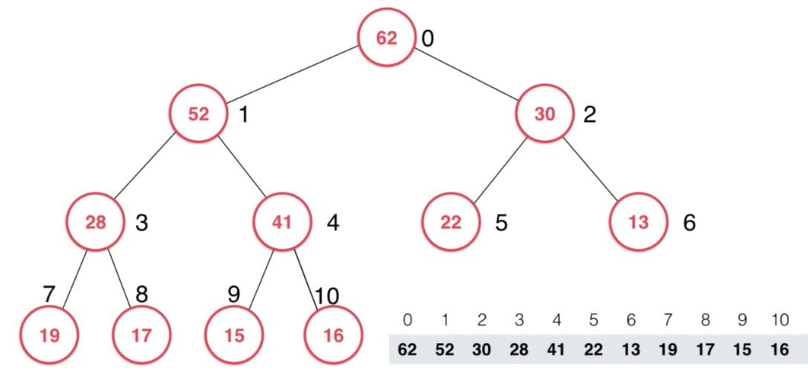

# 【堆】最大堆

<br/>

## 1、概述

<br/>

- 堆中的每一个节点中的值**小于（或不大于）**其父节点的值。最大堆中，根节点的值是整个堆中的最大值。

---

## 2、约定

<br/>

- 使用动态数组存储堆。
- 使用数组存储时，自索引0开始。


---

## 3、Java 代码实现 — 基本框架

<br/>

```java
import java.util.Objects;

/**
 * 自定义动态数组
 */
public class Array<E> {

    /**
     * 封装的原生数组
     */
    private E[] data;

    /**
     * 数组中元素个数
     */
    private int size;

    /**
     * 数组开辟的空间大小
     */
    private int capacity;

    /**
     * 默认开辟空间大小
     */
    private static final int DEFAULT_CAPACITY = 10;

    /**
     * 默认扩容倍数
     */
    private static final int DEFAULT_INCREASE_CAPACITY_TIMES = 2;

    /**
     * 默认缩容倍数
     */
    private static final int DEFAULT_DECREASE_CAPACITY_TIMES = 2;

    /**
     * 缩容时机
     *
     * 当元素个数仅仅是开辟空间大小的 1/4 时
     */
    private static final int DEFAULT_DECREASE_CAPACITY_WHEN = 4;

    /**
     * 在数组中未发现元素时的返回值
     */
    private static final int NOT_FIND_INDEX_FLAG = -1;

    public Array() {
        data = (E[]) new Object[DEFAULT_CAPACITY];
        capacity = DEFAULT_CAPACITY;
    }

    public Array(int capacity) {
        if (capacity > 0) {
            data = (E[]) new Object[capacity];
        } else {
            throw new IllegalArgumentException("Capacity Error!");
        }
    }

    /**
     * 在指定索引处增加元素
     *
     * @param e e
     * @param index index
     */
    public void addElement(E e, int index) {
        if (index < 0 || index > size) {
            throw new IllegalArgumentException("Index Error!");
        }
        if (size == capacity) {
            reCapacity(capacity * DEFAULT_INCREASE_CAPACITY_TIMES);
        }
        for (int i = size - 1; i >= index; i--) {
            data[i + 1] = data[i];
        }
        data[index] = e;
        size++;
    }

    /**
     * 在数组首部增加元素
     *
     * @param e e
     */
    public void addElementAtFirst(E e) {
        addElement(e, 0);
    }

    /**
     * 在数组尾部增加元素
     *
     * @param e e
     */
    public void addElementAtLast(E e) {
        addElement(e, size);
    }

    /**
     * 删除指定索引的元素
     *
     * @param index index
     * @return e
     */
    public E removeElement(int index) {
        if (index < 0 || index >= size) {
            throw new IllegalArgumentException("Index Error!");
        }
        E oldElem = data[index];
        for (int i = index; i + 1 < size; i++) {
            data[i] = data[i + 1];
        }
        data[size - 1] = null;
        size--;
        if (size == capacity / DEFAULT_DECREASE_CAPACITY_WHEN) {
            reCapacity(capacity / DEFAULT_DECREASE_CAPACITY_TIMES);
        }
        return oldElem;
    }

    public E removeElementAtFirst() {
        return removeElement(0);
    }

    public E removeElementAtLast() {
        return removeElement(size - 1);
    }

    /**
     * 删除特定的元素，从数组首部开始检索
     *
     * @param e e
     */
    public void removeSpecificElementFromFirst(E e) {
        int index = findSpecificElementFromFirst(e);
        if (index != NOT_FIND_INDEX_FLAG) {
            removeElement(index);
        }
    }

    /**
     * 删除特定的元素，从数组尾部开始检索
     *
     * @param e e
     */
    public void removeSpecificElementFromLast(E e) {
        int index = findSpecificElementFromLast(e);
        if (index != NOT_FIND_INDEX_FLAG) {
            removeElement(index);
        }
    }

    /**
     * 删除特定的所有元素
     *
     * @param e e
     */
    public void removeAllSpecificElements(E e) {
        for (int i = 0; i < size; i++) {
            if (Objects.equals(e, data[i])) {
                removeElement(i);
            }
        }
    }

    public E get(int index) {
        if (index < 0 || index >= size) {
            throw new IllegalArgumentException("Index Error!");
        }
        return data[index];
    }

    public void set(E e, int index) {
        if (index < 0 || index >= size) {
            throw new IllegalArgumentException("Index Error!");
        }
        data[index] = e;
    }

    public int findSpecificElementFromFirst(E e) {
        for (int i = 0; i < size; i++) {
            if (Objects.equals(e, data[i])) {
                return i;
            }
        }
        return NOT_FIND_INDEX_FLAG;
    }

    public int findSpecificElementFromLast(E e) {
        for (int i = size - 1; i >= 0; i--) {
            if (Objects.equals(e, data[i])) {
                return i;
            }
        }
        return NOT_FIND_INDEX_FLAG;
    }

    public E modifyElement(E e, int index) {
        if (index < 0 || index >= size) {
            throw new IllegalArgumentException("Index Error!");
        }
        E oldElem = data[index];
        data[index] = e;
        return oldElem;
    }

    public boolean contains(E e) {
        for (int i = 0; i < size; i++) {
            if (Objects.equals(e, data[i])) {
                return true;
            }
        }
        return false;
    }

    public void swap(int i, int j) {
        if (i < 0 || i >= size || j < 0 || j >= size) {
            throw new IllegalArgumentException("Index Error!");
        }
        E temp = data[i];
        data[i] = data[j];
        data[j] = temp;
    }

    public boolean isEmpty() {
        return size == 0;
    }

    public int capacity() {
        return capacity;
    }

    public int size() {
        return size;
    }

    @Override
    public String toString() {
        StringBuilder sb = new StringBuilder();
        sb.append("[");
        for (int i = 0; i < size; i++) {
            sb.append(data[i]);
            if (i != size - 1) {
                sb.append(", ");
            }
        }
        sb.append("]");
        return sb.toString();
    }


    private void reCapacity(int newCapacity) {
        E[] arr = (E[]) new Object[newCapacity];
        for (int i = 0; i < size; i++) {
            arr[i] = data[i];
        }
        capacity = newCapacity;
        data = arr;
    }

}
```


```java
public class MaxHeap<E extends Comparable<E>> {

    private Array<E> data;

    public MaxHeap() {
        this.data = new Array<>();
    }

    public int size() {
        return this.data.size();
    }

    public boolean isEmpty() {
        return this.data.isEmpty();
    }

    /**
     * 完全二叉树的数组中，获取索引 index 节点的父节点的索引
     *
     * @param index 索引
     * @return 索引 index 节点的父节点的索引
     */
    private int parentNodeIndex(int index) {
        if (index <= 0) {
            throw new IllegalArgumentException("Index error!");
        }
        return (index - 1) / 2;
    }

    /**
     * 完全二叉树的数组中，获取索引 index 节点的左子节点的索引
     *
     * @param index 索引
     * @return 索引 index 节点的左子节点的索引
     */
    private int leftChildNodeIndex(int index) {
        return index * 2 + 1;
    }

    /**
     * 完全二叉树的数组中，获取索引 index 节点的右子节点的索引
     *
     * @param index 索引
     * @return 索引 index 节点的右子节点的索引
     */
    private int rightChildNodeIndex(int index) {
        return index * 2 + 2;
    }

}
```


---

## 4、向最大堆中添加元素

<br/>

- 向最大堆中添加元素，添加新元素之后，仍能保持最大堆的特性。
- 思路是：将新元素添加至数组的最后。从树的角度去看，新元素添加的位置是树的最后一层的，始终保证“空缺”在右侧。然后，新元素和其父节点中的值比较，如果大于（或不小于）父节点中的值，和其父节点进行交换，重复这一步骤，直至与根节点完成比较。
- 将“新元素和其父节点中的值比较，如果大于（或不小于）父节点中的值，和其父节点进行交换，重复这一步骤，直至与根节点完成比较”的这个过程，称为“上浮、上移（Shift Up）”。可以编写成一个独立的方法，该方法一般命名为`shiftUp`或`siftUp`
- 思路如下图所示：最大堆，新添加节点中的值为`52`





- Java 代码实现：


```java
public class MaxHeap<E extends Comparable<E>> {

    private Array<E> data;

    public MaxHeap() {
        this.data = new Array<>();
    }

    /**
     * 向最大堆中添加元素
     *
     * @param e 元素
     */
    public void add(E e) {
        if (e == null) {
            throw new IllegalArgumentException("The element is null!");
        }
        
        data.addElementAtLast(e);
        shiftUp(data.size() - 1);
    }

    public int size() {
        return this.data.size();
    }

    public boolean isEmpty() {
        return this.data.isEmpty();
    }

    /**
     * 完全二叉树的数组中，获取索引 index 节点的父节点的索引
     *
     * @param index 索引
     * @return 索引 index 节点的父节点的索引
     */
    private int parentNodeIndex(int index) {
        if (index <= 0) {
            throw new IllegalArgumentException("Index error!");
        }
        return (index - 1) / 2;
    }

    /**
     * 完全二叉树的数组中，获取索引 index 节点的左子节点的索引
     *
     * @param index 索引
     * @return 索引 index 节点的左子节点的索引
     */
    private int leftChildNodeIndex(int index) {
        return index * 2 + 1;
    }

    /**
     * 完全二叉树的数组中，获取索引 index 节点的右子节点的索引
     *
     * @param index 索引
     * @return 索引 index 节点的右子节点的索引
     */
    private int rightChildNodeIndex(int index) {
        return index * 2 + 2;
    }

    /**
     * 上浮
     *
     * 索引为 index 的元素“上浮”，保持最大堆
     *
     * @param index 索引
     */
    private void shiftUp(int index) {
        if (index < 0 || index >= data.size()) {
            throw new IllegalArgumentException("The index is error!");
        }

        while (index > 0 && data.get(index).compareTo(data.get(parentNodeIndex(index))) > 0) {
            data.swap(index, parentNodeIndex(index));
            index = parentNodeIndex(index);
        }
    }

}
```


---

## 5、从最大堆中获取最大的元素

<br/>

- 最大堆中的最大的元素就是堆顶的元素，也就是根节点中的元素。
- 使用数组存储最大堆，索引为0或索引为1的元素就是该堆中最大的元素。
- Java 代码实现：


```java
public class MaxHeap<E extends Comparable<E>> {

    private Array<E> data;

    public MaxHeap() {
        this.data = new Array<>();
    }

    /**
     * 向最大堆中添加元素
     *
     * @param e 元素
     */
    public void add(E e) {
        if (e == null) {
            throw new IllegalArgumentException("The element is null!");
        }
        data.addElementAtLast(e);
        shiftUp(data.size() - 1);
    }

    /**
     * 从最大堆中获取最大的元素
     *
     * @return 最大的元素
     */
    public E max() {
        if (data.size() == 0) {
            return null;
        }
        return data.get(0);
    }

    public int size() {
        return this.data.size();
    }

    public boolean isEmpty() {
        return this.data.isEmpty();
    }

    /**
     * 完全二叉树的数组中，获取索引 index 节点的父节点的索引
     *
     * @param index 索引
     * @return 索引 index 节点的父节点的索引
     */
    private int parentNodeIndex(int index) {
        if (index <= 0) {
            throw new IllegalArgumentException("Index error!");
        }
        return (index - 1) / 2;
    }

    /**
     * 完全二叉树的数组中，获取索引 index 节点的左子节点的索引
     *
     * @param index 索引
     * @return 索引 index 节点的左子节点的索引
     */
    private int leftChildNodeIndex(int index) {
        return index * 2 + 1;
    }

    /**
     * 完全二叉树的数组中，获取索引 index 节点的右子节点的索引
     *
     * @param index 索引
     * @return 索引 index 节点的右子节点的索引
     */
    private int rightChildNodeIndex(int index) {
        return index * 2 + 2;
    }

    /**
     * 上浮
     *
     * 索引为 index 的元素“上浮”，保持最大堆
     *
     * @param index 索引
     */
    private void shiftUp(int index) {
        if (index < 0 || index >= data.size()) {
            throw new IllegalArgumentException("The index is error!");
        }

        while (index > 0 && data.get(index).compareTo(data.get(parentNodeIndex(index))) > 0) {
            data.swap(index, parentNodeIndex(index));
            index = parentNodeIndex(index);
        }
    }

}
```


---

## 6、从最大堆中移除（最大的）元素

<br/>

- 从堆中移除元素，通常：只能移除堆顶的元素，也就是根节点，最大堆中移除最大值，最小堆中移除最小值。这样的移除才具有实际意义。

- 从最大堆中移除最大的元素，移除之后，仍能保持最大堆的特性。

- 从最大堆中移除（最大的）元素的方法可以命名为`remove`、`extractMax`等。

- 思路是：先使用数组中的**最后一个元素**替代数组中的**第一个元素**，删除数组中最后一个元素。

  然后将**此时**的根节点中的值和其左、右子节点中的值比较：

  - 如果左、右子节点的值**均大于**父节点的值，与其左、右两个子节点中**较大**的一个进行交换；
  - 如果左子节点的值**大于**父节点的值**并且**右子节点的值**小于**父节点的值，与其左子节点进行交换；
  - 如果右子节点的值**大于**父节点的值**并且**左子节点的值**小于**父节点的值，与其右子节点进行交换；
  - 如果左子节点的值**大于**父节点的值并且**只有左子节点**时，与其左子节点进行交换；（只有右子节点的情况不可能在常规的堆中出现）

  重复上述步骤，直至最开始的根节点成为叶子节点或者已经满足最大堆的特征。

- 将新的根节点在最大堆中确定位置的过程，称为“下沉、下移（Shift Down）”。可以编写成一个独立的方法，该方法一般命名为`shiftDown`或`siftDown`。

- 思路如下图所示：最大堆，要移除节点中的值为`62`


- Java 代码实现：


```java
public class MaxHeap<E extends Comparable<E>> {

    private Array<E> data;

    public MaxHeap() {
        this.data = new Array<>();
    }

    /**
     * 向最大堆中添加元素
     *
     * @param e 元素
     */
    public void add(E e) {
        if (e == null) {
            throw new IllegalArgumentException("The element is null!");
        }
        data.addElementAtLast(e);
        shiftUp(data.size() - 1);
    }

    /**
     * 从最大堆中获取最大的元素
     *
     * @return 最大的元素
     */
    public E max() {
        if (data.size() == 0) {
            return null;
        }
        return data.get(0);
    }

    /**
     * 从最大堆中移除元素
     *
     * @return 最大的元素
     */
    public E remove() {
        if (data.size() == 0) {
            return null;
        }

        E max = data.get(0);
        data.set(data.get(data.size() - 1), 0);
        data.removeElementAtLast();
        if (data.size() != 0) {
            shiftDown(0);
        }
        return max;
    }

    public int size() {
        return this.data.size();
    }

    public boolean isEmpty() {
        return this.data.isEmpty();
    }

    @Override
    public String toString() {
        return data.toString();
    }

    /**
     * 完全二叉树的数组中，获取索引 index 节点的父节点的索引
     *
     * @param index 索引
     * @return 索引 index 节点的父节点的索引
     */
    private int parentNodeIndex(int index) {
        if (index <= 0) {
            throw new IllegalArgumentException("Index error!");
        }
        return (index - 1) / 2;
    }

    /**
     * 完全二叉树的数组中，获取索引 index 节点的左子节点的索引
     *
     * @param index 索引
     * @return 索引 index 节点的左子节点的索引
     */
    private int leftChildNodeIndex(int index) {
        return index * 2 + 1;
    }

    /**
     * 完全二叉树的数组中，获取索引 index 节点的右子节点的索引
     *
     * @param index 索引
     * @return 索引 index 节点的右子节点的索引
     */
    private int rightChildNodeIndex(int index) {
        return index * 2 + 2;
    }

    /**
     * 上浮
     *
     * 索引为 index 的元素“上浮”，保持最大堆
     *
     * @param index 索引
     */
    private void shiftUp(int index) {
        if (index < 0 || index >= data.size()) {
            throw new IllegalArgumentException("The index is error!");
        }

        while (index > 0 && data.get(index).compareTo(data.get(parentNodeIndex(index))) > 0) {
            data.swap(index, parentNodeIndex(index));
            index = parentNodeIndex(index);
        }
    }

    /**
     * 下沉
     *
     * 索引为 index 的元素“下沉”，保持最大堆
     *
     * @param index 索引
     */
    private void shiftDown(int index) {
        if (index < 0 || index >= data.size()) {
            throw new IllegalArgumentException("The index is error!");
        }

        int i,j = 0;
        int swapTargetIndex = 0;
        int size = data.size();

        // leftChildNodeIndex(index) >= data.size() 此时索引为 index 的节点在树中为叶子节点，因为其“左子节点”的索引已经越界
        while (leftChildNodeIndex(index) < size) {
            // i：左子节点的索引
            i = leftChildNodeIndex(index);
            // j：右子节点的索引
            j = i + 1;

            if (j < size) {
                // j < size：既有左子节点，又有右子节点

                if (data.get(i).compareTo(data.get(j)) > 0) {
                    swapTargetIndex = i;
                } else {
                    swapTargetIndex = j;
                }
            } else {
                // j >= size：只有左子节点

                swapTargetIndex = i;
            }

            if (data.get(swapTargetIndex).compareTo(data.get(index)) > 0) {
                data.swap(index, swapTargetIndex);
                index = swapTargetIndex;
            } else {
                break;
            }
        }
    }

}
```


---

## 7、替换最大堆中的最大的元素

<br/>

- 实现较为容易，替换根节点中的值，然后对新的根节点中的值进行“下沉”操作。
- Java 代码实现：


```java
public class MaxHeap<E extends Comparable<E>> {

    private Array<E> data;

    public MaxHeap() {
        this.data = new Array<>();
    }

    /**
     * 向最大堆中添加元素
     *
     * @param e 元素
     */
    public void add(E e) {
        if (e == null) {
            throw new IllegalArgumentException("The element is null!");
        }
        data.addElementAtLast(e);
        shiftUp(data.size() - 1);
    }

    /**
     * 从最大堆中获取最大的元素
     *
     * @return 最大的元素
     */
    public E max() {
        if (data.size() == 0) {
            return null;
        }
        return data.get(0);
    }

    /**
     * 从最大堆中移除元素
     *
     * @return 最大的元素
     */
    public E remove() {
        if (data.size() == 0) {
            return null;
        }

        E max = data.get(0);
        data.set(data.get(data.size() - 1), 0);
        data.removeElementAtLast();
        if (data.size() != 0) {
            shiftDown(0);
        }
        return max;
    }

    /**
     * 替换最大的元素，保持最大堆
     *
     * @param newElement 新的元素
     * @return 最大的元素
     */
    public E replace(E newElement) {
        if (newElement == null) {
            throw new IllegalArgumentException("The element is null!");
        }

        if (data.size() == 0) {
            return null;
        }

        E max = data.get(0);
        data.set(newElement, 0);
        shiftDown(0);
        return max;
    }

    public int size() {
        return this.data.size();
    }

    public boolean isEmpty() {
        return this.data.isEmpty();
    }

    @Override
    public String toString() {
        return data.toString();
    }

    /**
     * 完全二叉树的数组中，获取索引 index 节点的父节点的索引
     *
     * @param index 索引
     * @return 索引 index 节点的父节点的索引
     */
    private int parentNodeIndex(int index) {
        if (index <= 0) {
            throw new IllegalArgumentException("Index error!");
        }
        return (index - 1) / 2;
    }

    /**
     * 完全二叉树的数组中，获取索引 index 节点的左子节点的索引
     *
     * @param index 索引
     * @return 索引 index 节点的左子节点的索引
     */
    private int leftChildNodeIndex(int index) {
        return index * 2 + 1;
    }

    /**
     * 完全二叉树的数组中，获取索引 index 节点的右子节点的索引
     *
     * @param index 索引
     * @return 索引 index 节点的右子节点的索引
     */
    private int rightChildNodeIndex(int index) {
        return index * 2 + 2;
    }

    /**
     * 上浮
     *
     * 索引为 index 的元素“上浮”，保持最大堆
     *
     * @param index 索引
     */
    private void shiftUp(int index) {
        if (index < 0 || index >= data.size()) {
            throw new IllegalArgumentException("The index is error!");
        }

        while (index > 0 && data.get(index).compareTo(data.get(parentNodeIndex(index))) > 0) {
            data.swap(index, parentNodeIndex(index));
            index = parentNodeIndex(index);
        }
    }

    /**
     * 下沉
     *
     * 索引为 index 的元素“下沉”，保持最大堆
     *
     * @param index 索引
     */
    private void shiftDown(int index) {
        if (index < 0 || index >= data.size()) {
            throw new IllegalArgumentException("The index is error!");
        }

        int i,j = 0;
        int swapTargetIndex = 0;
        int size = data.size();

        // leftChildNodeIndex(index) >= data.size() 此时索引为 index 的节点在树中为叶子节点，因为其“左子节点”的索引已经越界
        while (leftChildNodeIndex(index) < size) {
            // i：左子节点的索引
            i = leftChildNodeIndex(index);
            // j：右子节点的索引
            j = i + 1;

            if (j < size) {
                // j < size：既有左子节点，又有右子节点

                if (data.get(i).compareTo(data.get(j)) > 0) {
                    swapTargetIndex = i;
                } else {
                    swapTargetIndex = j;
                }
            } else {
                // j >= size：只有左子节点

                swapTargetIndex = i;
            }

            if (data.get(swapTargetIndex).compareTo(data.get(index)) > 0) {
                data.swap(index, swapTargetIndex);
                index = swapTargetIndex;
            } else {
                break;
            }
        }
    }

}
```


---

## 8、Java 代码实现 — 完整

<br/>

```java
public class MaxHeap<E extends Comparable<E>> {

    private Array<E> data;

    public MaxHeap() {
        this.data = new Array<>();
    }

    /**
     * 向最大堆中添加元素
     *
     * @param e 元素
     */
    public void add(E e) {
        if (e == null) {
            throw new IllegalArgumentException("The element is null!");
        }
        data.addElementAtLast(e);
        shiftUp(data.size() - 1);
    }

    /**
     * 从最大堆中获取最大的元素
     *
     * @return 最大的元素
     */
    public E max() {
        if (data.size() == 0) {
            return null;
        }
        return data.get(0);
    }

    /**
     * 从最大堆中移除元素
     *
     * @return 最大的元素
     */
    public E remove() {
        if (data.size() == 0) {
            return null;
        }

        E max = data.get(0);
        data.set(data.get(data.size() - 1), 0);
        data.removeElementAtLast();
        if (data.size() != 0) {
            shiftDown(0);
        }
        return max;
    }

    /**
     * 替换最大的元素，保持最大堆
     *
     * @param newElement 新的元素
     * @return 最大的元素
     */
    public E replace(E newElement) {
        if (newElement == null) {
            throw new IllegalArgumentException("The element is null!");
        }

        if (data.size() == 0) {
            return null;
        }

        E max = data.get(0);
        data.set(newElement, 0);
        shiftDown(0);
        return max;
    }

    public int size() {
        return this.data.size();
    }

    public boolean isEmpty() {
        return this.data.isEmpty();
    }

    @Override
    public String toString() {
        return data.toString();
    }

    /**
     * 完全二叉树的数组中，获取索引 index 节点的父节点的索引
     *
     * @param index 索引
     * @return 索引 index 节点的父节点的索引
     */
    private int parentNodeIndex(int index) {
        if (index <= 0) {
            throw new IllegalArgumentException("Index error!");
        }
        return (index - 1) / 2;
    }

    /**
     * 完全二叉树的数组中，获取索引 index 节点的左子节点的索引
     *
     * @param index 索引
     * @return 索引 index 节点的左子节点的索引
     */
    private int leftChildNodeIndex(int index) {
        return index * 2 + 1;
    }

    /**
     * 完全二叉树的数组中，获取索引 index 节点的右子节点的索引
     *
     * @param index 索引
     * @return 索引 index 节点的右子节点的索引
     */
    private int rightChildNodeIndex(int index) {
        return index * 2 + 2;
    }

    /**
     * 上浮
     *
     * 索引为 index 的元素“上浮”，保持最大堆
     *
     * @param index 索引
     */
    private void shiftUp(int index) {
        if (index < 0 || index >= data.size()) {
            throw new IllegalArgumentException("The index is error!");
        }

        while (index > 0 && data.get(index).compareTo(data.get(parentNodeIndex(index))) > 0) {
            data.swap(index, parentNodeIndex(index));
            index = parentNodeIndex(index);
        }
    }

    /**
     * 下沉
     *
     * 索引为 index 的元素“下沉”，保持最大堆
     *
     * @param index 索引
     */
    private void shiftDown(int index) {
        if (index < 0 || index >= data.size()) {
            throw new IllegalArgumentException("The index is error!");
        }

        int i,j = 0;
        int swapTargetIndex = 0;
        int size = data.size();

        // leftChildNodeIndex(index) >= data.size() 此时索引为 index 的节点在树中为叶子节点，因为其“左子节点”的索引已经越界
        while (leftChildNodeIndex(index) < size) {
            // i：左子节点的索引
            i = leftChildNodeIndex(index);
            // j：右子节点的索引
            j = i + 1;

            if (j < size) {
                // j < size：既有左子节点，又有右子节点

                if (data.get(i).compareTo(data.get(j)) > 0) {
                    swapTargetIndex = i;
                } else {
                    swapTargetIndex = j;
                }
            } else {
                // j >= size：只有左子节点

                swapTargetIndex = i;
            }

            if (data.get(swapTargetIndex).compareTo(data.get(index)) > 0) {
                data.swap(index, swapTargetIndex);
                index = swapTargetIndex;
            } else {
                break;
            }
        }
    }

}
```

