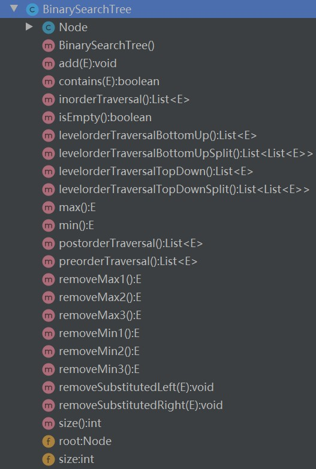

# 【数据结构—集合】集合（2）

<br/>

## 1、概述

<br/>

- 基于二分搜索树的集合。
- 应该说，常规的二分搜索树天然就具有集合的特性，因为常规的二分搜索树本身就不允许存在重复的元素。

---

## 2、Java 代码实现

<br/>

- 集合的接口：


```java
public interface Set<E> {

    void add(E e);

    void remove(E e);

    boolean contains(E e);

    int size();

    boolean isEmpty();

}
```


- 二分搜索树：





```java
import java.util.*;

/**
 * 二分搜素树
 *
 * 所有操作为 非递归
 */
public class BinarySearchTree<E extends Comparable<E>> {

    /**
     * 树的节点
     *
     * 注意：内部类无需声明泛型 即 Node<E> 不合适
     */
    private class Node {
        E val;

        Node left;

        Node right;

        public Node(E val, Node left, Node right) {
            this.val = val;
            this.left = left;
            this.right = right;
        }

        public Node(E val) {
            this(val, null, null);
        }

        public Node() {
            this(null, null, null);
        }
    }

    /**
     * 树的根节点
     */
    private Node root;

    /**
     * 树中的节点数
     */
    private int size;

    public BinarySearchTree() {
        this.root = null;
        this.size = 0;
    }

    /**
     * 向二分搜索树中添加节点
     *
     * @param val 节点中的值
     */
    public void add(E val) {
        if (val == null) {
            throw new IllegalArgumentException("Value is null!");
        }

        if (root == null) {
            root = new Node(val);
        } else {
            Node cur = root;
            Node pre = null;

            while (cur != null) {
                pre = cur;
                if (val.compareTo(cur.val) < 0) {
                    cur = cur.left;
                } else if (val.compareTo(cur.val) > 0) {
                    cur = cur.right;
                } else {
                    break;
                }
            }

            // Duplicate Value
            if (cur != null) {
                throw new IllegalArgumentException("Duplicate Value!");
            }

            Node newNode = new Node(val);
            if (val.compareTo(pre.val) < 0) {
                // val < pre.val
                pre.left = newNode;
            } else {
                // val > pre.val
                pre.right = newNode;
            }
        }
        size++;
    }

    /**
     * 前（先）序遍历
     *
     * @return null / list
     */
    public List<E> preorderTraversal() {
        if (root == null) {
            return null;
        }

        List<E> result = new ArrayList<>();

        Node cur = null;
        Stack<Node> stack = new Stack<>();
        stack.push(root);
        while (!stack.isEmpty()) {
            cur = stack.pop();
            result.add(cur.val);
            if (cur.right != null) {
                stack.push(cur.right);
            }
            if (cur.left != null) {
                stack.push(cur.left);
            }
        }

        return result;
    }

    /**
     * 中序遍历
     *
     * @return null / list
     */
    public List<E> inorderTraversal() {
        if (root == null) {
            return null;
        }

        List<E> result = new ArrayList<>();

        Node cur = root;
        Stack<Node> stack = new Stack<>();
        while (cur != null) {
            stack.push(cur);
            cur = cur.left;
        }
        while (!stack.isEmpty()) {
            cur = stack.pop();
            result.add(cur.val);
            if (cur.right != null) {
                cur = cur.right;
                while (cur != null) {
                    stack.push(cur);
                    cur = cur.left;
                }
            }
        }
        return result;
    }

    /**
     * 后序遍历
     *
     * @return null / list
     */
    public List<E> postorderTraversal() {
        if (root == null) {
            return null;
        }

        List<E> result = new ArrayList<>();

        Stack<Node> stack1 = new Stack<>();
        Stack<E> stack2 = new Stack<>();
        Node cur = null;
        stack1.push(root);
        while (!stack1.isEmpty()) {
            cur = stack1.pop();
            stack2.push(cur.val);
            if (cur.left != null) {
                stack1.push(cur.left);
            }
            if (cur.right != null) {
                stack1.push(cur.right);
            }
        }
        while (!stack2.isEmpty()) {
            result.add(stack2.pop());
        }

        return result;
    }

    /**
     * 层序遍历
     *
     * 自顶向下、每一层自左向右
     *
     * @return null / list
     */
    public List<E> levelorderTraversalTopDown() {
        if (root == null) {
            return null;
        }

        List<E> result = new ArrayList<>();

        Node cur = null;
        Queue<Node> queue = new LinkedList<>();
        queue.offer(root);
        while (!queue.isEmpty()) {
            cur = queue.poll();
            result.add(cur.val);
            if (cur.left != null) {
                queue.offer(cur.left);
            }
            if (cur.right != null) {
                queue.offer(cur.right);
            }
        }
        return result;
    }

    /**
     * 层序遍历
     *
     * 自顶向下、每一层自左向右、每一层分开存放
     *
     * @return null / list
     */
    public List<List<E>> levelorderTraversalTopDownSplit() {
        if (root == null) {
            return null;
        }

        List<List<E>> result = new ArrayList<>();

        Queue<Node> queue = new LinkedList<>();
        Node cur = null;
        int curSize = 0;
        List<E> curLevel = null;
        queue.offer(root);
        while (!queue.isEmpty()) {
            curSize = queue.size();
            curLevel = new ArrayList<>();
            for (int i = 0; i < curSize; i++) {
                cur = queue.poll();
                curLevel.add(cur.val);
                if (cur.left != null) {
                    queue.offer(cur.left);
                }
                if (cur.right != null) {
                    queue.offer(cur.right);
                }
            }
            result.add(curLevel);
        }

        return result;
    }

    /**
     * 层序遍历
     *
     * 自底向上、每一层自左向右
     *
     * @return null / list
     */
    public List<E> levelorderTraversalBottomUp() {
        if (root == null) {
            return null;
        }

        List<E> result = new ArrayList<>();
        List<List<E>> lists = levelorderTraversalBottomUpSplit();
        for (List<E> list : lists) {
            result.addAll(list);
        }

        return result;
    }

    /**
     * 层序遍历
     *
     * 自底向上、每一层自左向右、每一层分开存放
     *
     * @return null / list
     */
    public List<List<E>> levelorderTraversalBottomUpSplit() {
        if (root == null) {
            return null;
        }

        List<List<E>> result = levelorderTraversalTopDownSplit();
        Collections.reverse(result);

        return result;
    }

    /**
     * 二分搜索树中是否包含指定值的节点
     *
     * @param val 值
     * @return true / false
     */
    public boolean contains(E val) {
        if (val == null) {
            return false;
        }

        if (root == null) {
            return false;
        }

        Node cur = root;
        while (cur != null) {
            if (val.compareTo(cur.val) == 0) {
                break;
            } else if (val.compareTo(cur.val) < 0) {
                cur = cur.left;
            } else {
                cur = cur.right;
            }
        }

        return cur != null;
    }


    /**
     * 获取当前二分搜索树中的最大值
     *
     * @return exception / max value
     */
    public E max() {
        if (root == null) {
            throw new NullPointerException("Tree is empty!");
        }

        Node cur = root;
        while (cur.right != null) {
            cur = cur.right;
        }
        return cur.val;
    }

    /**
     * 获取当前二分搜索树中的最小值
     *
     * @return exception / min value
     */
    public E min() {
        if (root == null) {
            throw new NullPointerException("Tree is empty!");
        }

        Node cur = root;
        while (cur.left != null) {
            cur = cur.left;
        }
        return cur.val;
    }

    /**
     * 删除二分搜索树中的最大值的节点
     *
     * 实现1
     *
     * @return exception / max value
     */
    public E removeMax1() {
        if (root == null) {
            throw new NullPointerException("Tree is empty!");
        }

        Node cur = root;
        Node pre = null;

        while (cur.right != null) {
            pre = cur;
            cur = cur.right;
        }

        E max = null;
        if (pre == null) {
            max = root.val;
            root = null;
        } else {
            max = cur.val;
            pre.right = cur.left;
        }
        size--;

        return max;
    }

    /**
     * 删除二分搜索树中的最大值的节点
     *
     * 实现2
     *
     * @return exception / max value
     */
    public E removeMax2() {
        E max = max();
        removeSubstitutedLeft(max);
        return max;
    }

    /**
     * 删除二分搜索树中的最大值的节点
     *
     * 实现3
     *
     * @return exception / max value
     */
    public E removeMax3() {
        E max = max();
        removeSubstitutedRight(max);
        return max;
    }

    /**
     * 删除二分搜索树中的最小值的节点
     *
     * 实现1
     *
     * @return exception / min value
     */
    public E removeMin1() {
        if (root == null) {
            throw new NullPointerException("Tree is empty!");
        }

        Node cur = root;
        Node pre = null;

        while (cur.left != null) {
            pre = cur;
            cur = cur.left;
        }

        E min = null;
        if (pre == null) {
            min = root.val;
            root = null;
        } else {
            min = cur.val;
            pre.left = cur.right;
        }
        size--;

        return min;
    }

    /**
     * 删除二分搜索树中的最小值的节点
     *
     * 实现2
     *
     * @return exception / min value
     */
    public E removeMin2() {
        E min = min();
        removeSubstitutedLeft(min);
        return min;
    }

    /**
     * 删除二分搜索树中的最小值的节点
     *
     * 实现3
     *
     * @return exception / min value
     */
    public E removeMin3() {
        E min = min();
        removeSubstitutedRight(min);
        return min;
    }


    /**
     * 删除值为 val 的指定的节点
     *
     * 当待删节点既有左子树又有右子树时，使用“中序前驱”即“待删节点的左子树中最大值”替换
     *
     * @param val 指定值
     */
    public void removeSubstitutedLeft(E val) {
        if (root == null) {
            throw new NullPointerException("Tree is empty!");
        }

        Node cur1 = root;
        Node pre1 = null;
        Node cur2 = null;
        Node pre2 = null;

        while (cur1 != null) {
            if (val.compareTo(cur1.val) < 0) {
                pre1 = cur1;
                cur1 = cur1.left;
            } else if (val.compareTo(cur1.val) > 0) {
                pre1 = cur1;
                cur1 = cur1.right;
            } else {
                break;
            }
        }

        // 1、值不存在
        if (cur1 == null) {
            throw new IllegalArgumentException("Value does not exist!");
        }

        // 2、值存在

        // 2.1、pre1 == null：要删的节点为整棵树的根节点
        if (pre1 == null) {
            // 2.1.1、根节点的左右子树为空，即整棵树只有根节点
            if (root.left == null && root.right == null) {
                root = null;
                size--;
            } else {
                // 2.1.2、根节点的左子树为空，右子树不为空
                if (root.left == null) {
                    Node temp = root.right;
                    root.right = null;
                    root = temp;
                    size--;
                    return;
                }

                // 2.1.3、根节点的右子树为空，左子树不为空
                if (root.right == null) {
                    Node temp = root.left;
                    root.left = null;
                    root = temp;
                    size--;
                    return;
                }

                // 2.1.4、根节点左、右子树均不为空
                cur2 = root.left;
                pre2 = root;
                while (cur2.right != null) {
                    pre2 = cur2;
                    cur2 = cur2.right;
                }

                root.val = cur2.val;

                Node temp = cur2.left;
                cur2.left = null;

                // 2.1.4.1、所使用替换值（左子树中最大值）所在的节点的父节点 为 待删除根节点
                if (pre2 == root) {
                    pre2.left = temp;
                } else {
                    // 2.1.4.2、所使用替换值（左子树中最大值）所在的节点的父节点 不是 待删除根节点
                    pre2.right = temp;
                }
                size--;
            }
        } else {
            // 2.2、pre1 != null：要删的节点为非根节点

            // 2.2.1、待删节点的左右子树为空，即叶子节点
            if (cur1.left == null && cur1.right == null) {
                // 2.2.1.1、待删节点比父节点小
                if (cur1.val.compareTo(pre1.val) < 0) {
                    pre1.left = null;
                } else {
                    // 2.2.1.2、待删节点比父节点大
                    pre1.right = null;
                }
                size--;
            } else {
                // 2.2.2、待删节点的左子树为空，右子树不为空
                if (cur1.left == null) {
                    Node temp = cur1.right;
                    cur1.right = null;
                    // 2.2.2.1、待删节点比父节点小
                    if (cur1.val.compareTo(pre1.val) < 0) {
                        pre1.left = temp;
                    } else {
                        // 2.2.2.2、待删节点比父节点大
                        pre1.right = temp;
                    }
                    size--;
                    return;
                }

                // 2.2.3、待删节点的右子树为空，左子树不为空
                if (cur1.right == null) {
                    Node temp = cur1.left;
                    cur1.left = null;
                    // 2.2.3.1、待删节点比父节点小
                    if (cur1.val.compareTo(pre1.val) < 0) {
                        pre1.left = temp;
                    } else {
                        // 2.2.3.2、待删节点比父节点大
                        pre1.right = temp;
                    }
                    size--;
                    return;
                }

                // 2.2.4、待删节点的左、右子树均不为空
                cur2 = cur1.left;
                pre2 = cur1;
                while (cur2.right != null) {
                    pre2 = cur2;
                    cur2 = cur2.right;
                }

                cur1.val = cur2.val;

                Node temp = cur2.left;
                cur2.left = null;
                // 2.2.4.1、所使用替换值（左子树中最大值）所在的节点的父节点 是 待删除节点
                if (pre2 == cur1) {
                    pre2.left = temp;
                } else {
                    // 2.2.4.2、所使用替换值（左子树中最大值）所在的节点的父节点 不是 待删除节点
                    pre2.right = temp;
                }
            }
        }

    }

    /**
     * 删除值为 val 的指定的节点
     *
     * 当待删节点既有左子树又有右子树时，使用“中序后继”即“待删节点的右子树中最小值”替换
     *
     * @param val 指定值
     */
    public void removeSubstitutedRight(E val) {
        if (root == null) {
            throw new NullPointerException("Tree is empty!");
        }

        Node cur1 = root;
        Node pre1 = null;
        Node cur2 = null;
        Node pre2 = null;

        while (cur1 != null) {
            if (val.compareTo(cur1.val) < 0) {
                pre1 = cur1;
                cur1 = cur1.left;
            } else if (val.compareTo(cur1.val) > 0) {
                pre1 = cur1;
                cur1 = cur1.right;
            } else {
                break;
            }
        }

        // 1、值不存在
        if (cur1 == null) {
            throw new IllegalArgumentException("Value does not exist!");
        }

        // 2、值存在

        // 2.1、pre1 == null：要删的节点为整棵树的根节点
        if (pre1 == null) {
            // 2.1.1、根节点的左右子树为空，即整棵树只有根节点
            if (root.left == null && root.right == null) {
                root = null;
                size--;
            } else {
                // 2.1.2、根节点的左子树为空，右子树不为空
                if (root.left == null) {
                    Node temp = root.right;
                    root.right = null;
                    root = temp;
                    size--;
                    return;
                }

                // 2.1.3、根节点的右子树为空，左子树不为空
                if (root.right == null) {
                    Node temp = root.left;
                    root.left = null;
                    root = temp;
                    size--;
                    return;
                }

                // 2.1.4、根节点左、右子树均不为空
                cur2 = root.right;
                pre2 = root;
                while (cur2.left != null) {
                    pre2 = cur2;
                    cur2 = cur2.left;
                }

                root.val = cur2.val;

                Node temp = cur2.right;
                cur2.right = null;

                // 2.1.4.1、所使用替换值（右子树中最小值）所在的节点的父节点 为 待删除根节点
                if (pre2 == root) {
                    pre2.right = temp;
                } else {
                    // 2.1.4.2、所使用替换值（右子树中最小值）所在的节点的父节点 不是 待删除根节点
                    pre2.left = temp;
                }
                size--;
            }
        } else {
            // 2.2、pre1 != null：要删的节点为非根节点

            // 2.2.1、待删节点的左右子树为空，即叶子节点
            if (cur1.left == null && cur1.right == null) {
                // 2.2.1.1、待删节点比父节点小
                if (cur1.val.compareTo(pre1.val) < 0) {
                    pre1.left = null;
                } else {
                    // 2.2.1.2、待删节点比父节点大
                    pre1.right = null;
                }
                size--;
            } else {
                // 2.2.2、待删节点的左子树为空，右子树不为空
                if (cur1.left == null) {
                    Node temp = cur1.right;
                    cur1.right = null;
                    // 2.2.2.1、待删节点比父节点小
                    if (cur1.val.compareTo(pre1.val) < 0) {
                        pre1.left = temp;
                    } else {
                        // 2.2.2.2、待删节点比父节点大
                        pre1.right = temp;
                    }
                    size--;
                    return;
                }

                // 2.2.3、待删节点的右子树为空，左子树不为空
                if (cur1.right == null) {
                    Node temp = cur1.left;
                    cur1.left = null;
                    // 2.2.3.1、待删节点比父节点小
                    if (cur1.val.compareTo(pre1.val) < 0) {
                        pre1.left = temp;
                    } else {
                        // 2.2.3.2、待删节点比父节点大
                        pre1.right = temp;
                    }
                    size--;
                    return;
                }

                // 2.2.4、待删节点的左、右子树均不为空
                cur2 = cur1.right;
                pre2 = cur1;
                while (cur2.left != null) {
                    pre2 = cur2;
                    cur2 = cur2.left;
                }

                cur1.val = cur2.val;

                Node temp = cur2.right;
                cur2.right = null;
                // 2.2.4.1、所使用替换值（右子树中最小值）所在的节点的父节点 是 待删除节点
                if (pre2 == cur1) {
                    pre2.right = temp;
                } else {
                    // 2.2.4.2、所使用替换值（右子树中最小值）所在的节点的父节点 不是 待删除节点
                    pre2.left = temp;
                }
            }
        }

    }

    /**
     * 二分搜素树是否为空树
     *
     * @return true / false
     */
    public boolean isEmpty() {
        return size == 0;
        // 或者 return root == null;
    }

    /**
     * 二分搜索树中的节点数
     *
     * @return size
     */
    public int size() {
        return this.size;
    }

}
```


- 集合的实现：


```java
public class BinarySearchTreeSet<E extends Comparable<E>> implements Set<E> {

    private BinarySearchTree<E> bst;

    public BinarySearchTreeSet() {
        this.bst = new BinarySearchTree<>();
    }

    @Override
    public void add(E e) {
        if (e == null) {
            throw new IllegalArgumentException("Value is null!");
        }
        bst.add(e);
    }

    @Override
    public void remove(E e) {
        bst.removeSubstitutedLeft(e);
    }

    @Override
    public boolean contains(E e) {
        return bst.contains(e);
    }

    @Override
    public int size() {
        return bst.size();
    }

    @Override
    public boolean isEmpty() {
        if (this.bst == null) {
            return true;
        }
        return bst.isEmpty();
    }

}
```