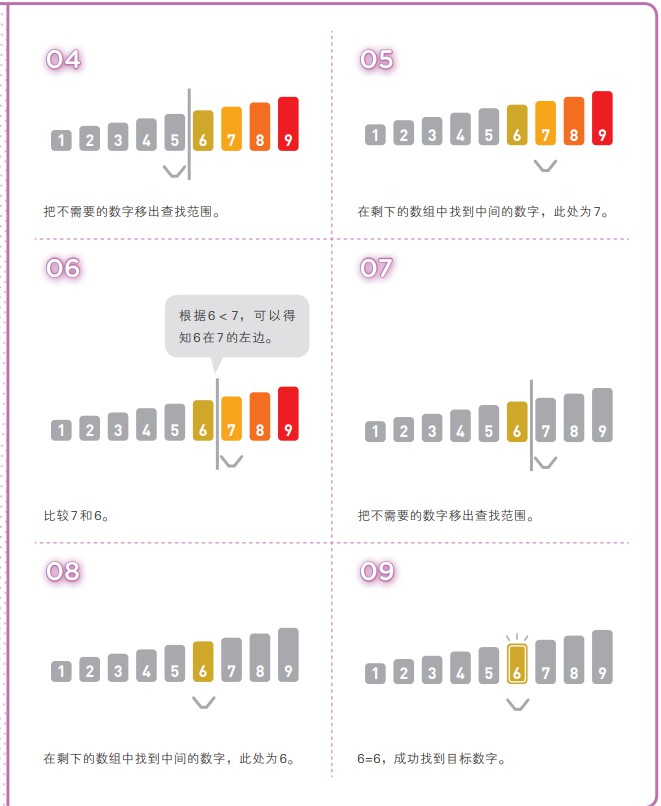

# 【查找】二分查找（1）

<br/>

## 1、概述

<br/>

- 查找是计算机领域一个朴素并且重要的问题。
- 很多数据结构的诞生，其主要目的之一就是为了实现快速查找。
- 最基本的查找是“线性查找”。时间复杂度 $O(n)$，即在遍历的过程中查找。
- 二分查找（Binary Search）是查找的经典算法之一，也称“折半查找”，但二分查找的前提是数据**有序**，排序是可以说是二分查找的前置条件。
- 二分查找时间复杂度 $O(logn)$

---

## 2、思想

- 二分查找法的思想是，在有序的数据中，先取中间的数据与目标数据比较，如果匹配则直接结束查找；如果不匹配，根据与中间数据比较的结果，将查找范围转向一侧；然后重复这一过程，直至查找出结果或给出“没有查到”的结论。

---


## 3、动画演示等

<br/>





---

## 4、Java 代码实现

<br/>

### 4.1、递归实现

- 从二分查找的描述上，可以看到二分查找是一个递归过程。


```java
public class BinarySearch {

    private static final int NOT_FOUND_FLAG = -1;

    private BinarySearch() {}

    public static int binarySearch(int[] arr, int target, boolean isAscending) {
        return search(arr, 0, arr.length - 1, target, isAscending);
    }

    /**
     * 在数组 arr 的区间 [l,r] 中查找 target
     *
     * @param arr 数组
     * @param l 左边界
     * @param r 右边界
     * @param target 查找目标
     * @param isAscending 数据是否是“升序”
     * @return 目标的索引 或 -1
     */
    private static int search(int[] arr, int l, int r, int target, boolean isAscending) {
        // 递归终止，没找到
        if (l > r) {
            return NOT_FOUND_FLAG;
        }

        // int mid = l + (r - l) / 2  防止整型溢出的写法
        int mid = (l + r) / 2;

        if (arr[mid] == target) {
            return mid;
        }

        int tempL, tempR;
        if (arr[mid] > target) {
            // 升序，中间位置数据比目标大，去左侧搜索 [l,mid-1]
            // 降序，中间位置数据比目标大，去右侧搜索 [mid+1,r]
            tempL = isAscending ? l : (mid + 1);
            tempR = isAscending ? (mid - 1) : r;
        } else {
            // 升序，中间位置数据比目标小，去右侧搜索 [mid+1,r]
            // 降序，中间位置数据比目标小，去左侧搜索 [l,mid-1]
            tempL = isAscending ? (mid + 1) : l;
            tempR = isAscending ? r : (mid - 1);
        }
        return search(arr, tempL, tempR, target, isAscending);
    }

}
```


```java
public class BinarySearch {

    private static final int NOT_FOUND_FLAG = -1;

    private BinarySearch() {}

    public static <E extends Comparable<E>> int binarySearch(E[] arr, E target, boolean isAscending) {
        return search(arr, 0, arr.length - 1, target, isAscending);
    }

    /**
     * 在数组 arr 的区间 [l,r] 中查找 target
     *
     * @param arr 数组
     * @param l 左边界
     * @param r 右边界
     * @param target 查找目标
     * @param isAscending 数据是否是“升序”
     * @return 目标的索引 或 -1
     */
    private static <E extends Comparable<E>> int search(E[] arr, int l, int r, E target, boolean isAscending) {
        // 递归终止，没找到
        if (l > r) {
            return NOT_FOUND_FLAG;
        }

        // int mid = l + (r - l) / 2  防止整型溢出的写法
        int mid = (l + r) / 2;

        if (arr[mid].compareTo(target) == 0) {
            return mid;
        }

        int tempL, tempR;
        if (arr[mid].compareTo(target) > 0) {
            // 升序，中间位置数据比目标大，去左侧搜索 [l,mid-1]
            // 降序，中间位置数据比目标大，去右侧搜索 [mid+1,r]
            tempL = isAscending ? l : (mid + 1);
            tempR = isAscending ? (mid - 1) : r;
        } else {
            // 升序，中间位置数据比目标小，去右侧搜索 [mid+1,r]
            // 降序，中间位置数据比目标小，去左侧搜索 [l,mid-1]
            tempL = isAscending ? (mid + 1) : l;
            tempR = isAscending ? r : (mid - 1);
        }
        return search(arr, tempL, tempR, target, isAscending);
    }

}
```


---

### 4.2、非递归实现

- 非递归实现，依靠循环和索引变化，实现查找。


```java
public class BinarySearch {

    private static final int NOT_FOUND_FLAG = -1;

    private BinarySearch() {}

    public static int binarySearch(int[] arr, int target, boolean isAscending) {
        int l = 0;
        int r = arr.length - 1;
        int mid;

        while (l <= r) {
            mid = (l + r) / 2;

            if (arr[mid] == target) {
                return mid;
            }

            if (arr[mid] > target) {
                // 升序，中间位置数据比目标大，去左侧搜索 [l,mid-1]
                // 降序，中间位置数据比目标大，去右侧搜索 [mid+1,r]
                l = isAscending ? l : (mid + 1);
                r = isAscending ? (mid - 1) : r;
            } else {
                // 升序，中间位置数据比目标小，去右侧搜索 [mid+1,r]
                // 降序，中间位置数据比目标小，去左侧搜索 [l,mid-1]
                l = isAscending ? (mid + 1) : l;
                r = isAscending ? r : (mid - 1);
            }
        }

        return NOT_FOUND_FLAG;
    }

}
```


```java
public class BinarySearch {

    private static final int NOT_FOUND_FLAG = -1;

    private BinarySearch() {}

    public static <E extends Comparable<E>> int binarySearch(E[] arr, E target, boolean isAscending) {
        int l = 0;
        int r = arr.length - 1;
        int mid;

        while (l <= r) {
            mid = (l + r) / 2;

            if (arr[mid].compareTo(target) == 0) {
                return mid;
            }

            if (arr[mid].compareTo(target) > 0) {
                // 升序，中间位置数据比目标大，去左侧搜索 [l,mid-1]
                // 降序，中间位置数据比目标大，去右侧搜索 [mid+1,r]
                l = isAscending ? l : (mid + 1);
                r = isAscending ? (mid - 1) : r;
            } else {
                // 升序，中间位置数据比目标小，去右侧搜索 [mid+1,r]
                // 降序，中间位置数据比目标小，去左侧搜索 [l,mid-1]
                l = isAscending ? (mid + 1) : l;
                r = isAscending ? r : (mid - 1);
            }
        }

        return NOT_FOUND_FLAG;
    }

}
```