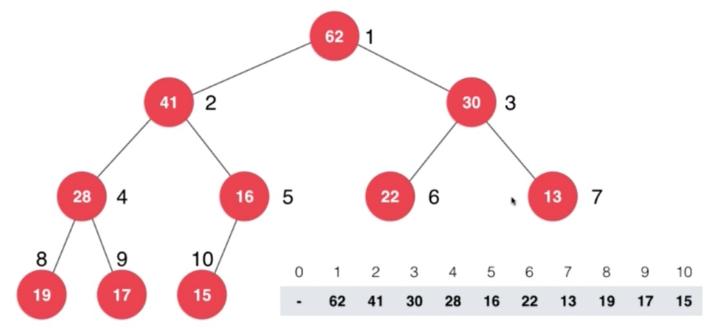
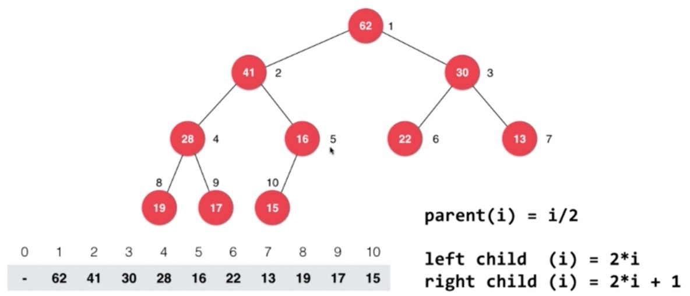
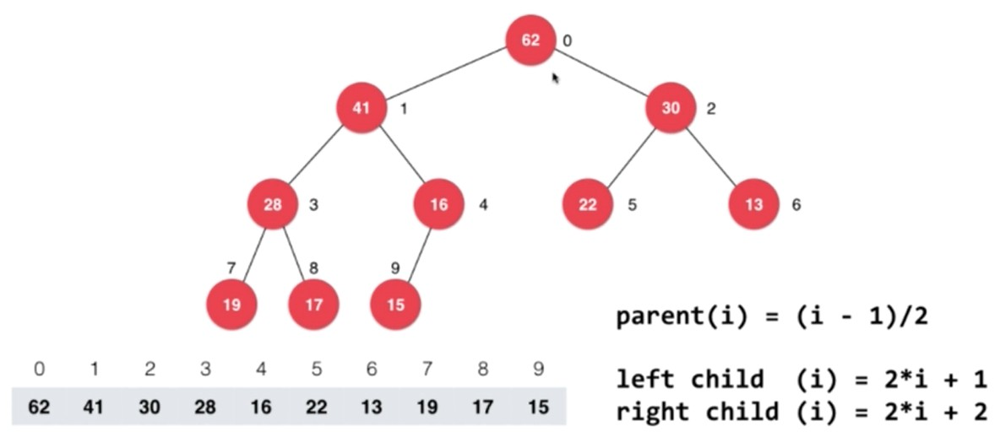

# 【堆】堆概述

<br/>

## 1、概述

<br/>

- 堆（Heap），常见的堆是二叉树形堆。
- 二叉树形堆，以下简称“堆”。首先，堆**必须**是一个**完全二叉树**；其次，如果堆中的每一个节点中的值**小于（或不大于）**其父节点的值，这个堆可以称为“最大堆”，最大堆中，根节点的值是整个堆中最大的；如果堆中的每一个节点中的值**大于（或不小于）**其父节点的值，这个堆可以称为“最小堆”，最小堆中，根节点的值是整个堆中最小的。
- 如果没有特殊说明，“堆”指的就是“二叉树形堆”。

---

## 2、堆在计算机中的存储

<br/>

### 2.1、链式存储

- 也就是二叉链表，二叉树最常见的存储方式。


```java
public class BinaryTree<T extends Comparable<T>> {
    
    private class Node {
        
        ······
        
        Node leftChild;
        
        Node rightChild;
        
        ······
        
    }
    
}
```


---

### 2.2、顺序存储

- 因为堆是完全二叉树，针对**完全二叉树**，是完全可以使用数组这一顺序存储结构的。





- 使用数组存储，关键问题之一就是如何确定某一节点的父节点、左、右子节点。完全二叉树使用数组存储，某一节点的索引与其父节点的索引、左右子节点的索引具有一定的关系。以下两图分别是使用数组自索引为1开始存储完全二叉树、自索引为0开始存储完全二叉树。








---

## 3、堆的分类

<br/>

### 3.1、最大堆

- 堆中的每一个节点中的值**小于（或不大于）**其父节点的值。
- 最大堆中，根节点的值是整个堆中的最大值。

---

### 3.2、最小堆

- 堆中的每一个节点中的值**大于（或不小于）**其父节点的值。
- 最小堆中，根节点的值是整个堆中的最小值。

---

## 4、堆的应用

<br/>

### 4.1、堆排序

- 利用堆这一数据结构或者构建堆的思想，可以实现排序。
- 利用最大堆可以实现降序排序；利用最小堆可以实现升序排序。

---

### 4.2、优先队列

- 优先队列（Priority Queue）
- 优先队列是一种特殊的队列，队列中的元素被赋予优先级，特殊的地方在于“出队”，“出队”基于优先级，优先级高的先出队。
- 优先队列的底层实现通常使用堆。