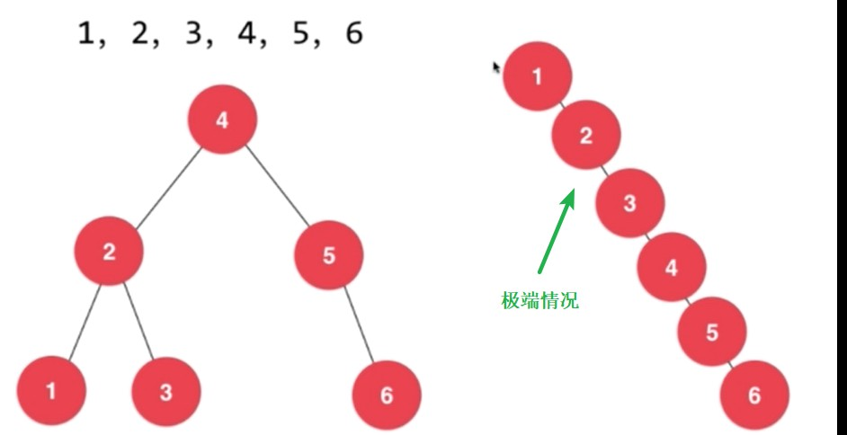

# 【集合】集合总结

 

## 1、时间复杂度

 

- 已经使用链表、二分搜索树实现了简单的集合。
- 底层使用链表实现的集合的相关操作的时间复杂度：

| 操作     | 时间复杂度 | 说明                                                         |
| -------- | ---------- | ------------------------------------------------------------ |
| add      | $O(n)$     | 对于链表实现的集合，首先要使用`contains`判断是否已经存在，这个过程最坏的情况就得遍历一遍整个链表。真正`add`操作，直接采用链表的“头插法”，这个操作是 $O(1)$。综合，时间复杂度是 $O(n)$ |
| remove   | $O(n)$     |                                                              |
| contains | $O(n)$     |                                                              |

- 底层使用二分搜索树实现的集合的相关操作的时间复杂度：

| 操作     | 时间复杂度 | 说明                                                         |
| -------- | ---------- | ------------------------------------------------------------ |
| add      | $O(h)$     | $h$ 是二叉树的高度。 `add`、`remove`、`contains`这几个操作，最坏的情况，都是需要定位至叶子节点，所以时间复杂度是 $O(h)$。  一棵高度为 $h$ 的满二叉树（$h$ 从1开始计算），有 $2^h-1$ 个节点。满二叉树有 $n$ 个节点，则 $h=log_2(n+1)$  所以这个时间复杂度 $O(h)$ 也可以写成 $O(logn)$ |
| remove   | $O(h)$     |                                                              |
| contains | $O(h)$     |                                                              |

---

## 2、其他的问题

 

### 2.1、有序集合、无序集合

- 有序集合，集合中的元素是遵循一定的排序规则（大小等）“存放”在集合中，具体的规则有时可以由人来制定。有序集合的底层实现比较常见的是二分搜索树或在其基础上的优化而来的数据结构。
- 无序集合，集合中的元素是无序存放或者按照添加的顺序存放。但无序存放并不意味着低效率查询。

---

### 2.2、二分搜索树时间复杂度退化

- 在上面的表中，$O(h)$ 是一个平均的时间复杂度，这个复杂度是建立在这个二叉树的形状是近似“满二叉树”。
- 但是，二分搜索树如果没有一些特殊处理的话，极端的情况是变为“链表”，就是每个节点只有左子树或每个节点只有右子树，这时，时间复杂度是 $O(n)$。

- 解决方案是平衡二叉树。