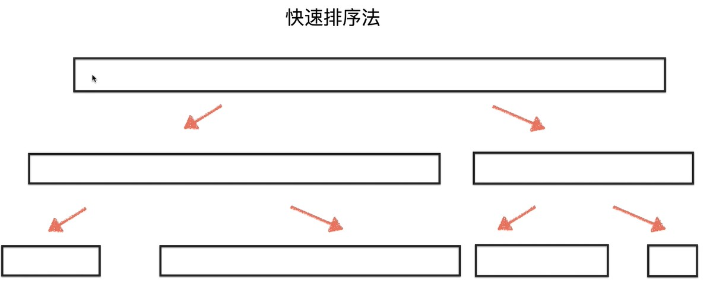

# 【排序】快速排序（3）

 

## 6、时间复杂度分析

 

- 快速排序算法的时间复杂度一般认为是 $O(nlogn)$。

  **简单理解**：这个复杂度是一个期望（数学期望）复杂度，因为快速排序是一个**随机算法**（partition 操作具有随机性（选取 pivot 的随机性）），不适合像普通算法那样，采用最坏的情况作为复杂度。

- 之前列举了三种快速排序：单路、双路、三路。三种快速排序演化的历程如下：

在均采取随机 pivot 的情况下，单路快速排序、双路快速排序的时间复杂度是有可能退化成$O(n^2)$的，但是概率是较低的。所以快速排序的时间复杂度平均来看是$O(nlogn)$的。

- 关于算法时间复杂度分析的一种角度：

> 普通算法：以最坏的情况作为时间复杂度。可以明确的找出用例使得算法出现最坏情况。

> 随机算法：所谓的随机算法，就是说其中含有的操作是具有随机性的，比如说快速排序中的 partition 操作的随机选取 pivot。
>
> 通过下图归并排序与快速排序的对比，可以看出快速排序的“随机”：
>
> 
>
> 
>
> 
>
> 
>
> 
>
> 对于随机算法，采用期望（平均化）作为时间复杂度。对于随机化的算法，并不是说不存在最坏情况，只是**很难**找出用例使其出现最坏情况。

> 算法中如果有某些操作是概率性的（不是随机，而是比较有规律的），可以尝试考虑均摊复杂度。

- 如果按照上面的角度，也会有人将**单路**快速排序的时间复杂度定为 $O(n^2)$，因为面对数据全都是一样的情况，单路快速排序确实是“退化”的且用例是明确的。
