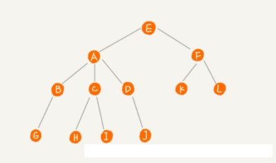
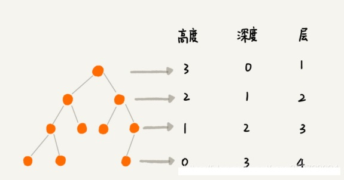
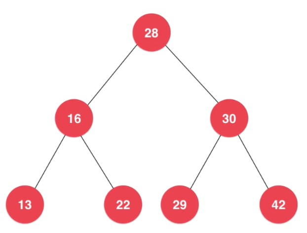
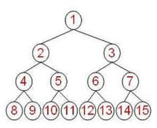
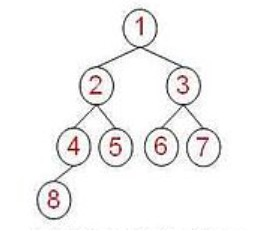
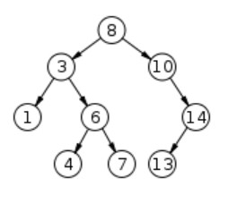

# 【树】树

<br/>

## 1、概述

- 树，数据结构领域中的重要角色。
- 树，与链表一样，是动态数据结构。
- 在计算机语言中，通过使用指针（引用）等来维系树的结构。
- 有很多数据结构是基于树实现的或基于树定义的。
- 创造出数据结构的目的，存储数据是一方面，重点是希望借助数据结构，提高数据读写等方面的性能。

---

## 2、相关概念

<br/>

### 2.1、基本

- 节点（Node）：树（Tree）的基本构成单元。树是由若干节点组成的有限集合，但节点之间存在联系。使用计算机语言描述“节点”时，需要使用指针（引用）等来维系树的结构。


```java
class Node {
    Content; // 节点内容，用于存储数据
    
    Node c1; 
    ···
    Node cn;// 指针，用于维系树的结构，可以取 null
}
```


- 空树（Empty Tree）：没有任何节点，即`NULL`。是一种比较特殊的树。


- 根节点（Root / Root Node）：类似于现实中的树的根。树结构的起点。一棵树最多有一个根节点。根节点无父节点。

  下图中 E 就是根节点。

- 父节点（Parent Node）：一个“相对”的概念，节点 X 是由节点 Y **直接**“延伸”出来的，则节点 X 是节点 Y 的父节点。

- 子节点（Child Node）：同样是一个“相对”的概念，节点 X 是由节点 Y **直接**“延伸”出来的，则节点 Y 是节点 X 的子节点。

- 叶（子）节点（Leaves / Leaves Node）：树结构的终点。没有子节点的节点。

  下图中，G、H、I、J 均是叶（子）节点。

- 非叶子节点：有子节点的节点。

- 兄弟节点：具有相同父节点的节点。

  下图中，A、F 是兄弟节点，B、C、D、K、L 是兄弟节点等。


- 只有一个节点，可以称为一棵树，该节点既是根节点，又是叶子节点。是一种比较特殊的树。





- 子树：除去父节点，每一个子节点和它的子节点所构成的结构都可以当作一颗树去看待。依次类推。所以在针对树这样的数据结构，理所当然的可以使用“递归”。
- 左子树、右子树：在左侧的子树、在右侧的子树。


- 节点的度（Degree）：该节点所拥有的子节点的数目。
- 树的度：取最大的“节点的度”作为当前树的度。


- 节点的所在的层（Level）：根节点处在第1层，与根节点的直接子节点处在第2层，依次类推。
- 树的层数：叶子节点所在的层数，取最大的层数作为树的层数。


- 节点的深度（Depth）：深度是从根节点开始计算（自顶向下）。关于“深度”的定义有很多种，有的地方认为根节点的深度为0，有的地方认为根节点的深度为1；有的地方以根节点到目标节点之间的节点数作为深度，有的地方以根节点到目标节点之间的边数作为深度等。
- 树的深度：取最大的“节点深度”作为当前树的深度。


- 节点的高度（Height）：高度是从**最底层的叶子节点**开始计算（自底向上）。关于“高度”的定义有很多种，有的地方认为最底层的叶子节点的高度为0，有的地方认为最底层的叶子节点的高度为1；有的地方以最底层的叶子节点到目标节点之间的节点数作为高度，有的地方以最底层的叶子节点到目标节点之间的边数作为深度等。
- 树的高度：取最大的“节点高度”作为当前树的高度。


- **常见**的深度、高度定义（多数资料中给出的定义）：





---

### 2.2、二叉树





- 二叉树（Binary Tree）可以认为是树这一数据结构中最常见的。
- 二叉树，**最多**允许有两个“分叉”即每个节点**最多**有**两个**子节点；同理，每个子节点最多有一个父节点。
- 空树、单节点、只有左子树、只有右子树等，也可以看作是一棵二叉树。
- 一般二叉树中节点的定义，Java 语言描述：


```java
class Node<E> {
    E e;
    Node leftChild;
    Node rightChild;
}
```


- 一个非空二叉树的第 $n$ 层（n 从1开始计算），**最多**有 $2^{n-1}$ 个节点。
- 一个非空的 $n$ 层二叉树，**最多**有 $2^n-1$ 个节点。


#### 2.2.1、满二叉树

- 满二叉树（Full Binary Tree）
- 非空二叉树，有 $n$ 层，有 $2^n-1$ 个节点，则这棵树就是一个满二叉树。
- 满二叉树，必须保证每一层都是“满”的，即第 $n$ 层的节点数（$n$ 从 $1$ 开始计算）必须是 $2^{n-1}$ 个。
- 下图为一个满二叉树：





---

#### 2.2.2、完全二叉树

- 完全二叉树（Complete Binary Tree）
- 除了最后一层，其余层的必须是“满”的，并且最后一层要么是“满”的，要么是**右侧缺少连续若干节点**。
- 满二叉树一定是完全二叉树，完全二叉树不一定是满二叉树。
- 下图为一个完全二叉树：





---

#### 2.2.3、二分搜索树

- 二分搜索树（Binary Search Tree, BST），也称“二分查找树”、“二叉搜索树”、“二叉查找树”、“排序二叉树”等。
- 前提是：节点所存储的内容**具有可比较性**。
- 一般（常规）的定义是：在二分搜索树中，每个节点所存储的内容，必须大于**其左子树中所有节点**所存储的内容，小于**其右子树中所有节点**所存储的内容。
- 二分搜索树的定义是比较灵活的，可以根据实际情况，定义所使用的二分搜索树，比如规定“每个节点所存储的内容，大于或等于**其左子树中所有节点**所存储的内容，小于**其右子树中所有节点**所存储的内容”等。
- 根据一般（常规）定义，二分搜索树中不存在所存储内容相等的节点。特殊定义除外。
- 空树、单节点，也可以看作是一棵二分搜索树。
- 由于二分搜索树的定义，所以出现所有的节点只有左子树或所有的节点只有右子树等情况是可能的。
- 如果无明确说明，二分搜索树均使用一般定义。
- 下图为一个二分搜索树：





---

### 2.3、多叉树

- 多叉树，允许有多个“分叉”即每个节点允许有多个子节点；但每个子节点最多有一个父节点。

---

### 2.4、森林

- 由 $n$ $(n \geq 0)$ 棵**互不相交**的树组成的集合。

---

## 3、树在计算机中的描述

<br/>

- 也可以称“树在计算机中的存储”。
- 常见的：基于指针（引用）的链式存储、基于数组的存储。
- 基于指针（引用）的链式存储，是使用是相对比较普遍的。