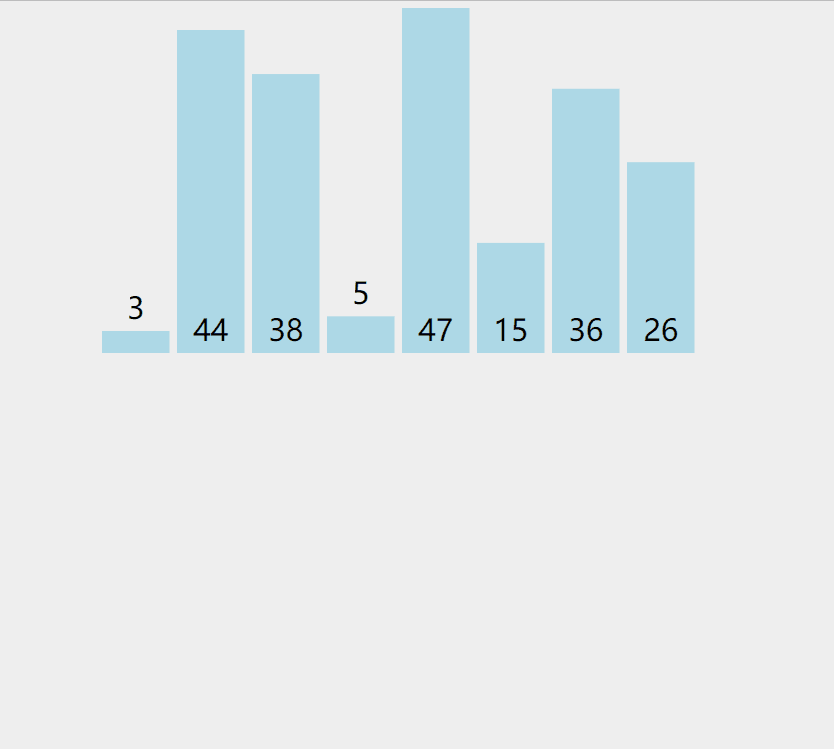
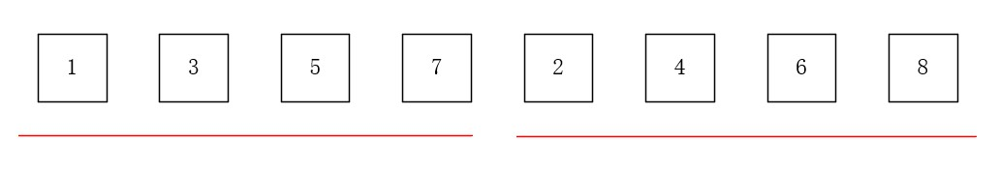

# 【排序】归并排序

<br/>

## 1、概述

<br/>

- 归并排序（Merge Sort）是一种高级排序算法。
- 归并排序的时间复杂度是 $O(nlogn)$，当然，这个是存在优化空间的。
- 整个排序的过程大体上就可以分为“归”、“并”两个步骤。“归”指的是“递归”，“并”是“合并”。
- 归并排序不是“就地”排序，因为在“并”的时候，需要开辟空间来完成。

---

## 2、思想

<br/>

- 归并排序的思想是：将需要排序的数据一分为二，分别对两个部分进行排序，排好序后，再将两组有序的数据进行合并。
- 归并排序中的一个重要的思想是“递归”，意思是，原始数据一分为二后，然后每一组数据再一分为二，直到每组中只有一个数据；之后每两组再按序合并，合并后的数据又形成一个新的组，再与另外一个组合二为一，直到合并完所有数据。


注意，虽然上图中所绘制出来的是拆分，但是实际上的“归并”依靠的是索引区间的变化，所有的数据仍然是一个完整的数组。


---


## 3、动画演示

<br/>




---

## 4、Java 代码实现

<br/>

### 4.1、合并的实现

- 在编写归并排序算法之前，需要先编写一个用于“合并”的方法，能够将两组有序数据**合并（或称“调整”）**成一组有序数据的方法。比较特殊的是，为了配合实现归并排序，这里的两组数据是在一起的即处在一个数组中，方法签名是`void merge(E[] arr, int l, int r, int mid)`，含义是“将`arr`中索引区间为$[l,mid]$这一有序部分与索引区间为$[mid+1,r]$这一有序部分按序合并”（注意，虽然字面上理解起来`merge`这一词更像是合并两个数组，但实际上`merge`的对象是**一个数组中的两部分**）。
- `merge`方法：


```java
import java.util.Arrays;

public class Main {

    public static void main(String[] args) {
        int[] arr = {1, 3, 5, 7, 9, 13, 0, 2, 4, 6, 8};
        System.out.println(arrString(arr));

        merge(arr, 1, arr.length - 2, 5);
        System.out.println(arrString(arr));
    }

    /**
     * 将 arr 的 [l,mid] 区间的有序部分与 [mid+1,r] 区间的有序部分合并（或称“调整”）为 [l,r] 整个区间有序
     *
     * 为配合归并排序，会直接对 arr 进行调整，所以调整之前需要拷贝一份原始对应索引区间的数据
     */
    private static void merge(int[] arr, int l, int r, int mid) {
        int[] temp = Arrays.copyOfRange(arr, l, r + 1);
        int i = l;
        int j = mid + 1;
        for (int k = l; k <= r; k++) {
            if (i <= mid && j <= r) {
                if (temp[i - l] < temp[j - l]) {
                    arr[k] = temp[i - l];
                    i++;
                } else {
                    arr[k] = temp[j - l];
                    j++;
                }
            } else if (i > mid) {
                arr[k] = temp[j - l];
                j++;
            } else {
                arr[k] = temp[i - l];
                i++;
            }
        }
    }

    private static String arrString(int[] arr) {
        StringBuilder sb = new StringBuilder("[");
        for (int i = 0; i < arr.length; i++) {
            sb.append(arr[i]);
            if (i != arr.length - 1) {
                sb.append(", ");
            }
        }
        sb.append("]");
        return sb.toString();
    }

}

/*
    [1, 3, 5, 7, 9, 13, 0, 2, 4, 6, 8]
    [1, 0, 2, 3, 4, 5, 6, 7, 9, 13, 8]
*/
```


上面代码在`main`方法调用`merge`方法，将数组`{1, 3, 5, 7, 9, 13, 0, 2, 4, 6, 8}`的索引区间为$[1,5]$的有序部分与索引区间为$[6,9]$的有序部分调整为整个$[1,9]$区间均为有序。

在`merge`方法中，为了配合后面的归并算法的实现，直接在原始的数组上进行调整，所以，需要先将整个索引区间中的数据拷贝出来（所以归并排序不是“就地”排序），在**拷贝出的数据**中**依次比较两部分有序数据**，根据比较的结果逐一放回原数组。由于拷贝出的数据索引是从0开始，所以会出现下面图所表示的偏移量的问题。


如果不理解，可以采取的一个较容易理解的方案，就是在一开始用新的变量来**在拷贝出的数组中**标注两个有序数据的起始。

拷贝出的数据中：

$0$ 一定是第一个有序数据部分的起始，$mid - l$ 是第一个有序数据部分的边界；

$mid + 1 - l$ 是第二个有序数据部分的起始，$r - l$ 是第二个有序数据部分的边界。


```java
    /**
     * 将 arr 的 [l,mid] 区间的有序部分与 [mid+1,r] 区间的有序部分合并（或称“调整”）为 [l,r] 整个区间有序
     *
     * 为配合归并排序，会直接对 arr 进行调整，所以调整之前需要拷贝一份原始数据
     */
    private static void merge(int[] arr, int l, int r, int mid) {
        int[] temp = Arrays.copyOfRange(arr, l, r + 1);
        
        // 拷贝出的数组中，如下是关键的变量

        // partOneIndex: 用于遍历第一部分有序数据
        int partOneIndex = 0;
        // partTwoIndex: 第一部分有序数据的边界索引
        int partOneBound = mid - l;

        // partOneIndex: 用于遍历第二部分有序数据
        int partTwoIndex = mid + 1 - l;
        // partTwoIndex: 第二部分有序数据的边界索引
        int partTwoBound = r - l;

        for (int cur = l; cur <= r; cur++) {
            if (partOneIndex <= partOneBound && partTwoIndex <= partTwoBound) {
                if (temp[partOneIndex] < temp[partTwoIndex]) {
                    arr[cur] = temp[partOneIndex];
                    partOneIndex++;
                } else {
                    arr[cur] = temp[partTwoIndex];
                    partTwoIndex++;
                }
            } else if (partOneIndex > partOneBound) {
                arr[cur] = temp[partTwoIndex];
                partTwoIndex++;
            } else {
                arr[cur] =  temp[partOneIndex];
                partOneIndex++;
            }
        }
    }
```


---

### 4.2、归并排序实现

- 对整数数组排序


```java
import java.util.Arrays;

public class MergeSortInteger {

    public static void mergeSort(int[] arr, boolean isAscending) {
        mergeSort(arr, 0, arr.length - 1, isAscending);
    }
    
    // 递归
    // 对 arr 数组的 [l,r] 区间进行排序 
    private static void mergeSort(int[] arr, int l, int r, boolean isAscending) {
        if (l >= r) {
            return;
        }
        // int mid = l + (r - l) / 2;
        int mid = (l + r) / 2;
        mergeSort(arr, l, mid, isAscending);
        mergeSort(arr, mid + 1, r, isAscending);
        // 排序后合并
        merge(arr, l, mid, r, isAscending);
    }

    private static void merge(int[] arr, int l, int mid, int r, boolean isAscending) {
        int[] temp = Arrays.copyOfRange(arr, l, r + 1);
        int partOneIndex = 0;
        int partOneBound = mid - l;
        int partTwoIndex = mid + 1 - l;
        int partTwoBound = r - l;

        for (int cur = l; cur <= r; cur++) {
            if (partOneIndex <= partOneBound && partTwoIndex <= partTwoBound) {
                if (temp[partOneIndex] < temp[partTwoIndex]) {
                    if (isAscending) {
                        arr[cur] = temp[partOneIndex];
                        partOneIndex++;
                    } else {
                        arr[cur] = temp[partTwoIndex];
                        partTwoIndex++;
                    }
                } else {
                    if (isAscending) {
                        arr[cur] = temp[partTwoIndex];
                        partTwoIndex++;
                    } else {
                        arr[cur] = temp[partOneIndex];
                        partOneIndex++;
                    }
                }
            } else if (partOneIndex > partOneBound) {
                arr[cur] = temp[partTwoIndex];
                partTwoIndex++;
            } else {
                arr[cur] = temp[partOneIndex];
                partOneIndex++;
            }
        }

    }

}
```


- 使用 Java 的泛型机制，对排序的数据种类进行拓展

```java
import java.util.Arrays;

public class MergeSort {

    public static <E extends Comparable<E>> void mergeSort(E[] arr, boolean isAscending) {
        mergeSort(arr, 0, arr.length - 1, isAscending);
    }

    private static <E extends Comparable<E>> void mergeSort(E[] arr, int l, int r, boolean isAscending) {
        if (l >= r) {
            return;
        }
        int mid = (l + r) / 2;
        mergeSort(arr, l, mid, isAscending);
        mergeSort(arr, mid + 1, r, isAscending);
        merge(arr, l, mid, r, isAscending);
    }

    private static <E extends Comparable<E>> void merge(E[] arr, int l, int mid, int r, boolean isAscending) {
        E[] temp = Arrays.copyOfRange(arr, l, r + 1);
        int partOneIndex = 0;
        int partOneBound = mid - l;
        int partTwoIndex = mid + 1 - l;
        int partTwoBound = r - l;

        for (int cur = l; cur <= r; cur++) {
            if (partOneIndex <= partOneBound && partTwoIndex <= partTwoBound) {
                if (temp[partOneIndex].compareTo(temp[partTwoIndex]) < 0) {
                    if (isAscending) {
                        arr[cur] = temp[partOneIndex];
                        partOneIndex++;
                    } else {
                        arr[cur] = temp[partTwoIndex];
                        partTwoIndex++;
                    }
                } else {
                    if (isAscending) {
                        arr[cur] = temp[partTwoIndex];
                        partTwoIndex++;
                    } else {
                        arr[cur] = temp[partOneIndex];
                        partOneIndex++;
                    }
                }
            } else if (partOneIndex > partOneBound) {
                arr[cur] = temp[partTwoIndex];
                partTwoIndex++;
            } else {
                arr[cur] = temp[partOneIndex];
                partOneIndex++;
            }
        }

    }

}
```


---

## 5、时间复杂度分析

- 递归函数的**粗略**算法复杂度分析：利用递归树，每个节点所包含的操作数之和。


---


## 6、优化

<br/>

### 6.1、优化1

- 优化1：有些情况下，没有必要`merge`。`merge`的含义是将“一个数组中的两个有序部分合并”，如果遇到下面的情况，升序时当“后部”的“第一个元素”就大于或等于“前部”的“最后一个元素”；降序时当“后部”的“第一个元素”就小于或等于“前部”的“最后一个元素。这时，就足以判定**当前递归过程中的数组**就已经是有序的了，没有必要再调用`merge`方法了。


```java
import java.util.Arrays;

public class MergeSort {

    public static <E extends Comparable<E>> void mergeSort(E[] arr, boolean isAscending) {
        mergeSort(arr, 0, arr.length - 1, isAscending);
    }

    private static <E extends Comparable<E>> void mergeSort(E[] arr, int l, int r, boolean isAscending) {
        if (l >= r) {
            return;
        }
        int mid = (l + r) / 2;
        mergeSort(arr, l, mid, isAscending);
        mergeSort(arr, mid + 1, r, isAscending);
        
        // 优化
        if (isAscending) {
            if (arr[mid].compareTo(arr[mid + 1]) > 0) {
                merge(arr, l, mid, r, isAscending);
            }
        } else {
            if (arr[mid].compareTo(arr[mid + 1]) < 0) {
                merge(arr, l, mid, r, isAscending);
            }
        }
    }

    private static <E extends Comparable<E>> void merge(E[] arr, int l, int mid, int r, boolean isAscending) {
        E[] temp = Arrays.copyOfRange(arr, l, r + 1);
        int partOneIndex = 0;
        int partOneBound = mid - l;
        int partTwoIndex = mid + 1 - l;
        int partTwoBound = r - l;

        for (int cur = l; cur <= r; cur++) {
            if (partOneIndex <= partOneBound && partTwoIndex <= partTwoBound) {
                if (temp[partOneIndex].compareTo(temp[partTwoIndex]) < 0) {
                    if (isAscending) {
                        arr[cur] = temp[partOneIndex];
                        partOneIndex++;
                    } else {
                        arr[cur] = temp[partTwoIndex];
                        partTwoIndex++;
                    }
                } else {
                    if (isAscending) {
                        arr[cur] = temp[partTwoIndex];
                        partTwoIndex++;
                    } else {
                        arr[cur] = temp[partOneIndex];
                        partOneIndex++;
                    }
                }
            } else if (partOneIndex > partOneBound) {
                arr[cur] = temp[partTwoIndex];
                partTwoIndex++;
            } else {
                arr[cur] = temp[partOneIndex];
                partOneIndex++;
            }
        }

    }

}
```


---

### 6.2、优化2

- 优化2：在满足某种条件的时候，归并排序不是最好的选择。所以这次优化的思路就是结合其他的排序算法。
- 归并排序（$O(nlogn)$ 复杂度）的优势体现在数据规模大、越无序的情况。但是在数据已经是有序的情况下，归并排序反倒显得没有优势。
- 在执行`merge`方法前进行判断的情况下（完成“优化1”的归并排序），对于有序的数组，时间复杂度“退化”为 $O(n)$。
- 之所以要强调归并排序在有序中没有优势，是因为归并排序的编写采用的是递归，递归过程中会出现“小数组”的情况（比如只对两个元素进行排序），在数组规模的越小的情况下，出现“当前数组本身已经就是有序”的情况的概率越大。于是，将在当前递归过程中“数组小”的时候采用“插入排序”。

> 插入排序与归并排序在面对**小规模已经是有序**的数据的时候，时间复杂度均是 $O(n)$，但是考虑到具体步骤的时候，归并排序的步骤明显会比插入排序繁琐。
>
> 即：因为时间复杂度分析一般是忽略常量的，插入排序在这种情况下“胜在”常量上。

对插入排序代码进行一些改造：


```java
    /**
     * 对数组 arr 中的索引 [l,r] 区间部分进行“插入排序”
     */
    private static <E extends Comparable<E>> void insertionSort(E[] arr, int l, int r, boolean isAscending) {
        for (int i = l; i <= r; i++) {
            for (int j = i; j - 1 >= l; j--) {
                if (isAscending) {
                    if (arr[j].compareTo(arr[j - 1]) < 0) {
                        swap(arr, j, j - 1);
                    } else {
                        break;
                    }
                } else {
                    if (arr[j].compareTo(arr[j - 1]) > 0) {
                        swap(arr, j, j - 1);
                    } else {
                        break;
                    }
                }
            }
        }
    }
```


```java
import java.util.Arrays;

public class MergeSort {

    public static <E extends Comparable<E>> void mergeSort(E[] arr, boolean isAscending) {
        mergeSort(arr, 0, arr.length - 1, isAscending);
    }

    private static <E extends Comparable<E>> void mergeSort(E[] arr, int l, int r, boolean isAscending) {
        // 优化：当数组规模较小的时候（长度小于某个确定值的时候），采用插入排序
        if (r - l + 1 <= 4) {
            insertionSort(arr, l, r, isAscending);
            return;
        }

        int mid = (l + r) / 2;
        mergeSort(arr, l, mid, isAscending);
        mergeSort(arr, mid + 1, r, isAscending);

        // 优化
        if (isAscending) {
            if (arr[mid].compareTo(arr[mid + 1]) > 0) {
                merge(arr, l, mid, r, isAscending);
            }
        } else {
            if (arr[mid].compareTo(arr[mid + 1]) < 0) {
                merge(arr, l, mid, r, isAscending);
            }
        }
    }

    private static <E extends Comparable<E>> void merge(E[] arr, int l, int mid, int r, boolean isAscending) {
        E[] temp = Arrays.copyOfRange(arr, l, r + 1);
        int partOneIndex = 0;
        int partOneBound = mid - l;
        int partTwoIndex = mid + 1 - l;
        int partTwoBound = r - l;

        for (int cur = l; cur <= r; cur++) {
            if (partOneIndex <= partOneBound && partTwoIndex <= partTwoBound) {
                if (temp[partOneIndex].compareTo(temp[partTwoIndex]) < 0) {
                    if (isAscending) {
                        arr[cur] = temp[partOneIndex];
                        partOneIndex++;
                    } else {
                        arr[cur] = temp[partTwoIndex];
                        partTwoIndex++;
                    }
                } else {
                    if (isAscending) {
                        arr[cur] = temp[partTwoIndex];
                        partTwoIndex++;
                    } else {
                        arr[cur] = temp[partOneIndex];
                        partOneIndex++;
                    }
                }
            } else if (partOneIndex > partOneBound) {
                arr[cur] = temp[partTwoIndex];
                partTwoIndex++;
            } else {
                arr[cur] = temp[partOneIndex];
                partOneIndex++;
            }
        }
    }

    /**
     * 对数组 arr 中的索引 [l,r] 区间部分进行“插入排序”
     */
    private static <E extends Comparable<E>> void insertionSort(E[] arr, int l, int r, boolean isAscending) {
        for (int i = l; i <= r; i++) {
            for (int j = i; j - 1 >= l; j--) {
                if (isAscending) {
                    if (arr[j].compareTo(arr[j - 1]) < 0) {
                        swap(arr, j, j - 1);
                    } else {
                        break;
                    }
                } else {
                    if (arr[j].compareTo(arr[j - 1]) > 0) {
                        swap(arr, j, j - 1);
                    } else {
                        break;
                    }
                }
            }
        }
    }

    private static <E> void swap(E[] arr, int i, int j) {
        if (arr != null && i >= 0 && i < arr.length && j >= 0 && j < arr.length) {
            E temp = arr[i];
            arr[i] = arr[j];
            arr[j] = temp;
        }
    }

}
```


该优化并不一定适合所有编程语言，在一些的语言中，这样的优化甚至可能会起到反效果。

---

### 6.3、优化3

- 优化3：这个优化属于空间上的优化。之前的`merge`方法中，都会创建一个新的数组`temp`，因为`merge`方法是会被多次调用，所以数组`temp`也会被重复创建，不断开辟新的数组空间是不合适的。所以这个优化所做的是，在整个归并排序过程中，只采用的一个数组空间来辅助完成归并排序。


```java
import java.util.Arrays;

public class MergeSort {

    public static <E extends Comparable<E>> void mergeSort(E[] arr, boolean isAscending) {
        // 优化，temp 将作为整个归并排序中的唯一辅助
        // 这里 copyOfRange 不是必须的，只要 temp 是一个长度与 arr  的长度相同的即可，一个新 new 的数组也是可以的：E[] temp = (E[]) new Object[arr.length]
        E[] temp = Arrays.copyOfRange(arr, 0, arr.length);
        mergeSort(arr, 0, arr.length - 1, isAscending, temp);
    }

    private static <E extends Comparable<E>> void mergeSort(E[] arr, int l, int r, boolean isAscending, E[] temp) {
        if (l >= r) {
            return;
        }
        int mid = (l + r) / 2;
        mergeSort(arr, l, mid, isAscending, temp);
        mergeSort(arr, mid + 1, r, isAscending, temp);

        // 优化
        if (isAscending) {
            if (arr[mid].compareTo(arr[mid + 1]) > 0) {
                merge(arr, l, mid, r, isAscending, temp);
            }
        } else {
            if (arr[mid].compareTo(arr[mid + 1]) < 0) {
                merge(arr, l, mid, r, isAscending, temp);
            }
        }
    }

    private static <E extends Comparable<E>> void merge(E[] arr, int l, int mid, int r, boolean isAscending, E[] temp) {
        // 优化，不用再新创建 temp 数组，通过“拷贝”使 temp 与 arr 保持一致即可
        // arr[l~r] 与 temp[l~r] 保持一致
        System.arraycopy(arr, l, temp, l, r - l + 1);

        int partOneIndex = l;
        int partOneBound = mid;

        int partTwoIndex = mid + 1;
        int partTwoBound = r;

        for (int cur = l; cur <= r; cur++) {
            if (partOneIndex <= partOneBound && partTwoIndex <= partTwoBound) {
                if (temp[partOneIndex].compareTo(temp[partTwoIndex]) < 0) {
                    if (isAscending) {
                        arr[cur] = temp[partOneIndex];
                        partOneIndex++;
                    } else {
                        arr[cur] = temp[partTwoIndex];
                        partTwoIndex++;
                    }
                } else {
                    if (isAscending) {
                        arr[cur] = temp[partTwoIndex];
                        partTwoIndex++;
                    } else {
                        arr[cur] = temp[partOneIndex];
                        partOneIndex++;
                    }
                }
            } else if (partOneIndex > partOneBound) {
                arr[cur] = temp[partTwoIndex];
                partTwoIndex++;
            } else {
                arr[cur] = temp[partOneIndex];
                partOneIndex++;
            }
        }

    }

}
```


---

## 7、自底向上的归并排序

<br/>

- 上面所编写的归并排序的代码，是“**自顶向下**”的。而“自底向上”的思想是开始不将数组看成一个整体，而是直接就分组，由1个到2个再到4个······





```java
import java.util.Arrays;

public class MergeSort {

    public static <E extends Comparable<E>> void mergeSort(E[] arr, boolean isAscending) {
        E[] temp = Arrays.copyOfRange(arr, 0, arr.length);

        int n = arr.length;

        // 外层循环：自底向上过程中，归并的尺寸
        // 1 -> 2 -> 4 -> 8 -> ······
        for (int size = 1; size < n; size += size) {
            // 内层循环：待合并区间的起始位置 i
            // 合并：[i, i + size - 1] 与 [i + size, i + size + size - 1]
            for (int i = 0; i + size < n; i += (size + size)) {
                if (isAscending) {
                    if (arr[i + size - 1].compareTo(arr[i + size]) > 0) {
                        // Math.min(i + size + size - 1, n - 1) 的意义：“i + size + size - 1” 在排序到最后的时候会出现越界
                        merge(arr, i, i + size - 1, Math.min(i + size + size - 1, n - 1), true, temp);
                    }
                } else {
                    if (arr[i + size - 1].compareTo(arr[i + size]) < 0) {
                        merge(arr, i, i + size - 1, Math.min(i + size + size - 1, n - 1), false, temp);
                    }
                }
            }
        }

    }

    private static <E extends Comparable<E>> void merge(E[] arr, int l, int mid, int r, boolean isAscending, E[] temp) {
        // 优化
        System.arraycopy(arr, l, temp, l, r - l + 1);

        int partOneIndex = l;
        int partOneBound = mid;

        int partTwoIndex = mid + 1;
        int partTwoBound = r;

        for (int cur = l; cur <= r; cur++) {
            if (partOneIndex <= partOneBound && partTwoIndex <= partTwoBound) {
                if (temp[partOneIndex].compareTo(temp[partTwoIndex]) < 0) {
                    if (isAscending) {
                        arr[cur] = temp[partOneIndex];
                        partOneIndex++;
                    } else {
                        arr[cur] = temp[partTwoIndex];
                        partTwoIndex++;
                    }
                } else {
                    if (isAscending) {
                        arr[cur] = temp[partTwoIndex];
                        partTwoIndex++;
                    } else {
                        arr[cur] = temp[partOneIndex];
                        partOneIndex++;
                    }
                }
            } else if (partOneIndex > partOneBound) {
                arr[cur] = temp[partTwoIndex];
                partTwoIndex++;
            } else {
                arr[cur] = temp[partOneIndex];
                partOneIndex++;
            }
        }

    }

}
```
