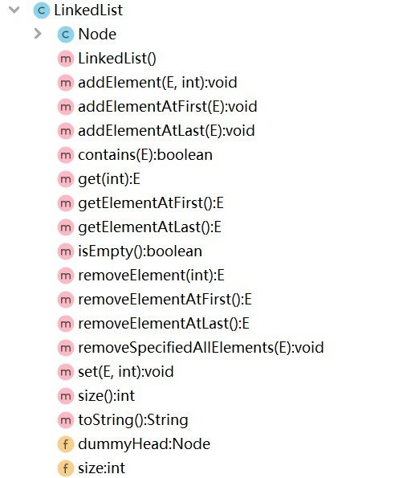

# 【集合】基于链表实现集合

<br/>

## 1、概述

- 基于链表的集合。

---

## 2、Java 代码实现

<br/>

- 集合的接口：


```java
public interface Set<E> {

    void add(E e);

    void remove(E e);

    boolean contains(E e);

    int size();

    boolean isEmpty();

}
```


- 链表：





```java
import java.util.Objects;

public class LinkedList<E> {

    private class Node {

        private E e;

        private Node next;

        public Node(E e) {
            this(e, null);
        }

        public Node(E e, Node next) {
            this.e = e;
            this.next = next;
        }

        @Override
        public String toString() {
            return e.toString();
        }

    }

    private Node dummyHead;

    private int size;

    public LinkedList() {
        this.dummyHead = new Node(null, null);
        this.size = 0;
    }

    public void addElementAtFirst(E e) {
        Node node = new Node(e);
        node.next = dummyHead.next;
        dummyHead.next = node;
        size++;
    }

    public void addElementAtLast(E e) {
        Node node = new Node(e, null);
        Node pre = dummyHead;
        while (pre.next != null) {
            pre = pre.next;
        }
        pre.next = node;
        size++;
    }

    public void addElement(E e, int index) {
        if (index < 0 || index > size) {
            throw new IllegalArgumentException("Index is Error!");
        }
        Node pre = dummyHead;
        for (int i = 0; i < index; i++) {
            pre = pre.next;
        }
        Node node = new Node(e);
        node.next = pre.next;
        pre.next = node;
        size++;
    }

    public E removeElement(int index) {
        if (index < 0 || index >= size) {
            throw new IllegalArgumentException("Index is Error!");
        }
        Node pre = dummyHead;
        for (int i = 0; i < index; i++) {
            pre = pre.next;
        }
        Node del = pre.next;
        pre.next = del.next;
        E ret = del.e;
        del.next = null;
        del = null;
        size--;
        return ret;
    }

    public void removeSpecifiedAllElements(E e) {
        if (size == 0) {
            throw new IllegalArgumentException("Empty Linked List!");
        }

        Node pre = dummyHead;
        while (pre.next != null) {
            Node cur = pre.next;
            if (Objects.equals(cur.e, e)) {
                pre.next = cur.next;
                size--;
            } else {
                pre = pre.next;
            }
        }
    }

    public E removeElementAtFirst() {
        return removeElement(0);
    }

    public E removeElementAtLast() {
        return removeElement(size - 1);
    }

    public void set(E e, int index) {
        if (index < 0 || index >= size) {
            throw new IllegalArgumentException("Index is Error!");
        }
        Node cur = dummyHead.next;
        for (int i = 0; i < index; i++) {
            cur = cur.next;
        }
        cur.e = e;
    }

    public E get(int index) {
        if (index < 0 || index >= size) {
            throw new IllegalArgumentException("Index is Error!");
        }
        Node cur = dummyHead.next;
        for (int i = 0; i < index; i++) {
            cur = cur.next;
        }
        return cur.e;
    }

    public E getElementAtFirst() {
        return get(0);
    }

    public E getElementAtLast() {
        return get(size - 1);
    }

    public boolean contains(E e) {
        Node cur = dummyHead.next;
        while (cur != null) {
            if (Objects.equals(cur.e, e)) {
                return true;
            }
            cur = cur.next;
        }
        return false;
    }

    public int size() {
        return this.size;
    }

    public boolean isEmpty() {
        return size == 0;
    }

    @Override
    public String toString() {
        StringBuilder sb = new StringBuilder("[");
        Node cur = dummyHead.next;
        while (cur != null) {
            sb.append(cur.e);
            if (cur.next != null) {
                sb.append(" -> ");
            }
            cur = cur.next;
        }
        sb.append("]");
        return sb.toString();
    }

}
```


- 集合的实现：


```java
public class LinkedListSet<E> implements Set<E> {

    private LinkedList<E> linkedList;

    public LinkedListSet() {
        this.linkedList = new LinkedList<>();
    }

    @Override
    public void add(E e) {
        if (linkedList.contains(e)) {
            throw new IllegalArgumentException("Duplicate Value!");
        }
        linkedList.addElementAtFirst(e);
    }

    @Override
    public void remove(E e) {
        if (linkedList.size() == 0) {
            throw new IllegalArgumentException("Empty Set!");
        }
        linkedList.removeSpecifiedAllElements(e);
    }

    @Override
    public boolean contains(E e) {
        return linkedList.contains(e);
    }

    @Override
    public int size() {
        return linkedList.size();
    }

    @Override
    public boolean isEmpty() {
        if (linkedList == null) {
            return false;
        }
        return linkedList.isEmpty();
    }

}
```


