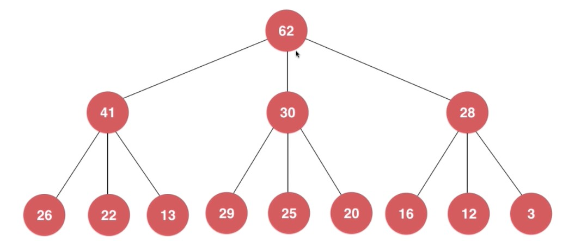
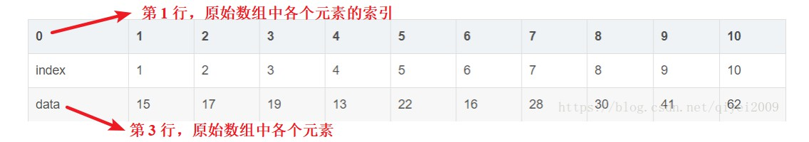
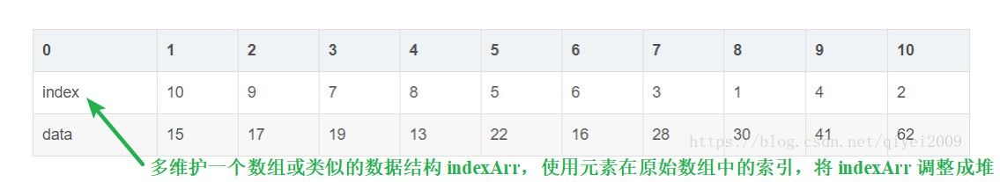
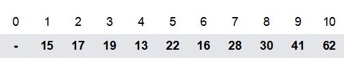
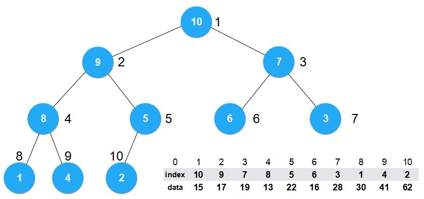
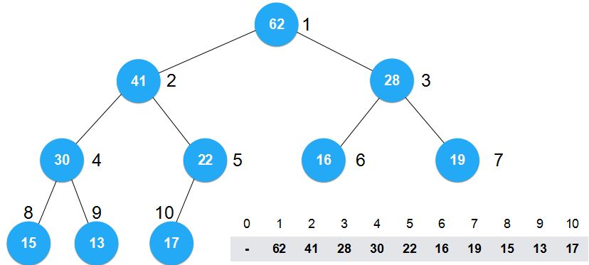

# 【堆】堆总结

 

## 1、时间复杂度

 

- 针对之前所编写的堆（[【数据结构—堆】最大堆](https://yyscyber.github.io/computer-basic/data-structures-and-algorithms/imooc/dsna-system-2021/2f90011b-41f5-446d-b163-cc33040689df)、[【数据结构—堆】最小堆](https://yyscyber.github.io/computer-basic/data-structures-and-algorithms/imooc/dsna-system-2021/6f795024-1f45-479c-8186-b7646113a943)、[【算法—排序】堆排序](https://yyscyber.github.io/computer-basic/data-structures-and-algorithms/imooc/dsna-system-2021/fa416879-471b-4e8d-be4e-29d2ae0b4496)）进行时间复杂度分析：

|                   操作                   |          时间复杂度          |                             说明                             |
| :--------------------------------------: | :--------------------------: | :----------------------------------------------------------: |
|                   add                    |     $O(h)$ 或 $O(logn)$      | 一次`shiftUp`或`shiftDown`操作，时间复杂度为 $O(h)$ 或 $O(logn)$  `add`中使用1次`shiftUp` |
|                  remove                  |     $O(h)$ 或 $O(logn)$      |                 `remove`中使用1次`shiftDown`                 |
|                max / min                 |            $O(1)$            |                                                              |
|                 replace                  |     $O(h)$ 或 $O(logn)$      |                  `replace`中使用`shiftDown`                  |
|       直观的 heapSort（异地排序）        |    $O(nh)$ 或 $O(nlogn)$     | 直观的堆排序（异地排序）  先将元素逐个放入堆中，$n$ 个元素，进行 $n$ 次`add`操作 ，此过程为 $O(nlogn)$  再将元素依次取出，$n$ 个元素，进行 $n$ 次`remove`操作，此过程为 $O(nlogn)$  整个过程 $O(2nlogn)$，忽略常数项，$O(nlogn)$ |
|                 heapify                  |            $O(n)$            |                       推导过程比较复杂                       |
| 使用 Heapify 优化的 heapSort（异地排序） | $O(n) + O(nlogn) = O(nlogn)$ | 使用 Heapify 优化的堆排序（异地排序） 先将数组使用 Heapify 调整为堆，$O(n)$  再将元素依次取出，$O(nlogn)$ |
|           就地排序的 heapSort            |              ？              |                              ？                              |

---

## 2、其他类型的堆

 

### 2.1、n 叉堆

- n 叉堆所基于的是完全 n 叉树。
- 如下图：一个三叉堆

---

### 2.2、索引堆

- 索引堆（Index Heap）
- 传统的使用数组存储的堆，其索引就代表着元素在堆中的位置，即意味着多数情况下，给定的原始数组中的元素需要调整位置才能形成堆。而索引堆，能够保留原始数组即数组中的元素的位置不用变化，但需要使用一个新的数组或其他数据结构来“建堆”。
- 如下图所示：上面的图为原始数组，下面的图为调整成堆

- 简单理解：建堆的时候，堆中保存的是“各个元素在原始数组中的位置索引”。下面的第1个图片为原始数组，第2个图片为使用“元素在原始数组中的位置索引”建堆（索引堆），第3个图片为直接使用“元素”建堆（传统的堆）。

- [https://blog.csdn.net/qiyei2009/article/details/80207342](https://blog.csdn.net/qiyei2009/article/details/80207342)
- [https://www.cnblogs.com/dudududu/p/8574740.html](https://www.cnblogs.com/dudududu/p/8574740.html)

---

### 2.3、二项堆

---

### 2.4、斐波那契堆