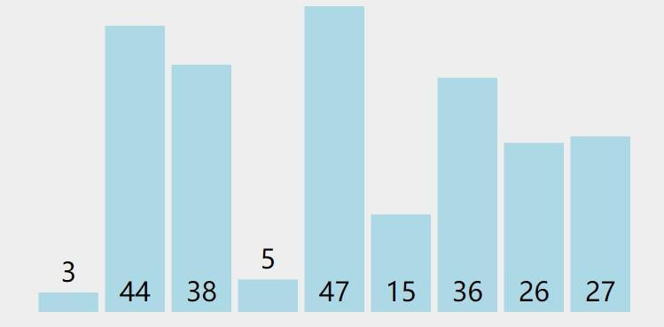
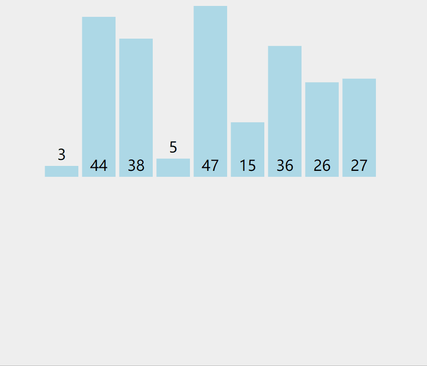
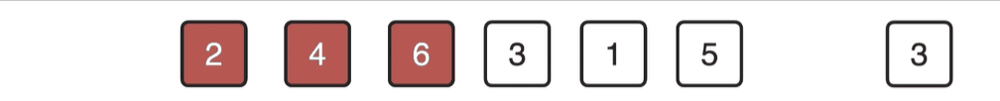

# 【排序】插入排序

<br/>

## 1、概述

<br/>

- 插入排序（Insertion Sort），是最基本的排序算法之一。

---

## 2、思想

<br/>

- 插入排序，这个算法的过程类似于在打扑克牌时，摸牌阶段将手牌进行整理的过程（每摸一张新牌，就会根据目前的手牌，将新牌插入到合适的位置）。
- 与选择排序一样，一般情况下所指的插入排序都是“就地（原地）”插入排序。

---

## 3、动画演示

<br/>

- 初始的未排序的一组整数，将进行升序排序





- 动画中，橙色表示“暂时位置”、红色表示“待插入的”、绿色表示“遍历”





---

## 4、Java 代码实现

<br/>

- 以实现一组整数升序排序为例，来先阐述一下插入排序的一个过程。

  - 首先，要将全部遍历一遍，遍历过的部分可以理解为“手牌”，未遍历的部分理解为“牌堆”；

  - 当遍历第1个的时候，“从牌堆中拿到了一张新牌，此时没有任何手牌，可以直接放到手里”，即第1个数的位置不用调整；

  - 当遍历第2个的时候，“从牌堆中拿到了一张新牌，此时手里有牌了，你就要考虑，新的这张牌要放在哪里合适，所以就和之前拿到的手牌比较，比较之后将新的手牌放入”，即第2个数的位置要与第1个数比较后才能确定；
  - 当遍历第3个的时候，“从牌堆中拿到了一张新牌，此时手里有牌了，你就要考虑，新的这张牌要放在哪里合适，所以就和之前拿到的手牌比较，比较之后将新的手牌放入”，即第3个数的位置要与第2个数、第1个数比较后才能确定；
  - 直到“牌堆中全部的牌摸完”，即全部遍历完。

- 对整数数组排序，就地排序


```java
public class InsertionSortInteger {

    private static final int DEFAULT_RANDOM_MIN = 0;

    private static final int DEFAULT_RANDOM_MAX = 100;

    private static final int DEFAULT_ARRAY_LENGTH = 10;

    /**
     * 随机生成一个数组
     *
     * @param length 数组长度
     * @param min 生成整数的最小值
     * @param max 生成整数的最大值
     * @return 数组
     */
    public static int[] generateIntegerArray(int length, int min, int max) {
        int tMin = (max <= min) ? DEFAULT_RANDOM_MIN : min;
        int tMax = (max <= min) ? DEFAULT_RANDOM_MAX : max;
        int tLength = (length > 0) ? length : DEFAULT_ARRAY_LENGTH;
        int[] arr = new int[tLength];
        for (int i = 0; i < tLength; i++) {
            arr[i] = getRandomInteger(tMin, tMax);
        }
        return arr;
    }

    /**
     * 打印数组
     *
     * 形式：[1, 2, 3, ...]
     *
     * @param arr 数组
     */
    public static void printArray(int[] arr) {
        StringBuilder sb = new StringBuilder("[");
        for (int i = 0; i < arr.length; i++) {
            sb.append(arr[i]);
            if (i != arr.length - 1) {
                sb.append(", ");
            }
        }
        sb.append("]");
        System.out.println(sb.toString());
    }

    /**
     * 生成指定范围的随机整数
     *
     * @param min 范围的最小值
     * @param max 范围的最大值
     * @return 随机数
     */
    private static int getRandomInteger(int min, int max) {
        return (int) (Math.random() * (max - min + 1) + min);
    }

    /**
     * 插入排序（就地）
     *
     * @param arr 数组
     * @param isAscending 是否升序
     */
    public static void insertionSort(int[] arr, boolean isAscending) {
        if (arr != null) {
            // 外层循环，遍历数组，相当于“从牌堆里摸一张牌”
            for (int i = 0; i < arr.length; i++) {
                // 内层循环，“将拿到的新牌与已有的牌 依次 比较”
                for (int j = i; j - 1 >= 0; j--) {
                    if (isAscending) {
                        if (arr[j] < arr[j - 1]) {
                            swap(arr, j, j - 1);
                        } else {
                            break;
                        }
                    } else {
                        if (arr[j] > arr[j - 1]) {
                            swap(arr, j, j - 1);
                        } else {
                            break;
                        }
                    }
                }
            }
        }
    }

    /**
     * 数组中两个索引位置的数据交换
     *
     * @param arr 数组
     * @param i 索引
     * @param j 索引
     */
    private static void swap(int[] arr, int i, int j) {
        if (arr != null && i >= 0 && i < arr.length && j >= 0 && j < arr.length) {
            int temp = arr[i];
            arr[i] = arr[j];
            arr[j] = temp;
        }
    }

}
```


```java
public class Main {

    public static void main(String[] args) {
        int[] arr = InsertionSortInteger.generateIntegerArray(10, 1, 50);
        InsertionSortInteger.printArray(arr);
        InsertionSortInteger.insertionSort(arr, true);
        InsertionSortInteger.printArray(arr);
    }

}

/*
    [37, 3, 50, 36, 2, 3, 9, 38, 21, 7]
    [2, 3, 3, 7, 9, 21, 36, 37, 38, 50]
*/
```


- 使用 Java 的泛型机制，对排序的数据种类进行拓展

```java
/**
 * 使用泛型方法
 */
public class InsertionSort {

    /**
     * 插入排序（就地）
     *
     * 必须具有可比性
     *
     * @param arr 数组
     * @param isAscending 是否升序
     */
    public static <E extends Comparable<E>> void insertionSort(E[] arr, boolean isAscending) {
        if (arr != null) {
            for (int i = 0; i < arr.length; i++) {
                for (int j = i; j - 1 >= 0; j--) {
                    if (isAscending) {
                        if (arr[j].compareTo(arr[j - 1]) < 0) {
                            swap(arr, j, j - 1);
                        } else {
                            break;
                        }
                    } else {
                        if (arr[j].compareTo(arr[j - 1]) > 0) {
                            swap(arr, j, j - 1);
                        } else {
                            break;
                        }
                    }
                }
            }
        }
    }

    /**
     * 打印数组
     *
     * @param arr 数组
     */
    public static <E> void printArray(E[] arr) {
        StringBuilder sb = new StringBuilder("[");
        for (int i = 0; i < arr.length; i++) {
            sb.append(arr[i]);
            if (i != arr.length - 1) {
                sb.append(",\n");
            }
        }
        sb.append("]\n");
        System.out.println(sb.toString());
    }

    /**
     * 数组中两个索引位置的数据交换
     *
     * @param arr 数组
     * @param i 索引
     * @param j 索引
     */
    private static <E> void swap(E[] arr, int i, int j) {
        if (arr != null && i >= 0 && i < arr.length && j >= 0 && j < arr.length) {
            E temp = arr[i];
            arr[i] = arr[j];
            arr[j] = temp;
        }
    }

}
```


```java
import java.util.Objects;

public class Student implements Comparable<Student> {

    private String id;
    private String name;

    public Student() {
    }

    public Student(String id, String name) {
        this.id = id;
        this.name = name;
    }

    public String getId() {
        return id;
    }

    public void setId(String id) {
        this.id = id;
    }

    @Override
    public boolean equals(Object o) {
        if (this == o) {
            return true;
        }
        if (o == null || this.getClass() != o.getClass()) {
            return false;
        }
        Student student = (Student) o;
        return Objects.equals(id, student.id);
    }

    @Override
    public int hashCode() {
        return Objects.hash(id);
    }

    @Override
    public int compareTo(Student o) {
        if (this.equals(o)) {
            return 0;
        }
        if (o != null) {
            return this.id.compareTo(o.getId());
        } else {
            throw new IllegalArgumentException("Argument Null");
        }
    }

    @Override
    public String toString() {
        return "Student{" +
                "id='" + id + '\'' +
                ", name='" + name + '\'' +
                '}';
    }

}
```


```java
public class Main {

    public static void main(String[] args) {
        Student[] arr = new Student[5];

        arr[0] = new Student("2001", "张三");
        arr[1] = new Student("3012", "张三");
        arr[2] = new Student("1052", "张三");
        arr[3] = new Student("8912", "张三");
        arr[4] = new Student("1233", "张三");

        InsertionSort.selectionSort(arr, false);
        InsertionSort.printArray(arr);
    }

}

/*
    [Student{id='8912', name='张三'},
    Student{id='3012', name='张三'},
    Student{id='2001', name='张三'},
    Student{id='1233', name='张三'},
    Student{id='1052', name='张三'}]
*/
```


- 另一个方案实现插入排序：在上面的插入排序实现过程中，是采取的“比较后逐一交换”的方案进行的，这里的新的方案是将要插入的元素暂存，比较后已有的元素直接通过赋值向后挪动。





```java
    public static <E extends Comparable<E>> void insertionSort(E[] arr, boolean isAscending) {
        if (arr != null) {
            for (int i = 0; i < arr.length; i++) {
                E temp = arr[i];
                int j;
                for (j = i - 1; j >= 0; j--) {
                    if (isAscending) {
                        if (temp.compareTo(arr[j]) < 0) {
                            arr[j + 1] = arr[j];
                        } else {
                            break;
                        }
                    } else {
                        if (temp.compareTo(arr[j]) > 0) {
                            arr[j + 1] = arr[j];
                        } else {
                            break;
                        }
                    }
                }
                arr[j + 1] = temp;
            }
        }
    }
```

---

## 5、时间复杂度分析

<br/>

- 插入排序的时间复杂度是$O(n^2)$
- 当插入排序面对是一组已经完成的排序的数据的时候，其时间复杂度是$O(n)$；对于选择排序而言，不论数据是否是有序，其时间复杂度一直是$O(n^2)$。所以，对于那些大体上已经有顺序的数据，如果要在插入排序与选择排序两者中做出选择的话，使用插入排序在时间性能上会更佳。

---

## 6、与选择排序的比较

<br/>

- 选择排序：能够将数据一次性地“安排”到它应该处在的位置，即一次移动后，其索引为最终的索引；

  插入排序：不能够将数据一次性地“安排”到它应该处在的位置，即一次移动后，其索引不是最终的索引。

- 选择排序：对于任何形式的一组数据，其时间复杂度为$O(n^2)$；

插入排序：对于无序的数据，其时间复杂度的级别是在$O(n^2)$，但是如果数据本身大致上是有序的，其时间复杂度能够近似为$O(n)$。

---

## 7、拓展

<br/>

- “摸牌的顺序由从上到下变为从下到上”，排序从后向前进行。

```java
    public static <E extends Comparable<E>> void insertionSort(E[] arr, boolean isAscending) {
        if (arr != null) {
            for (int i = arr.length - 1; i >= 0; i--) {
                for (int j = i; j + 1 <= arr.length - 1; j++) {
                    if (isAscending) {
                        if (arr[j].compareTo(arr[j + 1]) > 0) {
                            swap(arr, j, j + 1);
                        } else {
                            break;
                        }
                    } else {
                        if (arr[j].compareTo(arr[j + 1]) < 0) {
                            swap(arr, j, j + 1);
                        } else {
                            break;
                        }
                    }
                }
            }
        }
    }
```
