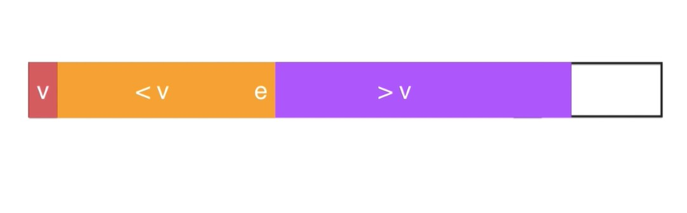

# 【排序】快速排序（1）

<br/>

## 1、概述

<br/>

- 快速排序（Quick Sort）是一种高级排序算法。
- 快速排序算法相对来说比较复杂，因为快速排序算法所延伸出来的问题是比较多的。

---

## 2、思想

- 快速排序算法的基本思想是，在数据中先确认一个“基准”（一般称 **pivot**，中文的含义是“枢纽”），然后比基准小的数据放在基准的一侧，而比基准大的数据放在另一侧。如下面所展示的：

$[<pivot]\,\,\,pivot\,\,\,[>pivot]$（升序）
$[>pivot]\,\,\,pivot\,\,\,[<pivot]$（降序）

上述这个过程，有的地方也称之为 **partition**，中文含义是“划分”。

经过一次 partition 后，然后再对左右两侧的数据（上面公式所示的$[\,]$中的部分）再进行 partition 操作。所以快速排序算法的实现也是**递归**。

每经过一次 partition 操作，最后 pivot 在**整个数据中的位置就是确定的**了。

- 快速排序算法的核心，就是如何实现 partition 这个过程。快速排序性能的优劣，很大程度上取决于 partition。像如何选择 pivot，当数据与 pivot 相等的时候如何处理等等，都是 partition 这个过程需要考虑的。不同的 partition 的实现带来不同版本的快速排序。
- 常见的快速排序有：基本快速排序、双路快速排序、三路快速排序等。

---

## 3、动画等演示

<br/>

- 下面的演示是快速排序最基础的版本，每次的 pivot 都是当前区间的首个元素。


partition 的具体图解：


> 规定：pivot 为当前区间的第一个元素，比 pivot 小的元素**最终**将被放置在 pivot 的左侧，比 pivot 大的元素**最终**将被放置在 pivot 的右侧。最终实现**升序**排序。
>
> 需要注意的是，partition 的操作是“就地（原地）”操作，“异地”操作 partition 是十分容易的，比如创建两个辅助空间`left`和`right`，遍历某一区间，比 pivot 小的依次放入`left`，比 pivot 大的依次放入`right`，最后`left`、pivot、`right`合并即可。但是为了提高效率**没有必要**这么做。
>
> 既然 partition 是“就地”操作，那么就使用需要一些索引变量。


> 2、图中 v 即 pivot，橙色部分为小于 pivot 的元素，紫色部分为大于 pivot 的元素，e 为当前遍历到的元素。
> 注意：pivot 的位置调整（到两部分中间）需要等全部遍历完毕后。图示的状态为**没有全部遍历完的状态**。
>
> 


> 3、当 e 大于 pivot 的时候，e 直接“并入”紫色部分，“并入”的实现将依靠的是索引变量的变化，然后继续遍历。
>
> 


> 4、当 e 小于 pivot 的时候，e 需要“并入”橙色部分，通过“交换”操作（和紫色部分的第一个元素交换，相应的索引变量发生变化），然后继续遍历。
>
> 


> 5、当前区间全部遍历完成的样子。
>
> 


> 6、调整 pivot 的位置。
>
> 


---

## 4、Java 代码实现

<br/>

### 4.1、partition 实现 —— 最基础的实现

- pivot 始终为每次进行 partition 操作的区间的首个元素。
- partition 的方法签名是：`int partition(E[] arr, int l, int r)`
  对数组`arr`的$[l,r]$区间进行 partition 操作，因为是“最基础的实现”，所以 pivot 是`arr[l]`。返回值是 pivot 最新的索引（此时 pivot 已经处在大于 pivot 部分和 小于 pivot 部分之间）。
  与归并排序思想一样，使用这样的方法签名有利于实现递归。调用`partition`方法后得到一个返回值，假设命名为`pivot`，而此时数据 pivot 在$[l,r]$区间中的**最终位置**就**已经确定**了。再对$[l,pivot-1]$和$[pivot+1,r]$这两个区间调用`partition`方法（形成递归），逐步地确定所有元素的位置，完成排序。
- “就地”操作，所以需要一些变量来记录一些具有意义的索引。


> $l$：区间的左边界索引，`arr[l]`为 pivot
>
> $r$：区间的右边界索引
>
> $cur$：当前遍历到的元素的索引，初始值为 $l+1$ 即 pivot 的下一个元素
>
> $bound$：小于 pivot 部分的**最后一个元素**的索引（升序情况；降序为大于 pivot 部分的最后一个元素的索引），初始值为 $l$
>
> 最终形成的局面：$[l+1,bound]$ 为左侧区间，$[bound+1,cur-1]$ 为右侧区间
>
> 如下图所示：
>
> 
>
> 
>
> 
>
> 
>
> 
>
> 通过上图，得到一些 partition 方法中的基本逻辑：
>
> - 升序，如果`arr[cur] < pivot`，需并入黄色部分，先`bound+1`，然后将`arr[bound]`与`arr[cur]`交换即可，最后`cur+1`。
> - 升序，如果`arr[cur] > pivot`，需并入紫色部分，只需`cur+1`即可。
> - 降序，如果`arr[cur] > pivot`，需并入黄色部分，先`bound+1`，然后将`arr[bound]`与`arr[cur]`交换即可，最后`cur+1`。
> - 降序，如果`arr[cur] < pivot`，需并入紫色部分，只需`cur+1`即可。


- 出现与 pivot **相等**的数据的时候，这一版本中，将其划归到左侧或右侧均可，下面的代码中，为了减少元素之间交换位置的次数，都划归到右侧。
- 编写 partition 方法并验证：


```java
public class Main {

    public static void main(String[] args) {
        // 随机生成一个长度为 10，范围是 [0,99] 的数组
        int[] arr = RandomArray.generateIntegerArray(10, 0, 99);
        System.out.println(arrayToString(arr));

        int pivotIndex = partition(arr, 0, arr.length - 1, true);

        System.out.println(pivotIndex);
        System.out.println(arrayToString(arr));
    }

    private static int partition(int[] arr, int l, int r, boolean isAscending) {
        // 忽略一些校验

        int bound = l;
        int pivot = arr[l];

        // partition
        for (int cur = l + 1; cur <= r; cur++) {
            if (isAscending) {
                // 升序，小于 pivot 交换；大于或等于 pivot 直接 cur++ 即可
                if (arr[cur] < pivot) {
                    bound++;
                    swap(arr, bound, cur);
                }
            } else {
                // 降序，大于 pivot 交换；小于或等于 pivot 直接 cur++ 即可
                if (arr[cur] > pivot) {
                    bound++;
                    swap(arr, bound, cur);
                }
            }
        }

        // 将 pivot (arr[l]) 调整到左右两侧区间的中间
        swap(arr, l, bound);

        // 返回 pivot 最新的索引
        return bound;
    }

    private static void swap(int[] arr, int i, int j) {
        int temp = arr[i];
        arr[i] = arr[j];
        arr[j] = temp;
    }

    private static String arrayToString(int[] arr) {
        StringBuilder sb = new StringBuilder("[");
        for (int i = 0; i < arr.length; i++) {
            sb.append(arr[i]);
            if (i != arr.length - 1) {
                sb.append(", ");
            }
        }
        sb.append("]");
        return sb.toString();
    }

}
```


---

### 4.2、快速排序实现 —— 最基础的实现

- 基于***4.1中实现的 `partition`方法***编写快速排序算法：


```java
/**
 * 快速排序
 *
 * 忽略一些校验
 */
public class QuickSort {

    /**
     * 该方法对外
     */
    public static void quickSort(int[] arr, boolean isAscending) {
        quickSort(arr, 0, arr.length - 1, isAscending);
    }

    /**
     * 递归
     */
    private static void quickSort(int[] arr, int l, int r, boolean isAscending) {
        if (l >= r) {
            return;
        }

        // 经过一次 partition 数组形态：[l,pivotIndex-1] pivotIndex [pivotIndex + 1,r]
        int pivotIndex = partition(arr, l, r, isAscending);

        quickSort(arr, l, pivotIndex - 1, isAscending);

        quickSort(arr, pivotIndex + 1, r, isAscending);
    }

    private static int partition(int[] arr, int l, int r, boolean isAscending) {
        int pivot = arr[l];
        int bound = l;

        for (int cur = l + 1; cur <= r; cur++) {
            if (isAscending) {
                if (arr[cur] < pivot) {
                    bound++;
                    swap(arr, cur, bound);
                }
            } else {
                if (arr[cur] > pivot) {
                    bound++;
                    swap(arr, cur, bound);
                }
            }
        }

        swap(arr, l, bound);

        return bound;
    }

    private static void swap(int[] arr, int i, int j) {
        int temp = arr[i];
        arr[i] = arr[j];
        arr[j] = temp;
    }

}
```


```java
public class Main {

    public static void main(String[] args) {
        int[] arr = RandomArray.generateIntegerArray(8, 1, 50);
        RandomArray.printArray(arr);

        QuickSort.quickSort(arr, true);
        RandomArray.printArray(arr);
    }

}
```


- 使用泛型的快速排序：


```java
public class QuickSort {

    public static <E extends Comparable<E>> void quickSort(E[] arr, boolean isAscending) {
        quickSort(arr, 0, arr.length - 1, isAscending);
    }

    private static <E extends Comparable<E>> void quickSort(E[] arr, int l, int r, boolean isAscending) {
        if (l >= r) {
            return;
        }
        int pivotIndex = partition(arr, l, r, isAscending);
        quickSort(arr, l, pivotIndex - 1, isAscending);
        quickSort(arr, pivotIndex + 1, r, isAscending);
    }

    private static <E extends Comparable<E>> int partition(E[] arr, int l, int r, boolean isAscending) {
        E pivot = arr[l];
        int bound = l;

        for (int cur = l + 1; cur <= r; cur++) {
            if (isAscending) {
                if (arr[cur].compareTo(pivot) < 0) {
                    bound++;
                    swap(arr, cur, bound);
                }
            } else {
                if (arr[cur].compareTo(pivot) > 0) {
                    bound++;
                    swap(arr, cur, bound);
                }
            }
        }

        swap(arr, l, bound);

        return bound;
    }

    private static <E> void swap(E[] arr, int i, int j) {
        E temp = arr[i];
        arr[i] = arr[j];
        arr[j] = temp;
    }

}
```


---

## 5、优化

<br/>

### 5.1、快速排序基础版面对已经有序的数据

- 基础版本的`partition`方法中，每一次的 pivot 都是选择当前区间的首个元素，对于无序情况下的数据，这个 pivot 的选择策略是可行的，但是一旦数据已经是有序的情况下，这样的选择策略会使快速排序不再“快速”。如下图所示：


一旦数据有序，每一次`partition`方法就会变成**纯遍历**操作，此时的时间复杂度已经是 $O(n^2)$ 级别的了；另外这种情况会导致递归次数（递归深度）的增加，面对数据量大的情况，容易出现“栈溢出”。

- 这一问题的症结是 pivot 的选择策略上，每一次都是首个元素，导致快速排序过程中出现上图的现象概率增加。优化方案就是 pivot 的选择变为随机选择。在**当前** $[l,r]$ 区间范围内**随机选择**。


```java
import java.util.Random;

public class QuickSort {

    private static Random random = new Random();

    public static <E extends Comparable<E>> void quickSort(E[] arr, boolean isAscending) {
        quickSort(arr, 0, arr.length - 1, isAscending);
    }

    private static <E extends Comparable<E>> void quickSort(E[] arr, int l, int r, boolean isAscending) {
        if (l >= r) {
            return;
        }
        int pivotIndex = partition(arr, l, r, isAscending);
        quickSort(arr, l, pivotIndex - 1, isAscending);
        quickSort(arr, pivotIndex + 1, r, isAscending);
    }

    private static <E extends Comparable<E>> int partition(E[] arr, int l, int r, boolean isAscending) {
        // 随机选择一个 pivot
        int pivotInitIndex = getRandomInteger(l, r);
        E pivot = arr[pivotInitIndex];

        int bound = l;

        // 将选定的 pivot 调整至当前区间的首位，保证后续的代码逻辑与之前编写的 partition 是一致的！
        swap(arr, l, pivotInitIndex);

        for (int cur = l + 1; cur <= r; cur++) {
            if (isAscending) {
                if (arr[cur].compareTo(pivot) < 0) {
                    bound++;
                    swap(arr, cur, bound);
                }
            } else {
                if (arr[cur].compareTo(pivot) > 0) {
                    bound++;
                    swap(arr, cur, bound);
                }
            }
        }

        swap(arr, l, bound);

        return bound;
    }

    private static <E> void swap(E[] arr, int i, int j) {
        E temp = arr[i];
        arr[i] = arr[j];
        arr[j] = temp;
    }

    private static int getRandomInteger(int min, int max) {
        // random.nextInt(max - min + 1) -> [0,max-min+1) -> [0,max-min]
        // min + random.nextInt(max - min + 1) -> [min,max+1) -> [min,max]
        return min + random.nextInt(max - min + 1);
    }

}
```


- 每一次 pivot 选择区间**中间**的元素，这种策略是否可行？


> 较一直选择首个元素的策略，这个策略是较好的。但是，这个策略较容易被“击破”，因为可以根据这个策略编写出“数据生成器”，这个“生成器”是能够生成使快速排序“退化”的一组数据。
如果是随机选择 pivot，是很难被“破解”的。
