# 【树】二分搜索树（2）

<br/>

## 2、Java 代码实现

<br/>

### 2.5、获取最小值

- 二分搜索树中的最小值，位于整棵树的**最左下侧**。
- 注意：最左下侧的节点不一定是叶子节点，也可能是一个只有右子树的节点。


#### 2.5.1、非递归实现


```java
import java.util.*;

/* 忽略一些方法 */
public class BinarySearchTree<E extends Comparable<E>> {

    /**
     * 节点
     */
    private class Node<E> {
        public E e;
        public Node<E> leftChild;
        public Node<E> rightChild;

        public Node() {
            this(null, null, null);
        }

        public Node(E e) {
            this(e, null, null);
        }

        public Node(E e, Node<E> leftChild, Node<E> rightChild) {
            this.e = e;
            this.leftChild = leftChild;
            this.rightChild = rightChild;
        }
    }

    /**
     * 根节点
     */
    private Node<E> root;

    /**
     * 节点数
     */
    private int size;

    public BinarySearchTree() {
        this.root = null;
        this.size = 0;
    }
    
    public E getMin() {
        if (root == null) {
            return null;
        }

        Node<E> cur = root;
        while (cur.leftChild != null) {
            cur = cur.leftChild;
        }
        return cur.e;
    }
    
}
```


---

#### 2.5.2、递归实现


```java
import java.util.ArrayList;
import java.util.List;

public class BinarySearchTree<E extends Comparable<E>> {

    /**
     * 节点
     */
    private class Node<E> {
        public E e;
        public Node<E> leftChild;
        public Node<E> rightChild;

        public Node() {
            this(null, null, null);
        }

        public Node(E e) {
            this(e, null, null);
        }

        public Node(E e, Node<E> leftChild, Node<E> rightChild) {
            this.e = e;
            this.leftChild = leftChild;
            this.rightChild = rightChild;
        }
    }

    /**
     * 根节点
     */
    private Node<E> root;

    /**
     * 节点数
     */
    private int size;

    public BinarySearchTree() {
        this.root = null;
        this.size = 0;
    }
    
    public E getMin() {
        if (root == null) {
            return null;
        }
        return getMinNode(root).e;
    }

    /**
     * 获取以 node 为根的二分搜索树中的最小值所在节点
     */
    private Node<E> getMinNode(Node<E> node) {
        if (node.leftChild == null) {
            return node;
        }
        return getMinNode(node.leftChild);
    }
    
}
```


---

### 2.6、获取最大值

- 二分搜索树中的最大值，位于整棵树的**最右下侧**。
- 注意：最右下侧的节点不一定是叶子节点，也可能是一个只有左子树的节点。


#### 2.6.1、非递归实现


```java
import java.util.*;

public class BinarySearchTree<E extends Comparable<E>> {

    /**
     * 节点
     */
    private class Node<E> {
        public E e;
        public Node<E> leftChild;
        public Node<E> rightChild;

        public Node() {
            this(null, null, null);
        }

        public Node(E e) {
            this(e, null, null);
        }

        public Node(E e, Node<E> leftChild, Node<E> rightChild) {
            this.e = e;
            this.leftChild = leftChild;
            this.rightChild = rightChild;
        }
    }

    /**
     * 根节点
     */
    private Node<E> root;

    /**
     * 节点数
     */
    private int size;

    public BinarySearchTree() {
        this.root = null;
        this.size = 0;
    }
    
    public E getMax() {
        if (root == null) {
            return null;
        }

        Node<E> cur = root;
        while (cur.rightChild != null) {
            cur = cur.rightChild;
        }
        return cur.e;
    }
    
}
```


---

#### 2.6.2、递归实现


```java
import java.util.ArrayList;
import java.util.List;

public class BinarySearchTree<E extends Comparable<E>> {

    /**
     * 节点
     */
    private class Node<E> {
        public E e;
        public Node<E> leftChild;
        public Node<E> rightChild;

        public Node() {
            this(null, null, null);
        }

        public Node(E e) {
            this(e, null, null);
        }

        public Node(E e, Node<E> leftChild, Node<E> rightChild) {
            this.e = e;
            this.leftChild = leftChild;
            this.rightChild = rightChild;
        }
    }

    /**
     * 根节点
     */
    private Node<E> root;

    /**
     * 节点数
     */
    private int size;

    public BinarySearchTree() {
        this.root = null;
        this.size = 0;
    }
    
    public E getMax() {
        if (root == null) {
            return null;
        }
        return getMaxNode(root).e;
    }

    /**
     * 获取以 node 为根的二分搜索树中的最大值所在节点
     */
    private Node<E> getMaxNode(Node<E> node) {
        if (node.rightChild == null) {
            return node;
        }
        return getMaxNode(node.rightChild);
    }
    
}
```


---

### 2.7、删除最小值

- 最小值，位于树的最左下侧。
- 如果最小值所在的节点是叶子节点。删除时，那么直接将其父节点的左指针置`null`即可；


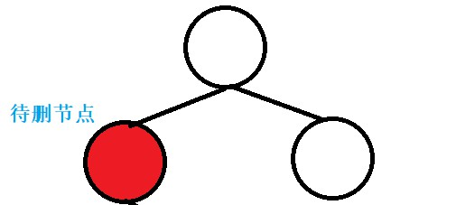


- 如果最小值所在的节点是非叶子结点，该节点一定是只有右子树的。删除时，其**父节点的左指针**应该指向其**右子树**。


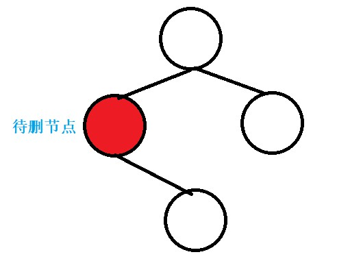


#### 2.7.1、非递归实现

- 非递归实现时需要特殊考虑的情况：空树、只有一个节点的树（只有根节点）、根节点只有右子树没有左子树。


```java
import java.util.*;

public class BinarySearchTree<E extends Comparable<E>> {

    /**
     * 节点
     */
    private class Node<E> {
        public E e;
        public Node<E> leftChild;
        public Node<E> rightChild;

        public Node() {
            this(null, null, null);
        }

        public Node(E e) {
            this(e, null, null);
        }

        public Node(E e, Node<E> leftChild, Node<E> rightChild) {
            this.e = e;
            this.leftChild = leftChild;
            this.rightChild = rightChild;
        }
    }

    /**
     * 根节点
     */
    private Node<E> root;

    /**
     * 节点数
     */
    private int size;

    public BinarySearchTree() {
        this.root = null;
        this.size = 0;
    }

    public E removeMin() {
        if (root == null) {
            return null;
        }

        E min = null;

        if (root.leftChild == null && root.rightChild == null) {
            min = root.e;
            root = null;
        } else {
            if (root.leftChild == null) {
                min = root.e;
                root = root.rightChild;
            } else {
                Node<E> cur = root;
                Node<E> pre = null;

                while (cur.leftChild != null) {
                    pre = cur;
                    cur = cur.leftChild;
                }

                min = cur.e;
                pre.leftChild = cur.rightChild;
            }
        }

        size--;

        return min;
    }
    
}
```


---

#### 2.7.2、递归实现


```java
import java.util.ArrayList;
import java.util.List;

public class BinarySearchTree<E extends Comparable<E>> {

    /**
     * 节点
     */
    private class Node<E> {
        public E e;
        public Node<E> leftChild;
        public Node<E> rightChild;

        public Node() {
            this(null, null, null);
        }

        public Node(E e) {
            this(e, null, null);
        }

        public Node(E e, Node<E> leftChild, Node<E> rightChild) {
            this.e = e;
            this.leftChild = leftChild;
            this.rightChild = rightChild;
        }
    }

    /**
     * 根节点
     */
    private Node<E> root;

    /**
     * 节点数
     */
    private int size;

    public BinarySearchTree() {
        this.root = null;
        this.size = 0;
    }
    
    public E getMin() {
        if (root == null) {
            return null;
        }
        return getMinNode(root).e;
    }

    /**
     * 获取以 node 为根的二分搜索树中的最小值所在节点
     */
    private Node<E> getMinNode(Node<E> node) {
        if (node.leftChild == null) {
            return node;
        }
        return getMinNode(node.leftChild);
    }
    
    public E removeMin() {
        if (root == null) {
            return null;
        }
        E min = getMin();
        root = removeMinNode(root);
        return min;
    }

    /**
     * 删除以 node 为根的二分搜索树中的最小节点
     * 返回删除后的二分搜索树的根节点
     * node 一定非空
     */
    private Node<E> removeMinNode(Node<E> node) {
        if (node.leftChild == null) {
            Node<E> currentRoot = node.rightChild;
            node.rightChild = null;
            size--;
            return currentRoot;
        }
        node.leftChild = removeMinNode(node.leftChild);
        return node;
    }
    
}
```


---

### 2.8、删除最大值

- 最大值，位于树的最右下侧。
- 如果最大值所在的节点是叶子节点。删除时，那么直接将其父节点的右指针置`null`即可；


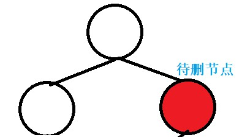


- 如果最大值所在的节点是非叶子结点，该节点一定是只有左子树的。删除时，其**父节点的右指针**应该指向其**左子树**。


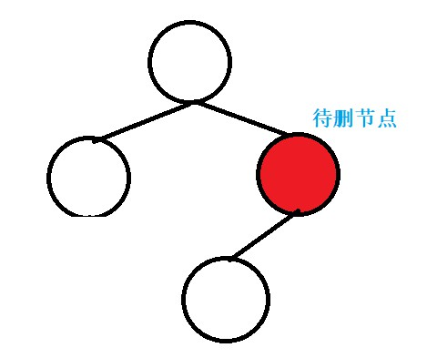


#### 2.8.1、非递归实现

- 非递归实现时需要特殊考虑的情况：空树、只有一个节点的树（只有根节点）、根节点只有左子树没有右子树。


```java
import java.util.*;

public class BinarySearchTree<E extends Comparable<E>> {

    /**
     * 节点
     */
    private class Node<E> {
        public E e;
        public Node<E> leftChild;
        public Node<E> rightChild;

        public Node() {
            this(null, null, null);
        }

        public Node(E e) {
            this(e, null, null);
        }

        public Node(E e, Node<E> leftChild, Node<E> rightChild) {
            this.e = e;
            this.leftChild = leftChild;
            this.rightChild = rightChild;
        }
    }

    /**
     * 根节点
     */
    private Node<E> root;

    /**
     * 节点数
     */
    private int size;

    public BinarySearchTree() {
        this.root = null;
        this.size = 0;
    }
    
    public E removeMax() {
        if (root == null) {
            return null;
        }

        E max = null;

        if (root.leftChild == null && root.rightChild == null) {
            max = root.e;
            root = null;
        } else {
            if (root.rightChild == null) {
                max = root.e;
                root = root.leftChild;
            } else {
                Node<E> cur = root;
                Node<E> pre = null;

                while (cur.rightChild != null) {
                    pre = cur;
                    cur = cur.rightChild;
                }

                max = cur.e;
                pre.rightChild = cur.leftChild;
            }
        }

        size--;

        return max;
    }
    
}
```


---

#### 2.8.2、递归实现


```java
import java.util.ArrayList;
import java.util.List;

public class BinarySearchTree<E extends Comparable<E>> {

    /**
     * 节点
     */
    private class Node<E> {
        public E e;
        public Node<E> leftChild;
        public Node<E> rightChild;

        public Node() {
            this(null, null, null);
        }

        public Node(E e) {
            this(e, null, null);
        }

        public Node(E e, Node<E> leftChild, Node<E> rightChild) {
            this.e = e;
            this.leftChild = leftChild;
            this.rightChild = rightChild;
        }
    }

    /**
     * 根节点
     */
    private Node<E> root;

    /**
     * 节点数
     */
    private int size;

    public BinarySearchTree() {
        this.root = null;
        this.size = 0;
    }
    
    public E getMax() {
        if (root == null) {
            return null;
        }
        return getMaxNode(root).e;
    }

    /**
     * 获取以 node 为根的二分搜索树中的最大值所在节点
     */
    private Node<E> getMaxNode(Node<E> node) {
        if (node.rightChild == null) {
            return node;
        }
        return getMaxNode(node.rightChild);
    }
    
    public E removeMax() {
        if (root == null) {
            return null;
        }
        E max = getMax();
        root = removeMaxNode(root);
        return max;
    }

    /**
     * 删除以 node 为根的二分搜索树中的最大节点
     * 返回删除后的二分搜索树的根节点
     * node 一定非空
     */
    private Node<E> removeMaxNode(Node<E> node) {
        if (node.rightChild == null) {
            Node<E> currentRoot = node.leftChild;
            node.leftChild = null;
            size--;
            return currentRoot;
        }
        node.rightChild = removeMaxNode(node.rightChild);
        return node;
    }
    
}
```


---

### 2.9、删除指定值

- 从二分搜索树中删除特定的值（节点），需要考虑不同的情况：
  - 1、删除的节点为叶子节点，即没有子节点。可以直接删除，方法是，其父节点的左指针或右指针置`null`即可。
  - 2、删除的节点只有左子树或只有右子树，即只有一个子节点。方法是，直接用其子节点作为替换。
  - 3、删除的节点既有左子树又有右子树。方法是，中序后继节点（待删除节点的右子树中的最小值的节点）或者前驱节点（待删除节点的左子树中的最大值的节点）来替换，再删除该目标节点。


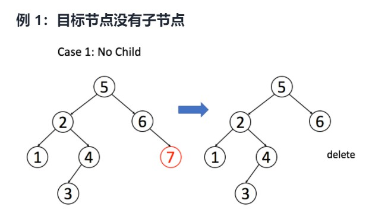


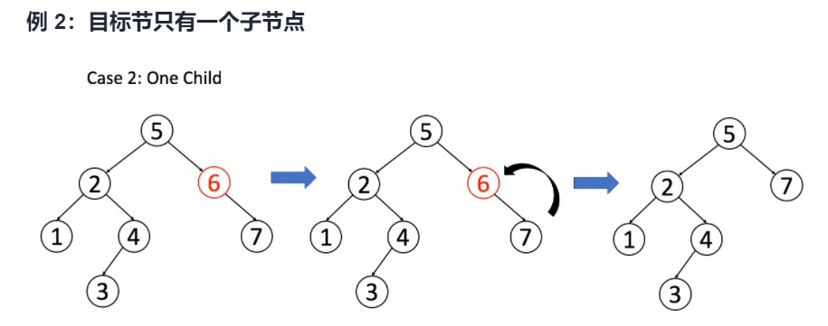


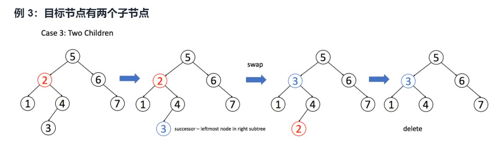


- 当待删除的节点只有左子树或只有右子树时，除了上面所说的，直接用其子节点替换。还有一种思路是，就是使用“待删除节点既有左子树又有右子树”的思路。当待删除节点只有左子树时，使用其左子树中的最大值替换；当待删除节点只有右子树时，使用其右子树中的最小值替换。


#### 2.9.1、非递归实现


- 分类讨论；当删除的节点既有左子树又有右子树时，选择使用“中序后继”替换待删除节点。


```java
import java.util.*;

public class BinarySearchTree<E extends Comparable<E>> {

    /**
     * 节点
     */
    private class Node<E> {
        public E e;
        public Node<E> leftChild;
        public Node<E> rightChild;

        public Node() {
            this(null, null, null);
        }

        public Node(E e) {
            this(e, null, null);
        }

        public Node(E e, Node<E> leftChild, Node<E> rightChild) {
            this.e = e;
            this.leftChild = leftChild;
            this.rightChild = rightChild;
        }
    }

    /**
     * 根节点
     */
    private Node<E> root;

    /**
     * 节点数
     */
    private int size;

    public BinarySearchTree() {
        this.root = null;
        this.size = 0;
    }
    
    public void remove(E e) {
        if (root == null) {
            return;
        }

        Node<E> cur = root;
        Node<E> pre = null;

        while (cur != null) {
            if (e.compareTo(cur.e) > 0) {
                pre = cur;
                cur = cur.rightChild;
            } else if (e.compareTo(cur.e) < 0) {
                pre = cur;
                cur = cur.leftChild;
            } else {
                break;
            }
        }

        // 节点不存在
        if (cur == null) {
            return;
        }

        if (pre == null) {
            // pre == null：说明要删除的节点为“根节点”
            if (root.leftChild == null && root.rightChild == null) {
                root = null;
                size--;
            } else {
                // root.leftChild != null || root.rightChild != null
                if (root.leftChild == null) {
                    // root.leftChild == null && root.rightChild != null
                    root = root.rightChild;
                    size--;
                    return;
                }

                if (root.rightChild == null) {
                    // root.leftChild != null && root.rightChild == null
                    root = root.leftChild;
                    size--;
                    return;
                }

                // root.leftChild != null && root.rightChild != null
                Node<E> cur2 = root.rightChild;
                Node<E> pre2 = root;
                while (cur2.leftChild != null) {
                    pre2 = cur2;
                    cur2 = cur2.leftChild;
                }
                root.e = cur2.e;
                if (pre2 == root) {
                    root.rightChild = cur2.rightChild;
                } else {
                    pre2.leftChild = cur2.rightChild;
                }
                size--;
            }
        } else {
            // pre != null：说明要删除的节点为“非根节点”
            if (cur.leftChild == null && cur.rightChild == null) {
                if (pre.e.compareTo(cur.e) > 0) {
                    pre.leftChild = null;
                } else {
                    pre.rightChild = null;
                }
                size--;
            } else {
                // cur.leftChild != null || cur.rightChild != null
                if (cur.leftChild == null) {
                    // cur.leftChild == null && cur.rightChild != null
                    if (pre.e.compareTo(cur.e) > 0) {
                        pre.leftChild = cur.rightChild;
                    } else {
                        pre.rightChild = cur.rightChild;
                    }
                    size--;
                    return;
                }

                if (cur.rightChild == null) {
                    // cur.leftChild != null && cur.rightChild == null
                    if (pre.e.compareTo(cur.e) > 0) {
                        pre.leftChild = cur.leftChild;
                    } else {
                        pre.rightChild = cur.leftChild;
                    }
                    size--;
                    return;
                }

                // cur.leftChild != null && cur.rightChild != null
                Node<E> cur2 = cur.rightChild;
                Node<E> pre2 = cur;
                while (cur2.leftChild != null) {
                    pre2 = cur2;
                    cur2 = cur2.leftChild;
                }
                cur.e = cur2.e;
                if (pre2 == cur) {
                    pre2.rightChild = cur2.rightChild;
                } else {
                    pre2.leftChild = cur2.rightChild;
                }
                size--;
            }
        }
    }
}
```


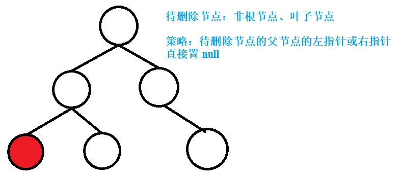


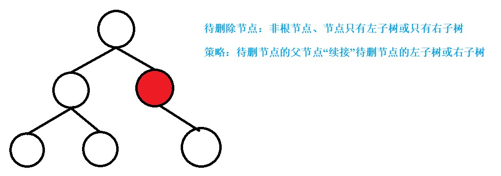


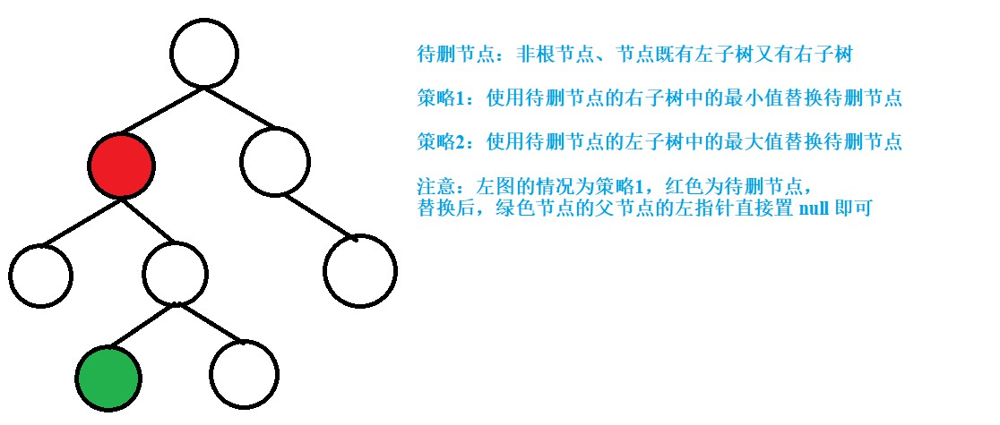


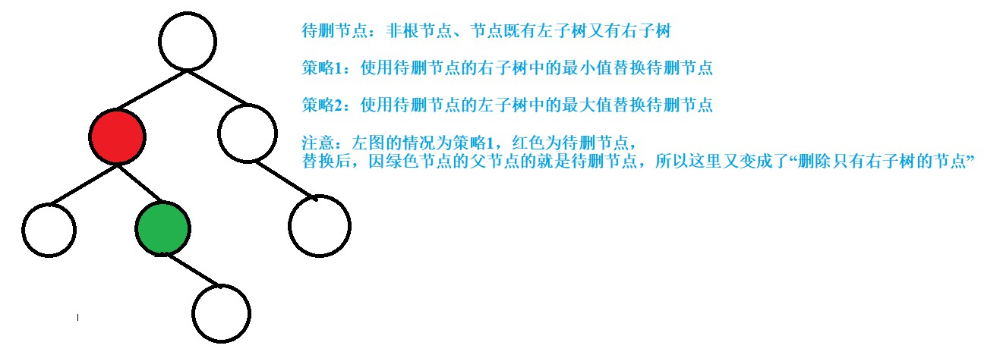


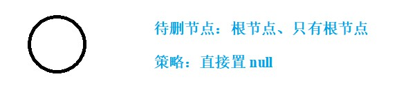


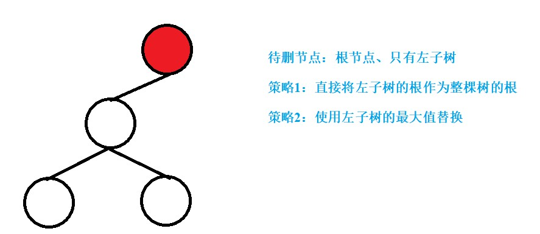


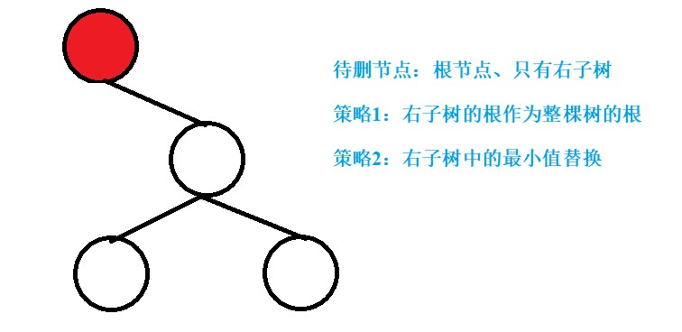


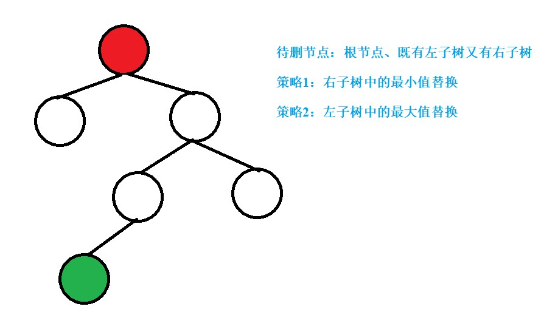


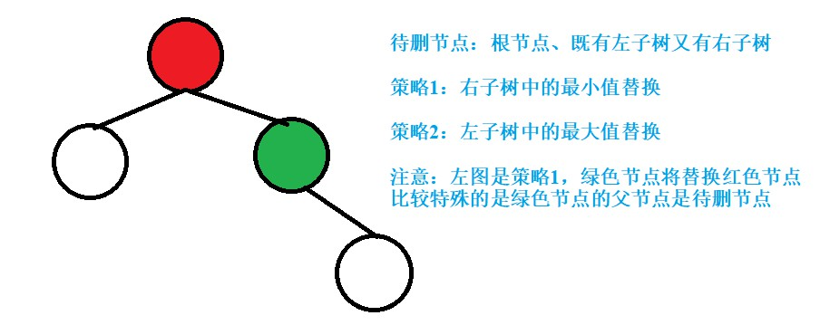


- 分类讨论；当删除的节点既有左子树又有右子树时，选择使用“中序前驱”替换待删除节点。


```java
import java.util.*;

public class BinarySearchTree<E extends Comparable<E>> {

    /**
     * 节点
     */
    private class Node<E> {
        public E e;
        public Node<E> leftChild;
        public Node<E> rightChild;

        public Node() {
            this(null, null, null);
        }

        public Node(E e) {
            this(e, null, null);
        }

        public Node(E e, Node<E> leftChild, Node<E> rightChild) {
            this.e = e;
            this.leftChild = leftChild;
            this.rightChild = rightChild;
        }
    }

    /**
     * 根节点
     */
    private Node<E> root;

    /**
     * 节点数
     */
    private int size;

    public BinarySearchTree() {
        this.root = null;
        this.size = 0;
    }
    
    public void remove(E e) {
        if (root == null) {
            return;
        }

        Node<E> cur = root;
        Node<E> pre = null;

        while (cur != null) {
            if (e.compareTo(cur.e) > 0) {
                pre = cur;
                cur = cur.rightChild;
            } else if (e.compareTo(cur.e) < 0) {
                pre = cur;
                cur = cur.leftChild;
            } else {
                break;
            }
        }

        if (cur == null) {
            return;
        }

        if (pre == null) {
            if (root.leftChild == null && root.rightChild == null) {
                root = null;
                size--;
            } else {
                if (root.leftChild == null) {
                    root = root.rightChild;
                    size--;
                    return;
                }
                if (root.rightChild == null) {
                    root = root.leftChild;
                    size--;
                    return;
                }

                Node<E> cur2 = root.leftChild;
                Node<E> pre2 = root;
                while (cur2.rightChild != null) {
                    pre2 = cur2;
                    cur2 = cur2.rightChild;
                }
                root.e = cur2.e;
                if (pre2 == root) {
                    root.leftChild = cur2.leftChild;
                } else {
                    pre2.rightChild = cur2.leftChild;
                }
                size--;
            }
        } else {
            if (cur.leftChild == null && cur.rightChild == null) {
                if (pre.e.compareTo(cur.e) > 0) {
                    pre.leftChild = null;
                } else {
                    pre.rightChild = null;
                }
                size--;
            } else {
                if (cur.leftChild == null) {
                    if (pre.e.compareTo(cur.e) > 0) {
                        pre.leftChild = cur.rightChild;
                    } else {
                        pre.rightChild = cur.rightChild;
                    }
                    size--;
                    return;
                }
                if (cur.rightChild == null) {
                    if (pre.e.compareTo(cur.e) > 0) {
                        pre.leftChild = cur.leftChild;
                    } else {
                        pre.rightChild = cur.leftChild;
                    }
                    size--;
                    return;
                }

                Node<E> cur2 = cur.leftChild;
                Node<E> pre2 = cur;
                while (cur2.rightChild != null) {
                    pre2 = cur2;
                    cur2 = cur2.rightChild;
                }
                cur.e = cur2.e;
                if (pre2 == cur) {
                    pre2.leftChild = cur2.leftChild;
                } else {
                    pre2.rightChild = cur2.leftChild;
                }
                size--;
            }
        }

    }
    
}
```


#### 2.9.2、递归实现

- 当删除的节点既有左子树又有右子树时，选择使用“中序后继”替换待删除节点。


```java
import java.util.ArrayList;
import java.util.List;

public class BinarySearchTree<E extends Comparable<E>> {

    /**
     * 节点
     */
    private class Node<E> {
        public E e;
        public Node<E> leftChild;
        public Node<E> rightChild;

        public Node() {
            this(null, null, null);
        }

        public Node(E e) {
            this(e, null, null);
        }

        public Node(E e, Node<E> leftChild, Node<E> rightChild) {
            this.e = e;
            this.leftChild = leftChild;
            this.rightChild = rightChild;
        }
    }

    /**
     * 根节点
     */
    private Node<E> root;

    /**
     * 节点数
     */
    private int size;

    public BinarySearchTree() {
        this.root = null;
        this.size = 0;
    }
    
    public E getMin() {
        if (root == null) {
            return null;
        }
        return getMinNode(root).e;
    }

    /**
     * 获取以 node 为根的二分搜索树中的最小值所在节点
     */
    private Node<E> getMinNode(Node<E> node) {
        if (node.leftChild == null) {
            return node;
        }
        return getMinNode(node.leftChild);
    }

    public E getMax() {
        if (root == null) {
            return null;
        }
        return getMaxNode(root).e;
    }

    /**
     * 获取以 node 为根的二分搜索树中的最大值所在节点
     */
    private Node<E> getMaxNode(Node<E> node) {
        if (node.rightChild == null) {
            return node;
        }
        return getMaxNode(node.rightChild);
    }

    public E removeMin() {
        if (root == null) {
            return null;
        }
        E min = getMin();
        root = removeMinNode(root);
        return min;
    }

    /**
     * 删除以 node 为根的二分搜索树中的最小节点
     * 返回删除后的二分搜索树的根节点
     * node 一定非空
     */
    private Node<E> removeMinNode(Node<E> node) {
        if (node.leftChild == null) {
            Node<E> currentRoot = node.rightChild;
            node.rightChild = null;
            size--;
            return currentRoot;
        }
        node.leftChild = removeMinNode(node.leftChild);
        return node;
    }

    public E removeMax() {
        if (root == null) {
            return null;
        }
        E max = getMax();
        root = removeMaxNode(root);
        return max;
    }

    /**
     * 删除以 node 为根的二分搜索树中的最大节点
     * 返回删除后的二分搜索树的根节点
     * node 一定非空
     */
    private Node<E> removeMaxNode(Node<E> node) {
        if (node.rightChild == null) {
            Node<E> currentRoot = node.leftChild;
            node.leftChild = null;
            size--;
            return currentRoot;
        }
        node.rightChild = removeMaxNode(node.rightChild);
        return node;
    }

    public void remove(E e) {
        root = removeNode(root, e);
    }

    /**
     * 删除以 node 为根的二分搜索树中值为 e 的节点
     * 返回删除节点后新的二分搜索树的根
     */
    private Node<E> removeNode(Node<E> node, E e) {
        if (node == null) {
            return null;
        }

        if (e.compareTo(node.e) > 0) {
            node.rightChild = removeNode(node.rightChild, e);
            return node;
        } else if (e.compareTo(node.e) < 0) {
            node.leftChild = removeNode(node.leftChild, e);
            return node;
        } else {
            if (node.leftChild == null) {
                Node<E> temp = node.rightChild;
                node.rightChild = null;
                size--;
                return temp;
            }

            if (node.rightChild == null) {
                Node<E> temp = node.leftChild;
                node.leftChild = null;
                size--;
                return temp;
            }

            // 待删除节点左右子树均不为空的情况

            // 找到比待删除节点大的最小节点, 即待删除节点右子树的最小节点
            // 用这个节点顶替待删除节点的位置
            Node<E> successor = getMinNode(node.rightChild);
            successor.rightChild = removeMinNode(node.rightChild);
            successor.leftChild = node.leftChild;
            node.leftChild = null;
            node.rightChild = null;

            return successor;
        }
    }
    
}
```