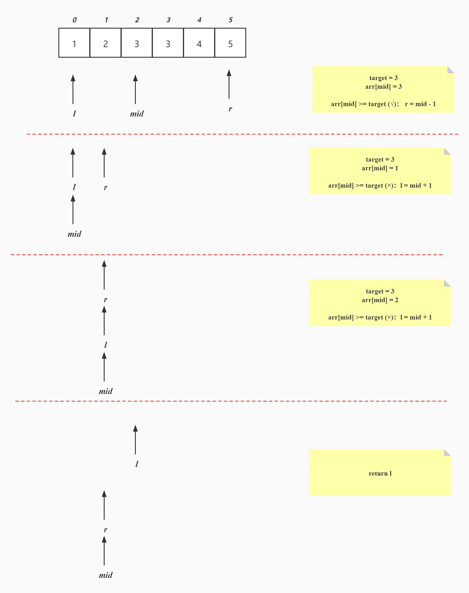
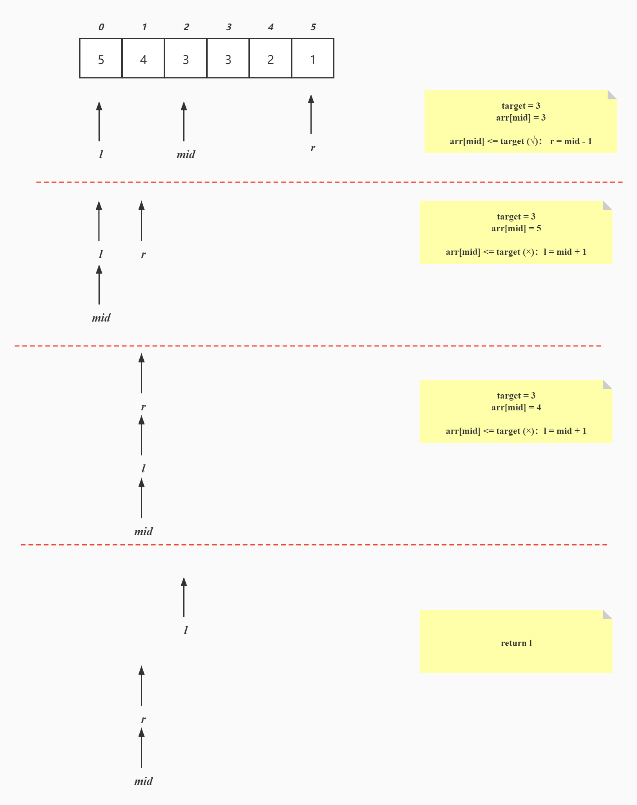
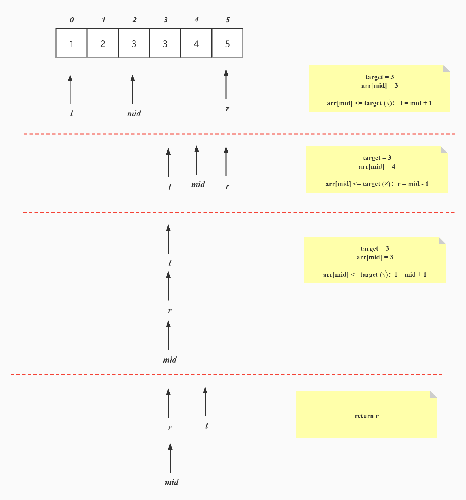
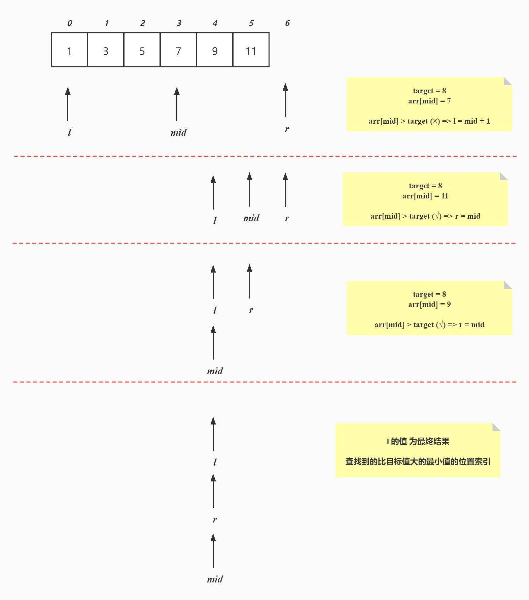

# 【查找】二分查找（2）

<br/>

## 1、概述

<br/>

关于“二分查找”问题的“变种”，**查找**的要么是**有特殊要求的目标值**，要么是**与目标值有关联的值**：

- 1、有序数据中查找目标值，查找到的”第一个“（升序降序中均是第一个）；
  - 例：`{1, 2, 3, 3, 4, 5, 6}`中，目标值为`3`，则返回值为`2`，因为`arr[2]`是升序中的第一个`3`
  - 例：`{6, 5, 4, 3, 3, 2, 1}`中，目标值为`3`，则返回值为`3`，因为`arr[3]`是降序中的第一个`3`。
  - 例：`{1, 2, 3, 4, 5, 6}`中，目标值为`5`，则返回`4`，因为`arr[4]`是数据中唯一一个`5`。

- 2、有序数据中查找目标值，查找到的”最后一个“（升序降序中均是最后一个）；
  
  - 例：`{1, 2, 3, 3, 4, 5, 6}`中，目标值为`3`，则返回值为`3`，因为`arr[3]`是升序中的最后一个`3`。
  
  - 例：`{6, 5, 4, 3, 3, 2, 1}`中，目标值为`3`，则返回值为`4`，因为`arr[4]`是降序中的最后一个`3`。
  
- 3、有序数据中查找到比 目标值 大的 最小值；
  - 例：`{1, 3, 5, 7, 9}`中，目标值为`3`（数据中存在），则返回值为`2`，因为`arr[2]=5`是当前比`3`大的数据中最小的。
  - 例：`{1, 3, 5, 7, 9}`中，目标值为`4`（数据中不存在），则返回值为`2`，因为`arr[2]=5`是当前比`4`大的数据中最小的。
  - 例：`{1, 3, 5, 7, 9}`中，目标值为`0`（数据中不存在），则返回值为`0`，因为`arr[0]=1`是当前比`0`大的数据中最小的。
  - 例：`{1, 3, 5, 7, 9}`中，目标值为`9`（数据中存在），则返回值为`5`或`-1`，因为`9`已经是当前数据中最大的，不存在比它还大的，所以可以返回“越界索引”或“非索引`-1`”。
  - 例：`{1, 3, 5, 7, 9}`中，目标值为`10`（数据中不存在），则返回值为`5`或`-1`，因为`9`已经是当前数据中最大的，不会存在比`10`还大的，所以可以返回“越界索引”或“非索引`-1`”。
  - 例：`{9, 7, 5, 3, 1}`中，目标值为`9`（数据中存在），则返回值为`-1`，因为`9`已经是当前数据中最大的，不存在比`9`还大的，所以可以返回“非索引`-1`”。
  - 例：`{9, 7, 5, 3, 1}`中，目标值为`10`（数据中不存在），则返回值为`-1`，因为`9`已经是当前数据中最大的，不存在比`9`还大的，所以可以返回“非索引`-1`”。

- 4、有序数据中查找到比 目标值 小的 最大值；
  - 例：`{1, 3, 5, 7, 9}`中，目标值为`7`，则返回值为`2`，因为`arr[2]=5`是当前比`7`小的数据中最大的。
  - 例：`{1, 3, 5, 7, 9}`中，目标值为`6`，则返回值为`2`，因为`arr[2]=5`是当前比`6`小的数据中最大的
  - 例：`{1, 3, 5, 7, 9}`中，目标值为`10`，则返回值为`4`，因为`arr[4]=9`是当前比`10`小的数据中最大的。
  - 例：`{1, 3, 5, 7, 9}`中，目标值为`1`，则返回值为`-1`，因为`1`已经是当前数据中最小的，不存在比它还小的，所以可以返回“非索引`-1`“。
  - 例：`{1, 3, 5, 7, 9}`中，目标值为`0`，则返回值为`-1`，因为`1`已经是当前数据中最小的，所以不存在比`0`还小的，所以可以返回“非索引`-1`“。
  - 例：`{9, 7, 5, 3, 1}`中，目标值为`1`（数据中存在），则返回值为`5`或`-1`，因为`1`已经是当前数据中最小的，不存在比它还小的，所以可以返回”越界索引“或“非索引`-1`”。
  - 例：`{9, 7, 5, 3, 1}`中，目标值为`10`（数据中不存在），则返回值为`0`，因为`arr[0]=9`比`10`小。


以上问题，在代码实现时，**返回值一般均为查找到结果的位置索引**。

---

## 2、思想

<br/>

### 2.1、查找目标值（查找到的第一个）

- 一组数据中，可能有存在重复的数据。
- 目标值如果在数据中存在重复的，势必出现“第一个”以及“最后一个”。


- 升序：





- 降序：





---

### 2.2、查找目标值（查找到的最后一个）

- 升序





- 降序


---


### 2.3、查找比目标值大的最小值

- 在有序数据中，查找比目标值大的最小值，返回**位置索引**。
- 注意事项：
  - 1、**不管目标值是否存在**，查找的始终是“比目标值大的最小值”。
  - 2、如果给出的目标值比所提供的数据中最大值都大，说明没有结果，可以返回的位置索引是一个“越界索引”，即“当前数据长度”，或者 -1。
- 可以将这个方法称为`upper`，在浮点数运算中，`upper`的含义是“向上取整”，即“返回比所提供浮点数大的最小整数”。


- 一组升序排列的数据，`{1, 3, 5, 7, 9, 11}`，从中查找比`8`大的最小值，返回其索引：





---


### 2.4、查找比目标值小的最大值

- 可以将这个方法称为`lower`。在浮点数运算中，`lower`的含义是“向下取整”，即“返回比所提供浮点数小的最大整数”。

---


## 3、Java 代码实现

<br/>

### 3.1、查找目标值（查找到的第一个）


```java
public class BinarySearch {

    private BinarySearch() {}

    public static int binarySearchFirst(int[] arr, int target, boolean isAscending) {
        int l = 0;
        int r = arr.length - 1;
        int mid;

        while (l <= r) {
            mid = (l + r) / 2;

            if (isAscending) {
                if (arr[mid] >= target) {
                    r = mid - 1;
                } else {
                    l = mid + 1;
                }
            } else {
                if (arr[mid] <= target) {
                    r = mid - 1;
                } else {
                    l = mid + 1;
                }
            }
        }
        if (l < arr.length && arr[l] == target) {
            return l;
        }
        return -1;
    }

}
```


---


### 3.2、查找目标值（查找到的最后一个）


```java
public class BinarySearch {

    private BinarySearch() {}

    public static int binarySearchLast(int[] arr, int target, boolean isAscending) {
        int l = 0;
        int r = arr.length - 1;
        int mid;

        while (l <= r) {
            mid = (l + r) / 2;

            if (isAscending) {
                if (arr[mid] <= target) {
                    l = mid + 1;
                } else {
                    r = mid - 1;
                }
            } else {
                if (arr[mid] >= target) {
                    l = mid + 1;
                } else {
                    r = mid - 1;
                }
            }
        }
        if (r >= 0 && arr[r] == target) {
            return r;
        }
        return -1;
    }

}
```


---

### 3.3、查找比目标值大的最小值


```java
/* 升序 实现1 */

public class Upper {

    // 只针对 升序 数据有效
    public static int upper(int[] arr, int target) {
        int l = 0;
        int r = arr.length;
        int mid;

        while (l < r) {
            mid = (l + r) / 2;

            if (arr[mid] > target) {
                // arr[mid] 大于 target
                // 说明比 target 大的元素在左侧，arr[mid] 也有可能是比 target 大的最小值
                r = mid;
            } else {
                // arr[mid] 小于或等于 target
                // 说明比 target 大的元素在右侧，arr[mid + 1] 有可能是比 target 大的最小值
                l = mid + 1;
            }
        }
        // l 是位置索引，如果“查不到”（给出的目标比数据中最大的都大），返回“数组长度”即一个越界索引
        return l;
    }

}
```


```java
/* 升序 实现2 */

public class BinarySearch {

    public static int upper(int[] arr, int target) {
        int l = 0;
        int r = arr.length - 1;
        int mid;

        while (l <= r) {
            mid = (l + r) / 2;
            if (arr[mid] > target) {
                r = mid - 1;
            } else {
                l = mid + 1;
            }
        }
        
        // l 的范围是 [0,arr.length]
        // 当返回的是 arr.length 时，说明数据中不存在比 target 还大的值
        // 可以加判断，如果不存在返回 -1
        return l;
    }

}
```


```java
/* 降序 */

public class BinarySearch {

    public static int upper(int[] arr, int target) {
        int l = 0;
        int r = arr.length - 1;
        int mid;

        while (l <= r) {
            mid = (l + r) / 2;
            if (arr[mid] > target) {
                l = mid + 1;
            } else {
                r = mid - 1;
            }
        }
        return r;
    }

}
```


```java
/* 升、降序 结合 */

public class BinarySearch {

    public static int upper(int[] arr, int target, boolean isAscending) {
        int l = 0;
        int r = arr.length - 1;
        int mid;

        while (l <= r) {
            mid = (l + r) / 2;
            if (isAscending) {
                if (arr[mid] > target) {
                    r = mid - 1;
                } else {
                    l = mid + 1;
                }
            } else {
                if (arr[mid] > target) {
                    l = mid + 1;
                } else {
                    r = mid - 1;
                }
            }
        }

        return isAscending ? l : r;
    }

}
```


---

### 3.4、查找比目标值小的最大值


```java
/* 升序 */

public class BinarySearch {

    public static int lower(int[] arr, int target) {
        int l = 0;
        int r = arr.length - 1;
        int mid;

        while (l <= r) {
            mid = (l + r) / 2;
            if (arr[mid] >= target) {
                r = mid - 1;
            } else {
                l = mid + 1;
            }
        }

        // r 的范围是 [-1, arr.length - 1]
        // 当返回的是 -1 时，说明数据中不存在比 target 还小的值
        return r;
    }

}
```


```java
public class BinarySearch {

    public static int lower(int[] arr, int target) {
        int l = 0;
        int r = arr.length - 1;
        int mid;

        while (l <= r) {
            mid = (l + r) / 2;
            if (arr[mid] >= target) {
                l = mid + 1;
            } else {
                r = mid - 1;
            }
        }

        // l 的范围是 [0,arr.length]
        // 当返回的是 arr.length 时，说明数据中不存在比 target 还小的值
        return l;
    }

}
```