# 【排序】堆排序

<br/>

## 1、概述

<br/>

- 堆排序（Heap Sort），是利用堆这种数据结构或者堆的思想完成的排序。
- 堆排序的本质是，利用堆的特点，依次取出堆顶元素，取出每个堆顶元素后，必须及时调整，确保剩余元素构成的仍是一个堆。直至将所有元素从堆中全部取出。
- 最大堆逐个取出对应降序排序，最小堆逐个取出对应升序排序。

---

## 2、最直观的堆排序

<br/>

- 最直观的堆排序，指的就是使用堆这种数据结构，先将数据逐个放入堆中，然后逐个从堆中取出，取出来的顺序就是已经排好序的数据。
- Java 代码实现：


```java
import java.util.Objects;

/**
 * 自定义动态数组
 */
public class Array<E> {

    /**
     * 封装的原生数组
     */
    private E[] data;

    /**
     * 数组中元素个数
     */
    private int size;

    /**
     * 数组开辟的空间大小
     */
    private int capacity;

    /**
     * 默认开辟空间大小
     */
    private static final int DEFAULT_CAPACITY = 10;

    /**
     * 默认扩容倍数
     */
    private static final int DEFAULT_INCREASE_CAPACITY_TIMES = 2;

    /**
     * 默认缩容倍数
     */
    private static final int DEFAULT_DECREASE_CAPACITY_TIMES = 2;

    /**
     * 缩容时机
     *
     * 当元素个数仅仅是开辟空间大小的 1/4 时
     */
    private static final int DEFAULT_DECREASE_CAPACITY_WHEN = 4;

    /**
     * 在数组中未发现元素时的返回值
     */
    private static final int NOT_FIND_INDEX_FLAG = -1;

    public Array() {
        data = (E[]) new Object[DEFAULT_CAPACITY];
        capacity = DEFAULT_CAPACITY;
    }

    public Array(int capacity) {
        if (capacity > 0) {
            data = (E[]) new Object[capacity];
        } else {
            throw new IllegalArgumentException("Capacity Error!");
        }
    }

    /**
     * 在指定索引处增加元素
     *
     * @param e e
     * @param index index
     */
    public void addElement(E e, int index) {
        if (index < 0 || index > size) {
            throw new IllegalArgumentException("Index Error!");
        }
        if (size == capacity) {
            reCapacity(capacity * DEFAULT_INCREASE_CAPACITY_TIMES);
        }
        for (int i = size - 1; i >= index; i--) {
            data[i + 1] = data[i];
        }
        data[index] = e;
        size++;
    }

    /**
     * 在数组首部增加元素
     *
     * @param e e
     */
    public void addElementAtFirst(E e) {
        addElement(e, 0);
    }

    /**
     * 在数组尾部增加元素
     *
     * @param e e
     */
    public void addElementAtLast(E e) {
        addElement(e, size);
    }

    /**
     * 删除指定索引的元素
     *
     * @param index index
     * @return e
     */
    public E removeElement(int index) {
        if (index < 0 || index >= size) {
            throw new IllegalArgumentException("Index Error!");
        }
        E oldElem = data[index];
        for (int i = index; i + 1 < size; i++) {
            data[i] = data[i + 1];
        }
        data[size - 1] = null;
        size--;
        if (size == capacity / DEFAULT_DECREASE_CAPACITY_WHEN) {
            reCapacity(capacity / DEFAULT_DECREASE_CAPACITY_TIMES);
        }
        return oldElem;
    }

    public E removeElementAtFirst() {
        return removeElement(0);
    }

    public E removeElementAtLast() {
        return removeElement(size - 1);
    }

    /**
     * 删除特定的元素，从数组首部开始检索
     *
     * @param e e
     */
    public void removeSpecificElementFromFirst(E e) {
        int index = findSpecificElementFromFirst(e);
        if (index != NOT_FIND_INDEX_FLAG) {
            removeElement(index);
        }
    }

    /**
     * 删除特定的元素，从数组尾部开始检索
     *
     * @param e e
     */
    public void removeSpecificElementFromLast(E e) {
        int index = findSpecificElementFromLast(e);
        if (index != NOT_FIND_INDEX_FLAG) {
            removeElement(index);
        }
    }

    /**
     * 删除特定的所有元素
     *
     * @param e e
     */
    public void removeAllSpecificElements(E e) {
        for (int i = 0; i < size; i++) {
            if (Objects.equals(e, data[i])) {
                removeElement(i);
            }
        }
    }

    public E get(int index) {
        if (index < 0 || index >= size) {
            throw new IllegalArgumentException("Index Error!");
        }
        return data[index];
    }

    public void set(E e, int index) {
        if (index < 0 || index >= size) {
            throw new IllegalArgumentException("Index Error!");
        }
        data[index] = e;
    }

    public int findSpecificElementFromFirst(E e) {
        for (int i = 0; i < size; i++) {
            if (Objects.equals(e, data[i])) {
                return i;
            }
        }
        return NOT_FIND_INDEX_FLAG;
    }

    public int findSpecificElementFromLast(E e) {
        for (int i = size - 1; i >= 0; i--) {
            if (Objects.equals(e, data[i])) {
                return i;
            }
        }
        return NOT_FIND_INDEX_FLAG;
    }

    public E modifyElement(E e, int index) {
        if (index < 0 || index >= size) {
            throw new IllegalArgumentException("Index Error!");
        }
        E oldElem = data[index];
        data[index] = e;
        return oldElem;
    }

    public boolean contains(E e) {
        for (int i = 0; i < size; i++) {
            if (Objects.equals(e, data[i])) {
                return true;
            }
        }
        return false;
    }

    public void swap(int i, int j) {
        if (i < 0 || i >= size || j < 0 || j >= size) {
            throw new IllegalArgumentException("Index Error!");
        }
        E temp = data[i];
        data[i] = data[j];
        data[j] = temp;
    }

    public boolean isEmpty() {
        return size == 0;
    }

    public int capacity() {
        return capacity;
    }

    public int size() {
        return size;
    }

    @Override
    public String toString() {
        StringBuilder sb = new StringBuilder();
        sb.append("[");
        for (int i = 0; i < size; i++) {
            sb.append(data[i]);
            if (i != size - 1) {
                sb.append(", ");
            }
        }
        sb.append("]");
        return sb.toString();
    }

    private void reCapacity(int newCapacity) {
        E[] arr = (E[]) new Object[newCapacity];
        for (int i = 0; i < size; i++) {
            arr[i] = data[i];
        }
        capacity = newCapacity;
        data = arr;
    }

}
```


```java
public class MaxHeap<E extends Comparable<E>> {

    private Array<E> data;

    public MaxHeap() {
        this.data = new Array<>();
    }

    /**
     * 向最大堆中添加元素
     *
     * @param e 元素
     */
    public void add(E e) {
        if (e == null) {
            throw new IllegalArgumentException("The element is null!");
        }
        data.addElementAtLast(e);
        shiftUp(data.size() - 1);
    }

    /**
     * 从最大堆中获取最大的元素
     *
     * @return 最大的元素
     */
    public E max() {
        if (data.size() == 0) {
            return null;
        }
        return data.get(0);
    }

    /**
     * 从最大堆中移除元素
     *
     * @return 最大的元素
     */
    public E remove() {
        if (data.size() == 0) {
            return null;
        }

        E max = data.get(0);
        data.set(data.get(data.size() - 1), 0);
        data.removeElementAtLast();
        if (data.size() != 0) {
            shiftDown(0);
        }
        return max;
    }

    /**
     * 替换最大的元素，保持最大堆
     *
     * @param newElement 新的元素
     * @return 最大的元素
     */
    public E replace(E newElement) {
        if (newElement == null) {
            throw new IllegalArgumentException("The element is null!");
        }

        if (data.size() == 0) {
            return null;
        }

        E max = data.get(0);
        data.set(newElement, 0);
        shiftDown(0);
        return max;
    }

    public int size() {
        return this.data.size();
    }

    public boolean isEmpty() {
        return this.data.isEmpty();
    }

    @Override
    public String toString() {
        return data.toString();
    }

    /**
     * 完全二叉树的数组中，获取索引 index 节点的父节点的索引
     *
     * @param index 索引
     * @return 索引 index 节点的父节点的索引
     */
    private int parentNodeIndex(int index) {
        if (index <= 0) {
            throw new IllegalArgumentException("Index error!");
        }
        return (index - 1) / 2;
    }

    /**
     * 完全二叉树的数组中，获取索引 index 节点的左子节点的索引
     *
     * @param index 索引
     * @return 索引 index 节点的左子节点的索引
     */
    private int leftChildNodeIndex(int index) {
        return index * 2 + 1;
    }

    /**
     * 完全二叉树的数组中，获取索引 index 节点的右子节点的索引
     *
     * @param index 索引
     * @return 索引 index 节点的右子节点的索引
     */
    private int rightChildNodeIndex(int index) {
        return index * 2 + 2;
    }

    /**
     * 上浮
     *
     * 索引为 index 的元素“上浮”，保持最大堆
     *
     * @param index 索引
     */
    private void shiftUp(int index) {
        if (index < 0 || index >= data.size()) {
            throw new IllegalArgumentException("The index is error!");
        }

        while (index > 0 && data.get(index).compareTo(data.get(parentNodeIndex(index))) > 0) {
            data.swap(index, parentNodeIndex(index));
            index = parentNodeIndex(index);
        }
    }

    /**
     * 下沉
     *
     * 索引为 index 的元素“下沉”，保持最大堆
     *
     * @param index 索引
     */
    private void shiftDown(int index) {
        if (index < 0 || index >= data.size()) {
            throw new IllegalArgumentException("The index is error!");
        }

        int i,j = 0;
        int swapTargetIndex = 0;
        int size = data.size();

        // leftChildNodeIndex(index) >= data.size() 此时索引为 index 的节点在树中为叶子节点，因为其“左子节点”的索引已经越界
        while (leftChildNodeIndex(index) < size) {
            // i：左子节点的索引
            i = leftChildNodeIndex(index);
            // j：右子节点的索引
            j = i + 1;

            if (j < size) {
                // j < size：既有左子节点，又有右子节点

                if (data.get(i).compareTo(data.get(j)) > 0) {
                    swapTargetIndex = i;
                } else {
                    swapTargetIndex = j;
                }
            } else {
                // j >= size：只有左子节点

                swapTargetIndex = i;
            }

            if (data.get(swapTargetIndex).compareTo(data.get(index)) > 0) {
                data.swap(index, swapTargetIndex);
                index = swapTargetIndex;
            } else {
                break;
            }
        }
    }

}
```


```java
public class MinHeap<E extends Comparable<E>> {

    private Array<E> data;

    public MinHeap() {
        this.data = new Array<>();
    }

    public void add(E e) {
        if (e == null) {
            throw new IllegalArgumentException("The element is null!");
        }

        data.addElementAtLast(e);
        shiftUp(data.size() - 1);
    }

    public E remove() {
        if (data.size() == 0) {
            return null;
        }

        E min = data.get(0);
        data.set(data.get(data.size() - 1), 0);
        data.removeElementAtLast();
        if (data.size() != 0) {
            shiftDown(0);
        }
        return min;
    }

    public E replace(E newElement) {
        if (newElement == null) {
            throw new IllegalArgumentException("The element is null!");
        }

        if (data.size() == 0) {
            return null;
        }

        E min = data.get(0);
        data.set(newElement, 0);
        shiftDown(0);
        return min;
    }

    public E min() {
        if (data.size() == 0) {
            return null;
        }

        return data.get(0);
    }

    public int size() {
        return this.data.size();
    }

    public boolean isEmpty() {
        return this.data.isEmpty();
    }

    @Override
    public String toString() {
        return data.toString();
    }

    private int parentNodeIndex(int index) {
        if (index <= 0) {
            throw new IllegalArgumentException("Index error!");
        }
        return (index - 1) / 2;
    }

    private int leftChildNodeIndex(int index) {
        return index * 2 + 1;
    }

    private int rightChildNodeIndex(int index) {
        return index * 2 + 2;
    }

    private void shiftUp(int index) {
        if (index < 0 || index >= data.size()) {
            throw new IllegalArgumentException("The index is error!");
        }

        while (index > 0 && data.get(index).compareTo(data.get(parentNodeIndex(index))) < 0) {
            data.swap(index, parentNodeIndex(index));
            index = parentNodeIndex(index);
        }
    }

    private void shiftDown(int index) {
        if (index < 0 || index >= data.size()) {
            throw new IllegalArgumentException("The index is error!");
        }

        int i,j = 0;
        int swapTargetIndex = 0;
        int size = data.size();

        // leftChildNodeIndex(index) >= data.size() 此时索引为 index 的节点在树中为叶子节点，因为其“左子节点”的索引已经越界
        while (leftChildNodeIndex(index) < size) {
            // i：左子节点的索引
            i = leftChildNodeIndex(index);
            // j：右子节点的索引
            j = i + 1;

            if (j < size) {
                // j < size：既有左子节点，又有右子节点
                if (data.get(i).compareTo(data.get(j)) < 0) {
                    swapTargetIndex = i;
                } else {
                    swapTargetIndex = j;
                }
            } else {
                // j >= size：只有左子节点
                swapTargetIndex = i;
            }

            if (data.get(swapTargetIndex).compareTo(data.get(index)) < 0) {
                data.swap(index, swapTargetIndex);
                index = swapTargetIndex;
            } else {
                break;
            }
        }
    }

}
```


```java
public class HeapSort {

    private HeapSort() {}

    public static <E extends Comparable<E>> void heapSort(E[] arr, boolean isAscending) {
        if (arr == null) {
            throw new IllegalArgumentException("The array is null!");
        }

        if (isAscending) {
            MinHeap<E> minHeap = new MinHeap<>();
            for (E e : arr) {
                minHeap.add(e);
            }
            for (int i = 0; i < arr.length; i++) {
                arr[i] = minHeap.remove();
            }
        } else {
            MaxHeap<E> maxHeap = new MaxHeap<>();
            for (E e : arr) {
                maxHeap.add(e);
            }
            for (int i = 0; i < arr.length; i++) {
                arr[i] = maxHeap.remove();
            }
        }
    }

}
```


---

## 3、堆排序优化 1 — Heapify

<br/>

- Heapify 是指将任意一个数组整理成堆的操作。
- 在前面的“最直观的堆排序”中，是需要先将数据逐个添加至一个空堆中，然后再依次从堆中取出堆顶元素。这里优化后的做法是，直接将传入的数组调整为堆。
- Heapify 的思想是：自最后一个非叶子节点开始，向前遍历，逐个“下沉”。
- Heapify 的思路如下图所示：一开始数组不是一个堆


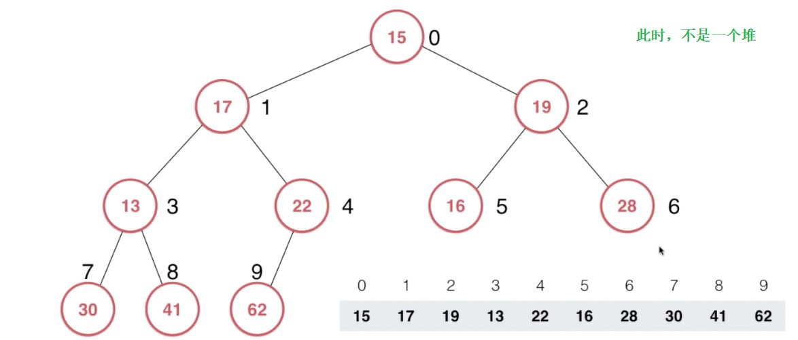


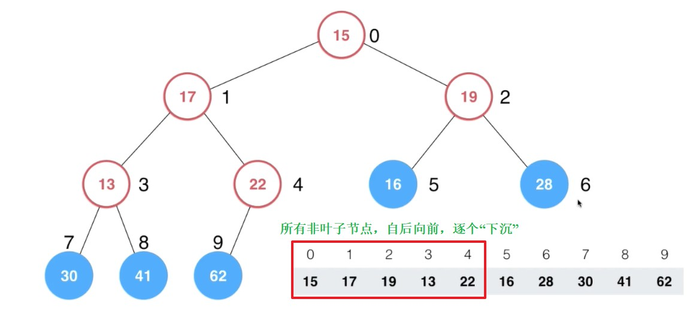


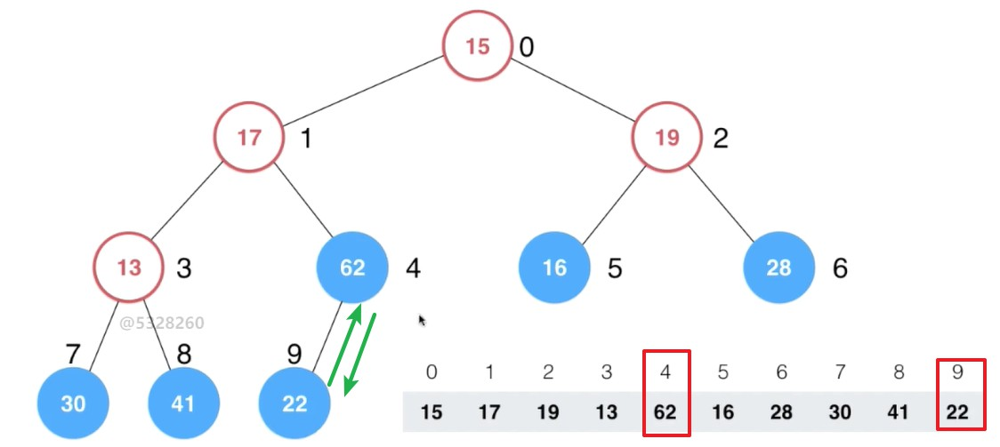


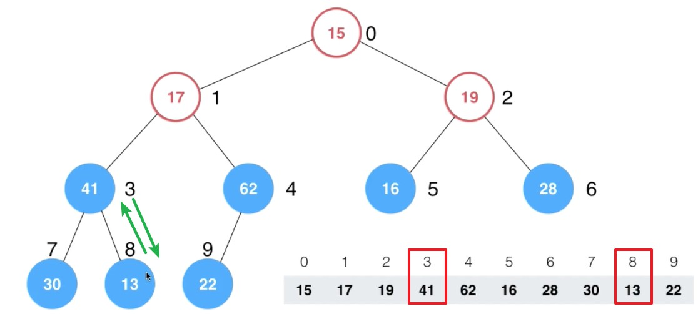


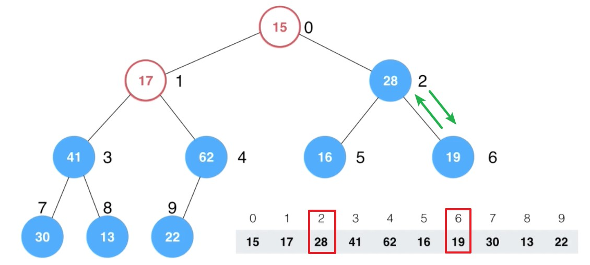


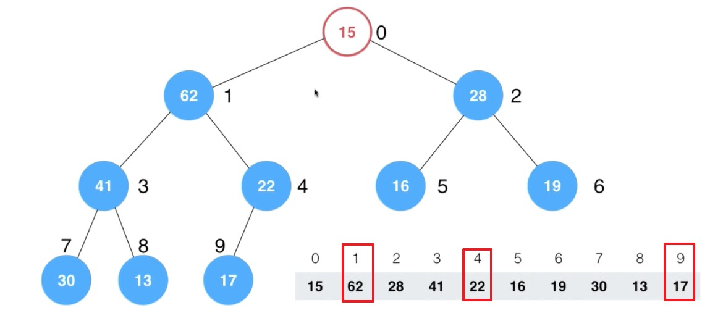


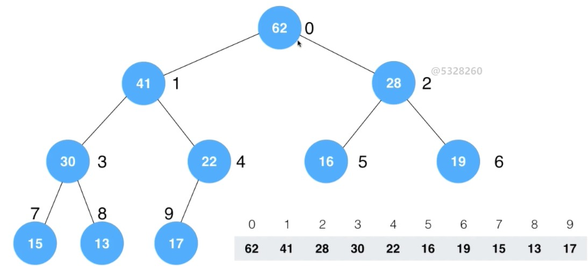


- 使用数组存储堆，最后一个非叶子节点的索引是当前数组最后一个元素的父节点的索引。
- Java 代码实现：在`MaxHeap`类和`MinHeap`类中增加新的构造方法，构造方法的参数是一个自定义数组。`MaxHeap`类和`MinHeap`类中的`Array`类型（`Array`是封装了普通数组的动态数组）的成员变量`data`会拷贝（拷贝至`Array`底层所封装的数组）构造方法中给出的自定义数组。然后就可以直接对`data`使用 Heapify 操作，调整成一个堆。最后，再逐个取出堆顶的元素。


```java
import java.util.Objects;

/**
 * 自定义动态数组
 */
public class Array<E> {

    /**
     * 封装的原生数组
     */
    private E[] data;

    /**
     * 数组中元素个数
     */
    private int size;

    /**
     * 数组开辟的空间大小
     */
    private int capacity;

    /**
     * 默认开辟空间大小
     */
    private static final int DEFAULT_CAPACITY = 10;

    /**
     * 默认扩容倍数
     */
    private static final int DEFAULT_INCREASE_CAPACITY_TIMES = 2;

    /**
     * 默认缩容倍数
     */
    private static final int DEFAULT_DECREASE_CAPACITY_TIMES = 2;

    /**
     * 缩容时机
     *
     * 当元素个数仅仅是开辟空间大小的 1/4 时
     */
    private static final int DEFAULT_DECREASE_CAPACITY_WHEN = 4;

    /**
     * 在数组中未发现元素时的返回值
     */
    private static final int NOT_FIND_INDEX_FLAG = -1;

    public Array() {
        data = (E[]) new Object[DEFAULT_CAPACITY];
        capacity = DEFAULT_CAPACITY;
    }

    public Array(int capacity) {
        if (capacity > 0) {
            data = (E[]) new Object[capacity];
        } else {
            throw new IllegalArgumentException("Capacity Error!");
        }
    }

    public Array(E[] arr) {
        if (arr != null) {
            data = (E[]) new Object[arr.length];
            System.arraycopy(arr, 0, data, 0, arr.length);
            size = arr.length;
        }
    }
    
    /**
     * 在指定索引处增加元素
     *
     * @param e e
     * @param index index
     */
    public void addElement(E e, int index) {
        if (index < 0 || index > size) {
            throw new IllegalArgumentException("Index Error!");
        }
        if (size == capacity) {
            reCapacity(capacity * DEFAULT_INCREASE_CAPACITY_TIMES);
        }
        for (int i = size - 1; i >= index; i--) {
            data[i + 1] = data[i];
        }
        data[index] = e;
        size++;
    }

    /**
     * 在数组首部增加元素
     *
     * @param e e
     */
    public void addElementAtFirst(E e) {
        addElement(e, 0);
    }

    /**
     * 在数组尾部增加元素
     *
     * @param e e
     */
    public void addElementAtLast(E e) {
        addElement(e, size);
    }

    /**
     * 删除指定索引的元素
     *
     * @param index index
     * @return e
     */
    public E removeElement(int index) {
        if (index < 0 || index >= size) {
            throw new IllegalArgumentException("Index Error!");
        }
        E oldElem = data[index];
        for (int i = index; i + 1 < size; i++) {
            data[i] = data[i + 1];
        }
        data[size - 1] = null;
        size--;
        if (size == capacity / DEFAULT_DECREASE_CAPACITY_WHEN) {
            reCapacity(capacity / DEFAULT_DECREASE_CAPACITY_TIMES);
        }
        return oldElem;
    }

    public E removeElementAtFirst() {
        return removeElement(0);
    }

    public E removeElementAtLast() {
        return removeElement(size - 1);
    }

    /**
     * 删除特定的元素，从数组首部开始检索
     *
     * @param e e
     */
    public void removeSpecificElementFromFirst(E e) {
        int index = findSpecificElementFromFirst(e);
        if (index != NOT_FIND_INDEX_FLAG) {
            removeElement(index);
        }
    }

    /**
     * 删除特定的元素，从数组尾部开始检索
     *
     * @param e e
     */
    public void removeSpecificElementFromLast(E e) {
        int index = findSpecificElementFromLast(e);
        if (index != NOT_FIND_INDEX_FLAG) {
            removeElement(index);
        }
    }

    /**
     * 删除特定的所有元素
     *
     * @param e e
     */
    public void removeAllSpecificElements(E e) {
        for (int i = 0; i < size; i++) {
            if (Objects.equals(e, data[i])) {
                removeElement(i);
            }
        }
    }

    public E get(int index) {
        if (index < 0 || index >= size) {
            throw new IllegalArgumentException("Index Error!");
        }
        return data[index];
    }

    public void set(E e, int index) {
        if (index < 0 || index >= size) {
            throw new IllegalArgumentException("Index Error!");
        }
        data[index] = e;
    }

    public int findSpecificElementFromFirst(E e) {
        for (int i = 0; i < size; i++) {
            if (Objects.equals(e, data[i])) {
                return i;
            }
        }
        return NOT_FIND_INDEX_FLAG;
    }

    public int findSpecificElementFromLast(E e) {
        for (int i = size - 1; i >= 0; i--) {
            if (Objects.equals(e, data[i])) {
                return i;
            }
        }
        return NOT_FIND_INDEX_FLAG;
    }

    public E modifyElement(E e, int index) {
        if (index < 0 || index >= size) {
            throw new IllegalArgumentException("Index Error!");
        }
        E oldElem = data[index];
        data[index] = e;
        return oldElem;
    }

    public boolean contains(E e) {
        for (int i = 0; i < size; i++) {
            if (Objects.equals(e, data[i])) {
                return true;
            }
        }
        return false;
    }

    public void swap(int i, int j) {
        if (i < 0 || i >= size || j < 0 || j >= size) {
            throw new IllegalArgumentException("Index Error!");
        }
        E temp = data[i];
        data[i] = data[j];
        data[j] = temp;
    }

    public boolean isEmpty() {
        return size == 0;
    }

    public int capacity() {
        return capacity;
    }

    public int size() {
        return size;
    }

    @Override
    public String toString() {
        StringBuilder sb = new StringBuilder();
        sb.append("[");
        for (int i = 0; i < size; i++) {
            sb.append(data[i]);
            if (i != size - 1) {
                sb.append(", ");
            }
        }
        sb.append("]");
        return sb.toString();
    }

    private void reCapacity(int newCapacity) {
        E[] arr = (E[]) new Object[newCapacity];
        for (int i = 0; i < size; i++) {
            arr[i] = data[i];
        }
        capacity = newCapacity;
        data = arr;
    }

}
```


```java
public class MaxHeap<E extends Comparable<E>> {

    private Array<E> data;

    public MaxHeap() {
        this.data = new Array<>();
    }

    public MaxHeap(E[] arr) {
        if (arr == null) {
            throw new IllegalArgumentException("The array is null!");
        }

        for (E e : arr) {
            if (e == null) {
                throw new IllegalArgumentException("The element in the array is null!");
            }
        }

        this.data = new Array<>(arr);
        // Heapity 操作
        for (int i = parentNodeIndex(data.size() - 1); i >= 0; i--) {
            shiftDown(i);
        }
    }

    /**
     * 向最大堆中添加元素
     *
     * @param e 元素
     */
    public void add(E e) {
        if (e == null) {
            throw new IllegalArgumentException("The element is null!");
        }
        data.addElementAtLast(e);
        shiftUp(data.size() - 1);
    }

    /**
     * 从最大堆中获取最大的元素
     *
     * @return 最大的元素
     */
    public E max() {
        if (data.size() == 0) {
            return null;
        }
        return data.get(0);
    }

    /**
     * 从最大堆中移除元素
     *
     * @return 最大的元素
     */
    public E remove() {
        if (data.size() == 0) {
            return null;
        }

        E max = data.get(0);
        data.set(data.get(data.size() - 1), 0);
        data.removeElementAtLast();
        if (data.size() != 0) {
            shiftDown(0);
        }
        return max;
    }

    /**
     * 替换最大的元素，保持最大堆
     *
     * @param newElement 新的元素
     * @return 最大的元素
     */
    public E replace(E newElement) {
        if (newElement == null) {
            throw new IllegalArgumentException("The element is null!");
        }

        if (data.size() == 0) {
            return null;
        }

        E max = data.get(0);
        data.set(newElement, 0);
        shiftDown(0);
        return max;
    }

    public int size() {
        return this.data.size();
    }

    public boolean isEmpty() {
        return this.data.isEmpty();
    }

    @Override
    public String toString() {
        return data.toString();
    }

    /**
     * 完全二叉树的数组中，获取索引 index 节点的父节点的索引
     *
     * @param index 索引
     * @return 索引 index 节点的父节点的索引
     */
    private int parentNodeIndex(int index) {
        if (index <= 0) {
            throw new IllegalArgumentException("Index error!");
        }
        return (index - 1) / 2;
    }

    /**
     * 完全二叉树的数组中，获取索引 index 节点的左子节点的索引
     *
     * @param index 索引
     * @return 索引 index 节点的左子节点的索引
     */
    private int leftChildNodeIndex(int index) {
        return index * 2 + 1;
    }

    /**
     * 完全二叉树的数组中，获取索引 index 节点的右子节点的索引
     *
     * @param index 索引
     * @return 索引 index 节点的右子节点的索引
     */
    private int rightChildNodeIndex(int index) {
        return index * 2 + 2;
    }

    /**
     * 上浮
     *
     * 索引为 index 的元素“上浮”，保持最大堆
     *
     * @param index 索引
     */
    private void shiftUp(int index) {
        if (index < 0 || index >= data.size()) {
            throw new IllegalArgumentException("The index is error!");
        }

        while (index > 0 && data.get(index).compareTo(data.get(parentNodeIndex(index))) > 0) {
            data.swap(index, parentNodeIndex(index));
            index = parentNodeIndex(index);
        }
    }

    /**
     * 下沉
     *
     * 索引为 index 的元素“下沉”，保持最大堆
     *
     * @param index 索引
     */
    private void shiftDown(int index) {
        if (index < 0 || index >= data.size()) {
            throw new IllegalArgumentException("The index is error!");
        }

        int i,j = 0;
        int swapTargetIndex = 0;
        int size = data.size();

        // leftChildNodeIndex(index) >= data.size() 此时索引为 index 的节点在树中为叶子节点，因为其“左子节点”的索引已经越界
        while (leftChildNodeIndex(index) < size) {
            // i：左子节点的索引
            i = leftChildNodeIndex(index);
            // j：右子节点的索引
            j = i + 1;

            if (j < size) {
                // j < size：既有左子节点，又有右子节点

                if (data.get(i).compareTo(data.get(j)) > 0) {
                    swapTargetIndex = i;
                } else {
                    swapTargetIndex = j;
                }
            } else {
                // j >= size：只有左子节点

                swapTargetIndex = i;
            }

            if (data.get(swapTargetIndex).compareTo(data.get(index)) > 0) {
                data.swap(index, swapTargetIndex);
                index = swapTargetIndex;
            } else {
                break;
            }
        }
    }

}
```


```java
public class MinHeap<E extends Comparable<E>> {

    private Array<E> data;

    public MinHeap() {
        this.data = new Array<>();
    }

    public MinHeap(E[] arr) {
        if (arr == null) {
            throw new IllegalArgumentException("The array is null!");
        }

        for (E e : arr) {
            if (e == null) {
                throw new IllegalArgumentException("The element in the array is null!");
            }
        }

        this.data = new Array<>(arr);
        // Heapity 操作
        for (int i = parentNodeIndex(data.size() - 1); i >= 0; i--) {
            shiftDown(i);
        }
    }

    public void add(E e) {
        if (e == null) {
            throw new IllegalArgumentException("The element is null!");
        }

        data.addElementAtLast(e);
        shiftUp(data.size() - 1);
    }

    public E remove() {
        if (data.size() == 0) {
            return null;
        }

        E min = data.get(0);
        data.set(data.get(data.size() - 1), 0);
        data.removeElementAtLast();
        if (data.size() != 0) {
            shiftDown(0);
        }
        return min;
    }

    public E replace(E newElement) {
        if (newElement == null) {
            throw new IllegalArgumentException("The element is null!");
        }

        if (data.size() == 0) {
            return null;
        }

        E min = data.get(0);
        data.set(newElement, 0);
        shiftDown(0);
        return min;
    }

    public E min() {
        if (data.size() == 0) {
            return null;
        }

        return data.get(0);
    }

    public int size() {
        return this.data.size();
    }

    public boolean isEmpty() {
        return this.data.isEmpty();
    }

    @Override
    public String toString() {
        return data.toString();
    }

    private int parentNodeIndex(int index) {
        if (index <= 0) {
            throw new IllegalArgumentException("Index error!");
        }
        return (index - 1) / 2;
    }

    private int leftChildNodeIndex(int index) {
        return index * 2 + 1;
    }

    private int rightChildNodeIndex(int index) {
        return index * 2 + 2;
    }

    private void shiftUp(int index) {
        if (index < 0 || index >= data.size()) {
            throw new IllegalArgumentException("The index is error!");
        }

        while (index > 0 && data.get(index).compareTo(data.get(parentNodeIndex(index))) < 0) {
            data.swap(index, parentNodeIndex(index));
            index = parentNodeIndex(index);
        }
    }

    private void shiftDown(int index) {
        if (index < 0 || index >= data.size()) {
            throw new IllegalArgumentException("The index is error!");
        }

        int i,j = 0;
        int swapTargetIndex = 0;
        int size = data.size();

        // leftChildNodeIndex(index) >= data.size() 此时索引为 index 的节点在树中为叶子节点，因为其“左子节点”的索引已经越界
        while (leftChildNodeIndex(index) < size) {
            // i：左子节点的索引
            i = leftChildNodeIndex(index);
            // j：右子节点的索引
            j = i + 1;

            if (j < size) {
                // j < size：既有左子节点，又有右子节点
                if (data.get(i).compareTo(data.get(j)) < 0) {
                    swapTargetIndex = i;
                } else {
                    swapTargetIndex = j;
                }
            } else {
                // j >= size：只有左子节点
                swapTargetIndex = i;
            }

            if (data.get(swapTargetIndex).compareTo(data.get(index)) < 0) {
                data.swap(index, swapTargetIndex);
                index = swapTargetIndex;
            } else {
                break;
            }
        }
    }

}
```


```java
public class HeapSort {

    private HeapSort() {}

    public static <E extends Comparable<E>> void heapSort(E[] arr, boolean isAscending) {
        if (arr == null) {
            throw new IllegalArgumentException("The array is null!");
        }

        if (isAscending) {
            MinHeap<E> minHeap = new MinHeap<>(arr); // 直接使用构造方法传入数组
            for (int i = 0; i < arr.length; i++) {
                arr[i] = minHeap.remove();
            }
        } else {
            MaxHeap<E> maxHeap = new MaxHeap<>(arr); // 直接使用构造方法传入数组
            for (int i = 0; i < arr.length; i++) {
                arr[i] = maxHeap.remove();
            }
        }
    }

}
```


---

## 4、堆排序优化 2 — 就地排序

<br/>

- 之前的堆排序都是**异地排序**（借助已经实现的堆）。实际上，基于 Heapify（将任意数组调整成一个堆）的思想完全可以实现数组的就地排序。
- 因为堆排序的本质是逐个取出堆顶元素，每取出一个堆顶元素后，剩余元素经过调整后仍构成一个堆，直至将堆中的元素全部取出，完成排序。所以，就堆排序而言，异地排序要容易的多。但是，并不代表堆排序不能实现就地排序。
  - 在一个数组中，可以划分为两个部分 A 和 B，A 使用 Heapify 操作将这个部分调整为堆，B 则存放从 A 中取出的堆顶元素，即 B 是已经完成排序的部分。每从 A 取出一个堆顶元素后，再对 A 部分使用 Heapify 操作确保 A 部分始终是一个堆，重复步骤直至 A 的区间中只有1个元素，说明已经完成就地排序。
  - **就地排序**，排好序的部分 B 放在**数组末尾**的话，升序的话，使用最大堆；降序的话，使用最小堆。
- 就地排序思路如下图所示：下图所示为升序，排好序的部分放在数组末尾


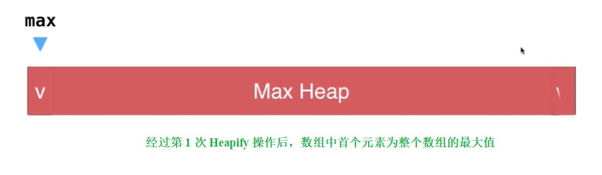


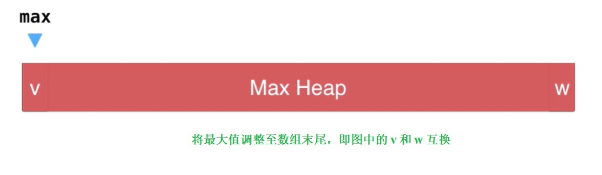


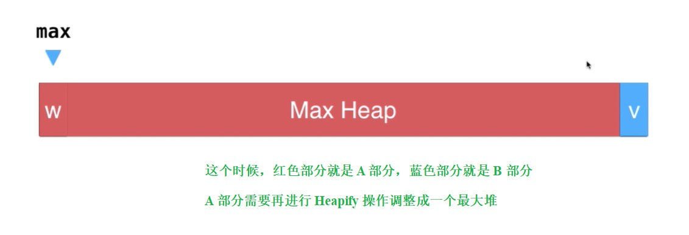


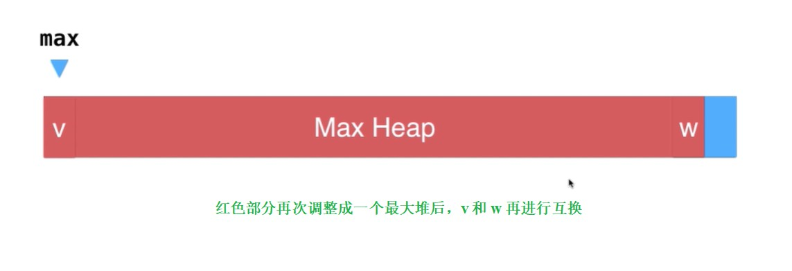


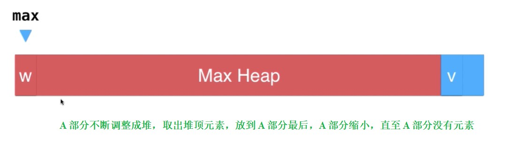


- Java 代码实现：


```java
public class HeapSort {

    public static <E extends Comparable<E>> void heapSort(E[] arr, boolean isAscending) {
        if (arr == null) {
            throw new IllegalArgumentException("The array is null!");
        }

        int arrSize = arr.length;

        // r > 1：当未排序区间只有1个元素时，没有必要进行堆排序
        for (int r = arrSize; r > 1; r--) {
            // [0, r) 区间进行 Heapify 操作
            heapify(arr, 0, r, isAscending);
            // 此时 arr[0] 是堆顶元素，arr[r - 1] 是已经完成排序的部分的首个元素的索引
            swap(arr, 0, r - 1);
        }
    }

    /**
     * 对 arr 的 [l, r) 区间进行 Heapify 操作，即把 arr 数组的 [l, r) 区间调整成堆
     */
    private static <E extends Comparable<E>> void heapify(E[] arr, int l, int r, boolean isAscending) {
        if (arr == null) {
            throw new IllegalArgumentException("The array is null!");
        }
        if (l >= r || l < 0 || r > arr.length) {
            throw new IllegalArgumentException("The range is error!");
        }

        int arrSize = arr.length;

        // [l, r) 区间中的“非叶子节点”自后向前逐个进行 Shift Down 操作
        for (int index = parentNodeIndex(r - 1, arrSize); index >= l; index--) {
            shiftDown(arr, l, r, index, isAscending);
        }
    }

    /**
     * 对 arr 的 [l, r) 区间中索引为 index 进行 Shift Down 操作
     */
    private static <E extends Comparable<E>> void shiftDown(E[] arr, int l, int r, int index, boolean isAscending) {
        if (arr == null) {
            throw new IllegalArgumentException("The array is null!");
        }
        if (l >= r || l < 0 || r > arr.length) {
            throw new IllegalArgumentException("The range is error!");
        }
        if (index < l || index >= r) {
            throw new IllegalArgumentException("The index is error!");
        }

        int arrSize = arr.length;
        int i, j = 0;
        int swapTargetIndex = 0;

        while (leftChildNodeIndex(index, arrSize) < r) {
            i = leftChildNodeIndex(index, arrSize);
            j = i + 1;

            if (j < r) {
                if (isAscending) {
                    // 因排好序的部分放在数组末尾，升序使用最大堆
                    if (arr[i].compareTo(arr[j]) > 0) {
                        swapTargetIndex = i;
                    } else {
                        swapTargetIndex = j;
                    }
                } else {
                    // 因排好序的部分放在数组末尾，降序使用最小堆
                    if (arr[i].compareTo(arr[j]) < 0) {
                        swapTargetIndex = i;
                    } else {
                        swapTargetIndex = j;
                    }
                }
            } else {
                swapTargetIndex = i;
            }

            if (isAscending) {
                if (arr[swapTargetIndex].compareTo(arr[index]) > 0) {
                    swap(arr, swapTargetIndex, index);
                    index = swapTargetIndex;
                } else {
                    break;
                }
            } else {
                if (arr[swapTargetIndex].compareTo(arr[index]) < 0) {
                    swap(arr, swapTargetIndex, index);
                    index = swapTargetIndex;
                } else {
                    break;
                }
            }
        }

    }

    private static int parentNodeIndex(int index, int arrSize) {
        if (index <= 0 || index >= arrSize) {
            throw new IllegalArgumentException("The index is error!");
        }

        return (index - 1) / 2;
    }

    private static int leftChildNodeIndex(int index, int arrSize) {
        if (index < 0 || index >= arrSize) {
            throw new IllegalArgumentException("The index is error!");
        }

        return index * 2 + 1;
    }

    private static int rightChildNodeIndex(int index, int arrSize) {
        if (index < 0 || index >= arrSize) {
            throw new IllegalArgumentException("The index is error!");
        }

        return index * 2 + 2;
    }

    private static <E> void swap(E[] arr, int i, int j) {
        if (arr == null) {
            throw new IllegalArgumentException("The array is null!");
        }
        if (i < 0 || i >= arr.length || j < 0 || j >= arr.length) {
            throw new IllegalArgumentException("The index is error!");
        }

        E temp = arr[i];
        arr[i] = arr[j];
        arr[j] = temp;
    }

}
```
