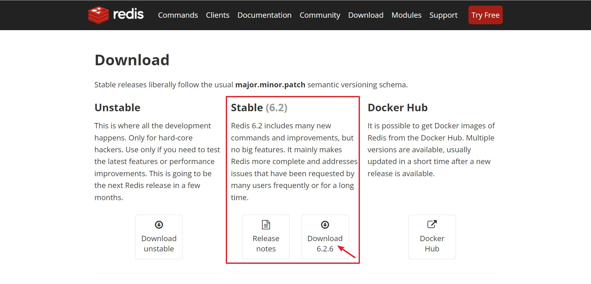
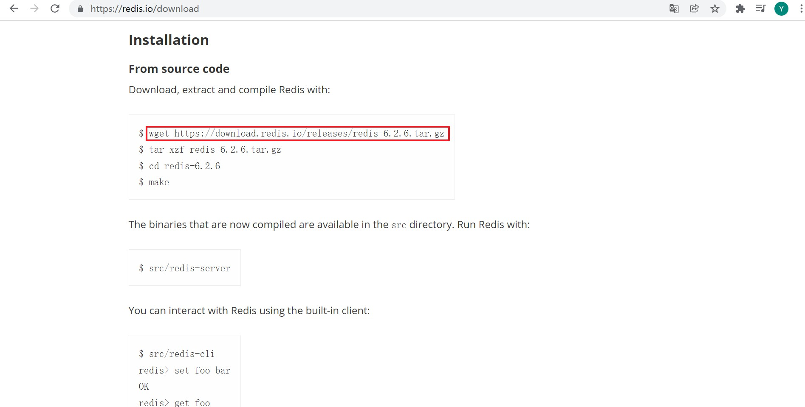
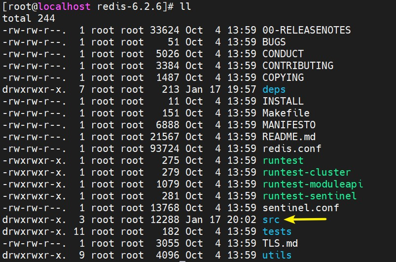
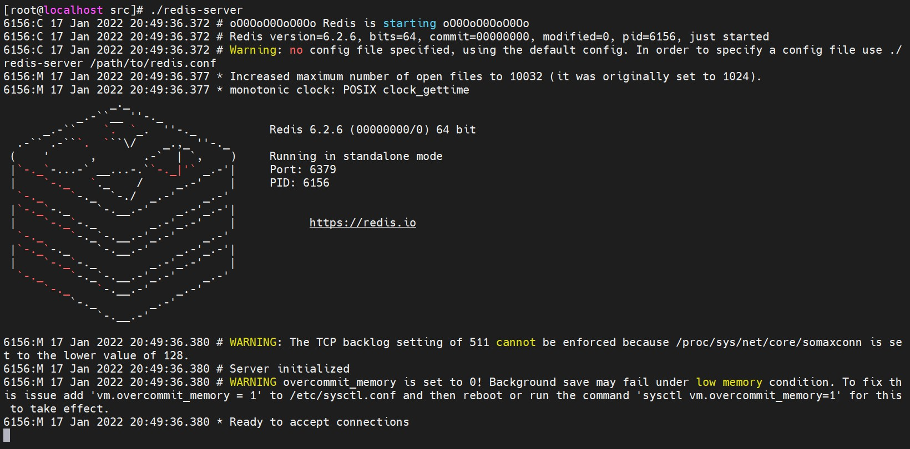
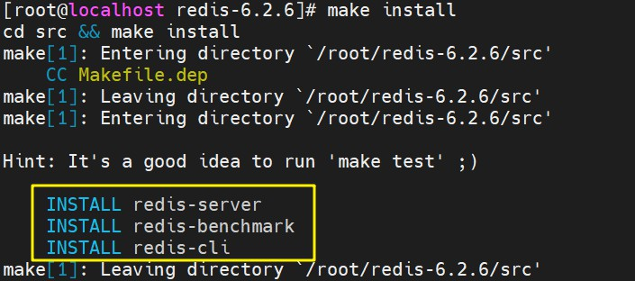

# CentOS 7 Redis 安装

<br/>

## 1、概述

<br/>

- Redis 官方提供了主要用于 Linux 系统安装的源码包。
- Redis 官方网站：[https://redis.io](https://redis.io)
- 安装参考：[https://www.runoob.com/redis/redis-install.html](https://www.runoob.com/redis/redis-install.html)、[https://redis.io/download](https://redis.io/download)

---

## 2、安装步骤

<br/>

### 2.1、下载源码包

- 在官方网站 [https://redis.io/download](https://redis.io/download)，下载 Stable 版本的源码包。然后上传至 Linux 系统中。





- 或者直接使用官网提供的`wget`命令。


```shell
wget https://download.redis.io/releases/redis-6.2.6.tar.gz
```





---

### 2.2、安装 GCC

- 因为下载到的是源码包，所以需要编译，需要提前安装编译器 GCC。如果已经安装过 GCC，则直接进行下一步。
- GCC 使用 `yum`安装即可：


```shell
yum install -y gcc
```


---

### 2.3、解压源码包

- 使用`tar`命令解压下载到的源码包。


```shell
tar -zxvf redis-6.2.6.tar.gz
```


---

### 2.4、编译源码包

- 使用`cd`切换至解压后得到的目录。
- 再使用`make`命令进行编译。


```shell
cd redis-6.2.6

make
```


- 编译后的“产物”，放在当前目录下的`src`目录中。





---

### 2.5、启动 Redis  server

- 使用`cd`切换到前面提到的`src`目录下。
- 使用`./redis-server`启动 Redis 的服务端。


```shell
cd src

./redis-server
```


- 如果执行后出现下图，则说明 Redis 安装成功。





---

### 2.6、可选操作 — `make install`

- 刚才在启动 Redis 服务端时，必须先切换目录至`src`。为了使操作更方便即在任何位置都可以启动 Redis 的服务端、客户端，在成功执行`make`命令后即 [2.4 编译源码包]() 步骤完成后，再使用`make install`命令。


```shell
make install
```





- 成功执行`make install`后，可以在任何位置使用`redis-server`、`redis-cli`、`redis-benchmark`这几个命令（上图中被黄色方框选中的部分）。