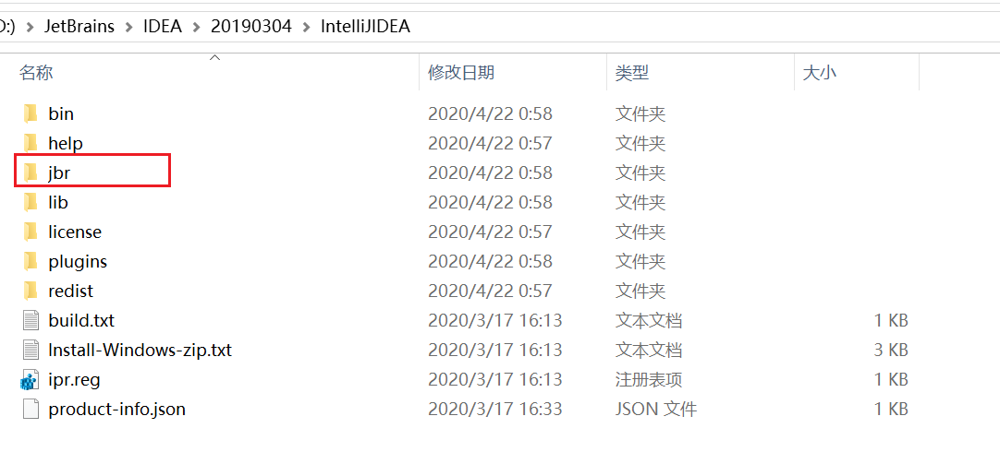
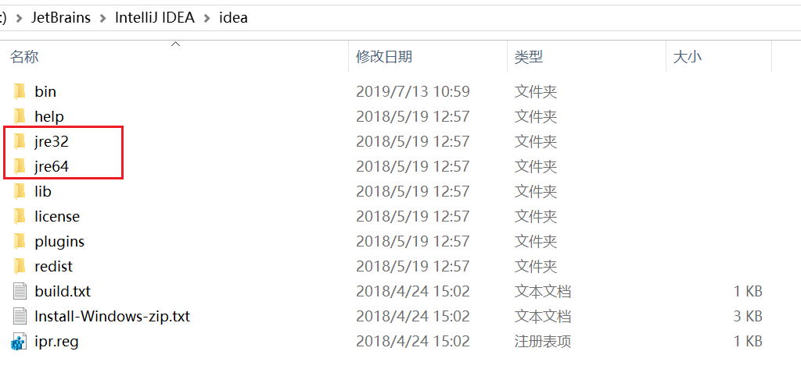

# IntelliJ IDEA 安装目录下的 jbr 目录

 

## 问题

最近下载了 IntelliJ IDEA 的`2019.3.4`版本，创建工程后，忽然发现工程所使用的 JDK 目录不是本机安装的 JDK 目录而是指向 IDEA 的安装目录下的一个 jbr 目录，如下图所示：

## 解释

关于这个目录，jbr 全称为 JetBrains Runtime ，这个目录可以认为是 IDEA 自带的 Java 运行环境，这个目录是 IDEA 一个比较新的变化（不知道从哪个版本开始的），在稍早一点的版本，应该是 jre32/jre64 这两个目录，如下图所示：

所以，在开发之前，最好还是将 IDEA 或者说工程的 JDK 目录调整为自己安装的 JDK 目录。

> [[1] JetBrains Runtime（jbr）的介绍和更改](https://www.thisfaner.com/p/jetbrains-runtime-jbr)
>
> 
>
> [[2] IntelliJ IDEA 之 配置JDK 的 4种方式](https://blog.csdn.net/qq_28289405/article/details/82698856)
