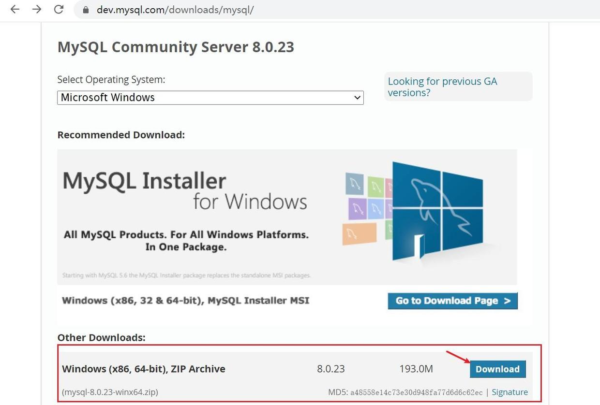
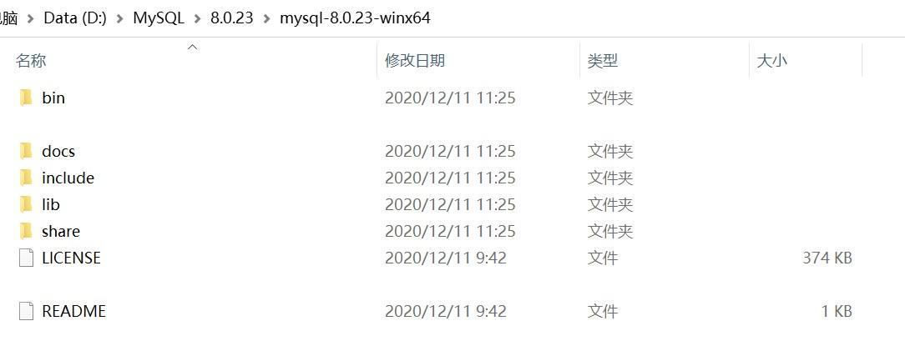
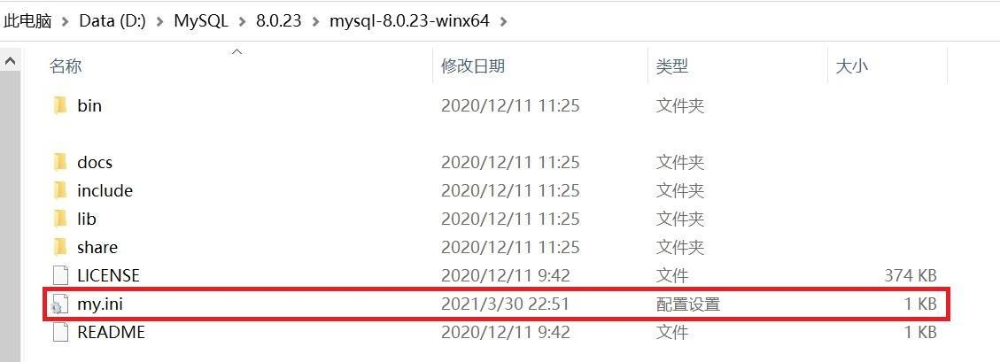
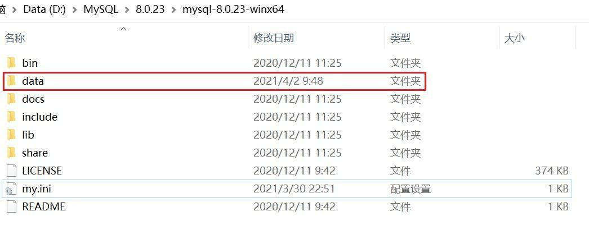
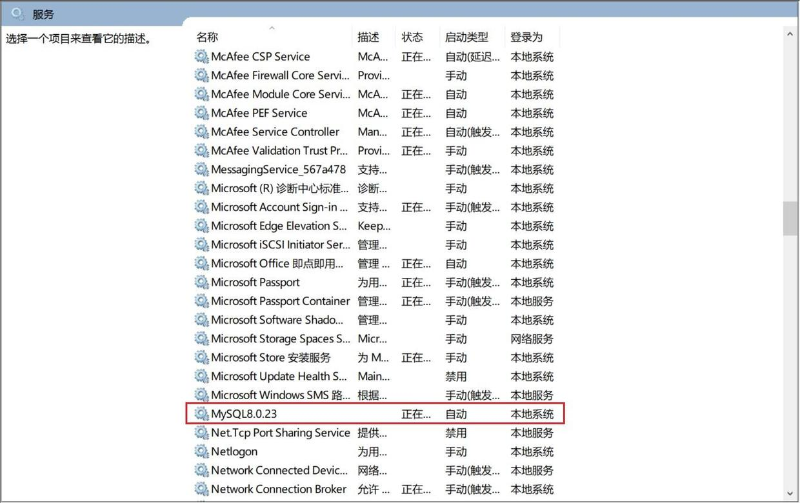
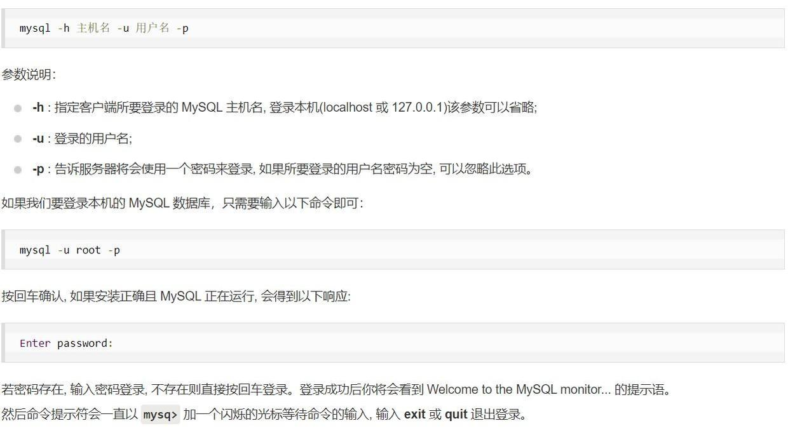

## 1、MySQL 的安装方式

- MySQL 的社区版（MySQL Community）是免费的、开源的，像企业版这些是收费的，学习阶段使用社区版的即可。

- MySQL 社区版在 Windows 10 的安装方式可以分为两种，一种是使用安装程序安装，另一种是使用压缩包安装。个人倾向于使用压缩包安装，因为这种方式安装得到的比较纯净，另外安装的灵活度较大，因为可以安装之前先编写好配置文件。

- 编写此文章时，最新的版本号是`8.0.23`。所以就以安装`8.0.23`为例。

## 2、压缩包安装

- 安装 MySQL 数据库，本质上是“MySQL 服务软件”。

### 2.1、下载压缩包

- 进入 MySQL 社区版下载官网（https://dev.mysql.com/downloads），点击进入`MySQL Community Server`（https://dev.mysql.com/downloads/mysql），如下图：




- 下载后，放入一个空目录（目录名建议纯英文，不含中文、特殊字符、空格等）中，然后解压。举个例子，解压后的形成的目录是`D:\MySQL\8.0.23\mysql-8.0.23-winx64`（`mysql-8.0.23-winx64`是默认解压后得到的目录名即与压缩包名是一致的。可以重命名，更名要求同样建议纯英文，不含中文、特殊字符、空格等，也可以不重命名），如下图：



### 2.2、创建并编写配置文件

- 在解压后的目录下（`D:\MySQL\8.0.23\mysql-8.0.23-winx64`），创建一个名为`my.ini`的配置文件（创建一个文本文件然后直接更改后缀名即可）。



- 使用记事本或其他文本编辑器编辑`my.ini`，编辑为以下内容：

```ini
[client]
port=3306
default-character-set=utf8mb4
[mysql]
default-character-set=utf8mb4
[mysqld]
port=3306
basedir=D:\MySQL\8.0.23\mysql-8.0.23-winx64
datadir=D:\MySQL\8.0.23\mysql-8.0.23-winx64\data
max_connections=200
max_connect_errors=10
character-set-server=utf8mb4
default-storage-engine=INNODB
default_authentication_plugin=mysql_native_password
```

先说明，这个`my.ini`文件中可以配置的项有很多，上面只是个人认为安装阶段必要的，能够确保安装后正常基本的使用。后续如果因像数据库优化等涉及修改`my.ini`，另行补充（修改`my.ini`并使修改后的生效也是有一定步骤的）。

> `[mysqld]`下面的配置均是 MySQL 服务（器）的配置
>
> `port=3306`：MySQL 服务的端口号，一般情况下为3306，如果想在一台电脑上再装一个甚至多个 MySQL 服务的话（比如不同版本的 MySQL），这项配置需要设置为其他的端口号。
>
> `basedir=D:\MySQL\8.0.23\mysql-8.0.23-winx64`：MySQL 的安装路径，这个路径直接使用解压后的路径即可。
>
> `datadir=D:\MySQL\8.0.23\mysql-8.0.23-winx64\data`：MySQL 数据库中的数据存储的位置。
数据库中的数据本质上还是以文件的形式存储在计算机中。
`data`目录是由自己提前创建好的。
关于这个配置项，网上有提出有的版本的 MySQL 反而不需要这个配置项，一旦配置了反而会出错。个人确定的是安装`8.0.23`时配置了该项没有问题，其他的版本无法确定，请自行查阅相关资料。
>
> 
>
> `max_connections=200`：表示允许同时访问 MySQL 服务的最大连接数。其中一个连接是保留的，留给管理员专用的。
>
> `max_connect_errors=10`：表示允许连接失败的次数。这是为了防止恶意攻击数据库。
>
> `character-set-server=utf8mb4`：使用的字符编码，防止出现乱码问题。
`utf8mb4`这个东西比较有意思，常见的字符编码是`UTF-8`，但在 MySQL 中的这个`utf8`并不是真正意义上的`UTF-8`，算是一个历史遗留 BUG，后续通过发布`utf8mb4`进行弥补。推荐使用`utf8mb4`而不是使用`utf8`，比如说，在`utf8`编码下，emoji 表情是无法存储的。
>
> `default-storage-engine=INNODB`：存储引擎，`MySQL 8.0`版本默认的存储引擎是`InnoDB`。
>
> `default_authentication_plugin=mysql_native_password`：使用`mysql_native_password`插件认证。这个感觉目前还是必要的，因为`MySQL 8.0`版本的默认的认证插件是`caching_sha2_password`，这个插件是会阻止客户端登录数据库的，保障安全性，但对一些图形化的数据库管理工具不友好了。

> `[client]`、`[mysql]`下面的配置是对 MySQL 客户端的配置
>
> `port=3306`：客户端通过3306端口与 MySQL 服务器建立连接。
>
> `default-character-set=utf8mb4`：客户端使用的字符编码。

### 2.3、使用命令行安装

- 以管理员的方式运行 Windows 系统中的命令提示符，务必以管理员的方式运行，避免出现因权限而出现的问题。

- 使用`cd`命令，将路径切换至 MySQL 安装目录下的`bin`目录。本文所举的例子，切换到`D:\MySQL\8.0.23\mysql-8.0.23-winx64\bin`目录。

- 使用`mysqld`命令进行相关操作，更多细节可以查看`mysqld`的官方文档`https://dev.mysql.com/doc/refman/8.0/en/mysqld.html`，通过`mysqld --verbose --help`命令可以查看`mysqld`的使用帮助（命令的选项等）。

- 运行命令1-初始化数据库

```
D:\MySQL\8.0.23\mysql-8.0.23-winx64\bin> mysqld --initialize-insecure
```

上面这条命令的作用是：

>  Create the default database and exit. Create a superuser with an empty password.
创建默认的数据库并退出。创建一个密码为空的超级用户（root）。

建议使用这条命令，生成的 root 用户密码为空而不是随机的，方便后续操作，待完成安装之后可以进行重新设置。

---

```
D:\MySQL\8.0.23\mysql-8.0.23-winx64\bin> mysqld -I 
或 
D:\MySQL\8.0.23\mysql-8.0.23-winx64\bin> mysqld --initialize
```

上面这条命令的作用是：

> Create the default database and exit. Create a superuser with a random expired password and store it into the log.
创建默认的数据库并退出。创建一个密码是随机密码的超级用户（root），将生成随机密码存入日志中。

---

```
D:\MySQL\8.0.23\mysql-8.0.23-winx64\bin> mysqld --initialize --console
```

上面这条命令的作用是：

> 创建默认的数据库并退出。创建一个密码是随机密码的超级用户（root），执行该命令后，将生成随机密码直接输出在命令行。

---

没有错误提示，继续进行。

- 运行命令2-安装 MySQL 服务

```
D:\MySQL\8.0.23\mysql-8.0.23-winx64\bin>mysqld --install
```

```
D:\MySQL\8.0.23\mysql-8.0.23-winx64\bin>mysqld --install service_name
```

安装 MySQL 服务的时候，命令`mysqld --install`后是允许跟自定义的服务名的，这个根据实际情况使用，如果为了后续能在一台机子上安装多种版本的 MySQL 这个还是服务名还是建议自定义，方便后期管理。

提示安装成功后，可以在 Windows 服务管理中看到安装的 MySQL 服务：



- 运行命令3-启动已安装的 MySQL 服务

```
D:\MySQL\8.0.23\mysql-8.0.23-winx64\bin> net start mysql_service_name
```

注意，`start`后面跟是“MySQL 服务名”，必须与安装时定义的服务名即`mysqld --install service_name`命令中的`service_name`一致。如果采用`mysqld --install`命令安装，使用的是默认服务名`MySQL`。不确定的话，先查询 Windows 服务管理。

提示启动成功后，继续进行。

- 运行命令4-验证

```
D:\MySQL\8.0.23\mysql-8.0.23-winx64\bin> mysql -u root -p
```



### 2.4、配置环境变量（可选操作）

- 配置环境变量是一个可选步骤，主要目的是为了简化在通过 Windows 命令行使用 MySQL 时候的步骤。

- 如果不选择配置环境变量的话，每次使用 MySQL 的时候，都需先用`cd`命令将路径切换至 MySQL 安装路径下的`bin`目录。对应本文中的所举的例子就是`D:\MySQL\8.0.23\mysql-8.0.23-winx64\bin`。

- 如果不选择配置环境变量，当然也可以通过编写`.bat`等文件方式简化使用`cd`切换至`bin`目录的这一步骤。

- 配置环境变量：

- 1、新建`MYSQL_HOME`变量，变量的值是 MySQL 的安装路径。
对应本文中的所举的例子就是`D:\MySQL\8.0.23\mysql-8.0.23-winx64`。

- 2、编辑`Path`变量，在其中新增一个变量值为`%MYSQL_HOME%\bin`。
如果没有新建`MYSQL_HOME`变量，新增的变量值为 MySQL 安装路径下的`bin`目录的完整路径。对应本文中的所举的例子就是`D:\MySQL\8.0.23\mysql-8.0.23-winx64\bin`。

### 2.5、修改密码

### 2.6、使用图形化工具操作 MySQL

- SQLyog（第三方图形化工具）

- Navicat（第三方图形化工具）

- MySQL Workbench（MySQL 官方推出的图形化工具）
