# Windows 10 安装 RabbitMQ

 

## 1、概述

 

- Windows 版本的 RabbitMQ 主要供初学以及本地调试使用。实际的部署环境中，还是需要在 Linux 系统等这样服务器操作系统中安装 RabbitMQ。
- RabbitMQ 官方提供的安装指南：[Installing on Windows](https://www.rabbitmq.com/install-windows.html)、[Installing on Windows Manually](https://www.rabbitmq.com/install-windows-manual.html)

---

## 2、安装

 

- 手动安装对应的官方安装指南是：[Installing on Windows Manually](https://www.rabbitmq.com/install-windows-manual.html)
- 参考：[https://blog.csdn.net/april_zheng/article/details/122544813](https://blog.csdn.net/april_zheng/article/details/122544813)
- [Installing on Windows](https://www.rabbitmq.com/install-windows.html)、[Installing on Windows Manually](https://www.rabbitmq.com/install-windows-manual.html) 这两个主要差别是，前者使用安装程序，后者使用的是免安装压缩包。

### 2.1、安装 Erlang

- RabbitMQ 是使用并发式语言 Erlang 编写的，所以安装 RabbitMQ 的前提是安装 Erlang 环境。
- RabbitMQ 版本与 Erlang 版本之间有对应的关系，必须遵守。详见：[RabbitMQ Erlang Version Requirements](https://www.rabbitmq.com/which-erlang.html)

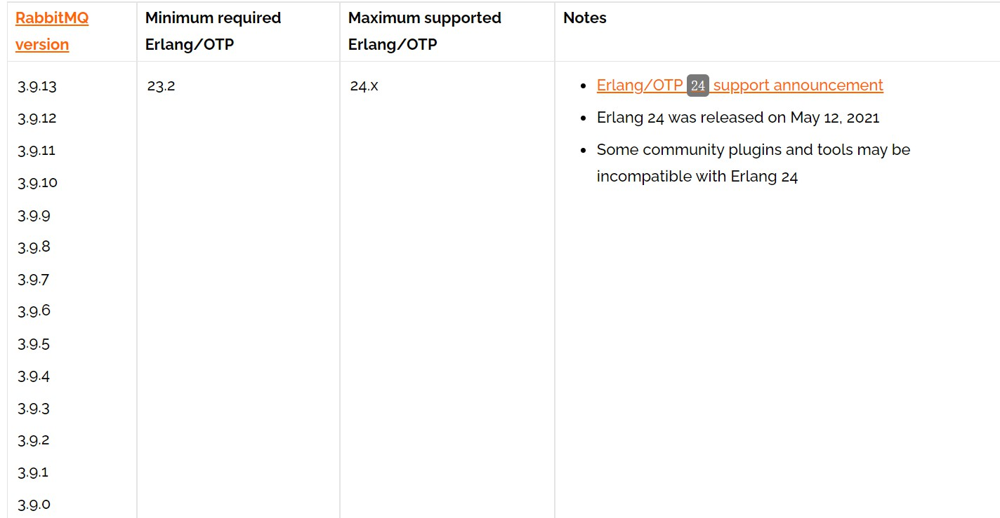

- Erlang 官方网站：[https://www.erlang.org](https://www.erlang.org)
- 下载合适版本的 Erlang 安装程序：[https://www.erlang.org/downloads](https://www.erlang.org/downloads)

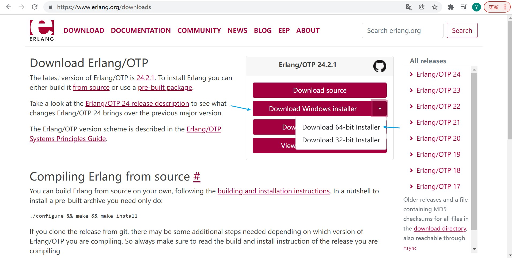

- 1、启动安装程序，依据提示安装 Erlang。基本上“下一步”即可。

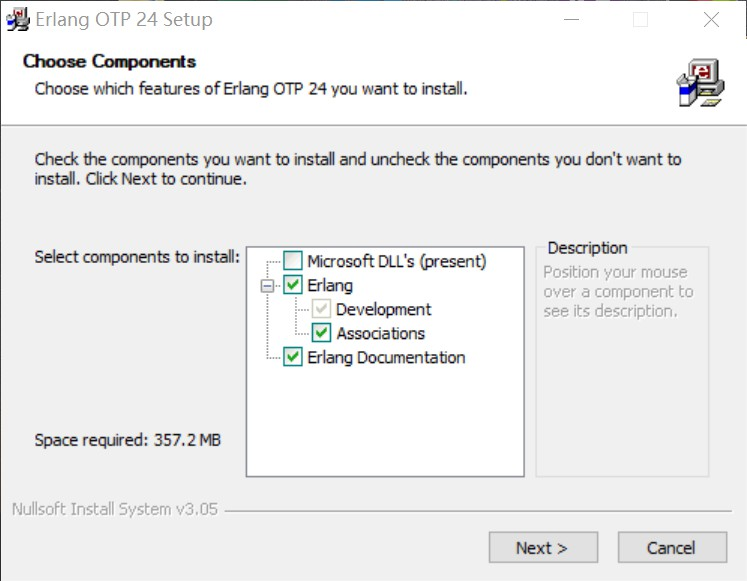

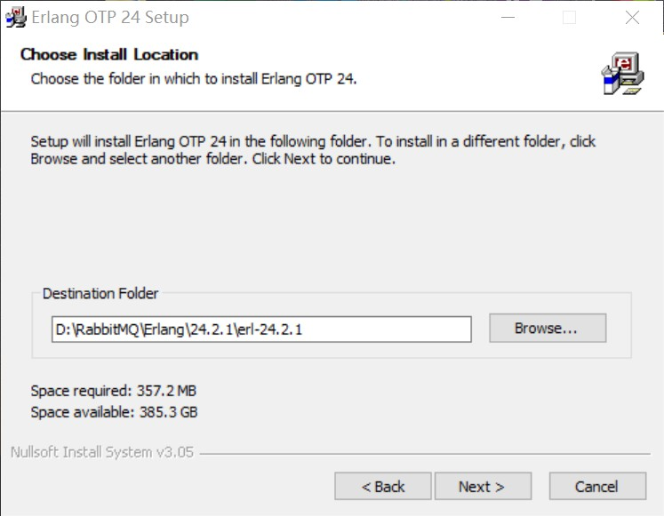

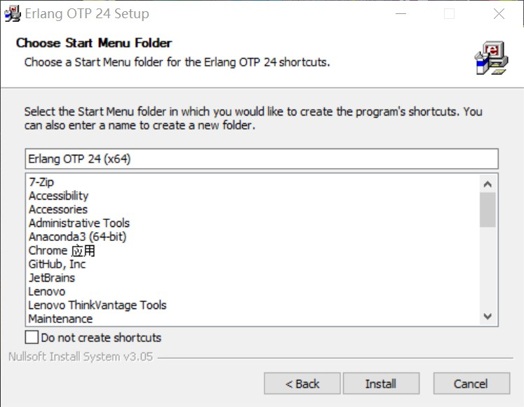

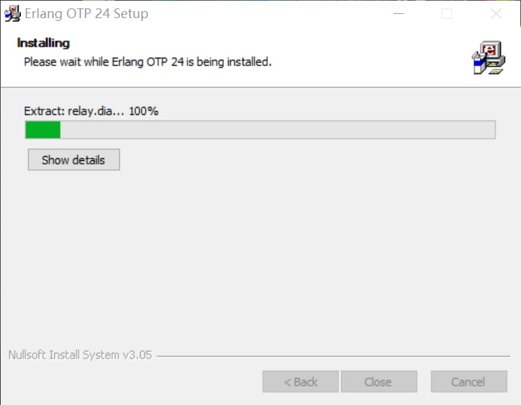

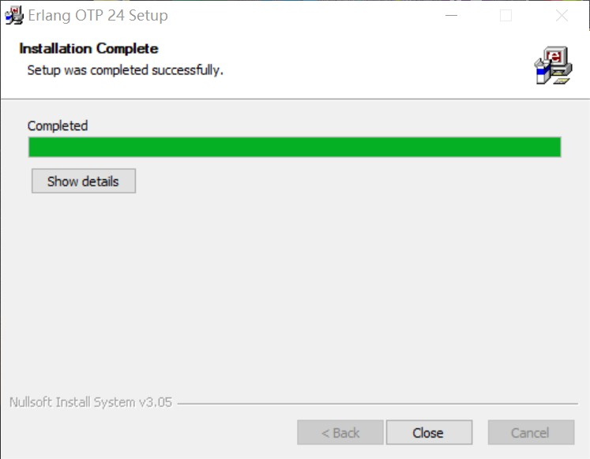

- 2、配置系统环境变量。

> 新建系统环境变量：ERLANG_HOME
>
> 变量名：ERLANG_HOME
>
> 变量值：Erlang 安装的位置

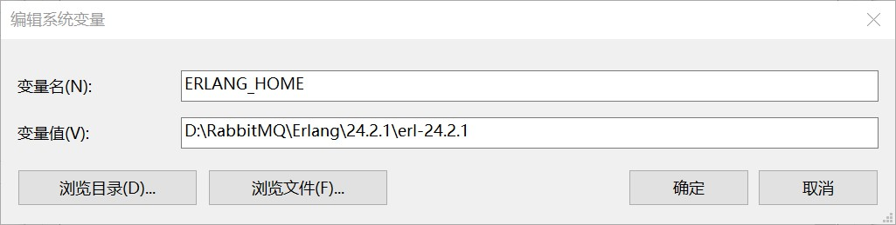

> 添加系统环境变量：path
>
> 变量名：path
>
> 变量值：%ERLANG_HOME%\bin

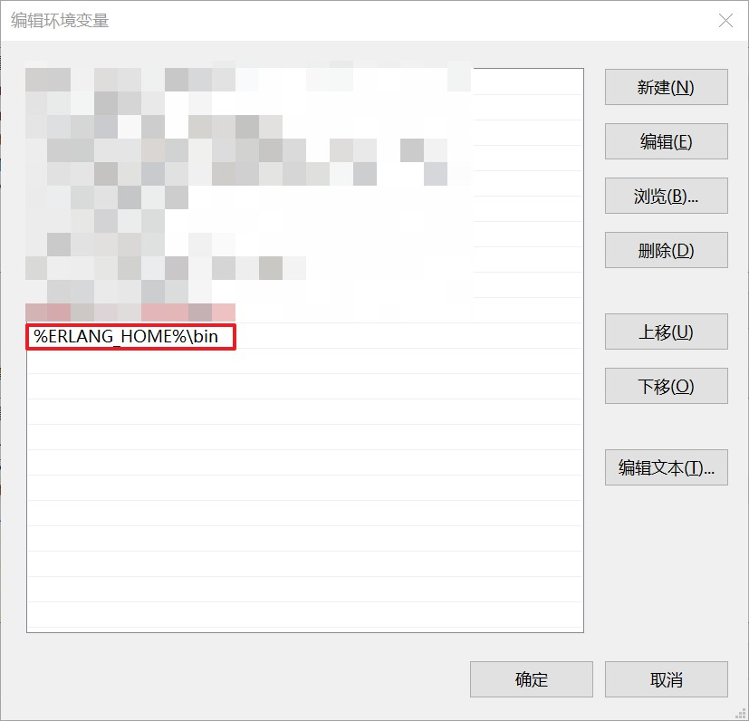

- 3、验证环境变量是否配置成功。打开命令行窗口，输入`erl`，如果输出版本号，说明安装、配置成功。

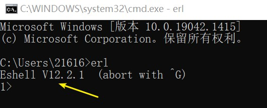

---

### 2.2、安装 RabbitMQ

- 1、RabbitMQ 官网提供了安装程序以及免安装压缩包。建议直接下载“免安装压缩包”，解压后即可使用。

  - 安装程序下载：[https://www.rabbitmq.com/install-windows.html#downloads](https://www.rabbitmq.com/install-windows.html#downloads)

  

  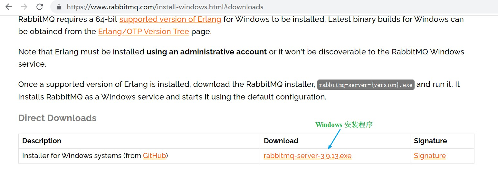

  

  - 免安装压缩包下载：[https://www.rabbitmq.com/install-windows-manual.html#downloads](https://www.rabbitmq.com/install-windows-manual.html#downloads)

  

  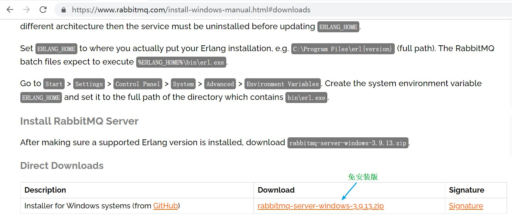

  

  - 免安装压缩包解压后的目录。

  

  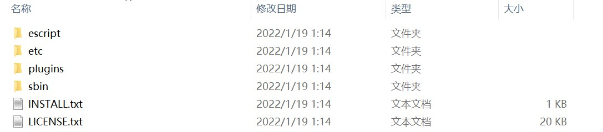

- 2、打开命令行窗口，切换路径至解压后目录中的`sbin`下。然后执行`rabbitmq-plugins enable rabbitmq_management`命令，`rabbitmq_management` 是 RabbitMQ 的管理平台的插件，要开启这个插件才能通过浏览器访问 RabbitMQ 管理页面。

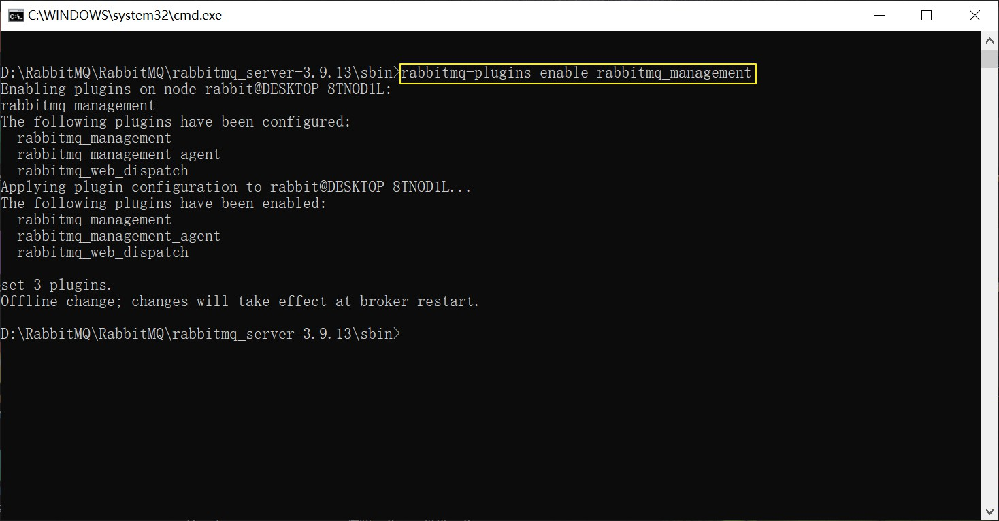

- 3、打开`sbin`目录下的`rabbitmq-server.bat`，启动 RabbitMQ 服务。

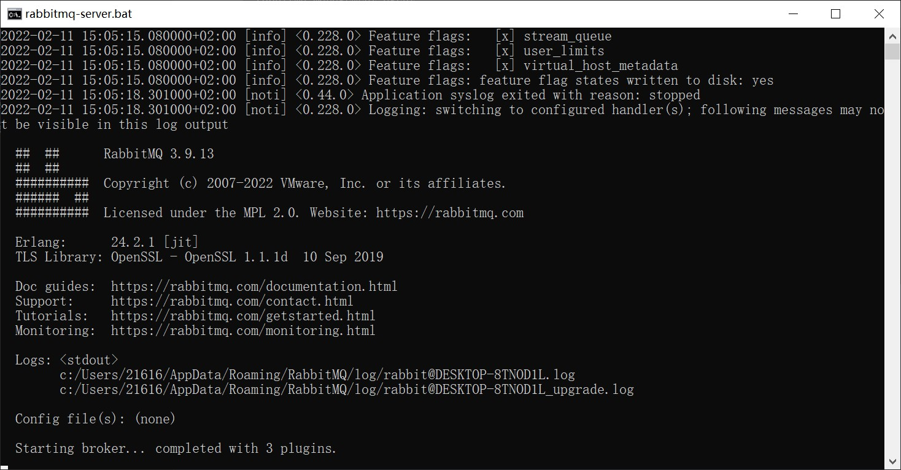

- 4、使用浏览器访问`http://localhost:15672`，如果看到如下页面（RabbitMQ 服务管理平台登录页面），说明 RabbitMQ 安装成功。

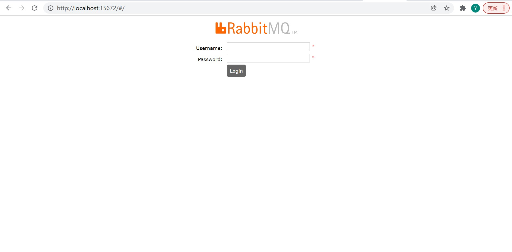

---

### 2.3、RabbitMQ 服务管理平台

- 浏览器访问`http://localhost:15672`，进入 RabbitMQ 服务管理平台的登录页面。
- 默认的账号为`guest`，密码为`guest`。
- 使用默认账号登录后，进入 RabbitMQ 服务的管理平台。

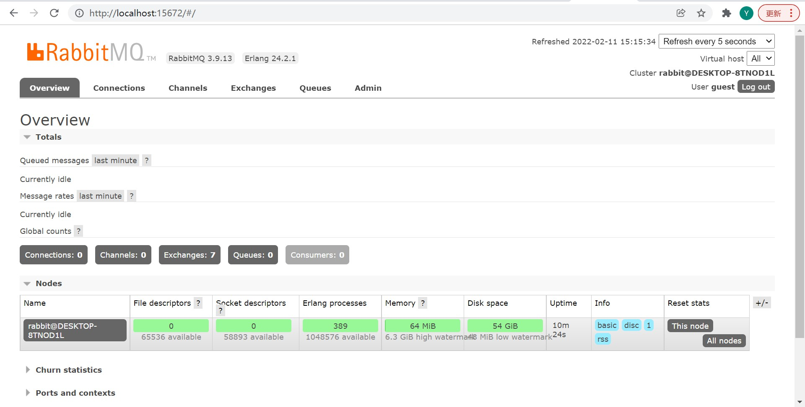