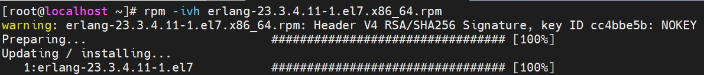
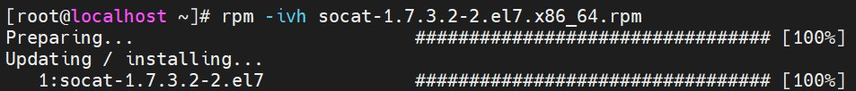
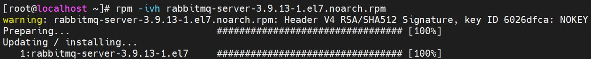
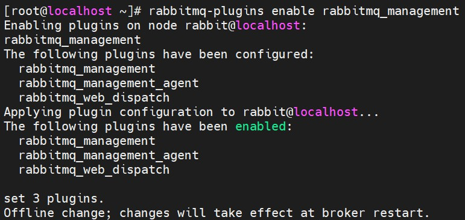
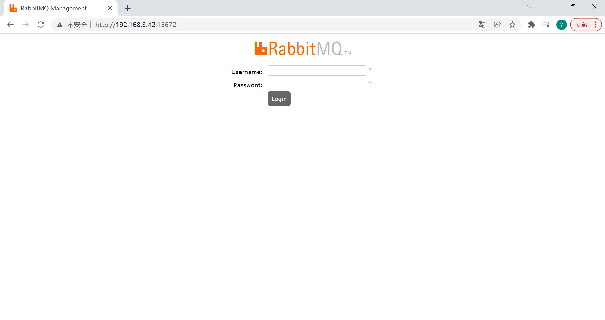
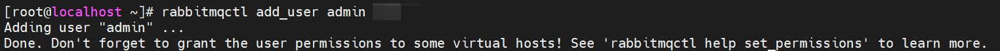
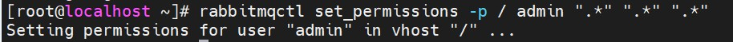
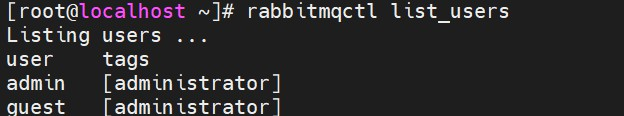
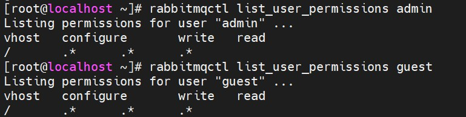
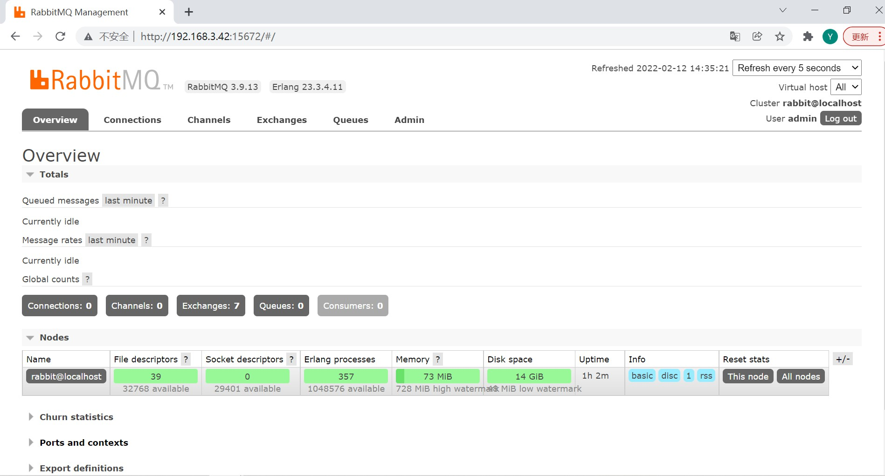

# CentOS 7 RabbitMQ 安装

<br/>

## 1、概述

<br/>

- 官方安装指南：[https://www.rabbitmq.com/install-rpm.html](https://www.rabbitmq.com/install-rpm.html)
- 根据官方安装指南，使用 RPM 包安装 RabbitMQ。提供了两种 RPM 包安装方案，一种是使用`yum`，另一种是使用`rpm`，前者安装方式比较智能，后者安装方式需要自行解决“依赖”问题。

---

## 2、rpm 安装

<br/>

- 使用`rpm`命令安装。
- [https://blog.csdn.net/code_yun/article/details/122849304](https://blog.csdn.net/code_yun/article/details/122849304)
- [https://www.cnblogs.com/delone/p/15800698.html](https://www.cnblogs.com/delone/p/15800698.html)
- [https://blog.csdn.net/qq_43663493/article/details/122719464](https://blog.csdn.net/qq_43663493/article/details/122719464)


### 2.1、下载相关的 rpm 包

- 使用`rpm`命令安装，首先要将所有相关的 RPM 包下载至 Linux 本地。下载至 Linux 本地，可以使用`wget`命令，也可以下载至 Windows 系统后使用文件传输工具上传至 Linux 系统等。
- 安装 RabbitMQ 之前，需要安装的有：Erlang、 Socat。


- 1、下载 Erlang 的 RPM 包并安装。

  - 同 [Windows 10 安装 RabbitMQ](https://yyscyber.github.io/development-environment-and-tools/33f957ea-1d3b-4bb1-a39f-6efd3bedd313) 一样，要注意版本对应情况，版本对应情况参考 [https://www.rabbitmq.com/which-erlang.html](https://www.rabbitmq.com/which-erlang.html)。
  - Erlang 的 RPM 包下载地址：[https://github.com/rabbitmq/erlang-rpm/releases](https://github.com/rabbitmq/erlang-rpm/releases)（这个被称为“Zero-dependency Erlang from RabbitMQ”，是由 RabbitMQ 官方提供的，这里提供的包只保留了 RabbitMQ 所需要的 Erlang 环境）、[https://www.erlang-solutions.com/downloads](https://www.erlang-solutions.com/downloads)（这里提供的包是完整的 Erlang）。
  - 此处使用的是 RabbitMQ 官方提供的 Zero-dependency Erlang from RabbitMQ，因为使用的 Linux 系统是 CentOS 7，所以选择 RPM 包的版本是`erlang-23.3.4.11-1.el7.x86_64.rpm`（根据 RPM 包的命名规则，`el7`表示可以在 CentOS 7.x 安装）。
  - 使用`rpm -ivh`命令安装这个 RPM 包。

  

  ```shell
  # rpm -ivh 命令
  rpm -ivh erlang-23.3.4.11-1.el7.x86_64.rpm
  ```

  

  


- 2、下载 Socat 的 RPM 包并安装。

  - 下载地址：[https://rpmfind.net/linux/RPM/centos/7.9.2009/x86_64/Packages/socat-1.7.3.2-2.el7.x86_64.html](https://rpmfind.net/linux/RPM/centos/7.9.2009/x86_64/Packages/socat-1.7.3.2-2.el7.x86_64.html)
  - 因为使用的 Linux 系统是 CentOS 7，所以选择 RPM 包的版本是`socat-1.7.3.2-2.el7.x86_64.rpm`。
  - 使用`rpm -ivh`命令安装这个 RPM 包。

  

  ```shell
  rpm -ivh socat-1.7.3.2-2.el7.x86_64.rpm
  ```

  

  


- 3、下载 RabbitMQ 的 RPM 包并安装。

  - 下载地址：[https://www.rabbitmq.com/install-rpm.html#downloads](https://www.rabbitmq.com/install-rpm.html#downloads)、[https://github.com/rabbitmq/rabbitmq-server/releases](https://github.com/rabbitmq/rabbitmq-server/releases)
  - 因为使用的 Linux 系统是 CentOS 7，所以选择 RPM 包的版本是`rabbitmq-server-3.9.13-1.el7.noarch.rpm`。
  - 使用`rpm -ivh`命令安装这个 RPM 包。

  

  ```shell
  rpm -ivh rabbitmq-server-3.9.13-1.el7.noarch.rpm
  ```

  

  


---

### 2.2、开启 RabbitMQ 服务的 Web 管理页面


```shell
rabbitmq-plugins enable rabbitmq_management
```





---

### 2.3、启动 RabbitMQ 服务


- 1、为了方便实验，需要先关闭防火墙。


```shell
systemctl stop firewalld
```


- 2、开启 RabbitMQ 服务


```shell
systemctl start rabbitmq-server
```


- 3、浏览器访问`http://${ip}:15672`。如果看到下面的页面，说明 RabbitMQ 服务启动成功。





---

### 2.4、其他基本操作

- 启动 RabbitMQ 服务


```shell
systemctl start rabbitmq-server

systemctl start rabbitmq-server.service

service rabbitmq-server start
```


- 停止 RabbitMQ 服务


```sh
systemctl stop rabbitmq-server

systemctl stop rabbitmq-server.service

service rabbitmq-server stop
```


- 重启 RabbitMQ 服务


```shell
systemctl restart rabbitmq-server

systemctl restart rabbitmq-server.service

service rabbitmq-server restart
```


- 查看 RabbitMQ 服务的状态


```shell
systemctl status rabbitmq-server

systemctl status rabbitmq-server.service

service rabbitmq-server status
```


- 创建用户
  - 由于 RabbitMQ 默认提供的登录 Web 管理平台的账户`guest`，只允许本地登录（当浏览器访问的链接是`http://localhost:15672`，`guest`才能登录），所以为了便于远程管理，要创建一个新的用户并给这个新的用户授予最高权限。


```shell
# user_name 用户名
# user_password 该用户的密码

rabbitmqctl add_user ${user_name} ${user_password}
```





- 设置用户的角色（标识、标签）


```shell
# user_name 用户名
# user_tag 用户角色

rabbitmqctl set_user_tags ${user_name} ${user_tag}
```


- 设置用户的权限


```shell
# vhost 虚拟主机名
# user_name 用户名
# ".*" 最高（所有的）权限（三个方面的权限：configure、write、read）

rabbitmqctl set_permissions -p ${vhost} ${user_name} ".*" ".*" ".*"

# 授予用户 admin 对于虚拟主机 / 的最高（所有的）权限
rabbitmqctl set_permissions -p "/" admin ".*" ".*" ".*"
```





- 查看所有用户


```shell
rabbitmqctl list_users
```





- 查看用户权限


```shell
# user_name 用户名

rabbitmqctl list_user_permissions ${user_name}
```





---

### 2.5、使用新创建的用户登录 Web 管理平台





---

## 3、yum 安装