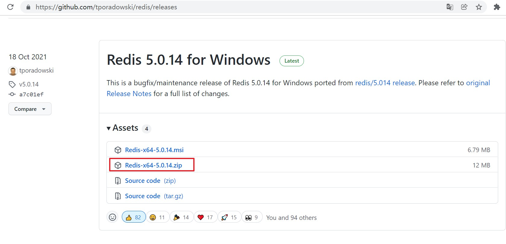
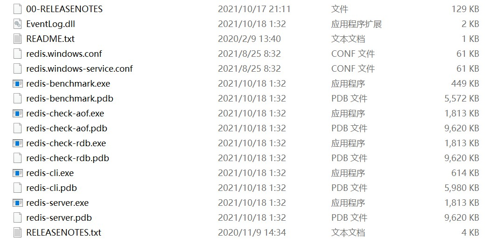
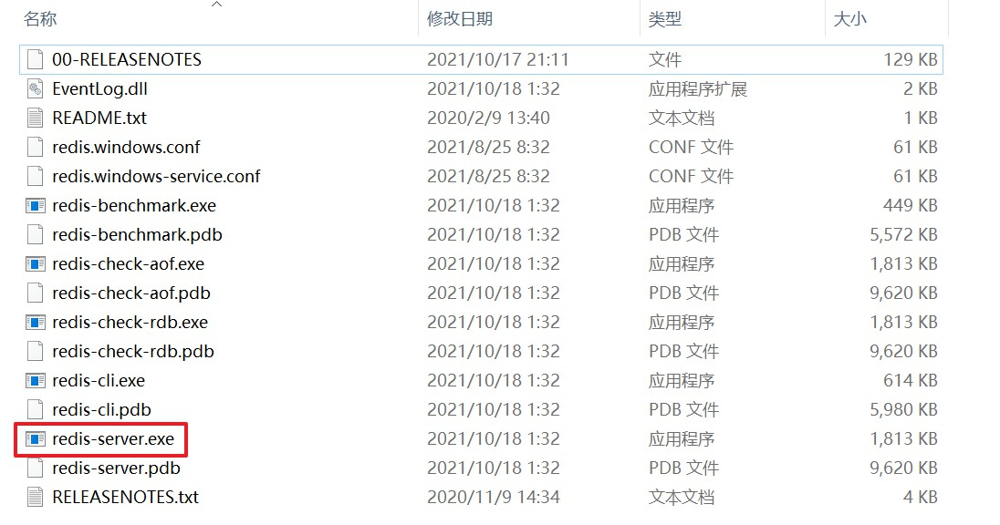
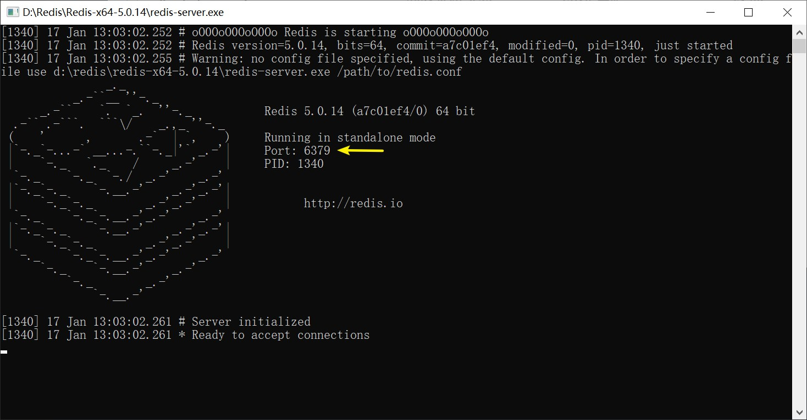
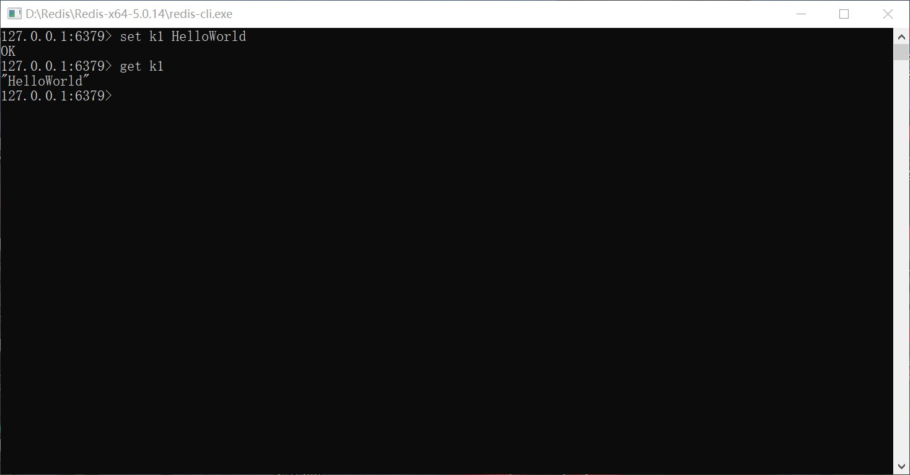

# Windows 10 Redis 安装

 

## 1、概述

 

- 先明确，Redis 官网并没有提供 Windows 版的 Redis，官方提供的版本均是安装在 Linux 系统中的。
- Redis 的 Windows 版本是由一些大牛基于 Redis 官方开源的代码创作出来的，最为经典的是：[https://github.com/tporadowski/redis](https://github.com/tporadowski/redis)
- Windows 版本的 Redis 可供初学以及本地调试使用。实际的部署环境中，还是以官方提供的 Linux 版本为主。

---

## 2、安装

 

- 参考：[https://www.runoob.com/redis/redis-install.html](https://www.runoob.com/redis/redis-install.html) 等

### 2.1、下载压缩包

- 下载地址：[https://github.com/tporadowski/redis/releases](https://github.com/tporadowski/redis/releases)
- 点击下载`.zip`的压缩包即可：

- 解压：

---

### 2.2、安装成功

- 启动 Redis 服务端：打开解压后的目录中的`redis-server.exe`，如果看到下面的窗口，说明 Redis 服务端启动成功。

- 启动**自带**的 Redis 客户端：打开解压后的目录中的`redis-cli.exe`，如果看到下面的窗口，说明 Redis 自带的客户端启动成功。

- 如果上述均成功执行，则说明 Windows 版的 Redis 安装成功。
- 关闭时，先关闭客户端，再关闭服务端。直接将对应的命令行窗口关闭即可。
- 其他的启动方法，见：[https://www.runoob.com/redis/redis-install.html](https://www.runoob.com/redis/redis-install.html)