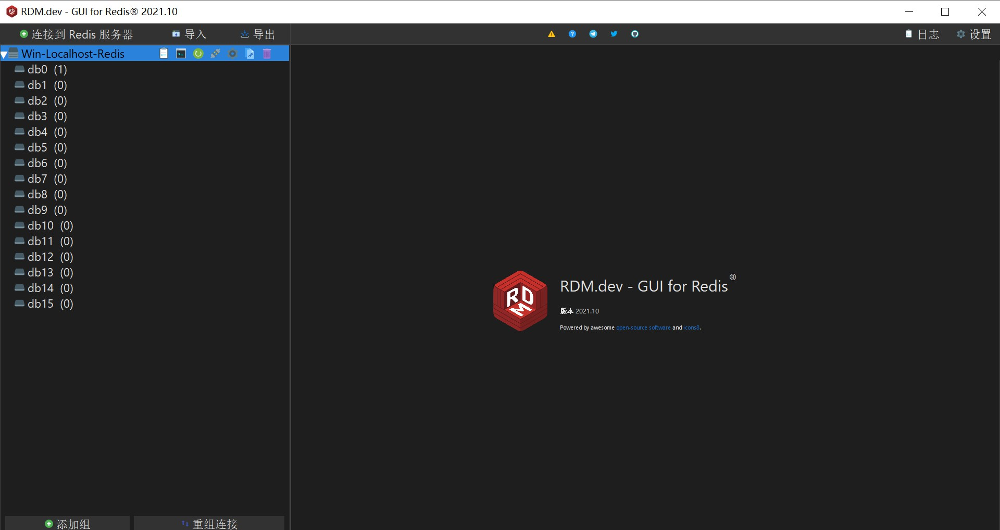

# Windows 10 Redis GUI 工具安装

 

## 1、概述

 

- Redis 与 MySQL 类似，为了方便使用，有一些可视化管理工具。
- Redis 的可视化管理工具有很多，有免费的、开源的，也有收费的。

---

## 2、常见的工具

 

- Redis Desktop Manager（RESP.app）
  - 开源、下载安装包收费
  - GitHub 上 star 最多的 Redis 可视化管理工具
  - 官方网站：[https://resp.app](https://resp.app)
  - GitHub：[https://github.com/uglide/RedisDesktopManager](https://github.com/uglide/RedisDesktopManager)
  - 有免费使用的方法，因为是开源的，所以完全可以通过源码自行编译
  - GitHub 上有用户进行自行编译，然后上传免费安装包的供大家使用的，比如：[https://github.com/lework/RedisDesktopManager-Windows](https://github.com/lework/RedisDesktopManager-Windows)

- Another Redis Desktop Manager
  - 开源、免费
  - GitHub 上 star 仅次于 Redis Desktop Manager（RESP.app）
  - GitHub：[https://github.com/qishibo/AnotherRedisDesktopManager](https://github.com/qishibo/AnotherRedisDesktopManager)

- 还有很多优秀的，不再列举，可以自行到 GitHub、Gitee、搜索引擎等搜索。

---

## 3、安装 Redis Desktop Manager

 

- 从 [https://github.com/lework/RedisDesktopManager-Windows](https://github.com/lework/RedisDesktopManager-Windows) 下载免费的`.exe`安装包。有能力的也可以直接从 [https://github.com/uglide/RedisDesktopManager](https://github.com/uglide/RedisDesktopManager) 下载源码进行编译。
- 下载`.exe`安装包后，点击运行，安装过程就是依次点击“下一步”即可。
- 安装完成后，打开桌面上的快捷方式即可使用。

