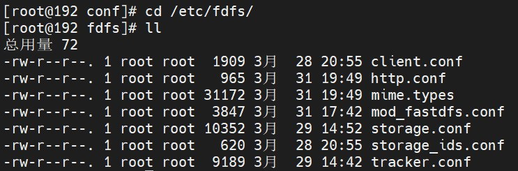
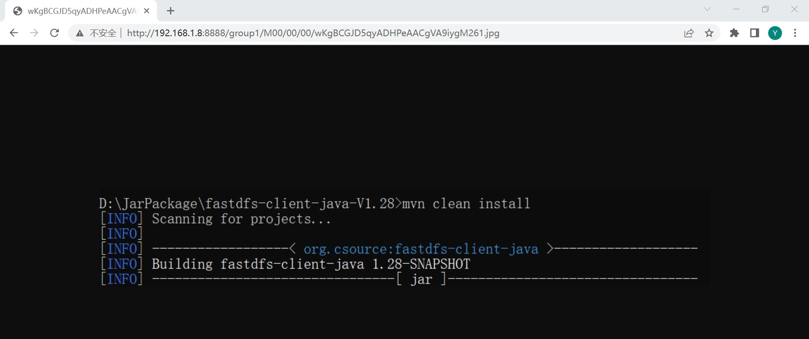

# CentOS 7 FastDFS 安装（2）

> 时间：2022-03-31

<br/>

## 1、概述

<br/>

- 在 [CentOS 7 FastDFS 安装（1）](https://yyscyber.github.io/development-environment-and-tools/ba5fc48b-215d-4045-81b9-a60fe64249e3) 中已经安装了 FastDFS。但是如果希望 FastDFS 在互联网中使用，还需要进行一些准备。
- FastDFS 官方提供了与 Nginx 结合的模块 fastdfs-nginx-module，也就是说 FastDFS 可以通过与 Nginx 结合最终实现文件服务器。
- fastdfs-nginx-module 源码官网：[https://github.com/happyfish100/fastdfs-nginx-module](https://github.com/happyfish100/fastdfs-nginx-module)、[https://gitee.com/fastdfs100/fastdfs-nginx-module](https://gitee.com/fastdfs100/fastdfs-nginx-module)
- fastdfs-nginx-module 安装参考：[https://gitee.com/fastdfs100/fastdfs/wikis](https://gitee.com/fastdfs100/fastdfs/wikis)、[https://github.com/happyfish100/fastdfs/wiki](https://github.com/happyfish100/fastdfs/wiki)
- 这里仍是简单的单机部署，Nginx 与 FastDFS（含 Tracker Server 和 Storage Server）部署在同一台机器上。


|         软件         |           版本号           |
| :------------------: | :------------------------: |
|    libfastcommon     |  1.57（文档编写时主分支）  |
|       FastDFS        | 6.08 （文档编写时主分支）  |
| fastdfs-nginx-module | 1.22（文档编写时的主分支） |
|        Nginx         |           1.20.2           |


---

## 2、准备

<br/>

- 1、安装 FastDFS，参考 [CentOS 7 FastDFS 安装（1）](https://yyscyber.github.io/development-environment-and-tools/ba5fc48b-215d-4045-81b9-a60fe64249e3) 。
- 2、下载 Nginx 源码包，以及安装 Nginx 所需的前置软件，这里暂时不进行 Nginx 安装，参考 [CentOS 7 Nginx 安装](https://yyscyber.github.io/development-environment-and-tools/d0e6e158-3715-40f6-a709-c400d3a547a6)。

---

## 3、安装

<br/>

### 3.1、下载 fastdfs-nginx-module

- 1、使用`git clone`命令从远程仓库下载 fastdfs-nginx-module 的源码。


```shell
git clone https://github.com/happyfish100/fastdfs-nginx-module.git --depth 1

git clone https://gitee.com/fastdfs100/fastdfs-nginx-module.git --depth 1
```


- 2、将下载后的源码移动到合适位置。


```shell
mv ~/fastdfs-nginx-module /usr/local/fastdfs/
```


- 3、将源码中`src`目录下的一个名为`mod_fastdfs.conf`的配置文件拷贝至 FastDFS 一系列配置文件所在的目录`/etc/fdfs`中。


```shell
cp /usr/local/fastdfs/fastdfs-nginx-module/src/mod_fastdfs.conf /etc/fdfs/
```


---

### 3.2、安装 Nginx

- 1、解压 Nginx 源码包。


```shell
tar -zxvf nginx-1.20.2.tar.gz
```


- 2、进入解压后的目录，进行一些安装前的必要的预配置。


```shell
cd nginx-1.20.2

# --prefix：安装路径
# --add-module：fastdfs-nginx-module 中 src 目录的路径
./configure --prefix=/usr/local/fastdfs/nginx/ --add-module=/usr/local/fastdfs/fastdfs-nginx-module/src/
```


- 3、仍是解压后的目录，编译、安装。


```shell
make && make install
```


---

### 3.3、拷贝配置文件

- 将 FastDFS 源码中的`conf`目录下的`http.conf`和`mime.types`拷贝至`/etc/fdfs`目录下。


```shell
cp /usr/local/fastdfs/fastdfs/conf/http.conf /etc/fdfs

cp /usr/local/fastdfs/fastdfs/conf/mime.types /etc/fdfs
```


- `/etc/fdfs`目录下的配置文件。





---

## 4、配置

<br/>

### 4.1、修改`mod_fastdfs.conf`配置文件

- `mod_fastdfs.conf`这一配置文件的作用是对 Nginx 与 FastDFS 结合进行配置。
- 此处仅是对基本的一些配置进行修改。


```shell
# 基础目录，如果没有需提前创建
# the base path to store log files
base_path=/usr/local/fastdfs/fastdfs_data/base

# 配置 Tracker Server
# FastDFS tracker_server can ocur more than once, and tracker_server format is
#  "host:port", host can be hostname or ip address
# valid only when load_fdfs_parameters_from_tracker is true
tracker_server=192.168.1.8:22122

# 配置 Storage Server 端口
# the port of the local storage server
# the default value is 23000
storage_server_port=23000

# 配置 Storage Server 组名
# the group name of the local storage server
group_name=group1

# 提供访问文件的 URL/URI 中是否包含 Storage Server 的组名
# if the url / uri including the group name
# set to false when uri like /M00/00/00/xxx
# set to true when uri like ${group_name}/M00/00/00/xxx, such as group1/M00/xxx
# default value is false
url_have_group_name = true

# path(disk or mount point) count, default value is 1
# must same as storage.conf
store_path_count=1

# store_path#, based 0, if store_path0 not exists, it's value is base_path
# the paths must be exist
# must same as storage.conf
store_path0=/usr/local/fastdfs/fastdfs_data/storage/A
#store_path1=/home/yuqing/fastdfs1
```


---

### 4.2、修改 Nginx 配置文件

- Nginx 的配置文件位于其安装目录中的`conf`目录下，名为`nginx.conf`。
- 参考：[核心配置文件](https://yyscyber.github.io/java/lagou/basic/80d69cce-d3d9-4774-99c2-6b5a486b1858)、[使用 Nginx 实现虚拟主机](https://yyscyber.github.io/java/lagou/basic/dba285e9-3ba9-4470-acca-2010bfdf0b35)、[使用 Nginx 实现反向代理](https://yyscyber.github.io/java/lagou/basic/51ee99c1-7617-4dbd-91ec-973465b5911e)、[常用命令](https://yyscyber.github.io/java/lagou/basic/21bbe5ab-c2ed-4320-a881-b362ed7a659c)
- 此处仅是对基本的一些配置进行修改。


```nginx
server {
    
    # 必须与 /etc/fdfs/storage.conf 中的 http.server_port 配置一致
    listen 8888;
    
    server_name  localhost;
    
    # 此处的编写逻辑暂时不明确
    location ~ /group[0-9]/ {
        # 固定写法
        ngx_fastdfs_module;
    }
    
    error_page   500 502 503 504  /50x.html;
    
    location = /50x.html {
        root   html; 
    }
    
}
```


---

### 4.3、验证

- 1、为了便于验证，关闭防火墙。实际使用中，根据需要配置防火墙。
- 2、启动 FastDFS。


```shell
# 启动 Tracker Server

/usr/bin/fdfs_trackerd /etc/fdfs/tracker.conf start

# 启动 Storage Server

/usr/bin/fdfs_storaged /etc/fdfs/storage.conf start
```


- 3、启动 Nginx。


```shell
# 切换至 Nginx 安装目录下的 sbin 目录
cd /usr/local/fastdfs/nginx/sbin

# 启动 Nginx
./nginx
```


- 4、通过浏览器访问已经成功上传的文件。如果访问到，说明安装、部署成功。

> `http://192.168.1.8:8888/group1/M00/00/00/wKgBCGJD5qyADHPeAACgVA9iygM261.jpg`




