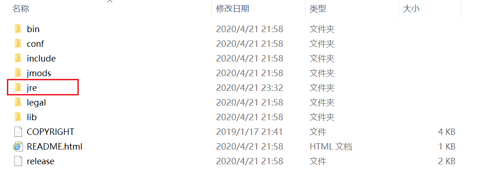

#### 前言

Java 11 是作为 LTS （长期支持）这样的一个版本，今后应该会像 Java 8 那样逐步流行。

#### 安装

1、到官方网站下载。
2、安装（详细的不再展开，可以参考后面的链接），同样，安装路径还是尽量不要含有中文、空格等特殊字符。
3、Java 11 如果采用 exe 进行安装，只会安装 JDK **不会**像 Java 8 那样安装完 JDK 后还会弹出窗口提示安装 JRE 。

#### 环境变量配置

1、尽量在“系统变量”中配置。
2、配置 JAVA_HOME 变量：

```
变量名称：JAVA_HOME
变量值：JDK 安装的路径，例如：D:\Java\11\jdk
```

3、配置 Path 变量（一般情况下在 Path 变量中直接添加即可而不是创建 Path）：

```
变量值：%JAVA_HOME%\bin
```

#### 注意

1、Java 11 在配置上不会像之前的版本上配置那么复杂，像原来的 CLASSPATH 这样的不用再配置，以及原来在 Path 中还需要配置`%JAVA_HOME%\jre\bin`这部分也不需要了。

2、Java 11 默认是不安装 JRE 的，不会影响使用，如果需要 JRE ，解决的方案是以管理员身份进入命令行，切换至 JDK 安装目录，然后执行下面的命令：

```shell
bin\jlink.exe --module-path jmods --add-modules java.desktop --output jre 
```

执行完后，会在 JDK 安装目录下产生出 jre 文件夹，如下图所示：



3、个人遇到的问题，个人之前所安装的版本是 Java 8 然后希望保留这个版本，最开始，根据经验，认为只要改动一下 JAVA_HOME 等即可，但是，修改完毕后，使用`java -version`命令后，显示出来的版本仍是 Java 8 。随后，查了一些资料，发现在 Path 中有一个变量为`C:\Program Files (x86)\Common Files\Oracle\Java\javapath
`，这个变量实际上是之前的 Java 自动更新（因为当时安装 Java 8 后没有将“自动更新”关闭）后自动配置的 Path 变量，并且这个变量的顺序在我们自己配置的`%JAVA_HOME%\bin`之前，所以导致我们配置的 JDK 没有被优先使用。

建议的做法是：将这个环境变量配置直接删除或者将`%JAVA_HOME%\bin`这个变量移动到`C:\Program Files (x86)\Common Files\Oracle\Java\javapath`之前，**最好能关闭自动更新，删除相关更新出来的文件**。
个人倾向于直接删除这个环境变量配置，并且“斩草除根”（该删的删，但删的时候还有谨慎，毕竟是在 C 盘）。如果想退回去使用原来的版本，只需要修改相关的 JAVA_HOME 等这些自己配置的即可。


> 参考：
> [[1] win10配置JDK11(Java SE Development Kit 11)](https://blog.csdn.net/qq_40922859/article/details/88078862)
>
> [[2] jdk11，jdk12，没有jre的解决方法](https://blog.csdn.net/jlq_diligence/article/details/88884945)
>
> [[3] The system cannot find the file C:\ProgramData\Oracle\Java\javapath\java.exe](https://stackoverflow.com/questions/26864662/the-system-cannot-find-the-file-c-programdata-oracle-java-javapath-java-exe)
