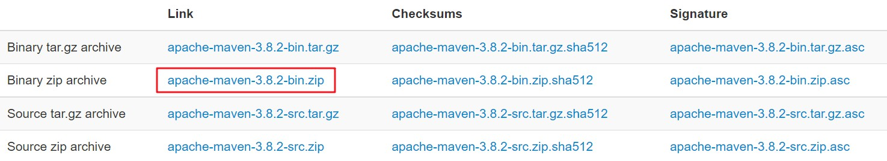
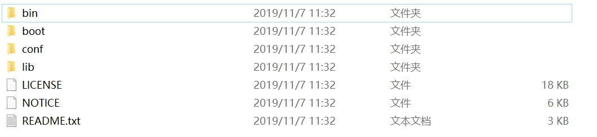

# Windows10 Maven 安装

<br/>

## 1、安装

- 安装前确保已经成功安装 JDK（参考：[Windows10 Java11 安装与配置](https://yyscyber.github.io/development-environment-and-tools/6d1da0cd-3e0d-46cc-98f6-8701be0a397e)），一般要求不低于 JDK 8

- 官方网站：https://maven.apache.org

- 从官网（https://maven.apache.org/download.cgi）下载 zip 压缩包，下载后直接解压。路径中建议不要含中文以及空格等特殊符号。






## 2、配置

<br/>

### 2.1、配置环境变量

- 配置系统环境变量：

> 新建系统环境变量`MAVEN_HOME`：Maven 的安装目录
系统环境变量`Path`中新增：`%MAVEN_HOME%\bin`

> 直接在系统环境变量`Path`中新增：`%Maven 安装目录%\bin`

- 验证：

命令行输入`mvn -version`或`mvn -v`，若输出版本号，则说明环境变量配置成功。


### 2.2、配置国内镜像

- 加快从“远程仓库”下载“依赖”的速度。如果能够科学上网，该步骤可以忽略。

- 国内可供大众使用的 Maven 镜像还是比较多的，各个镜像的官方都会提供镜像的配置方法，按照镜像官方给出的方法配置即可。

- 以配置阿里提供的 Maven 镜像为例（`https://developer.aliyun.com/mvn/guide`）：

打开 Maven 安装目录下的`conf`目录，使用编辑器打开`settings.xml`配置文件。找到`<mirrors></mirrors>`标签，如下所示：

```xml
  <mirrors>
    <mirror>
      <id>maven-default-http-blocker</id>
      <mirrorOf>external:http:*</mirrorOf>
      <name>Pseudo repository to mirror external repositories initially using HTTP.</name>
      <url>http://0.0.0.0/</url>
      <blocked>true</blocked>
    </mirror>
  </mirrors>
```

在`<mirrors></mirrors>`标签中有一个默认的“依赖”源配置即上面所示的`<mirror></mirror>`标签，可以将其注释或直接删除。

在`<mirrors></mirrors>`标签中添加阿里提供的镜像配置：

```xml
<mirror>
  <id>aliyunmaven</id>
  <mirrorOf>*</mirrorOf>
  <name>阿里云公共仓库</name>
  <url>https://maven.aliyun.com/repository/public</url>
</mirror>
```

保存配置文件。


### 2.3、配置本地仓库路径

- 从“远程仓库”获取的“依赖”需要在本地保存，等到“依赖”在第二次被使用时，如果本地存在的话，直接从本地获取，无需再从远程获取，所以要创建一个“本地仓库”。Windows 下 Maven 默认的“本地仓库”会选择在 C 盘，不合适，所以需要重新配置。

- “本地仓库”路径中建议不要含中文以及空格等特殊符号。

- 仍然是修改`settings.xml`这个配置文件。在根标签`<settings></settings>`下可以看到如下注释：

```xml
  <!-- localRepository
   | The path to the local repository maven will use to store artifacts.
   |
   | Default: ${user.home}/.m2/repository
  <localRepository>/path/to/local/repo</localRepository>
  -->
```

根据上面的注释，直接在根标签`<settings></settings>`下使用`<localRepository></localRepository>`标签配置“本地仓库”路径。比如说：

```xml
<localRepository>D:\LocalRepo\maven1</localRepository>
```

保存配置文件。
