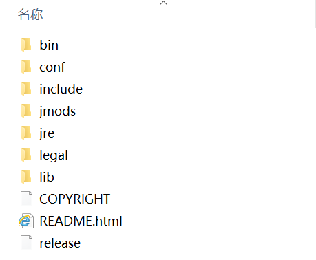

# Java11 JDK 目录

- bin：该目录下主要存放 JDK 的各种工具命令。
- conf：该目录下主要存放 JDK 的相关配置文件。
- include：该目录下主要存放了一些平台的头文件。
- jmods：该目录下主要存放了 JDK 的各种模块。
- legal：该目录下主要存放了 JDK 各模块的授权文档。
- lib：该目录下主要存放了 JDK 工具的一些补充 jar 包和源代码。
