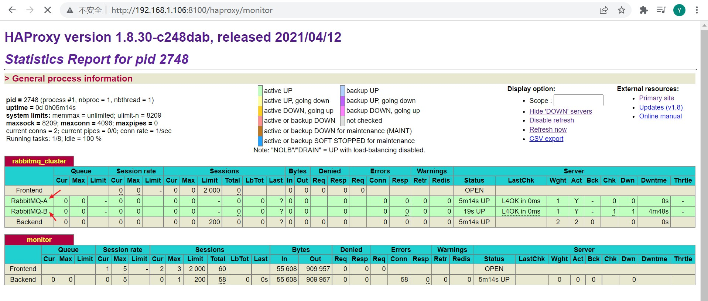

# CentOS 7 HAProxy 安装

<br/>

## 1、下载安装包

<br/>

- 安装包下载网址：[https://www.haproxy.org/#down](https://www.haproxy.org/#down)
- HAProxy 免费、开源的版本为社区版，即 HAProxy Community。
- 这里，要安装的 HAProxy 版本号是`1.8.30`。


---

## 2、安装与配置

<br/>

- 1、解压


```shell
tar -zxvf haproxy-1.8.30.tar.gz
```


- 2、明确当前系统所基于的 Linux 内核版本


```shell
uname -r
```


需要明确内核版本后，才能确定后续编译命令中所使用的参数


Linux 内核`3.x`版本，将使用的参数是`linux2628`


- 3、进入解压后的目录，编译、安装


```shell
cd haproxy-1.8.30
```


```shell
make TARGET=linux2628 PREFIX=/usr/local/haproxy
```


```shell
make install PREFIX=/usr/local/haproxy
```


- 4、安装成功后，可以查看 HAProxy 的版本号


```shell
/usr/local/haproxy/sbin/haproxy -v
```


- 5、配置启动文件：将 HAProxy 安装目录下的`/sbin/haproxy`这一可执行文件拷贝至`/usr/sbin`目录下；将 HAProxy 解压后目录下的`/example/haproxy.init`这一文件，拷贝至`/etc/init.d`目录下，并重命名为`haproxy`，并修改权限


```shell
cp /usr/local/haproxy/sbin/haproxy /usr/sbin/
```


```shell
cp ~/haproxy-1.8.30/examples/haproxy.init /etc/init.d/haproxy
```


```shell
chmod 755 /etc/init.d/haproxy
```


- 6、创建一个系统账号


```shell
useradd -r haproxy
```


- 7、创建`/etc/haproxy`目录，在该目录下，创建`haproxy.cfg`文件


```shell
mkdir /etc/haproxy
```


`haproxy.cfg`内容如下


```
# 全局配置
global
	# 设置日志
	log 127.0.0.1 local0 info
	# 当前工作目录（HAProxy 安装目录）
	chroot /usr/local/haproxy
	# 用户与用户组
	user haproxy
	group haproxy
	# 运行进程ID
	uid 99
	gid 99
	# 守护进程启动
	daemon
	# 最大连接数
	maxconn 4096
	
# 默认配置
defaults
	# 应用全局的日志配置
	log global
	# 默认的模式mode {tcp|http|health}，TCP是4层，HTTP是7层，health只返回OK
	mode tcp
	# 日志类别tcplog
	option tcplog
	# 不记录健康检查日志信息
	option dontlognull
	# 3次失败则认为服务不可用
	retries 3
	# 每个进程可用的最大连接数
	maxconn 2000
	# 连接超时
	timeout connect 5s
	# 客户端超时30秒，HAProxy 就会发起重新连接
	timeout client 30s
	# 服务端超时15秒，HAProxy 就会发起重新连接
	timeout server 15s
	
# 绑定配置
listen rabbitmq_cluster
	# HAProxy
	bind 192.168.1.106:5672
	# 配置TCP模式
	mode tcp
	# 简单的轮询
	balance roundrobin
	# RabbitMQ 集群节点配置，每隔5秒对 MQ 集群做检查，2次正确证明 MQ 服务可用，3次失败证明 MQ 服务不可用
	server RabbitMQ-A 192.168.1.105:5672 check inter 5000 rise 2 fall 3
	server RabbitMQ-B 192.168.1.101:5672 check inter 5000 rise 2 fall 3
	
# HAProxy 监控平台 — Web 页面地址
listen monitor
	bind 192.168.1.106:8100
	mode http
	option httplog
	stats enable
	# 监控 Web 页面地址 http://192.168.1.106:8100/haproxy/monitor
	stats uri /haproxy/monitor
	# Web 页面每5s进行刷新
	stats refresh 5s
```


---

## 3、启动 HAProxy

<br/>

- 1、启动集群中的 RabbitMQ 服务
- 2、启动 HAProxy


```shell
service haproxy start
```


- 3、为便于操作，关于防火墙，访问 HAProxy 的 Web 监控平台




