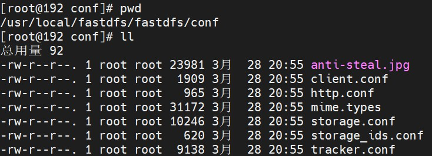
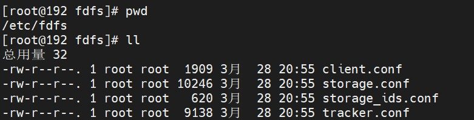

# CentOS 7 FastDFS 安装（1）

> 时间：2022-03-31

<br/>

## 1、概述

<br/>

- FastDFS 官方提供的安装教程：[https://github.com/happyfish100/fastdfs/wiki](https://github.com/happyfish100/fastdfs/wiki)，[https://gitee.com/fastdfs100/fastdfs/wikis/Home](https://gitee.com/fastdfs100/fastdfs/wikis/Home)
- 简单的单机部署，Tracker Server 和 Storage Server 部署在同一台机器上。


|     软件      |              版本号               |
| :-----------: | :-------------------------------: |
| libfastcommon | Version 1.57（文档编写时主分支）  |
|    FastDFS    | Version 6.08 （文档编写时主分支） |


---

## 2、准备

<br/>

- 1、良好的网络，良好的`yum`源。CentOS 7 换国内阿里`yum`源参考 [https://developer.aliyun.com/mirror/centos](https://developer.aliyun.com/mirror/centos)
- 2、使用`yum`命令安装一些必要的前置软件。


```shell
# git 主要是为了获取从远程仓库获取 FastDFS 的源码
yum install -y git

# 像 gcc 等主要是为了对获取到的源码进行编译
yum install -y gcc gcc-c++ 

yum install -y make 

yum install -y automake 

yum install -y autoconf 

yum install -y libtool 

yum install -y pcre pcre-devel 

yum install -y zlib zlib-devel 

yum install -y openssl-devel 

yum install -y wget 

yum install -y vim
```


---

## 3、安装

<br/>

### 3.1、安装  libfastcommon

- 从开源项目 FastDFS 中提取的 C 公共函数库，这个库非常简单和稳定。
- 1、使用`git clone`命令从远程仓库下载 libfastcommon 源码。


```shell
git clone https://github.com/happyfish100/libfastcommon.git --depth 1

git clone https://gitee.com/fastdfs100/libfastcommon.git --depth 1
```


- 2、下载后的源码移动至合适的位置。


```shell
mv libfastcommon /usr/local/fastdfs/
```


- 3、进入源码目录，进行编译、安装。


```shell
cd /usr/local/fastdfs/libfastcommon

./make.sh && ./make.sh install
```


- 4、如果没有报错，则说明安装成功。

---

### 3.2、安装 FastDFS

- 1、使用`git clone`命令从远程仓库下载 FastDFS 源码。


```shell
git clone https://github.com/happyfish100/fastdfs.git --depth 1

git clone https://gitee.com/fastdfs100/fastdfs.git --depth 1
```


- 2、下载后的源码移动至合适的位置。


```shell
mv fastdfs /usr/local/fastdfs/
```


- 3、进入源码目录，进行编译、安装。


```shell
cd /usr/local/fastdfs/fastdfs

./make.sh && ./make.sh install
```


- 4、如果没有报错，则说明安装成功。

---

## 4、配置

<br/>

- 单机部署，非集群。一个 Tracker Server 和一个 Storage Server，部署在同一机器上。仅做一些简单配置。
- 配置文件的样例，在 FastDFS 源码目录下的`conf`目录中。





- FastDFS 配置文件默认在`/etc/fdfs`目录下。正常情况下，成功安装后，`/etc/fdfs`目录以及其内部的配置文件会自动生成。如果没有的话，自行创建`fdfs`目录，再将 FastDFS 源码目录下的`conf`目录中相关配置文件拷贝至`/etc/fdfs`目录下。





### 4.1、配置 Tracker Server

- Tracker Server 对应的配置文件是`tracker.conf`。
- 可以根据实际，修改配置文件。这里给出的仅是基础性的配置。


```shell
# Tracker Server 对外端口，一般使用默认即可
# the tracker server port
port = 22122

# 基础目录，存储日志等基础数据。根据实际情况，需提前创建好
# the base path to store data and log files
base_path = /usr/local/fastdfs/fastdfs_data/base
```


---

### 4.2、配置 Storage Server

- Storage Server 对应的配置文件是`storage.conf`。
- 可以根据实际，修改配置文件。这里给出的仅是基础性的配置。


```shell
# 配置组名
# the name of the group this storage server belongs to
#
# comment or remove this item for fetching from tracker server,
# in this case, use_storage_id must set to true in tracker.conf,
# and storage_ids.conf must be configured correctly.
group_name = group1

# Storage Server 对外端口，一般使用默认即可
# the storage server port
port = 23000

# 基础目录，存储日志等基础数据。根据实际情况，需提前创建好
# the base path to store data and log files
# NOTE: the binlog files maybe are large, make sure
#       the base path has enough disk space,
#       eg. the disk free space should > 50GB
base_path = /usr/local/fastdfs/fastdfs_data/base

# store path (disk or mount point) count, default value is 1
store_path_count = 1

# 虚拟磁盘对应的真实路径，存储文件。根据实际情况，需提前创建好
# 虚拟磁盘 M00 对应的真实存储路径由 store_path0 配置
# 虚拟磁盘 M01 对应的真实存储路径由 store_path1 配置
# store_path#, based on 0, to configure the store paths to store files
# if store_path0 not exists, it's value is base_path (NOT recommended)
# the paths must be exist.
#
# IMPORTANT NOTE:
#       the store paths' order is very important, don't mess up!!!
#       the base_path should be independent (different) of the store paths

store_path0 = /usr/local/fastdfs/fastdfs_data/storage/A
#store_path1 = /home/yuqing/fastdfs2

# 配置 Tracker Server
# 可根据实际，配置多个 Tracker Server
# tracker_server can ocur more than once for multi tracker servers.
# the value format of tracker_server is "HOST:PORT",
#   the HOST can be hostname or ip address,
#   and the HOST can be dual IPs or hostnames seperated by comma,
#   the dual IPS must be an inner (intranet) IP and an outer (extranet) IP,
#   or two different types of inner (intranet) IPs.
#   for example: 192.168.2.100,122.244.141.46:22122
#   another eg.: 192.168.1.10,172.17.4.21:22122

tracker_server = 192.168.1.8:22122
# tracker_server = 192.168.209.122:22122

# Nginx 结合 FastDFS 可提供 Web 服务后，外界访问已上传文件时所使用的端口
# the port of the web server on this storage server
http.server_port = 8888
```


---

### 4.3、启动 FastDFS

- 1、为方便测试，可以关闭防火墙。实际使用中，根据实际情况配置防火墙（开放端口）。


```shell
systemctl stop firewalld.service

systemctl stop firewalld
```


- 2、启动 FastDFS


```shell
# 启动 Tracker Server

/usr/bin/fdfs_trackerd /etc/fdfs/tracker.conf start

# 启动 Storage Server

/usr/bin/fdfs_storaged /etc/fdfs/storage.conf start
```


- 3、停止、重启 FastDFS


```shell
/usr/bin/fdfs_trackerd /etc/fdfs/tracker.conf stop
/usr/bin/fdfs_storaged /etc/fdfs/storage.conf stop

/usr/bin/fdfs_trackerd /etc/fdfs/tracker.conf restart
/usr/bin/fdfs_storaged /etc/fdfs/storage.conf restart
```


