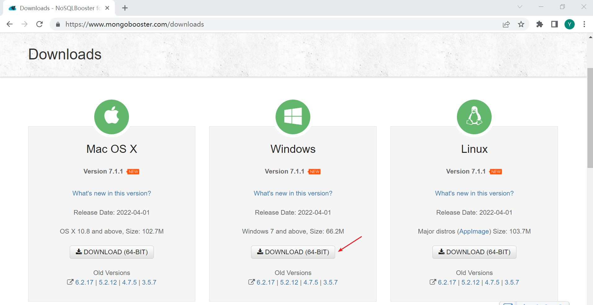

# Windows 10 MongoDB GUI 工具安装

>时间：2022-04-08

 

## 1、概述

 

- 与 MySQL、Redis 一样，MongoDB 也有为了便于用户操作的 GUI 工具。
- 常见的 MongoDB GUI 工具有：
  - MongoDB Compass：MongoDB 官方出品的 GUI 工具。[https://www.mongodb.com/try/download/compass](https://www.mongodb.com/try/download/compass)
  - NoSQLBooster：一款比较流行的 MongoDB 的 GUI 工具。[https://nosqlbooster.com](https://nosqlbooster.com)
  - Navicat Premium：经典的 SQL GUI，也支持连接 MongoDB
  - ······

|      软件       |     版本号      |
| :-------------: | :-------------: |
| MongoDB Compass | 1.31.1 (Stable) |
|  NoSQLBooster   |      7.1.1      |

---

## 2、MongoDB Compass 安装

 

- [https://www.mongodb.com/try/download/compass](https://www.mongodb.com/try/download/compass)
- 可以根据实际，选择下载安装程序（`.msi`）或免安装压缩包（`.zip`）。

- 选择免安装压缩包，解压后，在解压后的目录中双击`MongoDBCompass.exe`，即可使用。

---

## 3、NoSQLBooster 安装

 

- [https://www.mongobooster.com/downloads](https://www.mongobooster.com/downloads)
- 下载安装包（`.exe`文件）。

- 打开安装包之后，自动安装，无需任何操作。

