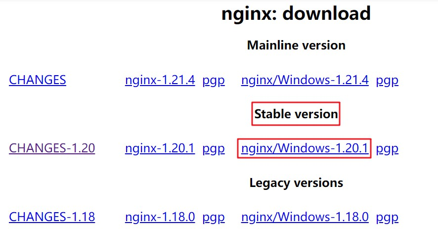
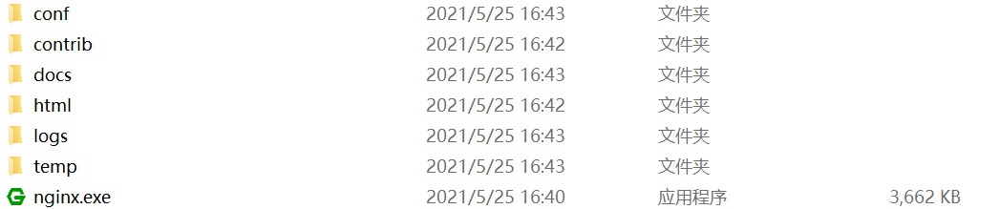

## 1、概述

- Nginx 官网提供了 Windows 版本的 Nginx，[http://nginx.org/en/download.html](http://nginx.org/en/download.html)。

- 一般 Nginx 会被安装在 Linux 这样的服务器操作系统，很少安装在 Windows 操作系统中，并且 Windows 版本可能在功能上比 Linux 版本要少一点。

  Windows 版本更多的使用场景是作为初学者来熟悉 Nginx 以及在开发的时候进行一些简单的测试。

## 2、安装

- 1、从官网下载直接下载 Windows 版本的 Nginx 压缩包。

- 2、解压后，即可使用。

## 3、基本使用

- [http://nginx.org/en/docs/windows.html](http://nginx.org/en/docs/windows.html)
