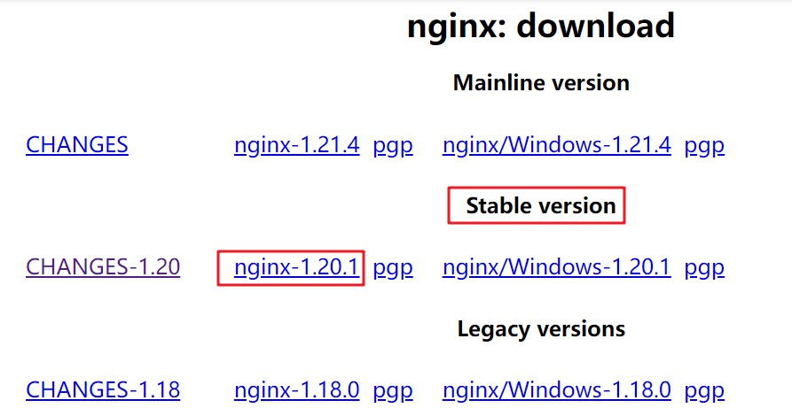
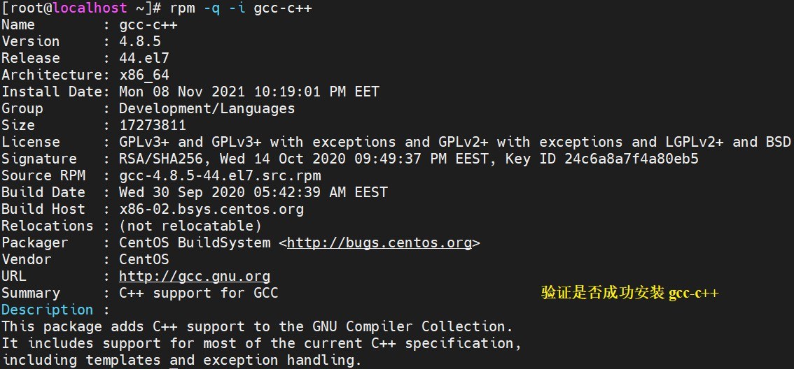
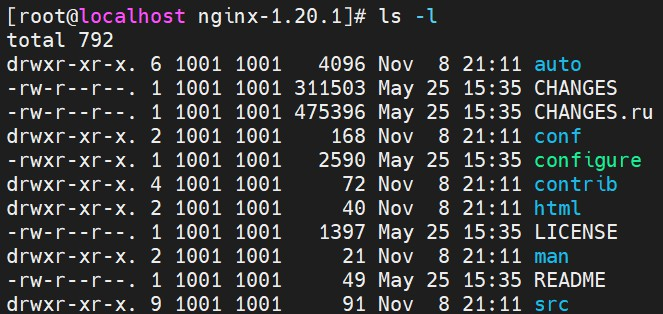
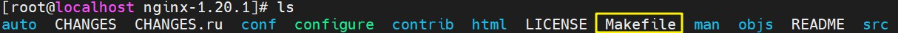
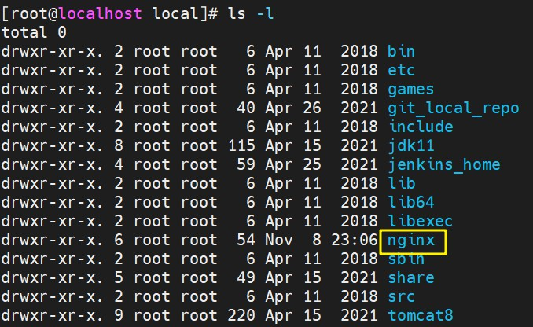
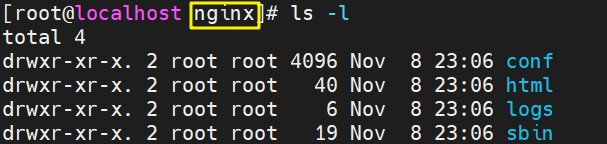
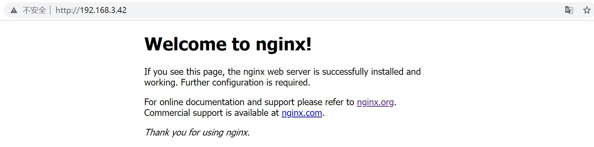

# CentOS7 Nginx 安装

<br/>

## 1、Nginx 源码包安装

<br/>

### 1.1、概述

- Nginx 官网（[http://nginx.org/en/download.html](http://nginx.org/en/download.html)）提供了源码包：




所以，使用源码包在 Linux 中安装 Nginx 是较为常见的。

- 源码包安装流程较为繁琐。

- [https://www.cnblogs.com/skynet/p/4146083.html](https://www.cnblogs.com/skynet/p/4146083.html)


### 1.2、安装步骤

- 1、确保网络正常以及配置了合适的 yum 源（镜像）。

- 2、由于 Nginx 的源码是由 C 语言编写的，需要进行编译，所以需要预先安装 gcc 环境，使用 yum 安装即可

```shell
# 判断 gcc-c++ 是否已经安装

rpm -q -i gcc-c++
```

```shell
# 使用 yum 安装 gcc-c++

yum install -y gcc-c++
```



- 3、安装 PCRE（Perl Compatible Regular Expressions，[https://www.pcre.org](https://www.pcre.org)），使用 yum 安装即可

```shell
yum install -y pcre pcre-devel
```

- 4、安装 zlib（[https://www.zlib.net](https://www.zlib.net)），使用 yum 安装即可

```shell
yum install -y zlib zlib-devel
```

- 5、安装 OpenSSL（[https://www.openssl.org](https://www.openssl.org)），使用 yum 安装即可

```shell
yum install -y openssl openssl-devel
```

- 6、将从官网下载的源码包上传至 Linux 或者使用`wget`命令下载

- 7、解压源码包（任意路径下均可）

```shell
tar -z -x -v -f  nginx-1.20.1.tar.gz
```



- 8、切换路径至解压后形成的目录中（必须），执行`configure`程序，可以根据实际需求比如安装的路径等设置参数

```shell
./configure --prefix=/usr/local/nginx
```

注意，在这个过程中，如果出现错误使用`make clean`命令，解决错误后再重新执行`./configure`。只有成功后才能继续后面的步骤。

成功执行`./configure`后，会在当前目录下出现一个名为`Makefile`的文件



- 9、仍然在当前路径下，依次执行`make`、`make install`命令或者使用`make & make install`这一联合命令。
中途如果出现错误，使用`make clean`命令，解决错误后重新执行`make`或`make install`。
成功执行后，会在安装路径下看到 Nginx 的目录（以`/usr/local/nginx`为例）





- 10、验证安装成功

将防火墙的 80 端口开放供后续使用，然后启动 Ngnix，最后访问`http://{ip_address}`，如果成功看到“Welcome to nginx!”的页面证明安装成功

```shell
# 永久开放 80 端口
firewall-cmd --permanent --add-port=80/tcp

# 重新启动防火墙
service firewalld restart
```

```
# 路径切换到 Nginx 安装目录下的 sbin 目录
cd sbin

# 启动 Nginx
./nginx
```


