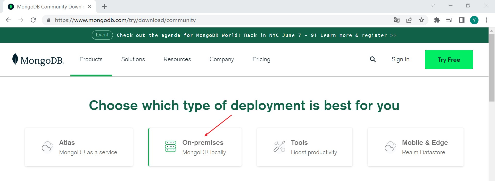
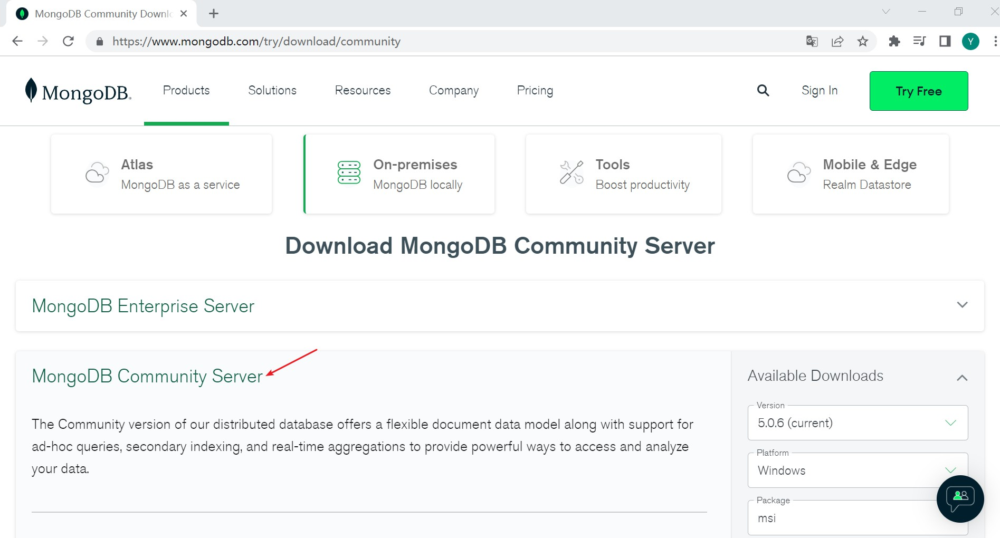
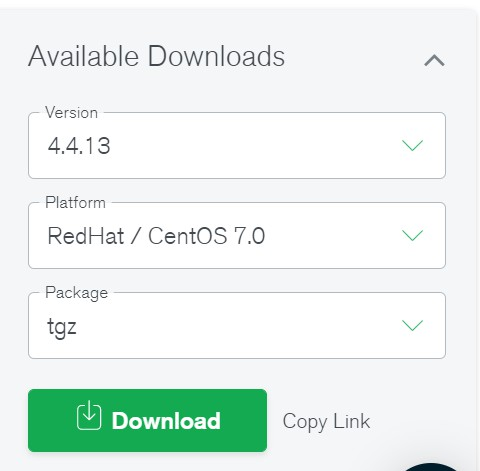
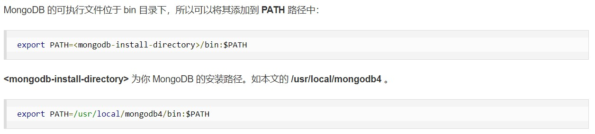
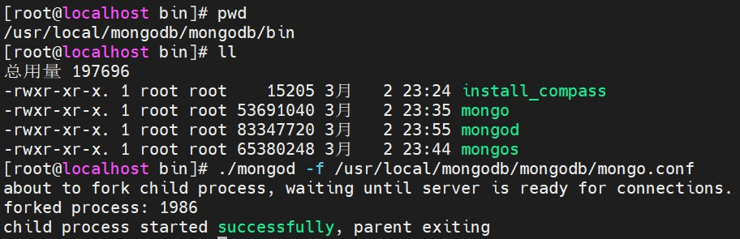
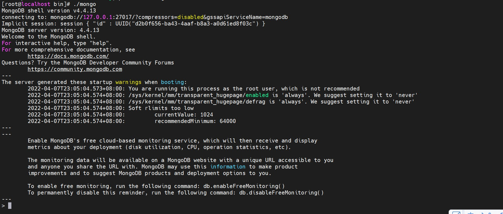
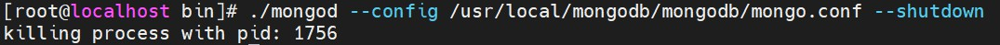

# CentOS 7 安装 MongoDB

> 时间：2022-04-08

<br/>

## 1、概述

<br/>

- 社区版安装包官方下载地址：[https://www.mongodb.com/try/download/community](https://www.mongodb.com/try/download/community)
- MongoDB 社区版免费，企业版付费。


|                      软件                       | 版本号 |
| :---------------------------------------------: | :----: |
| MongoDB (Community Server, RedHat / CentOS 7.0) | 4.4.13 |


---

## 2、下载安装包

<br/>

- 1、[https://www.mongodb.com/try/download/community](https://www.mongodb.com/try/download/community)
- 2、【Choose which type of deployment is best for you】选择【On-premises MongoDB locally】





- 3、【Download MongoDB Community Server】选择【MongoDB Community Server】





- 4、选择要安装 MongoDB 的版本、操作系统、安装包格式，下载安装包。此处下载的安装包信息如下图。





---

## 3、安装

<br/>

- 1、使用`tar -zxvf`命令解压压缩包。


```shell
tar -zxvf mongodb-linux-x86_64-rhel70-4.4.13.tgz
```


- 2、根据实际，将解压后的目录移动到合适的位置。


```shell
mv ~/mongodb-linux-x86_64-rhel70-4.4.13 /usr/local/mongodb/

# 将目录重命名
mv /usr/local/mongodb/mongodb-linux-x86_64-rhel70-4.4.13/ mongodb
```


- 3、创建一个新目录，用于存储 MongoDB 的数据、日志等。


```shell
cd /usr/local/mongodb

mkdir mongodb_data

cd mongodb_data

# 存放数据
mkdir data
# 存放日志
mkdir log

# 创建日志文件
cd log
touch mongodb.log
```


- 4、根据实际，在合适的位置创建 MongoDB 的配置文件`mongo.conf`。


```shell
cd /usr/local/mongodb/mongodb

touch mongo.conf
# 直接 vim mongodb.conf 也可以
```


```shell
# 配置文件 mongodb.conf 内容

# 指定数据存储目录
dbpath=/usr/local/mongodb/mongodb_data/data
# 指定日志文件所在的目录，注意此处必须是日志文件，而不是目录
logpath=/usr/local/mongodb/mongodb_data/log/mongodb.log
# 是否使用追加方式写日志
logappend=true      
# 端口，默认端口号 27017
port=27017
# 是否以守护进程方式运行
fork=true   
# 是否启用验证
auth=false
# 允许访问的 IP
bind_ip=0.0.0.0                           
```


- 5、【可选操作】配置 MongoDB 的系统或针对用户的环境变量。





## 4、基本使用

<br/>

- 1、启动 MongoDB 服务。


```shell
# 没有配置环境变量，需要切换到 bin 目录；如果配置了环境变量，则可以任意目录下使用 mongod 命令

cd /usr/local/mongodb/mongodb/bin

# 指定配置文件
./mongod -f /usr/local/mongodb/mongodb/mongo.conf
./mongod --config /usr/local/mongodb/mongodb/mongo.conf
```





- 2、进入 MongoDB 自带的 Shell（命令行）。


```shell
# 没有配置环境变量，需要切换到 bin 目录；如果配置了环境变量，则可以任意目录下使用 mongo 命令


cd /usr/local/mongodb/mongodb/bin

# 连接本机的 MongoDB 服务
./mongo

# 指定 host 和 port，连接远程的 MongoDB 服务
./mongo --host=192.168.1.9 --port=27017
```





退出的话，直接使用`Ctrl + C`即可。


- 3、关闭 MongoDB 服务。


```shell
# 建议关闭服务时，指定配置文件

cd /usr/local/mongodb/mongodb/bin

./mongod --config /usr/local/mongodb/mongodb/mongo.conf --shutdown
```




