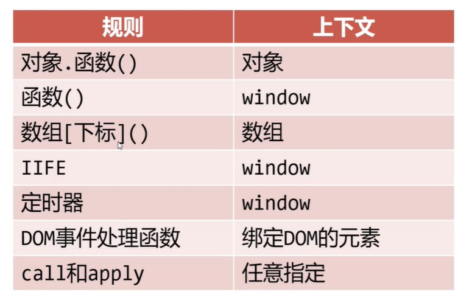

# 上下文

<br/>

## 1、概述

<br/>

- 函数中可以使用`this`关键字，表示函数的上下文。
- 上下文实际上是一种引用，但是这引用具体指的是什么，需要辨明。
- 函数上下文（函数中`this`关键字指的具体是什么）的大体上的原则是，由**调用**函数的方式决定，即“运行时上下文”。如果函数没有被调用，则**不能确定**函数的上下文。

---

## 2、规则1

<br/>

- 规则1：一般情况下，对象中的方法（函数）中如果使用`this`，如果是对象“打点调用方法（函数）”，则`this`这个引用指向的就是**当前**对象；如果“圆括号直接调用函数”，`this`引用指向的就是`window`对象。


```javascript
// 对象打点调用方法（函数）
// this 引用 指向的就是当前对象

var obj = {
    name: "Jerry",
    type: "mouse",
    age: 5,
    friends: ["Tom"],

    introduce() {
        console.log("My name is " + this.name);
    }
};

// My name is Jerry
obj.introduce();
```


```javascript
// 圆括号直接调用函数
// this 引用指向的就是 window 对象

var name = "Tom";

var obj = {
    name: "Jerry",
    type: "mouse",
    age: 5,
    friends: ["Tom"],

    introduce() {
        console.log("My name is " + this.name);
    }
};

// 相当于：window 对象打点调用方法（函数）
var fun = obj.introduce;
// My name is Tom
fun();
```


```javascript
// 虽然函数的定义在对象之外，但是调用函数时仍是对象打点调用方法（函数）
// this 引用 指向的就是当前对象

var a = 1;
var b = 2;

function fun() {
    return this.a + this.b;
}

var obj = {
    a: 3,
    b: 4,

    f: fun
};

// 7
console.log(obj.f());
```


```javascript
// 虽然 obj2 中 fun 函数的定义另一个对象之外，但是调用函数时仍是对象打点调用方法（函数）
// this 引用 指向的就是当前对象，注意是当前的对象，即谁调用的指向谁

var obj1 = {
    a: 1,
    b: 2,

    fun: function() {
        return this.a + this.b;
    }
};

var obj2 = {
    a: 3,
    b: 4,

    fun: obj1.fun
};


console.log(obj1.fun()); // 3
console.log(obj2.fun()); // 7
```


```javascript
// 对象打点调用方法（函数）
// this 引用 指向的就是当前对象

function f() {
    var a = 1;
    var b = 2;

    return {
        a: 3,
        b: 4,

        fun: function() {
            return this.a + this.b;
        }
    };
}

// 函数 f 执行的结果是返回一个对象
console.log(f().fun()); // 7
```


```javascript
// 圆括号直接调用函数
// this 引用指向的就是 window 对象

function f() {
    return this.a + this.b;
}

var obj = {
    a: 1,
    b: 2,
    c: [{
        a: 3,
        b: 4,
        c: f()
    }]
};

// 由于全局中（即 window 对象中）并没有定义 a 和 b
console.log(obj.c[0]); // NaN
```


```javascript
// 对象打点调用方法（函数）
// this 引用 指向的就是当前对象

function f() {
    return this.a + this.b;
}

var obj = {
    a: 1,
    b: 2,
    c: [{
        a: 3,
        b: 4,
        c: f
    }]
};

// obj.c[0] 是一个对象，相当于对象打点调用方法（函数）
console.log(obj.c[0].c()); // 7
```


```javascript
function f() {
    return this.a + this.b;
}

var a = 1;
var b = 2;

var obj = {
    a: 3,
    b: f(), // 圆括号直接调用函数，this 引用指向的就是 window 对象，b 为 1+2=3

    f: f
};

console.log(obj.f()); // 对象打点调用方法（函数），this 引用指向的就是当前对象，3+3=6
```


---

## 3、规则2

<br/>

- 规则2：数组（类数组对象）枚举出函数进行调用，上下文是这样数组（类数组对象）。


```javascript
var arr = ['A', 'B', 'C', function() {
    console.log(this[0]);
}];

arr[3](); // A
```


```javascript
// 类数组对象：可以使用自然数（从0开始）作为索引，并且具有 length 属性
// arguments 是最经典的类数组对象，为函数的实参列表

function f() {
    arguments[3]();
}

f('A', 'B', 'C', function() {
    console.log(this[1]); // B
});
```


---

## 4、规则3

<br/>

- 规则3：IIFE （Immediately-invoked function expression，立即执行函数表达式）中，上下文是`window`对象。
- IIFE：


```javascript
(function() {
    ······ // 函数体
})();

(function(p1, p2) {
    ······ // 函数体
})(1, 2);
```


```javascript
(function() {
    console.log(this === window); // true
})();
```


```javascript
var a = 1;

var obj = {
    a: 2,

    // obj 的 fun 是 IIFE 的执行结果，（返回值）是一个函数
    fun: (function() {
        // 这里，a = 1，因为 IIFE 中，上下文是 window 对象
        var a = this.a;
        return function() {
            // a = 1
            // this.a 只有调用时才能明确
            console.log(a + this.a);
        }
    })()
};

// 对象打点调用方法（函数），this 引用指向的就是当前对象
obj.fun(); // 1+2=3
```


---

## 5、规则4

<br/>

- 规则4：定时器、延时器调用函数（处理函数），上下文是`window`对象。


```javascript
setTimeout(handler_function, time);
setInterval(handler_function, time);
```


```javascript
setTimeout(function() {
    console.log(this === window); // true
}, 1000);

setInterval(function() {
    console.log(this === window); // true
}, 1000);
```


```javascript
var obj = {
    a: 1,
    b: 2,

    f: function() {
        console.log(this.a + this.b);
    }
};

var a = 3;
var b = 4;

setTimeout(obj.f, 2000); // 7
```


```javascript
var obj = {
    a: 1,
    b: 2,

    f: function() {
        console.log(this.a + this.b);
    }
};

var a = 3;
var b = 4;

setTimeout(function() {
    obj.f(); // 这里是对象打点调用方法（函数），this 引用指向的就是当前对象，1+2=3
}, 2000); // 3
```


---

## 6、规则5

<br/>

- 事件处理函数的上下文，是绑定事件的 DOM 元素。


```html
<!-- 使用同一个事件处理函数，使得三个 div 被点击后变色  -->

<!DOCTYPE html>
<html lang="cn-zh">
<head>
    <meta charset="UTF-8">
    <title>JS</title>

    <style>
        div {
            width: 100px;
            height: 100px;
            float: left;
            border: 1px solid #000000;
            margin-right: 10px;
        }
    </style>
</head>
<body>

<div id="box1"></div>
<div id="box2"></div>
<div id="box3"></div>

<script>
    
    // 事件处理函数的上下文，是绑定事件的 DOM 元素
    function clickChangeColor() {
        this.style.backgroundColor = "#FF0000";
    }

    document.getElementById("box1").onclick = clickChangeColor;
    document.getElementById("box2").onclick = clickChangeColor;
    document.getElementById("box3").onclick = clickChangeColor;
</script>
</body>
</html>
```


```html
<!-- 使用同一个事件处理函数，使得三个 div 被点击后延迟1s变色  -->

<!DOCTYPE html>
<html lang="cn-zh">
<head>
    <meta charset="UTF-8">
    <title>JS</title>

    <style>
        div {
            width: 100px;
            height: 100px;
            float: left;
            border: 1px solid #000000;
            margin-right: 10px;
        }
    </style>
</head>
<body>

<div id="box1"></div>
<div id="box2"></div>
<div id="box3"></div>

<script>
    function clickChangeColor() {
        // 由于定时器、延时器调用函数（处理函数），上下文是 window 对象，所以需要先把“事件处理函数”中的 this 提取出来，备份上下文
        // self、that、_this 常常作为备份上下文时的变量名
        var self = this;
        setTimeout(function() {
            self.style.backgroundColor = "#FF0000";
        }, 1000);
    }

    document.getElementById("box1").onclick = clickChangeColor;
    document.getElementById("box2").onclick = clickChangeColor;
    document.getElementById("box3").onclick = clickChangeColor;
</script>
</body>
</html>
```


---

## 7、call 和 apply

<br/>

- call 和 apply 能够指定函数的上下文。


```javascript
// 函数的 call，指定上下文

// 希望得到小明的成绩和
// 需要将 sum 函数中的 this 引用指向对象 xiaoming

function sum() {
    return this.chinese + this.math + this.english;
}

var xiaoming = {
    chinese: 98,
    math: 90,
    english: 94
};

console.log(sum.call(xiaoming));
```


```javascript
// 函数的 call，指定上下文

// call 的第一个参数指定对象引用后，后面的参数为执行函数所需要的参数

function sum(bonus) {
    return this.chinese + this.math + this.english + bonus;
}

var xiaoming = {
    chinese: 98,
    math: 90,
    english: 94
};

console.log(sum.call(xiaoming, 10));
```


```javascript
// 函数的 apply，指定上下文

function sum() {
    return this.chinese + this.math + this.english;
}

var xiaoming = {
    chinese: 98,
    math: 90,
    english: 94
};

console.log(sum.apply(xiaoming));
```


```javascript
// 函数的 apply，指定上下文

// apply 的第一个参数指定对象引用后，后面的参数为执行函数所需要的参数，并且要求是类数组形式

function sum(bonus) {
    return this.chinese + this.math + this.english + bonus;
}

var xiaoming = {
    chinese: 98,
    math: 90,
    english: 94
};

console.log(sum.apply(xiaoming, [10]));
```


---

## 8、总结

<br/>



