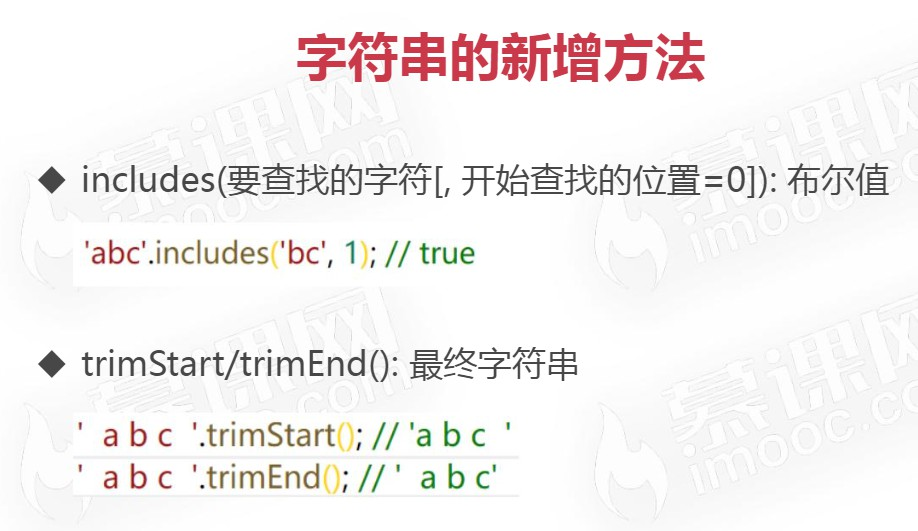
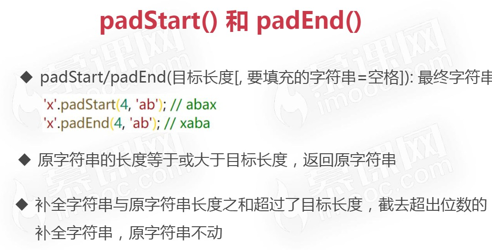
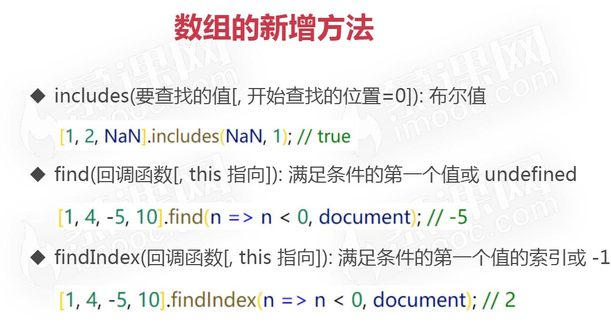
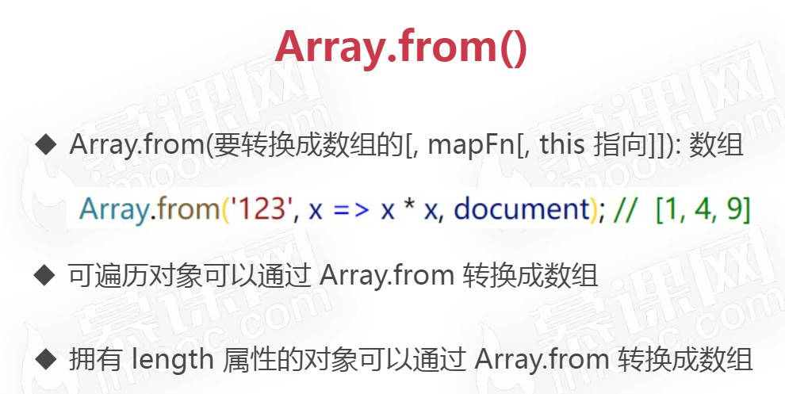
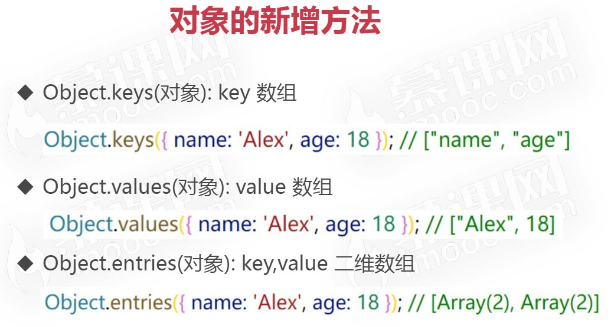
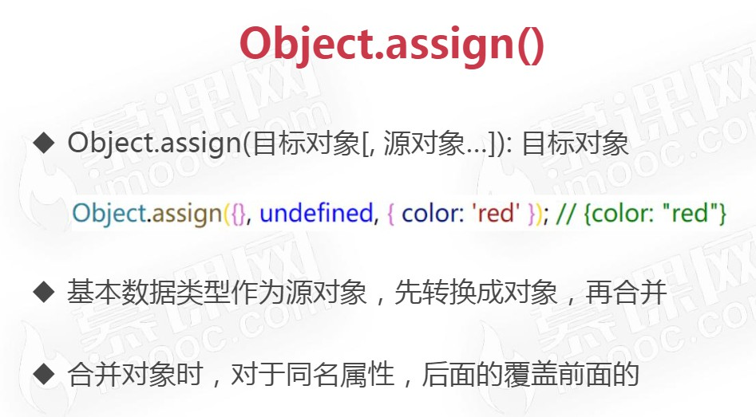

# ES6 常用新增方法

> 时间：2022-05-26

<br/>

## 1、字符串

<br/>







### 1.1、includes


```javascript
// 判断字符串中是否包含某些字符

console.log("abc".includes("a")); // true
console.log("abc".includes("ab")); // true


// 自某个索引开始判断是否包含某些字符
console.log("abc".includes("ab", 0));  // true
console.log("ababc".includes("ab", 2)); // true
```


---

### 1.2、padStart & padEnd


```javascript
// padStart 在头部补充字符串，直至指定长度
// padEnd 在尾部补充字符串，直至指定长度

console.log("x".padStart(3, "ab")); // abx

console.log("x".padStart(2, "ab")); // ax

console.log("x".padStart(5, "ab")); // ababx

console.log("x".padStart(4, "ab")); // abax

console.log("x".padEnd(3, "ab")); // xab

console.log("x".padEnd(2, "ab")); // xa

console.log("x".padEnd(5, "ab")); // xabab

console.log("x".padEnd(4, "ab")); // xaba

// 原字符串的长度，等于或大于 padStart 和 padEnd 方法的第一个参数“最大长度”，不会消减原字符串，字符串补全不生效，返回原字符串

console.log("abc".padEnd(3, "xyz")); // abc

// “用来补全的字符串”与原字符串长度之和超过了最大长度，截去超出位数的“用来补全的字符串”，原字符串不动

console.log("abc".padEnd(10, "0123456789")); // abc0123456

// 如果省略第二个参数即“补全的字符串”，默认使用空格补全长度

console.log("abc".padEnd(4)); // abc （在后面补全一个空格）
```


---

### 1.3、trimStart & trimEnd


```javascript
// trimStart 或 trimLeft 去除字符串首部空格
// trimEnd 或 trimRight 去除字符串尾部空格

console.log(" a b c ".trimStart());
console.log(" a b c ".trimLeft());

console.log(" a b c ".trimEnd());
console.log(" a b c ".trimRight());
```


---

### 1.4、replaceAll


```javascript
// replaceAll 会将字符串中所有匹配的内容替换为指定内容，返回一个新的字符串，不会改变原字符

let s1 = "山东省，江苏省，浙江省";

let s2 = s1.replaceAll("省", "");

console.log(s2); // 山东，江苏，浙江
```


---

## 2、数组

<br/>







### 2.1、includes


```javascript
// 判断数组中是否含有某个元素
// 判断标准是严格相等（===）
// 特殊的是，includes 方法：NaN === NaN

let arr = ["a", "b", "c", 1, 2, 3, NaN];

console.log(arr.includes("a")); // true

console.log(arr.includes("2")); // false

console.log(arr.includes(NaN)); // true

// 自指定索引开始判断是否包含某个元素

console.log(arr.includes("b", 2)); // false
```


---

### 2.2、Array.from


```javascript
// 使用其他数据形式创建数组
// 数组、字符串、Set、Map、NodeList、arguments 等可遍历的可以使用 Array.from 创建数组

let str = "Hello";

let arr = Array.from(str);

console.log(arr);
```


```javascript
// 使用其他数据形式创建数组
// 带有 length 属性的普通对象也能使用 Array.from 创建出数组

let obj = {
    length: 3
};

let arr = Array.from(obj);

console.log(obj); // [undefined, undefined, undefined]

// 对象中属性名是索引值的，数组中对应索引值就是属性值

let obj = {
    0: "a",
    1: "b",
    length: 3
};

let arr = Array.from(obj);

console.log(arr); // ["a", "b", undefined]
```


```javascript
// Array.from 方法的第二个参数
// 作用类似于数组的 map 方法，用来对每个元素进行处理，将处理后的值放入返回的数组

let arr1 = [1, 2];

let arr2 = arr1.map(value => {
    return value * 2; // 数组中的每个元素都乘 2
});

console.log(arr2); // [2, 4]


let str = "12345";

let arr3 = Array.from(str, v => v * 2);

console.log(arr3); // [2, 4, 6, 8, 10]
```


```javascript
// Array.from 方法的第三个参数
// 指定 map 函数中的 this
// 注意，当 map 使用的是箭头函数的形式，第三个参数没有意义；只有使用一般的函数形式，第三个参数才有意义

let str = "12345";

let arr = Array.from(str, function(v) {
    console.log(this === document); // true
    return v * 2;
}, document);

console.log(arr);
```


---

### 2.3、find & findIndex


```javascript
// find 返回数组中第一个符合条件的元素

let arr = [
    {
        id: "0001",
        name: "Zhang San"
    },
    {
        id: "0002",
        name: "Li Si"
    },
    {
        id: "0003",
        name: "Wang Wu"
    }
];

let student = arr.find((value, index, array) => {
    return value.id === "0002"; // 条件
});

console.log(student); // {id: '0002', name: 'Li Si'}
```


```javascript
// findIndex 返回数组中第一个符合条件的元素的索引

let arr = [
    {
        id: "0001",
        name: "Zhang San"
    },
    {
        id: "0002",
        name: "Li Si"
    },
    {
        id: "0003",
        name: "Wang Wu"
    }
];

let studentIndex = arr.findIndex((value, index, array) => {
    return value.id === "0002";
});

console.log(studentIndex); // 1
```


```javascript
// find 和 findIndex 的第一个参数是回调函数（查找条件），第二个参数是指定回调函数中的 this，同样，只有在一般形式的函数写法第二个参数才有效，箭头形式的回调函数使得第二个参数没有意义

let arr = [
    {
        id: "0001",
        name: "Zhang San"
    },
    {
        id: "0002",
        name: "Li Si"
    },
    {
        id: "0003",
        name: "Wang Wu"
    }
];

arr.find(function(value, index, array) {
    console.log(this === document); // true
    return value.id === "0003";
}, document);
```


---

## 3、对象

<br/>







### 3.1、Object.assign


```javascript
// 合并对象

let obj1 = {
    id: "0001",
    name: "Zhang San"
};

let obj2 = {
    gender: "M",
    school: "XXX"
};

let obj3 = Object.assign(obj1, obj2);

console.log(obj3); 
console.log(obj3 === obj1); // 注意，这里是 true
```


```javascript
// 合并对象

let obj1 = {
    id: "0001",
    name: "Zhang San"
};

let obj2 = {
    gender: "M",
    school: "XXX"
};

let obj3 = Object.assign({}, obj1, obj2); // 不在原对象基础上合并，使用空对象

console.log(obj3); 
console.log(obj3 === obj1); // false
```


```javascript
// 合并对象
// 重名的属性会覆盖，后面的覆盖前面的，无论属性是基本数据还是引用数据，重名即覆盖

let obj1 = {
    id: "0001",
    name: "Zhang San",
    address: ["Street 1", "Street 2"]
};

let obj2 = {
    gender: "M",
    school: "XXX",
    id: "0002",
    address: ["Street 3", "Street 4"]
};

let obj3 = Object.assign(obj1, obj2);

console.log(obj3); // id 最终是 0002，address 最终是 ["Street 3", "Street 4"]
```


```javascript
// 合并时有基本数据类型，与对象的展开类似，先转换成对象，再合并
// null、undefined、数值、布尔转换为对象的话是空对象

console.log(Object.assign({}, null)); // {}

console.log(Object.assign({}, undefined)); // {}

console.log(Object.assign({}, 12)); // {}

console.log(Object.assign({}, true)); // {}

console.log(Object.assign({}, "Hello")); // {0: 'H', 1: 'e', 2: 'l', 3: 'l', 4: 'o'}
```


---

### 3.2、Object.keys &  Object.values &  Object.entries


```javascript
// Object.keys：对象中的属性名的数组
// Object.values：对象中的属性值的数组
// Object.entries：对象中属性的数组

let obj = {
    id: "0001",
    name: "Zhang San"
};

console.log(Object.keys(obj)); // ['id', 'name']

console.log(Object.values(obj)); // ['0001', 'Zhang San']

console.log(Object.entries(obj)); // [['id', '0001'], ['name', 'Zhang San']]
```


```javascript
// 遍历
// 注意：for-in 和 使用 for-of 结合 Object.keys/Object.values/Object.entries 对某个对象进行遍历，遍历的顺序可能并不是期望的顺序。如果希望是严格的顺序，则需要编写 Symbol.iterator 方法

let obj = {
    id: "0001",
    name: "Zhang San"
};

for (let k of Object.keys(obj)) {
    console.log(obj[k]);
}

for (let [k, v] of Object.entries(obj)) {
    console.log(k + ": " + v);
}
```
