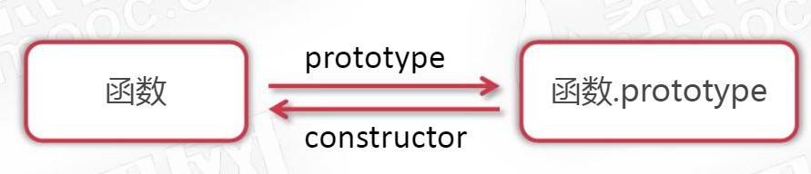
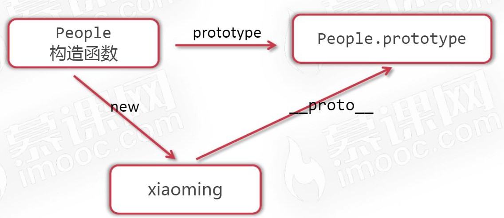
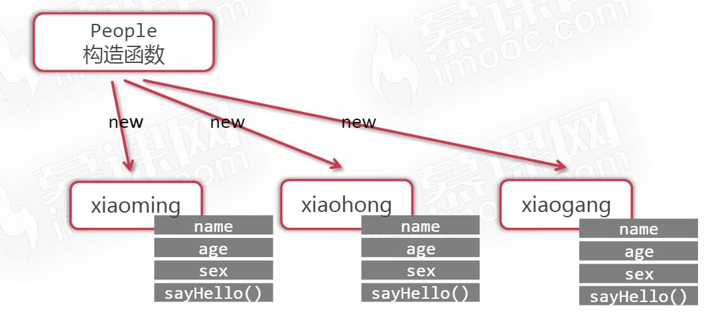
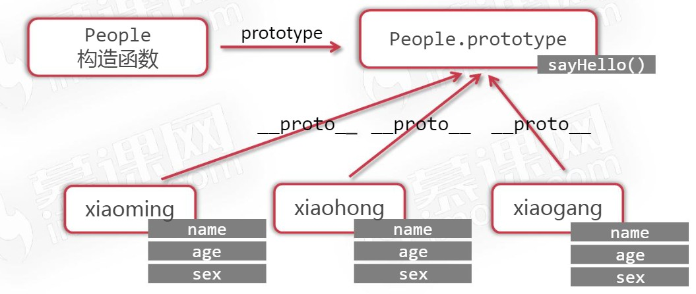
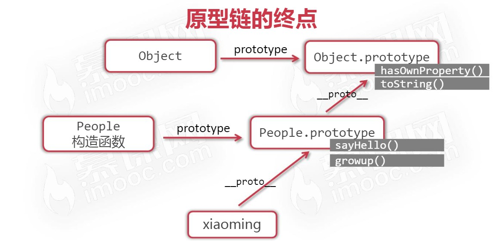
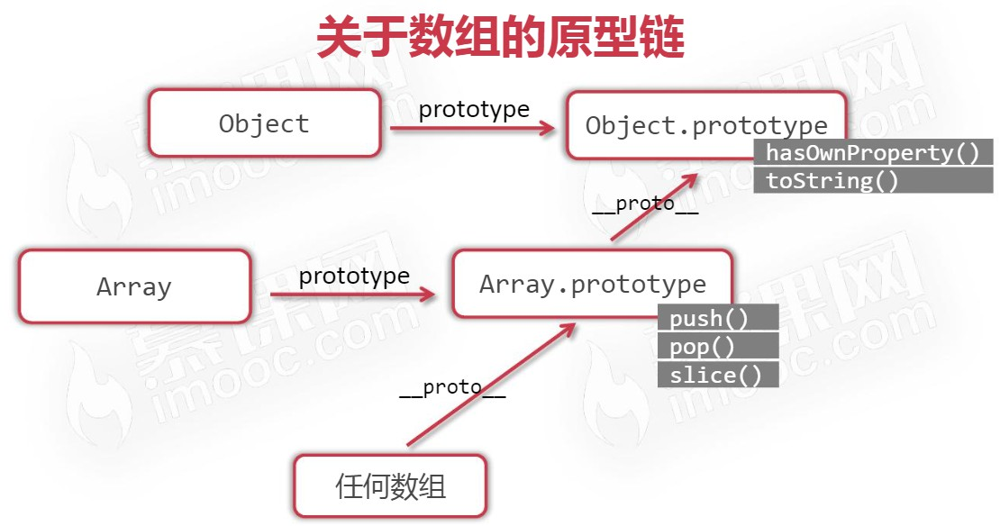

# 原型与原型链

> 时间：2022-04-28

<br/>

## 1、函数的原型

<br/>

- prototype（原型）。所有的 JavaScript 对象都会从一个 prototype（原型对象）中**继承**属性和方法。
- JavaScript 中任何函数都有 prototype 这一属性。函数的 prototype 属性的值是一个对象。


```javascript
function f() {
    console.log("Hello World!");
}

console.log(f.prototype);
console.log(typeof f.prototype); // object
```


- 函数的 prototype 属性的值是一个对象，在该对象中，默认会有一个 constructor 属性，该属性又指向当前函数。


```javascript
function f() {
    console.log("Hello World!");
}

console.log(f === f.prototype.constructor); // true
```





---

## 2、构造函数的原型

<br/>

### 2.1、概述

- 构造函数的 prototype 属性是**其实例的原型**。





- 通过构造函数可以创建新的对象，新对象的原型是构造函数的原型。
- 上图中的`__proto__`如今已经从相关的 Web 标准中删除，虽然仍有浏览器支持。另外，并不是说因为有了`__proto__`，才能保证“对象的原型是构造函数的原型”。“对象的原型是构造函数的原型”这一机制是一直存在的。


```javascript
function People(id, name) {
    this.id = id;
    this.name = name;
}

var p = new People("0001", "Tom");

console.log(p.__proto__ === People.prototype); // true
```


---

### 2.2、原型链查找

- 任何对象（实例）可以打点访问**其原型**中的属性和方法，这个过程可以称为“原型链查找”。有一个并不是很恰当的类比（因为存在差异），“JavaScript 中构造函数的原型有点‘类似’于 Java 中类的静态”。


```javascript
function People(id, name) {
    this.id = id;
    this.name = name;
}

People.prototype.nationality = "CHN";

var p = new People("0001", "Tom");

console.log(p.nationality); // CHN
```


- 当对象本身的属性或方法会对其原型中的**同名**属性或方法进行“屏蔽”。


```javascript
function People(id, name) {
    this.id = id;
    this.name = name;
}

People.prototype.nationality = "CHN";

var p = new People("0001", "Tom");
p.nationality = "RUS";

console.log(p.nationality); // RUS
```


---

### 2.3、hasOwnProperty

- hasOwnProperty 方法可以检查当前对象是否是真正“自己拥有”某个属性或方法。


```javascript
function People(id, name) {
    this.id = id;
    this.name = name;
}

People.prototype.nationality = "CHN";

var p = new People("0001", "Tom");
p.nationality = "RUS";

console.log(p.hasOwnProperty("nationality")); // true
```


```javascript
function People(id, name) {
    this.id = id;
    this.name = name;
}

People.prototype.nationality = "CHN";

var p = new People("0001", "Tom");

console.log(p.hasOwnProperty("nationality")); // false
```


---

### 2.4、原型中的方法

- 一些情况下，方法直接写在实例中，会造成内存的浪费。


```javascript
function People(id, name) {
    this.id = id;
    this.name = name;
    this.sayHello = function() {
        console.log("My name is " + this.name);
    }
}

var p1 = new People("0001", "Tom");
var p2 = new People("0002", "Jack");

p1.sayHello();
p2.sayHello();
```





- 将方法写在原型中，避免内存空间的浪费。


```javascript
function People(id, name) {
    this.id = id;
    this.name = name;
}

People.prototype.sayHello = function() {
    console.log("My name is " + this.name);
};

var p1 = new People("0001", "Tom");
var p2 = new People("0002", "Jack");

p1.sayHello(); // My name is Tom
p2.sayHello(); // My name is Jack
```





---

### 2.5、原型链的终点

- 构造函数的原型，是一个对象。这个对象的**最终**的原型是`Object.prototype`。
- 在 JavaScript 中，几乎所有的对象都是 Object 类型的实例。[https://www.runoob.com/js/js-objects.html](https://www.runoob.com/js/js-objects.html)


```javascript
function People(id, name) {
    this.id = id;
    this.name = name;
}

console.log(People.prototype.__proto__ === Object.prototype); // true

console.log(Object.prototype.__proto__); // null，所以 Object 的 prototype 是原型链的终点
```





- 关于 JavaScript 的数组的原型链。


```javascript
arr = [];

console.log(arr.__proto__ === Array.prototype); // true

console.log(Array.prototype.__proto__ === Object.prototype); // true

console.log(Object.prototype.__proto__); // null
```


