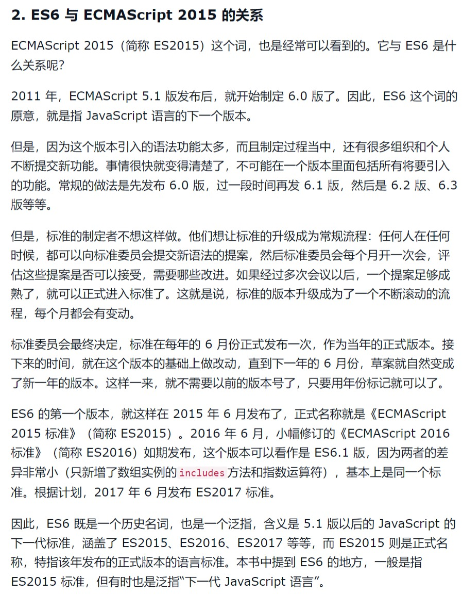

# 概述

> 时间：2022-05-03

 

## 1、ECMAScript

 

- JavaScript 是前端重要的语言。ECMAScript 是一种前端脚本语言的标准，简称 ES，JavaScript 是 ECMAScript 标准的一种实现。

- ECMAScript 这套标准是在不断更新的，其目的是为了使得前端脚本语言 JavaScript 也能够像后端那样，形成“前端开发框架”，使得前端开发更便利。

- 目前主流的前端框架像 Vue.js、React、Angular 等，都需要基于 ECMAScript 的语法等。

- ECMA 是一个标准化组织，全称是“European Computer Manufacturers Association”（目前该组织已更名为“Ecma International”，即“Ecma”属于一种专用词汇，不再代表缩写）。

  1996 年 11 月，JavaScript 的创造者 Netscape 公司，决定将 JavaScript 提交给标准化组织 ECMA，希望这种语言能够成为国际标准。

  次年，ECMA 发布 262 号标准文件（ECMA-262）的第一版，规定了浏览器脚本语言的标准，并将这种语言称为 ECMAScript，这个版本就是 ECMAScript 的 1.0 版。

- ECMA-262 标准官网：[https://www.ecma-international.org/publications-and-standards/standards/ecma-262](https://www.ecma-international.org/publications-and-standards/standards/ecma-262)

- ECMAScript 标准的制订小组称为“TC39”，各大浏览器厂商会参与其中。标准的实现最终还是需要依靠各大浏览器厂商。由于各个浏览器发展情况不同，所以可能会出现**不同的浏览器在实现 ES 方面存在差异**。 差异的详细情况：[https://kangax.github.io/compat-table/es6](https://kangax.github.io/compat-table/es6)

---

## 2、ECMAScript 与 JavaScript

 

- [https://es6.ruanyifeng.com/#docs/intro](https://es6.ruanyifeng.com/#docs/intro)

---

## 3、ES6

 

- ES6，是 ECMAScript 这一标准的第6版，简称是 ES6，于2015年正式发布。ES6 这一版本可以认为是一个具有里程碑意义的版本。
- 由于 ES6 这一版本具有里程碑式的意义，是一代新的标准，使得 ES6 在某些时候不单单指的是“第6版”这一个版本，**ES6 这一词可以泛指 ES5.1 之后的版本**。已经被广泛应用。
- ES6 与 ECMAScript 2015 的关系：

- ES6 兼容性问题：ES6 已经被主流浏览器厂商普遍支持。如果使用较老版本的浏览器，不支持 ES6，可以通过 Babel 这一转码器进行转码，即可以用 ES6 的方式编写程序，待转码后，在较老版本的浏览器中使用。

---

## 4、浏览器的 JavaScript

 

- 浏览器的 JavaScript = ECMAScript + DOM + BOM