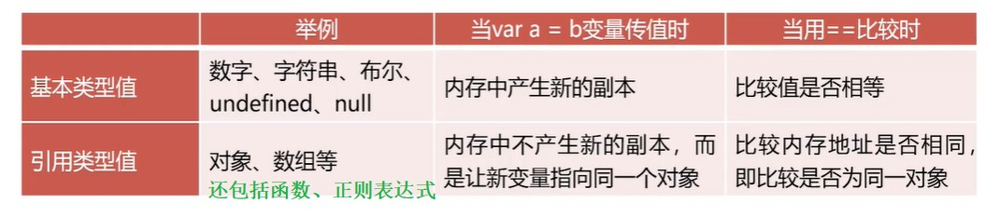

# 对象

<br/>

## 1、基础

<br/>

- JavaScript 中的对象（Object），是“键值对”的集合。
- JavaScript 中对象是一种数据类型，并且是引用数据类型。
- JavaScript 对象中一个“键值对”，可以称之为“属性”，“键”可以称为“属性名”，“值”可以称为“属性值”。

---

## 2、基本语法

<br/>

- 对象使用`{}`包裹。
- 每个键与值之间使用`:`分隔，每一个键值对之间用`,`分隔。对象中最后一个键值对后可以不书写`,`。


```javascript
{
    k1: v1,
    k2: v2,
    k3: v3
}
```


- 对象中的键名，如果不符合 JavaScript 标识符命名规范，则键名必须使用`""`或`''`包裹。

---

## 3、属性

<br/>

- 正常情况，使用`.`访问（获取）对象中指定键的值。


```javascript
var obj = {
    name: "Jerry",
    type: "mouse"
};

console.log(obj.name);
console.log(obj.type);
```


- 如果不符合 JavaScript 标识符命名规范，必须使用`[]`访问（获取）对象中指定键的值。


```javascript
var obj = {
    name: "Jerry",
    type: "mouse",
    
    // 不符合 JavaScript 标识符命名规范
    "favorite-food": "cheese"
};

console.log(obj["favorite-food"]);
```


- 如果使用**变量**来存储键名，必须使用`[]`访问（获取）对象中指定键的值。


```javascript
var obj = {
    name: "Jerry",
    type: "mouse",
};

var keyName = "name";

console.log(obj[keyName]);
```


- 直接使用赋值运算符`=`，可以重新对某属性重新赋值，即修改。


```javascript
var obj = {
    name: "Jerry",
    type: "mouse",
    age: 5
};

obj.age++;

// 6
console.log(obj.age);
```


- 如果对象本身没有某个属性，使用`.`或`[]`，属性会添加至对象中。


```javascript
var obj = {
    name: "Jerry",
    type: "mouse",
    age: 5
};

obj.skills = ["Anything"];
obj["address"] = "Anywhere";

console.log(obj);
```


- 删除对象中的属性，使用`delete`操作符。


```javascript
var obj = {
    name: "Jerry",
    type: "mouse",
    age: 5
};

delete obj.age;

console.log(obj);
```


---

## 4、方法

<br/>

- 对象中可以有函数，称为“方法”。


```javascript
var obj = {
    name: "Jerry",
    type: "mouse",
    age: 5,

    play: function() {
        console.log("Play with Tom.");
    }
};
```


- 使用`.`调用对象中的方法。


```javascript
var obj = {
    name: "Jerry",
    type: "mouse",
    age: 5,

    play: function() {
        console.log("Play with Tom.");
    }
};

obj.play();
```


---

## 5、遍历

<br/>

- 使用`for-in`可以遍历对象中的每个**键**。


```javascript
var obj = {
    name: "Jerry",
    type: "mouse",
    age: 5,

    play: function() {
        console.log("Play with Tom.");
    }
};

for (var k in obj) {
    console.log(k);
    console.log(obj[k]);
}
```


---

## 6、浅克隆与深克隆

<br/>

- 基本类型与引用类型：





- 对象是引用类型，`=`赋值操作变量仍然指向的是同一个对象。这种操作不是“克隆”。“克隆”指的是产生一个“副本”，但是这个“副本”是完全独立的（与原始数据处在不同的内存空间）。


```javascript
var obj = {
    name: "Jerry",
    type: "mouse",
    age: 5,

    play: function() {
        console.log("Play with Tom.");
    }
};

var obj1 = obj;

obj.age++;

console.log(obj1.age); // 6
```


- 浅克隆：只克隆对象的“表层”。如果对象中存在属性值为引用类型，则不会进一步执行克隆，只是进行简单赋值（传递引用）。使用`for-in`即可实现浅克隆。


```javascript
var obj1 = {
    name: "Jerry",
    type: "mouse",
    age: 5,
    friends: ["Tom", "Tuffy"]
};

var obj2 = {};

for (var k in obj1) {
    obj2[k] = obj1[k];
}

console.log(obj1 === obj2); // false
console.log(obj1.friends === obj2.friends); // true，浅克隆
```


---

- 深克隆：完全克隆，对象中的引用类型也将进行克隆。使用递归实现深克隆。


```javascript
// 深克隆函数
function deepClone(obj) {
    var result;
    if (Array.isArray(obj)) {
        result = [];
        for (var i = 0; i < obj.length; i++) {
            result.push(deepClone(obj[i]));
        }
    } else if (typeof obj === "object") {
        result = {};
        for (var k in obj) {
            result[k] = deepClone(obj[k]);
        }
    } else {
        result = obj;
    }
    return result;
}
```


```javascript
function deepClone(obj) {
    var result;
    if (Array.isArray(obj)) {
        result = [];
        for (var i = 0; i < obj.length; i++) {
            result.push(deepClone(obj[i]));
        }
    } else if (typeof obj === "object") {
        result = {};
        for (var k in obj) {
            result[k] = deepClone(obj[k]);
        }
    } else {
        result = obj;
    }
    return result;
}


var obj1 = {
    name: "Jerry",
    type: "mouse",
    age: 5,
    friends: ["Tom", "Tuffy"]
};

var obj2 = deepClone(obj1);

console.log(obj1);
console.log(obj2);
console.log(obj1 === obj2);
console.log(obj1.friends === obj2.friends); // false，深克隆
```