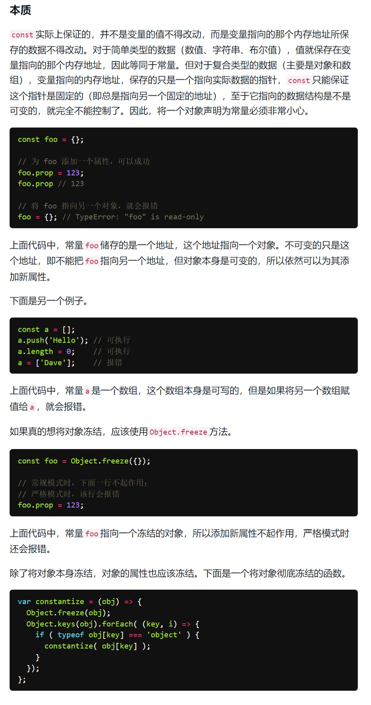
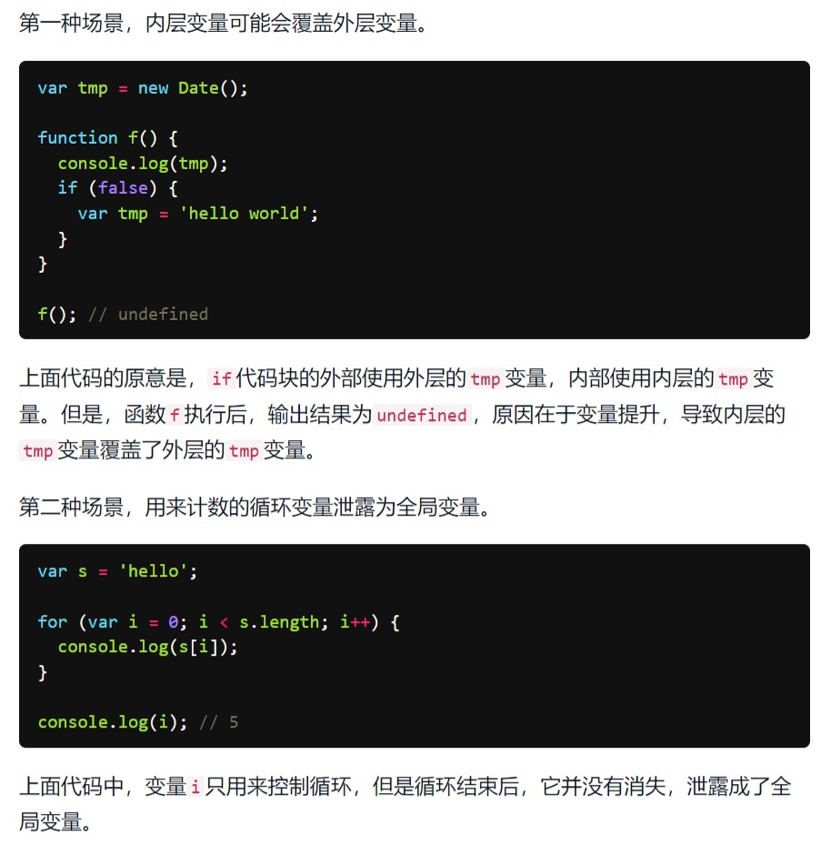
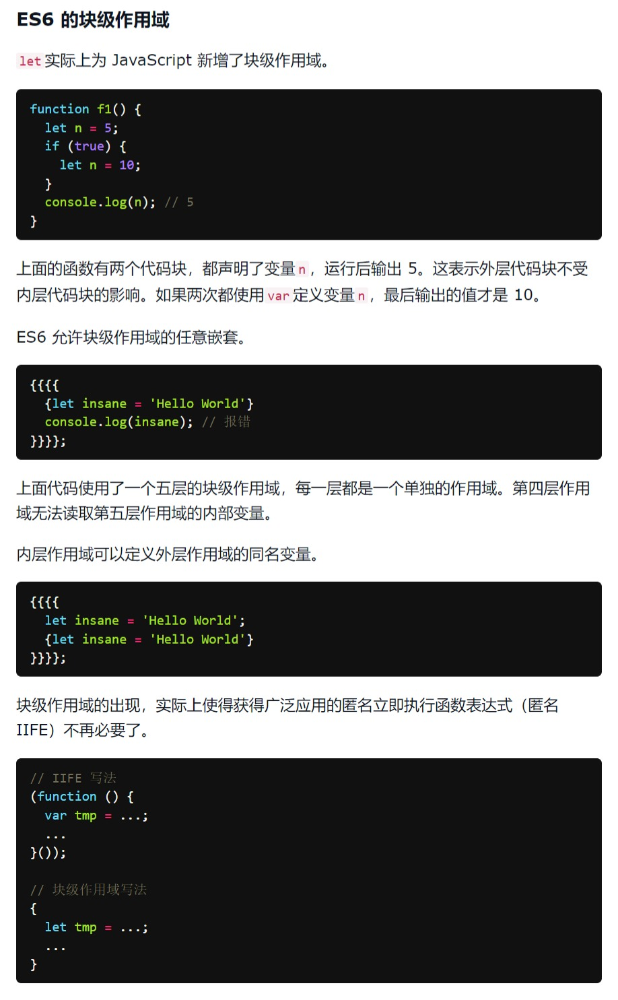
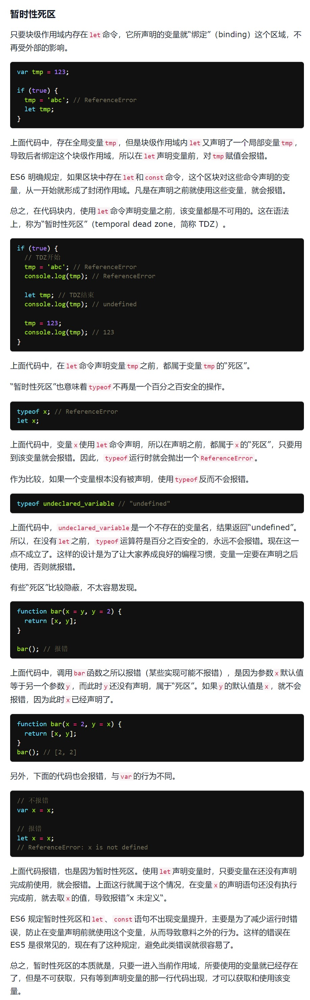

# let 与 const

> 时间：2022-05-03

<br/>

## 1、概述

<br/>

- `let`和`const`可以认为是 ES6 中最基本的新特性。

---

## 2、const 基本使用

<br/>

- `const`表示常量（constant）。
- 一旦声明，常量的值就不能改变。


```javascript
const PI = 3.1415;

PI = 3.14; // 报错
```


```javascript
// 对于引用数据类型，const 不允许改变了其指向的内存区域

const CODE = {
    CHN: "People's Republic of China",
    PRC: "People's Republic of China",
    RUS: "Russian Federation"
};

// 可以
// 没有改变了其指向的内存区域
CODE.USA = "United States of America"

// 报错
// CODE = {};
```





- `const`一旦声明变量，就**必须立即初始化**，不能留到以后赋值。

---

## 3、let 基本使用

<br/>

- `let`用于声明变量，相当于之前的`var`。


```javascript
let a = 10;
```


---

## 4、let、const 与 var 的区别

<br/>

### 4.1、重复声明

- `let`、`const`不允许重复声明，`var`可以重复声明。


```javascript
let a = 10;

let a = 5; // 错误
```


```javascript
var a = 10;

var a = 5;
```


---

### 4.2、变量提升

- `let`、`const`不存在变量提升（必须确保先声明后使用），`var`存在变量提升。


```javascript
console.log(a); // 输出 undefined 但不报错

var a = 10;
```


```javascript
console.log(a); // 报错

let a = 10;
```


---

### 4.3、window 对象

- `var`声明的变量以及通过`function`声明的函数，会**自动**变成`window`对象的属性或方法。而`let`、`const`不会。


```javascript
var a = 10;
console.log(window.a === a); //  true

// 注意：此处的 i 会“泄露”成为全局变量
for (var i = 0; i < 5; i++) {

}
console.log(window.i === i); // true
```


```javascript
let a = 10;
console.log(window.a === a); // false

for (let i = 0; i < 5; i++) {

}
console.log(window.i === i); // 报错
```


---

### 4.4、块级作用域

<br/>

- ES6 之前，只有**全局作用域**和**函数作用域**。
- ES6 之后，引入`let`、`const`，出现了**块级作用域**。
- 没有块级作用域会出现的问题（只有`var`时）：





```javascript
for (let i = 0; i < 5; i++) {
    console.log(i);
}

console.log(i); // 报错
```


- **只有使用`let`、`const`后**，才有可能会形成块级作用域，只有`var`的话，可以认为是不存在块级作用域这一概念。
- 哪些能够形成块级作用域：大部分具有`{}`的结构（`{}`（直接使用一对花括号）、`if`、`while`、`switch`等），是能够形成块级作用域；块级作用域可以嵌套；对象的`{}`是不构成块级作用域的。
- 关于“作用域”的问题，有时可能会比较难理解，但是一般情况下，只要养成好的编写代码的习惯（比如：先声明后使用等），就可以避免一些问题。





---

### 4.5、暂时性死区

- 只要块级作用域内存在`let`、`const`，它所声明的变量就会“绑定”（binding）这个区域，不再受外部的影响。


```javascript
let a = 10;

if (true) {
    let a = 2;
    console.log(a); // 2
}
```


```javascript
let a = 10;

if (true) {
    console.log(a); // 报错
    let a = 2; // 之所以不会向外查找 a，是因为块级作用域中已经用 let 声明了 a
}
```


```javascript
let a = 10;

if (true) {
    console.log(a); // 输出 10，当前块级作用域中没有 let 声明 a，不存在暂时性死区，所以可以向外查找
}
```


