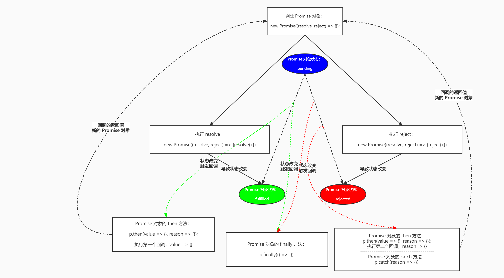

# Promise

> 时间：2022-05-31

<br/>

## 1、概述

<br/>

- Promise 是异步编程的一种解决方案，比传统的解决方案 —— 回调函数和事件 —— 更合理和更强大。它由社区最早提出和实现，ES6 将其写进了语言标准，统一了用法，原生提供了`Promise`对象。
- Promise 一般用来解决**层层嵌套**的回调函数（回调地狱 callback hell）的问题（注意，Promise 不是解决回调函数的问题，而是解决“回调地狱”的问题）。

---

## 2、基本使用

<br/>

- 创建 Promise 对象。


```javascript
const p = new Promise(function(resolve, reject) {
    
});

// 箭头函数形式
const p = new Promise((resolve, reject) => {

});
```


- Promise 对象的状态。有3种状态。
  - Promise 对象刚创建时，状态是 pending（待办的），初始状态。
  - 当`resolve`方法执行后，状态变为 fulfilled / resolved（完成）。
  - 当`reject`方法执行后，状态变为 rejected（被拒绝）。
- Promise 对象的状态一旦发生变化，就不会再改变了（只能变化一次）。
- Promise 对象的状态的变化，仅有两种可能性，要么由 pending 变为 fulfilled / resolved，要么由 pending 变为 rejected。


```javascript
// Promise 对象刚创建时，状态是 pending（待办的）

const p = new Promise((resolve, reject) => {
    
});

console.log(p); // Promise {<pending>}
```


```javascript
// 当 resolve 方法执行后，状态变为 fulfilled（完成）

const p = new Promise((resolve, reject) => {
    resolve();
});

console.log(p); // Promise {<fulfilled>: undefined}
```


```javascript
// 当 reject 方法执行后，状态变为 rejected（被拒绝）

const p = new Promise((resolve, reject) => {
    reject();
});

console.log(p); // Promise {<rejected>: undefined}
```


```javascript
// Promise 对象的状态一旦发生变化，就不会再改变了（只能变化一次）

const p = new Promise((resolve, reject) => {
    resolve();
    reject(); // 因为 resolve 使得状态已经发生变化了，所以 reject 不再影响
});

console.log(p); // Promise {<fulfilled>: undefined}
```


---

## 3、then

<br/>

- `then`方法。是 Promise 最基本的方法。


```javascript
const p = new Promise((resolve, reject) => {});

// then 方法的参数，是两个回调函数
p.then(function() {}, function() {});

// 箭头函数形式
p.then(() => {}, () => {});
```


```javascript
// 当 Promise 对象的状态由 pending 变为 fulfilled（执行了 resolve 方法），则会执行 then 方法中的第一个回调函数

const p = new Promise((resolve, reject) => {
    resolve();
});

p.then(() => {
    console.log("resolve");
}, () => {
    console.log("reject");
});

// 输出结果：resolve
```


```javascript
// 当 Promise 对象的状态由 pending 变为 rejected（执行了 reject 方法），则会执行 then 方法中的第二个回调函数

const p = new Promise((resolve, reject) => {
    resolve();
});

p.then(() => {
    console.log("resolve");
}, () => {
    console.log("reject");
});

// 输出结果：reject
```


```javascript
// 注意：Promise 对象的状态一旦发生变化，就不会再改变了（只能变化一次）

const p = new Promise((resolve, reject) => {
    reject();
    resolve();
});

p.then(() => {
    console.log("resolve");
}, () => {
    console.log("reject");
});

// 输出结果：reject
```


- `then`方法执行后（实际上是执行`then`中的两个回调的其中之一），返回一个新的 Promise 对象。


```javascript
const p1 = new Promise((resolve, reject) => {
    reject();
});

const p2 = p1.then(() => {
    console.log("resolve");
}, () => {
    console.log("reject");
});

console.log(p1 === p2); // false
```


- 关于`then`方法执行后（实际上是执行`then`中的两个回调的其中之一），返回的新的 Promise 对象的状态变化，取决于创建 Promise 对象时执行的是`resolve`还是`reject`。


```javascript
const p1 = new Promise((resolve, reject) => {
    resolve();
});

const p2 = p1.then(() => {
    // 显式返回新的 Promise 对象
    return new Promise((resolve, reject) => {
        reject();
    });
}, () => {

});

console.log(p2); // rejected
```


```javascript
const p1 = new Promise((resolve, reject) => {
    resolve();
});

const p2 = p1.then(() => {
    return new Promise((resolve, reject) => {
        resolve();
    });
}, () => {

});

console.log(p2); // fulfilled
```


- `then`方法执行后（实际上是执行`then`中的两个回调的其中之一），返回一个新的 Promise 对象。当**不使用`return`**返回新的 Promise 对象时，将`undefined`“包装”成一个 Promise 对象返回，新的 Promise 对象的状态是 fulfilled。


```javascript
const p1 = new Promise((resolve, reject) => {
    resolve();
});

const p2 = p1.then(() => {
    // 显式使用 return 返回新的 Promise 对象
    return new Promise((resolve, reject) => {
        resolve();
    });
}, () => {

});

console.log(p2);
```


```javascript
const p1 = new Promise((resolve, reject) => {
    resolve();
});

// 不使用 return 默认返回新的 Promise 对象
const p2 = p1.then(() => {}, () => {});

/*

相当于：

const p2 = p1.then(() => {
    return new Promise((resolve, reject) => {
        resolve(undefined);
    });
}, () => {});

*/

console.log(p2);
```


- 由于`then`方法执行后（实际上是执行`then`中的两个回调的其中之一），返回一个新的 Promise 对象，所以`then`可以用“链式调用”的方式编写。


```javascript
const p = new Promise((resolve, reject) => {
    reject(); // 此处执行 reject，所以会执行 then 的第二个回调
});

p.then(() => {
    console.log("resolve 1");
}, () => {
    console.log("reject 1"); // 执行该回调，输出 reject 1。由于隐式情况下，返回新的 Promise 对象中执行的是 resolve，所以会执行下一个 then 的第一个回调
}).then(() => {
    console.log("resolve 2");
}, () => {
    console.log("reject 2");
});

// 输出：reject 1 resolve 2
```


```javascript
const p = new Promise((resolve, reject) => {
    reject(); // 此处执行 reject，所以会执行 then 的第二个回调
});

p.then(() => {
    console.log("resolve 1");
}, () => {
    console.log("reject 1"); // 执行该回调，输出 reject 1。显式情况下，返回新的 Promise 对象中执行的是 reject，所以会执行下一个 then 的第二个回调
    return new Promise((resolve, reject) => {
        reject();
    });
}).then(() => {
    console.log("resolve 2");
}, () => {
    console.log("reject 2");
});

// 输出：reject 1 reject 2
```


- `resolve`和`reject`方法可以有参数，然后在`then`中接收。


```javascript
// resolve 对应约定俗成的参数名是 value
// reject 应约定俗成的参数名是 reason 或 error，表示“拒绝的原因、因发生什么错误被拒绝”

const p = new Promise((resolve, reject) => {
    reject("This is reject reason");
});

p.then((value) => {
    console.log("resolve 1");
}, (reason) => {
    console.log(reason);
    console.log("reject 1");
});

// 输出：This is reject reason reject 1
```


```javascript
const p = new Promise((resolve, reject) => {
    resolve("This is value");
});

p.then((value) => {
    console.log("resolve 1");
    console.log(value);
}, (reason) => {
    console.log("reject 1");
});

// 输出：resolve 1 This is value
```


- `then`方法执行后（实际上是执行`then`中的两个回调的其中之一），返回一个新的 Promise 对象。使用`return`显式返回时，不写`new Promise()`的话，直接`return xxx`时，`xxx`会被自动“包装”成一个 Promise 对象，并且执行`resolve`回调。


```javascript
const p = new Promise((resolve, reject) => {
    resolve(123);
});

p.then(value => {
    console.log(value); // 123
    return 456;
}, reason => {
    console.log(reason);
}).then(value => {
    console.log(value); // 456
}, reason => {
    console.log(reason);
});
```


```javascript
// 上面的代码等价于：

const p = new Promise((resolve, reject) => {
    resolve(123);
});

p.then(value => {
    console.log(value); // 123
    return new Promise((resolve, reject) => {
        resolve("456");
    });
}, reason => {
    console.log(reason);
}).then(value => {
    console.log(value); // 456
}, reason => {
    console.log(reason);
});
```


---

## 4、catch

<br/>

- `catch`方法可以认为是`then`方法的一种特殊形式。当  Promise 对象的状态由 pending 变为 rejected 时，`catch`方法执行。


```javascript
const p = new Promise((resolve, reject) => {
    reject("This is the reason");
});

p.catch(reason => {
    console.log(reason); // This is the reason
});
```


```javascript
// 上面的代码相当于：

const p = new Promise((resolve, reject) => {
    reject("This is the reason");
});

p.then(null, reason => {
    console.log(reason); // This is the reason
});
```


- `catch`方法的返回值仍是一个新的 Promise 对象。与`then`方法用法一致：显式返回（使用`return`）、不使用`return`、链式调用等。


```javascript
const p = new Promise((resolve, reject) => {
    reject("reject 1");
});

p.catch(reason => {
    console.log(reason);
    // 显式返回
    return new Promise((resolve, reject) => {
        resolve("resolve 1");
    });
}).then(value => {
    console.log(value); // 链式调用
}, reason => {
    console.log(reason);
});
```


```javascript
const p = new Promise((resolve, reject) => {
    reject("reject 1");
});

p.catch(reason => {
    // 显式返回
    console.log(reason);
    return "resolve 1";
}).then(value => {
    console.log(value);
}, reason => {
    console.log(reason);
});
```


```javascript
const p = new Promise((resolve, reject) => {
    reject("reject 1");
});

p.catch(reason => {
    console.log(reason);
    // 不使用 return
}).then(value => {
    console.log(value);
}, reason => {
    console.log(reason);
});
```


---

## 5、finally

<br/>

- `finally`方法仍可以认为是`then`方法的特例。当  Promise 对象的状态发生变化（由 pending 变为 fulfilled、由 pending 变为 rejected）后执行。


```javascript
const p = new Promise((resolve, reject) => {
    reject("reject");
});

p.finally(() => {
    console.log("final") // 执行
});

/* ------------------------------------------------------ */

const p = new Promise((resolve, reject) => {
    resolve("resolve");
});

p.finally(() => {
    console.log("final") // 也执行
});
```


- `finally`方法，意味着“结束”，也就是后面无法继续调用（含链式调用）`then`、`catch`方法。


```javascript
const p = new Promise((resolve, reject) => {
    reject("reject");
});

p.finally(() => {
    console.log("final");
    // 无效的“返回”
    return new Promise((resolve, reject) => {
        resolve();
    });
}).then(value => {
    console.log("resolve"); // 不再执行
}, reason => {});
```


---

## 6、小结

<br/>




- 使用时的一些语法问题。


```javascript
// new Promise 的完整写法
const p = new Promise((resolve, reject) => {});

// new Promise 的省略写法，注意可以省略的是 reject 而不是 resolve
const p = new Promise((resolve) => {});

// new Promise 的省略写法，注意可以省略的是 reject 而不是 resolve
// 这里虽然是形参名是 reject，但本质是 resolve
const p = new Promise((reject) => {});
```


```javascript
// then 方法的完整写法
p.then(value => {}, reason => {});

// then 方法根据实际需求，只保留第一个回调
p.then(value => {});

// then 方法根据实际需求，只保留第一个回调
p.then(value => {}, null);

// then 方法根据实际需求，只保留第二个回调
// 注意，只保留第二个回调时，第一个回调可以设为 null，但是不能不写第一个
p.then(null, reason => {});

// then 方法根据实际需求，可行的一些写法
p.then(() => {}, () => {});

// then 方法根据实际需求，可行的一些写法
p.then(() => {});

// then 方法根据实际需求，可行的一些写法
p.then(() => {}, null);

// then 方法根据实际需求，可行的一些写法
p.then(null, () => {});
```


---

## 7、Promise.resolve & Promise.reject

<br/>

- `Promise.resolve()`可以认为是一种简写形式，是`new Promise(resolve => resolve())`的简写。这种写法意味着，Promise 对象的状态变化只能是由 pending 变为 fulfilled。


```javascript
const p = Promise.resolve();

console.log(p); // Promise {<fulfilled>: undefined}
```


```javascript
const p = Promise.resolve("Hi");

// Promise 对象状态由 pending 变为 fulfilled
// 执行第一个回调
p.then((value) => {
    console.log(value); // Hi
}, () => {});
```


- `Promise.reject()`也可以认为是一种简写形式，是`new Promise((resolve, reject) => {reject();});`的简写。这种写法意味着，Promise 对象的状态变化只能是由 pending 变为 rejected。


```javascript
const p = Promise.reject();

console.log(p); // Promise {<rejected>: undefined}
```


```javascript
const p = Promise.reject("Hi");

// Promise 对象状态由 pending 变为 rejected
// 执行第二个回调
p.then(() => {}, (reason) => {
    console.log(reason);
});
```


- `Promise.resolve()`的参数。

  - 常见的就是一般的参数，比如字符串等。

  

  ```javascript
  Promise.resolve("Hello world").then((value) => {
      console.log(value); // Hello world
  });
  ```

  

  - 参数也可以是 Promise 对象，当参数是 Promise 对象时，直接返回这个 Promise 对象。

  

  ```javascript
  const p1 = new Promise((resolve, reject) => {
      reject("Hi");
  });
  
  const p2 = Promise.resolve(p1);
  
  console.log(p1 === p2); // true
  ```

  

  ```javascript
  const p1 = new Promise((resolve, reject) => {
      reject("Hi");
  });
  
  const p2 = Promise.resolve(p1).then(value => {}, reason => {
      console.log(reason); // Hi
  });
  
  // 上面的代码相当于：
  
  const p1 = new Promise((resolve, reject) => {
      reject("Hi");
  });
  
  p1.then(value => {}, reason => {
      console.log(reason); // Hi
  });
  ```

  

  - 补充：当`resolve`函数接收的是 Promise 对象时，后面的`then`会根据传递的 Promise 对象的状态变化决定执行哪一个回调。

  

  ```javascript
  const p1 = new Promise((resolve, reject) => {
      reject("Hi");
  });
  
  const p2 = new Promise(resolve => {
      resolve(p1); // resolve 函数接收的是 Promise 对象时
  });
  
  // then 会根据传递的 Promise 对象的状态变化决定执行哪一个回调
  p2.then(value => {}, reason => {
      console.log(reason); // Hi
  });
  ```

  

  - 参数可以是含`then`方法的对象。
  
  
  
  ```javascript
  const thenable = {
      then() {
          console.log("Hello");
      }
  };
  
  // 这样的情况下，含有 then 方法的 thenable 对象不会影响 Promise 对象的状态，状态仍是 pending
  // thenable 对象中的 then 方法正常执行
  const p = Promise.resolve(thenable);
  
  console.log(p); // Promise {<pending>}
  ```
  
  
  
  ```javascript
  // 这样的情况下，含有 then 方法的 thenable 对象会影响 Promise 对象的状态，状态的如何变化取决于执行的是 resolve 还是 reject
  
  
  const thenable = {
      then(resolve, reject) {
          reject("HaHaHa");
      }
  };
  
  const p = Promise.resolve(thenable);
  console.log(p); // pending 变为 rejected
  
  p.then(value => {
      console.log("value: " + value);
  }, reason => {
      console.log("reason: " + reason);
  });
  
  // reason: HaHaHa
  ```
  
  
  
- `Promise.reject()`，不管什么参数，都原封不动向后传递，作为后续方法的参数。


```javascript
const p1 = new Promise((resolve, reject) => {
    resolve("hahaha");
});

const p2 = Promise.reject(p1);
p2.then(value => {
    console.log("value: " + value);
}, reason => {
    console.log("reason: " + reason);
});

// reason: [object Promise]
// 原封不动向后传递
```


```javascript
const p1 = new Promise((resolve, reject) => {
    resolve("hahaha");
});

const p2 = Promise.reject(p1);
p2.then(value => {
    console.log("value: " + value);
}, reason => {
    // 因为 p1 被原封不动传递过来
    // 根据 p1 的状态变化执行回调
    reason.then(value1 => {
        console.log("value1: " + value1);
    }, reason1 => {
        console.log("reason1: " + reason1);
    });
});

// value1: hahaha
```


---

## 8、Promise.all

<br/>

- `Promise.all()`可以关注**多个** Promise 对象的状态变化。
- `Promise.all()`可以接收多个 Promise 对象作为参数，然后返回一个新的 Promise 对象。
- `Promise.all()`返回新的 Promise 对象的状态与传入的 Promise 对象的状态有关。
  - 所有传入对象的状态都变成 fulfilled / resolved，最终返回对象的状态才会变成 fulfilled / resolved。
  - 传入对象的状态只要有一个变成 rejected，最终返回对象的状态就变成 rejected。


```javascript
const p1 = new Promise((resolve, reject) => {
    resolve("p1");
});

const p2 = new Promise((resolve, reject) => {
    resolve("p2");
});

const p3 = Promise.all([p1, p2]);

p3.then(value => {
    console.log("p3 is fulfilled"); // 执行该回调
}, reason => {
    console.log("p3 is rejected");
});

// p3 最终的状态是 fulfilled
```


```javascript
const p1 = new Promise((resolve, reject) => {
    resolve("p1");
});

const p2 = new Promise((resolve, reject) => {
    reject("p2");
});

const p3 = Promise.all([p1, p2]);

p3.then(value => {
    console.log("p3 is fulfilled");
}, reason => {
    console.log("p3 is rejected"); // 执行该回调
});

// p3 最终的状态是 rejected
```


---

## 9、Promise.race

<br/>

- `Promise.race()`可以接收多个 Promise 对象作为参数，然后返回一个新的 Promise 对象。
- `Promise.race()`返回新的 Promise 对象的状态与传入的 Promise 对象的状态有关，且取决于第一个完成状态变化的 Promise 对象。如果第一个完成的，其状态是变为 fulfilled / resolved，那返回的新对象最终的状态就是 fulfilled / resolved；如果第一个完成，其状态是变为 rejected，那返回的新对象最终的状态就是 rejected。


```javascript
const p1 = new Promise((resolve, reject) => {
    setTimeout(resolve, 1000);
});

const p2 = new Promise((resolve, reject) => {
    setTimeout(reject, 5000);
});

const p3 = Promise.race([p1, p2]);

p3.then(value => {
    console.log("p3 is fulfilled"); // 执行该回调
}, reason => {
    console.log("p3 is rejected");
});

// p3 最终的状态是 fulfilled
// 因为 p1 比 p2 先完成状态变化，p1 的状态最终变为 fulfilled，所以 p3 的状态也变为 fulfilled
```


```javascript
const p1 = new Promise((resolve, reject) => {
    setTimeout(resolve, 5000);
});

const p2 = new Promise((resolve, reject) => {
    setTimeout(reject, 1000);
});

const p3 = Promise.race([p1, p2]);

p3.then(value => {
    console.log("p3 is fulfilled");
}, reason => {
    console.log("p3 is rejected");
});

// p3 最终的状态是 rejected
// 因为 p2 比 p1 先完成状态变化，p2 的状态最终变为 rejected，所以 p3 的状态也变为 rejected
```


---

## 10、Promise.allSettled

<br/>

- `Promise.allSettled()`可以接收多个 Promise 对象作为参数，然后返回一个新的 Promise 对象。
- `Promise.allSettled()`返回新的 Promise 对象的状态与传入的 Promise 对象的状态无关，最终的状态都是 fulfilled，返回新的 Promise 对象会“记录”传入的各个 Promise 对象的“表现”（状态变化等）。


```javascript
const p1 = new Promise((resolve, reject) => {
    resolve();
});

const p2 = new Promise((resolve, reject) => {
    reject();
});

const p3 = Promise.allSettled([p1, p2]);

p3.then(value => {
    console.log("p3 is fulfilled"); // 执行该回调
    console.log(value);
}, reason => {
    console.log("p3 is rejected");
});

// p3 最终的状态是 fulfilled
```


---

## 11、Promise.any

<br/>


---

## 12、注意事项

<br/>

- `resolve`函数和`reject`函数后如有代码，可正常执行。但是**不建议**在`resolve`函数和`reject`函数之后有代码。


```javascript
const p = new Promise((resolve, reject) => {
    resolve();
    console.log(1+2); // resolve 后的代码可以执行，但是不建议有代码。将 resolve 或 reject 作为“终点”，其余的逻辑交给 then / catch 等处理
});
```


```javascript
const p = new Promise((resolve, reject) => {
    return resolve(); // 使用 return 写法，可以避免执行 resolve 后续的代码。可以认为是一种良好的编写习惯
});
```


- `Promise.all()`、`Promise.race()`、`Promise.allSettled()`、`Promise.any()`的参数问题。
  - 一般情况下，传入由 Promise 对象组成的数组。
  - 对于由 Promise 对象组成的可遍历对象也可以作为参数。
  - 对于可遍历对象中含有**不是** Promise 对象的元素，会自动将其转换为 Promise 对象。


```javascript
Promise.all([1, 2, 3]);

// 上面代码相当于：

Promise.all([
    Promise.resolve(1),
    Promise.resolve(2),
    Promise.resolve(3)
]);
```


- `Promise.all()`、`Promise.race()`、`Promise.allSettled()`、`Promise.any()`的错误处理（`catch`）。从语法上可以单独处理，也可以统一处理。


```javascript
// 单独处理

const p1 = new Promise((resolve, reject) => {}).catch(reason => {});
const p2 = new Promise((resolve, reject) => {}).catch(reason => {});

const p3 = Promise.all([p1, p2]);
```


```javascript
// 统一处理

const p1 = new Promise((resolve, reject) => {});
const p2 = new Promise((resolve, reject) => {});

const p3 = Promise.all([p1, p2]).catch(reason => {});
```


---

## 13、async / await

<br/>


---

## 14、简单案例

<br/>

- 使用 Promise 实现图片的异步加载（当前图片没有被切换时，后面的需要显示的图片已经被加载好了）。


```html
<!DOCTYPE html>
<html lang="cn-zh">
<head>
    <meta charset="UTF-8">
    <title>JS</title>
</head>
<body>

<br/>
<br/>
<input id="my-btn" type="button" value="切换图片"/>

<script>
    // 异步加载图片的方法
    const loadImageAsyn = (newImageUrl) => {
        return new Promise((resolve, reject) => {
            // new Image() 相当于创建一个  这样的 DOM
            const loadingImageObj = new Image();

            loadingImageObj.src = newImageUrl;

            // onload：当图片加载完毕后执行
            loadingImageObj.onload = () => {
                resolve(loadingImageObj.src);
            };

            // onerror：当图片加载失败执行
            loadingImageObj.onerror = () => {
                reject(loadingImageObj.src);
            };
        });
    };

    const imageDOM = document.getElementById("my-img");
    const buttonDOM = document.getElementById("my-btn");
    const newImageUrl = "https://img1.sycdn.imooc.com/629ebc2f00017fca17920764.jpg";

    loadImageAsyn(newImageUrl).then(newImageUrlFromPromise => {
        // 注意：正常情况下，点击按钮之前（切换图片之前），新图片应该是已经加载到缓存中了，所以当页面上的  更换新的 src 时，只是从缓存中加载图片（前提是浏览器“允许缓存”）
        buttonDOM.onclick = () => {
            // 由于新图片已经被加载到缓存中，此处无需请求图片资源
            imageDOM.src = newImageUrlFromPromise;
        };
    }, newImageUrlFromPromise => {
        console.log(new Error(`Can not load the image from ${newImageUrlFromPromise}`));
    });
</script>
</body>
</html>
```


