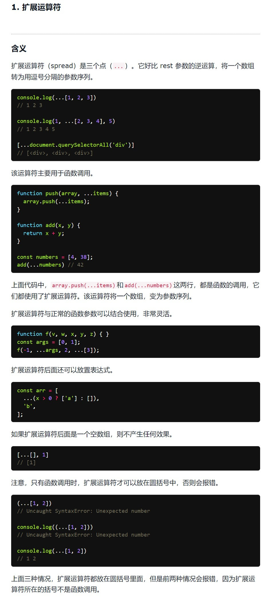
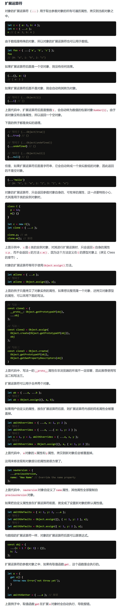

# 展开运算符

> 时间：2022-05-10

<br/>

## 1、概述

<br/>

- 展开运算符，通俗地讲，是“拆解”，将数组、对象等数据进行“拆解”，提取其中的元素等。
- 展开运算符形式是`...变量`。
- 剩余参数，是“化零为整”；展开运算是“化整为零”。

---

## 2、数组展开运算符

<br/>

- 基本使用，展开数组。


```javascript
let arr = [1, 2, 3];

console.log(...arr); // 1 2 3
```


```javascript
let arr = [1, 2, 3];

console.log(Math.min(1, 2, 3)); // 1
console.log(Math.min(...arr)); // 1
```


- 与剩余参数的区别，剩余参数，是“化零为整”（多个参数转数组）；展开运算是“化整为零”（数组转多个参数）。


```javascript
const f1 = (...args) => {
    console.log(args);
};

f1(1, 2, 3);


const f2 = (arr) => {
    console.log(...arr);
};

f2([1, 2, 3]);
```


- 使用展开运算符，可以进行复制数组、合并数组等一些操作。


```javascript
// 复制数组

let arr1 = [1, 3, 5, 7, 9];
let arr2 = [...arr1];

console.log(arr1 === arr2); // false
```


```javascript
// 合并数组

let arr1 = [1, 3, 5, 7, 9];
let arr2 = [2, 4, 6, 8, 10];

let arr3 = [0, ...arr1, ...arr2];

console.log(arr3);
```


- 使用展开运算符，将字符串转为字符数组。


```javascript
let str = "Hello";

let arr = [...str];
```


- 使用展开运算符，将**类数组**转换为数组。


```javascript
function f() {
    let arr = [...arguments];
}
```


---

## 3、对象展开运算符

<br/>

- 基本使用，展开对象，但是**必须在对象中展开即在`{}`中展开**。


```javascript
let obj = {
    name: "Zhang San",
    age: 20
};

console.log({...obj});
```


```javascript
let obj1 = {
    name: "Zhang San",
    age: 20
};

let obj2 = {...obj1};

console.log(obj1 === obj2); // false
```


- 使用展开运算符可以进行合并对象的操作。合并时，如果存在属性名、函数名相同，后者会覆盖前者。


```javascript
let obj1 = {
    name: "Zhang San",
    age: 20,
    country: "CHN"
};

let obj2 = {
    name: "Li Si",
    age: 23,
    passport: "EJXXXXXX"
};

// obj1 为前者，obj2 为后者
console.log({...obj1, ...obj2}); // {name: 'Li Si', age: 23, country: 'CHN', passport: 'EJXXXXXX'}

// obj2 为前者，obj1 为后者
console.log({...obj2, ...obj1}); // {name: 'Zhang San', age: 20, passport: 'EJXXXXXX', country: 'CHN'}
```


- 一个空对象，可以使用展开运算符，但是没有意义。


```javascript
let obj = {...{}, a: 10};
```


- 数组、类数组在对象中展开（在`{}`中展开），形成一个**类似于数组的对象**。


```javascript
let arr = [6, 7, 8];

console.log({...arr}); // {0: 6, 1: 7, 2: 8}
```


- 字符串，既可以在对象中展开（在`{}`中展开），形成类似于数组的对象；也可以在数组中展开（在`[]`中展开），形成字符数组。


```javascript
let str = "Hello";

console.log({...str}); // {0: 'H', 1: 'e', 2: 'l', 3: 'l', 4: 'o'}
```


- 一些非对象的数据类型可以使用展开运算符（不报错），但是没有意义。


```javascript
console.log({...null});

console.log({...51});

console.log({...undefined});

console.log({...true});
```


- 对象中含有对象属性，展开时，其中的对象属性是不会被展开的。


```javascript
let obj = {
    name: "Zhang San",
    birth: "1990-01-01",
    gender: "M",
    
    // 对象中的对象属性不会被展开
    passport: {
        type: "P",
        number: "EJXXXXXX"
    }
};

console.log({...obj});
```


- 函数参数如果是对象，并且有默认值，这个场景下可以利用展开运算符。


```javascript
function printUserObj(userObj) {
    const defaultUserObj = {
        name: "null",
        age: 0
    };

    // 真正的参数在“合并”过程中会覆盖默认参数
    let obj = {...defaultUserObj, ...userObj};

    console.log(obj.name + ", " + obj.age);
}

printUserObj(); // null, 0

printUserObj({name: "Zhang San"}); // Zhang San, 0

printUserObj({name: "Li Si", age: "20"}); // Li Si, 20
```


```javascript
function printUserObj(userObj) {
    const defaultUserObj = {
        name: "null",
        age: 0
    };

    // 结合解构赋值
    let {name: n, age: a} = {...defaultUserObj, ...userObj};

    console.log(n + ", " + a);
}

printUserObj(); // null, 0

printUserObj({name: "Zhang San"}); // Zhang San, 0

printUserObj({name: "Li Si", age: "20"}); // Li Si, 20
```


---

## 4、补充

<br/>




