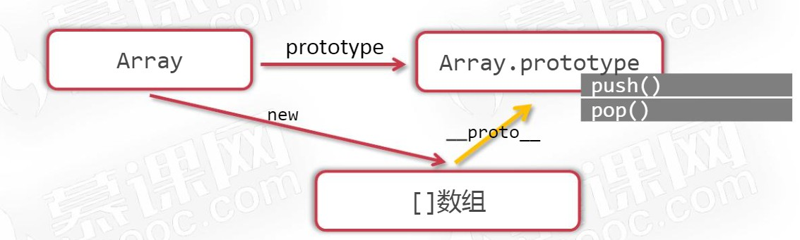
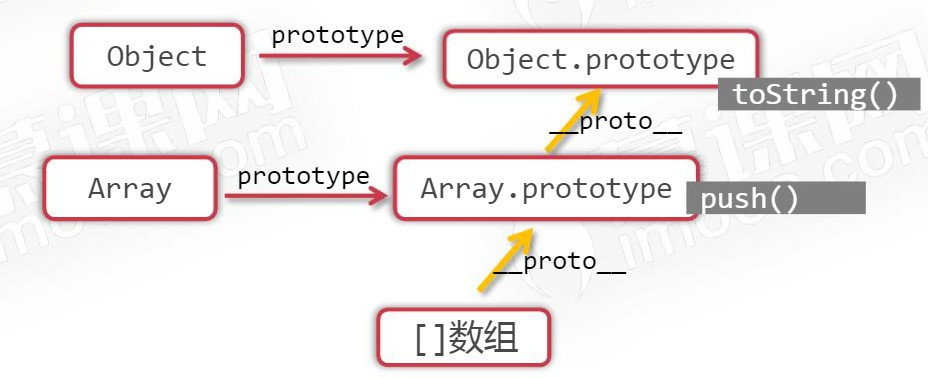
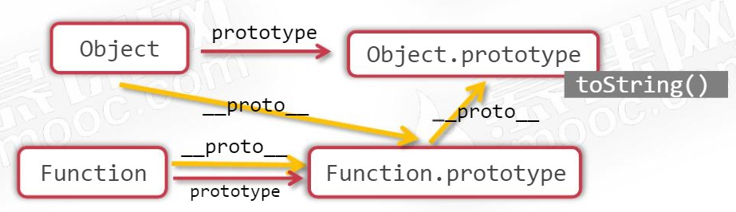

# 内置构造函数

> 时间：2022-05-03

<br/>

## 1、概述

<br/>

- JavaScript 有很多**内置**构造函数，比如 Array 就是数组类型的构造函数，Function 就是函数类型的构造函数，Object 就是对象类型的构造函数。
- 内置构造函数非常有用，所有该类型的方法都是定义在它的内置构造函数的 prototype 上的，可以给这个对象添加新的方法，从而拓展某类型的功能。比如数组的`push`等方法，均是定义在`Array.prototype`上的。





---

## 2、常见内置构造函数

<br/>

### 2.1、Array


```javascript
console.log([] instanceof Array); // true
console.log([].__proto__ === Array.prototype); // true

console.log([1, 2] instanceof Array); // true
console.log([1, 2].__proto__ === Array.prototype); // true

var arr = new Array(5);
console.log(arr instanceof Array); // true
console.log(arr.__proto__ === Array.prototype); // true
```


```javascript
console.log(Array.prototype.hasOwnProperty("push")); // true

console.log(Array.prototype.hasOwnProperty("pop")); // true
```


```javascript
console.log(Array.prototype.__proto__ === Object.prototype); // true
```


```javascript
// 扩展

Array.prototype.sum = function() {
    var arr = this;

    var sum = 0;
    for (var i = 0; i < arr.length; i++) {
        sum += arr[i];
    }

    return sum;
};

var arr = [1, 2, 3];
console.log(arr.sum());
```


---

### 2.2、Function


```javascript
function f1() {
    return null;
}
console.log(f1.__proto__ === Function.prototype); // true
console.log(f1 instanceof Function); // true

var f2 = new Function();
console.log(f2.__proto__ === Function.prototype); // true
console.log(f2 instanceof Function); // true

var f3 = new Function("a", "b", "return a - b");
console.log(f3(5, 4)); // 1
console.log(f3.__proto__ === Function.prototype); // true
console.log(f3 instanceof Function); // true
```


---

### 2.3、Object


```javascript
console.log({} instanceof Object); // true
console.log({}.__proto__ === Object.prototype); // true

console.log({a: 1} instanceof Object); // true
console.log({a: 1}.__proto__ === Object.prototype); // true

var obj = new Object();
obj.a = 1;
console.log(obj instanceof Object); // true
console.log(obj.__proto__ === Object.prototype); // true
```


```javascript
function f1() {
    return null;
}
console.log(f1.__proto__.__proto__ === Object.prototype); // true
console.log(Function.prototype.__proto__ === Object.prototype); // true

console.log([].__proto__.__proto__ === Object.prototype); // true
console.log(Array.prototype.__proto__ === Object.prototype); // true
```


---

## 3、Object.prototype

<br/>

- JavaScript 中`Object.prototype`是万物原型链的终点。





- Function 与 Object：
  - JavaScript 中`Object.prototype`是万物原型链的终点。
  - 与此同时，Object 也是内置构造函数之一，Object 也是 Function 的对象（实例）。
  - Function 也是内置构造函数之一，Function 也是 Function 的对象（实例）。





---

## 4、基本类型的包装类

<br/>

- `Number`、`String`、`Boolean` 是三个基本类型值的包装类用`new`调用它们可以生成“对象”版本的基本类型值。


