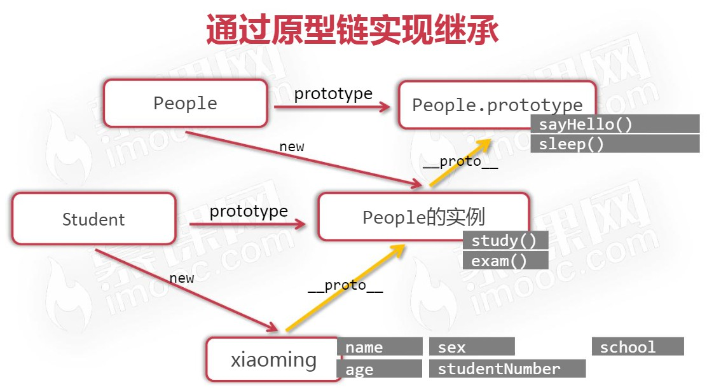
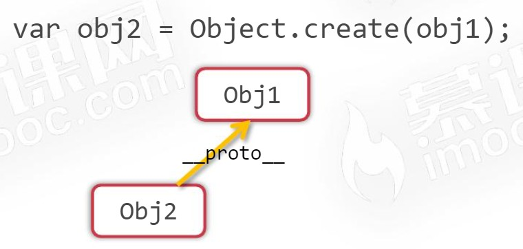
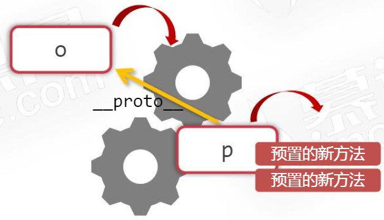
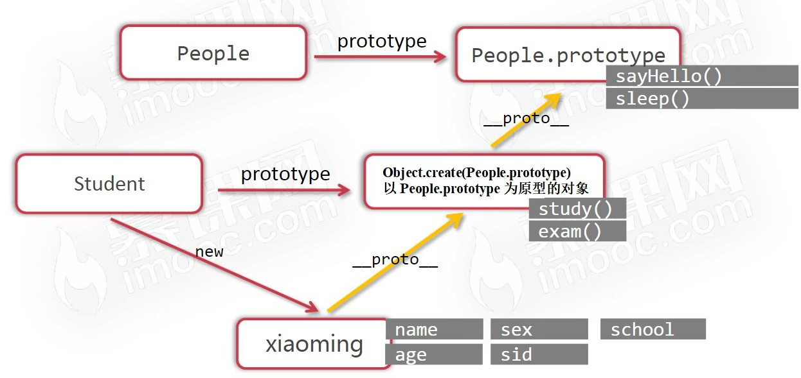
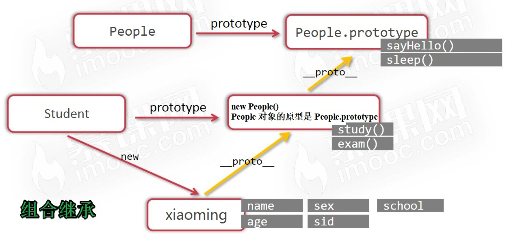

# 继承

> 时间：2022-04-28

<br/>

## 1、概述

<br/>

- JavaScript 中的“继承”想要实现的目的与 Java 语言是一样的。所以有关什么是继承就不再详述。
- 在继承之前，必须理清原型、原型链。

---

## 2、基于原型链实现继承

<br/>

- 子类（构造函数）的 prototype 需指向父类（构造函数）的对象（实例），实现继承。


```javascript
function People(name, gender) {
    this.name = name;
    this.gender = gender;
}

function Student(name, gender, studentId) {
    this.name = name;
    this.gender = gender;
    this.studentId = studentId;
}

// 实现继承
Student.prototype = new People();
```


- 继承后，子类对象可以使用父类原型中的属性、方法。


```javascript
function People(name, gender) {
    this.name = name;
    this.gender = gender;
}

People.prototype.nationality = "CHN";
People.prototype.say = function() {
    console.log("Say");
};

function Student(name, gender, studentId) {
    this.name = name;
    this.gender = gender;
    this.studentId = studentId;
}

// 继承后，子类对象可以使用父类原型中的属性、方法
Student.prototype = new People();

var s = new Student("Zhang San", "男", "1001");
console.log(s.nationality);
s.say();
```


```javascript
function People(name, gender) {
    this.name = name;
    this.gender = gender;
}

People.prototype.say = function() {
    // this 仍取决于如何函数如何被调用
    console.log("我叫" + this.name);
};

function Student(name, gender, studentId) {
    this.name = name;
    this.gender = gender;
    this.studentId = studentId;
}

Student.prototype = new People();

var s = new Student("张三", "男", "1001");
s.say(); // 我叫张三
```


- 如果需要继承，继承操作需要在向子类（构造方法）的原型中添加属性或方法前进行。


```javascript
// 正确写法

function People(name, gender) {
    this.name = name;
    this.gender = gender;
}

function Student(name, gender, studentId) {
    this.name = name;
    this.gender = gender;
    this.studentId = studentId;
}

// 此时，继承操作必须在前
Student.prototype = new People();

Student.prototype.schoolName = "第一中学";

var s = new Student("张三", "男", "1001");
console.log(s.schoolName);
```


```javascript
// 错误写法

function People(name, gender) {
    this.name = name;
    this.gender = gender;
}

function Student(name, gender, studentId) {
    this.name = name;
    this.gender = gender;
    this.studentId = studentId;
}

Student.prototype.schoolName = "第一中学";

Student.prototype = new People();

var s = new Student("张三", "男", "1001");
console.log(s.schoolName);
```


- 继承中，父类（构造函数）原型中的属性、方法可以在子类（构造函数）原型中重写。


```javascript
function People(name, gender) {
    this.name = name;
    this.gender = gender;
}

People.prototype.nationality = "USA";

function Student(name, gender, studentId) {
    this.name = name;
    this.gender = gender;
    this.studentId = studentId;
}

Student.prototype = new People();

// 重写属性
Student.prototype.nationality = "CHN";

var s = new Student("张三", "男", "1001");
console.log(s.nationality); // CHN
```


```javascript
function People(name, gender) {
    this.name = name;
    this.gender = gender;
}

People.prototype.say = function() {
    console.log("我叫" + this.name);
};

function Student(name, gender, studentId) {
    this.name = name;
    this.gender = gender;
    this.studentId = studentId;
}

Student.prototype = new People();

// 重写方法
Student.prototype.say = function() {
    console.log("我叫" + this.name + "，学号是" + this.studentId);
};

var s = new Student("张三", "男", "1001");
s.say(); // 我叫张三，学号是1001
```





- `SubType.prototype = new SupType()`这一语句，除了表示继承，不要忘记这个语句本身的含义即`SubType`的`prototype`这一对象是`SupType`的实例。`SubType`的对象（实例）可以访问其原型中的属性或方法（任何对象均能访问其原型中的属性或方法）。


```javascript
function People(name, gender) {
    this.name = name;
    this.gender = gender;
    this.nationality = "CHN";
}

function Student(name, gender, studentId) {
    this.name = name;
    this.gender = gender;
    this.studentId = studentId;
}

// 该语句的作为是能够实现继承，但与此同时，不要忘记 JavaScript 的“原型链查找”
Student.prototype = new People();

var s = new Student("张三", "男", "1001");
// 子类（构造函数）的对象（实例）能够访问其原型中的属性或方法
console.log(s.nationality);
```


- 基于原型链实现继承的缺点1：如果父类的属性中有引用类型数据，则这个属性会被**所有子类**的对象（实例）所共享（本质上还是原型链引起的）。


```javascript
function People(name, gender) {
    this.name = name;
    this.gender = gender;
    this.phoneNumbers = ["110", "120"]; // 引用类型数据
}

function Student(name, gender, studentId) {
    this.name = name;
    this.gender = gender;
    this.studentId = studentId;
}

Student.prototype = new People();

var p = new Student("李四", "男", "1002"); // 子类对象1
var s = new Student("张三", "男", "1001"); // 子类对象2

console.log(s.phoneNumbers === p.phoneNumbers); // true

p.phoneNumbers.push("119");
console.log(p.phoneNumbers); // ['110', '120', '119']
console.log(s.phoneNumbers); // ['110', '120', '119']

// 如果父类的属性中有引用类型数据，则这个属性会被所有子类的对象（实例）所共享
```


- 基于原型链实现继承的缺点2：子类的构造函数中，往往需要重复定义父类已经定义过的属性。


```javascript
function People(name, gender) {
    this.name = name;
    this.gender = gender;
}

function Student(name, gender, studentId) {
    this.name = name;
    this.gender = gender;
    this.studentId = studentId;
}

Student.prototype = new People();

// name、gender 被重复定义
```


---

## 3、借用构造函数实现继承

<br/>

- 为解决基于原型链实现继承中的缺点，通常使用一种称为“借助构造函数”的技术，也称“伪造对象”或“经典继承”。
- 借助构造函数的思想是：在子类的构造函数内部调用父类的构造函数，在这个过程中需使用`call`指定上下文。


```javascript
function People(name, gender) {
    this.name = name;
    this.gender = gender;
}

function Student(name, gender, studentId) {
    // call 调用该函数即 People 函数
    // 使用 call 指定上下文即调用函数 People 时，People 函数中的 this 指的是 Student 的对象（实例）
    // 避免对父类中的属性重复定义
    People.call(this, name, gender); // 因为将使用 new 调用函数，所以 this 指 Student 对象
    this.studentId = studentId;
}

var s = new Student("张三", "男", "1001");
```


```javascript
function People(name, gender) {
    this.name = name;
    this.gender = gender;
    this.phoneNumbers = ["110", "120"];
}

function Student(name, gender, studentId) {
    // call 调用该函数即 People 函数
    // 由于指定了上下文，所以 People 函数中像 phoneNumbers 这样的引用类型数据最终是实例独有
    People.call(this, name, gender);
    this.studentId = studentId;
}

var p = new Student("李四", "男", "1002");
var s = new Student("张三", "男", "1001");

console.log(p.phoneNumbers === s.phoneNumbers); // false
```


---

## 4、组合继承

<br/>

- JavaScript 中最常用的继承方式。
- 将“基于原型链”和“借用构造函数”两种进行整合，称“组合继承”，也称“伪经典继承”。


```javascript
function People(name, gender) {
    this.name = name;
    this.gender = gender;
}

function Student(name, gender, studentId) {
    People.call(this, name, gender);
    this.studentId = studentId;
}

Student.prototype = new People();

var s = new Student("张三", "男", "1001");
```


-  组合继承最大的问题是，会调用两次父类（构造函数）。


```javascript
function People(name, gender) {
    this.name = name;
    this.gender = gender;
}

function Student(name, gender, studentId) {
    People.call(this, name, gender); // 两次调用之一
    this.studentId = studentId;
}

Student.prototype = new People(); // 两次调用之一
```


---

## 5、原型式继承

<br/>

- 在没有构造函数的情况下，并且希望新对象与现有对象“类似”的情况下，使用`Object.create()`即可，**根据指定的对象为原型创建出新对象**。称为“原型式继承”。


```javascript
var obj1 = {
    a: 1,
    b: 2
};

var obj2 = Object.create(obj1);

console.log(obj2.__proto__ === obj1); // true
```





- 可以添加独有属性或覆盖重名属性。


```javascript
var obj1 = {
    a: 1,
    b: 2
};

var obj2 = Object.create(obj1, {
    a: {value: 3},
    c: {value: 4}
});

console.log(obj2.a); // 3
console.log(obj2.c); // 4
```


- 方法


```javascript
var obj1 = {
    a: 1,
    b: 2,

    f1: function() {
        return this.a + this.b;
    }
};

var obj2 = Object.create(obj1, {
    a: {value: 3},
    c: {value: 4}
});

console.log(obj2.a);
console.log(obj2.c);
console.log(obj2.f1()); // 3 + 2 = 5
```


```javascript
var obj1 = {
    a: 1,
    b: 2,

    f1: function() {
        return this.a + this.b;
    }
};

var obj2 = Object.create(obj1, {
    a: {value: 3},
    c: {value: 4},

    f1: {value: function() {
        return this.a + this.c;
    }},
    f2: {value: function() {
        return this.a + this.b;
    }}

});

console.log(obj2.a);
console.log(obj2.c);
console.log(obj2.f1()); // 3 + 4 = 7
console.log(obj2.f2()); // 3 + 2 = 5
```


- 兼容性问题，`Object.create()`是一个相对比较新的 JavaScript 标准中的方法，所以对于版本较老的浏览器需要考虑兼容性写法。


```javascript
// 兼容性写法
// 根据指定的对象为原型创建出新对象

function object(o) {
    function F() {}
    F.prototype = o;
    return new F();
}
```


```javascript
function object(o) {
    function F() {}
    F.prototype = o;
    return new F();
}

var obj1 = {
    a: 1,
    b: 2,

    f1: function() {
        return this.a + this.b;
    }
};

var obj2 = object(obj1);

console.log(obj2.a); // 1
console.log(obj2.b); // 2
console.log(obj2.f1()); // 1 + 2 = 3
```


---

## 6、寄生式继承

<br/>

- 编写一个函数，它接收一个参数 o，返回以 o 为原型的新对象 p，同时给 p 上添加预置的新方法。





- 寄生式继承就是编写一个函数，它可以“增强对象”，只要把对象传入这个函数，这个函数将以此对象为“基础”创建出新对象，并为新对象赋予新的预置方法。


```javascript
var obj1 = {
    a: 1,
    b: 2
};

// “增强”
function getObj2(obj1) {
    var obj2 = Object.create(obj1);

    obj2.c = 3;

    obj2.f = function() {
        return this.a + this.b + this.c;
    };

    return obj2;
}

var obj2 = getObj2(obj1);

console.log(obj2.f());
```


- 在主要考虑对象而不是自定义类型和构造函数的情况下，寄生式继承也是一种有用的模式。
- 缺点：使用寄生式继承来为对象添加函数，会由于不能做到**函数复用**而降低效率，即方法没有写到 prototype 上而是每个对象独有的。


```javascript
var obj1 = {
    a: 1,
    b: 2
};

var obj2 = {
    a: 3,
    b: 4
};

function getObj(obj) {
    var objNew = Object.create(obj);

    objNew.c = 3;

    objNew.f = function() {
        return this.a + this.b + this.c;
    };

    return objNew;
}

var o1 = getObj(obj1);
var o2 = getObj(obj2);

console.log(o1.f === o2.f); // false
```


---

## 7、寄生组合继承

<br/>

- 组合继承最大的问题就是无论什么情况下，都会调用两次父类的构造函数：一次是在创建子类原型的时候，另一次是在子类构造函数的内部。


```javascript
// 组合继承

function People(id, name, gender) {
    this.id = id;
    this.name = name;
    this.gender = gender;
}

function Student(id, name, gender, schoolId, schoolName) {
    People.call(this, id, name, gender); // 调用构造函数 2
    this.schoolId = schoolId;
    this.schoolName = schoolName;
}

Student.prototype = new People(); // 调用构造函数 1
```


- 寄生组合式继承：通过借用构造函数来继承属性，通过原型链的混成形式来继承方法。
- 其基本思路是，不必为了指定子类型的原型而调用超类型的构造函数，我们所需要的无非就是超类型原型的一个副本而已。本质上，就是使用寄生式继承来继承超类型的原型，然后再将结果指定给子类型的原型。


```javascript
function extend(subType, superType) {
    subType.prototype = Object.create(superType.prototype);
}

function People(id, name, gender) {
    this.id = id;
    this.name = name;
    this.gender = gender;
}

function Student(id, name, gender, schoolId, schoolName) {
    People.call(this, id, name, gender);
    this.schoolId = schoolId;
    this.schoolName = schoolName;
}

extend(Student, People);

var xiaoming = new Student("10001", "小明", "男", "A001", "北京大学");
```








---

## 8、instanceof

<br/>

- instanceof 运算符用来检测“某对象是不是某个类的实例”。
- 底层机理：检查 Xxx.prototype 属性是否在该对象的原型链上（不论原型链有多长，只要在链上，结果都为`true`）。


```javascript
function extend(subType, superType) {
    subType.prototype = Object.create(superType.prototype);
}

function People(id, name, gender) {
    this.id = id;
    this.name = name;
    this.gender = gender;
}

function Student(id, name, gender, schoolId, schoolName) {
    People.call(this, id, name, gender);
    this.schoolId = schoolId;
    this.schoolName = schoolName;
}

extend(Student, People);

var xiaoming = new Student("10001", "小明", "男", "A001", "北京大学");

console.log(xiaoming instanceof Student); // true
console.log(xiaoming instanceof People); // true
```


---

## 9、总结

<br/>

- 理解继承，必须理解原型、原型链、上下文。
- JavaScript 中6种常见的继承（标题 2~7）。
- JavaScript 中的继承，通俗理解，就是子类的对象能不能访问父类的属性、方法。