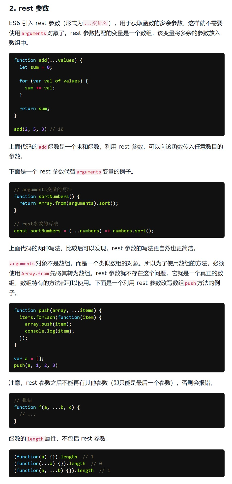

# 剩余参数

> 时间：2022-05-10

<br/>

## 1、概述

<br/>

- 剩余参数（rest 参数），即不定长参数（0个或1个或多个）。
- 剩余参数的本质是一个数组，可以是一个空数组。
- [https://es6.ruanyifeng.com/#docs/function#rest-%E5%8F%82%E6%95%B0](https://es6.ruanyifeng.com/#docs/function#rest-%E5%8F%82%E6%95%B0)

---

## 2、使用

<br/>

- 基本形式为`...参数名`。


```javascript
function f1(...args) {
    console.log(args);
}

f1();

f1(1);

f1(1, 2, 3, 4);
```


```javascript
function f2(a, b, ...args) {
    console.log(args);
}

f2(1, 2, 3, 4); // 3, 4 由剩余参数接收
```


- 使用箭头形式编写函数，如果函数的参数**仅有剩余参数**，包裹函数参数的`()`**不能省略**。


```javascript
const f = (...args) => {};
```


- 函数有多个参数时，剩余参数必须放在最后。


```javascript
const f = (x, y, ...args) => {};
```


- 使用时，剩余参数对应实参的个数可以是0个或1个或多个。0个的时候，本质上是一个空数组。


```javascript
const f = (...args) => {
    console.log(args);
};

f(); // []

f(1); // [1]

f(1, 2, 3); // [1, 2, 3]
```


- 剩余参数可以替代`arguments`，由于箭头函数中没有`arguments`，所以剩余参数对于箭头函数而言是比较有用。


```javascript
const f = (...args) => {
    console.log(args);
};
```


- 剩余参数不仅能用在函数中，也能在其他一些地方使用剩余参数，并且可以和解构赋值一起使用。


```javascript
let [a, ...args] = [1, 3, 5, 7, 9];

console.log(a); // 1
console.log(args); // [3, 5, 7, 9]
```


```javascript
let obj = {
    name: "Zhang",
    age: 20,
    address: "CHN"
};

let {name, ...args} = obj;

console.log(name); // Zhang
console.log(args); // {age: 20, address: 'CHN'}
```


---

## 3、补充

<br/>

