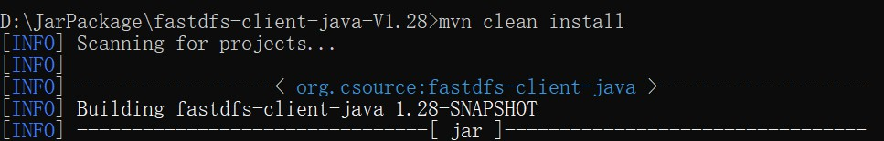
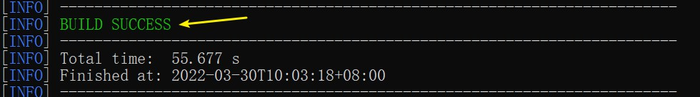
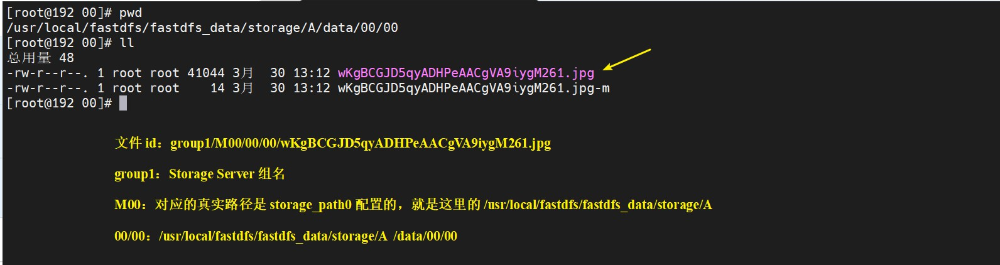

# 简单使用 — 简单的文件上传与下载的 Java 程序

<br/>

## 1、概述

<br/>

- Maven 工程，以测试代码的形式编写文件上传、查看、下载。
- 仅是功能的简单实现，供初学 FastDFS Java SDK 参考，不涉及更多细节。

---

## 2、准备

<br/>

### 2.1、Maven 引入 FastDFS 官方依赖

- FastDFS 官方提供了 Java 使用 FastDFS 的库，[https://gitee.com/fastdfs100/fastdfs-client-java](https://gitee.com/fastdfs100/fastdfs-client-java)、[https://github.com/happyfish100/fastdfs-client-java](https://github.com/happyfish100/fastdfs-client-java)。也有一些开发者基于官方的 FastDFS 库自行编写的库。
- FastDFS 官方提供的 Java 使用 FastDFS 的库，在 Maven 的中央仓库中没有，所以仅是在`pom.xml`文件中引入 GAV 坐标是不行的。要先从 GitHub 或者是 Gitee 仓库中下载源码，然后使用 Maven 的`mvn`命令进行编译，安装进本地的 Maven 仓库，这样才能在`pom.xml`文件中引入对应的 GAV 坐标。
  - 源码下载地址：[https://gitee.com/fastdfs100/fastdfs-client-java](https://gitee.com/fastdfs100/fastdfs-client-java)、[https://github.com/happyfish100/fastdfs-client-java](https://github.com/happyfish100/fastdfs-client-java)、[https://gitee.com/fastdfs100/fastdfs-client-java/tags](https://gitee.com/fastdfs100/fastdfs-client-java/tags)、[https://github.com/happyfish100/fastdfs-client-java/tags](https://github.com/happyfish100/fastdfs-client-java/tags)
  - 对下载后的压缩包进行解压，进入解压后的目录，并在当前路径下打开命令行窗口。
  - 使用`mvn clean install`命令（这里使用`mvn`命令的前提是，Maven 已经配置了环境变量），对源码进行编译以及编译后将其安装进 Maven 本地仓库。
  - 编译、安装过程中没有报错，便可以在 Maven 工程的`pom.xml`文件中引入相应的 GAV 坐标。








```xml
<!-- FastDFS 官方提供的依赖 -->
<!-- 2020-03-30 使用 V1.28 -->
<dependency>
    <groupId>org.csource</groupId>
    <artifactId>fastdfs-client-java</artifactId>
    <version>1.28-SNAPSHOT</version>
</dependency>

<!-- 测试代码用 -->
<dependency>
    <groupId>junit</groupId>
    <artifactId>junit</artifactId>
    <version>4.12</version>
    <scope>test</scope>
</dependency>
```


- FastDFS 官方提供的 Java SDK，不同版本间使用上略有差异。这里使用的是`1.28-SNAPSHOT`这一版本。

---

### 2.2、Maven 项目中 FastDFS 配置文件

- FastDFS Java Client SDK 的基本使用在 [https://gitee.com/fastdfs100/fastdfs-client-java](https://gitee.com/fastdfs100/fastdfs-client-java) [https://github.com/happyfish100/fastdfs-client-java](https://github.com/happyfish100/fastdfs-client-java) 的`README.md`中。
- Maven 项目中 FastDFS 配置文件一般在类路径下（Maven 项目中的`src/main/resources`下），允许有子目录。
- 配置文件的形式可以是`.conf`文件，也可以是`.properties`文件。
- 在这里，使用`.properties`文件（路径为`src/main/resources/com/yscyber/fastdfs/fastdfs-client.properties`），进行一些基础性的配置。


```properties
# 配置文件名 fastdfs-client.properties(或使用其它文件名 xxx-yyy.properties)

# 注1：properties 配置文件中属性名跟 conf 配置文件不尽相同，并且统一加前缀"fastdfs."，便于整合到用户项目配置文件
# 注2：fastdfs.tracker_servers 配置项不能重复属性名，多个 tracker_server 用逗号","隔开
# 注3：除了fastdfs.tracker_servers，其它配置项都是可选的

fastdfs.connect_timeout_in_seconds = 5
fastdfs.network_timeout_in_seconds = 30
fastdfs.charset = UTF-8
fastdfs.http_anti_steal_token = false
fastdfs.http_secret_key = FastDFS1234567890
fastdfs.http_tracker_http_port = 80

# Tracker Server
fastdfs.tracker_servers = 192.168.1.8:22122

# 连接池
fastdfs.connection_pool.enabled = true
fastdfs.connection_pool.max_count_per_entry = 500
fastdfs.connection_pool.max_idle_time = 3600
fastdfs.connection_pool.max_wait_time_in_ms = 1000
```


---

### 2.3、启动 FastDFS

- 服务器启动 FastDFS（单机且 Tracker Server 与 Storage Server 部署在同一台服务器上）。

```shell
/usr/bin/fdfs_trackerd /etc/fdfs/tracker.conf start
/usr/bin/fdfs_storaged /etc/fdfs/storage.conf start
```


- 为了便于操作，关闭服务器防火墙。实际使用中，根据需要配置防火墙（开放端口）。

---

## 3、文件上传

<br/>

```java
import org.csource.common.MyException;
import org.csource.common.NameValuePair;
import org.csource.fastdfs.*;

import org.junit.Test;

import java.io.IOException;

public class FastDFSFileUploadTest {

    @Test
    public void uploadTest() {
        TrackerClient trackerClient = null;
        TrackerServer trackerServer = null;
        StorageClient1 storageClient1 = null;

        try {
            // 1、加载配置文件
            ClientGlobal.initByProperties("com/yscyber/fastdfs/fastdfs-client.properties");

            // 2、通过 Tracker Client 获取与 Tracker Server 的连接
            trackerClient = new TrackerClient();
            trackerServer = trackerClient.getTrackerServer();

            // 3、通过 Tracker Server，创建 Storage Client
            // 通过 Storage Client 完成相关操作

            // org.csource.fastdfs.StorageClient：通过 StorageClient 对象完成文件相关操作
            // org.csource.fastdfs.StorageClient1：继承 org.csource.fastdfs.StorageClient，有一些新方法
            storageClient1 = new StorageClient1(trackerServer);

            // 4、NameValuePair 类似键值对集合，用于定义文件元数据（元信息），可有可无
            NameValuePair[] fileMeta = new NameValuePair[1];
            fileMeta[0] = new NameValuePair("fileName", "1.jpg");

            // 5、upload_file1 方法（有多种重载）：上传文件至 FastDFS
            // 参数 1：文件的路径
            // 参数 2：文件的扩展名
            // 参数 3：文件元信息
            // 返回值：由 FastDFS 自动生成的文件 id，后续访问、下载文件的凭证
            String fileId = storageClient1.upload_file1("C:\\Users\\21616\\Desktop\\当前\\039170be-508a-48bf-bea9-13c8f8cf5b88\\1.jpg", "jpg", fileMeta);

            // 最终输出：文件的id，group1/M00/00/00/wKgBCGJD5qyADHPeAACgVA9iygM261.jpg
            System.out.println(fileId);

        } catch (IOException | MyException e) {
            e.printStackTrace();
        } finally {
            try {
                if (storageClient1 != null) {
                    storageClient1.close();
                }
            }catch (IOException e) {
                e.printStackTrace();
            }
        }

    }

}
```


- 文件上传成功后，返回一个字符串，即文件的 id，作为后续相关操作的“凭证”。
- 可以到服务器中查看文件是否是真的上传成功。





---

## 4、文件是否存在

<br/>

- 根据文件 id 查询文件在当前 FastDFS 中是否存在。


```java
import org.csource.common.MyException;
import org.csource.fastdfs.*;

import org.junit.Test;

import java.io.IOException;

public class FastDFSFileUploadTest {

    @Test
    public void queryTest() {
        TrackerClient trackerClient = null;
        TrackerServer trackerServer = null;
        StorageClient1 storageClient1 = null;

        try {
            // 1、加载配置文件，基于类路径加载
            ClientGlobal.initByProperties("com/yscyber/fastdfs/fastdfs-client.properties");

            // 2、通过 Tracker Client 获取与 Tracker Server 的连接
            trackerClient = new TrackerClient();
            trackerServer = trackerClient.getTrackerServer();

            // 3、通过 Tracker Server，创建 Storage Client
            // 通过 Storage Client 完成相关操作

            // org.csource.fastdfs.StorageClient：通过 StorageClient 对象完成文件相关操作
            // org.csource.fastdfs.StorageClient1：继承 org.csource.fastdfs.StorageClient，有一些新方法
            storageClient1 = new StorageClient1(trackerServer);

            // 4、根据文件 id，判断文件是否存在
            FileInfo fileInfo = storageClient1.query_file_info1("group1/M00/00/00/wKgBCGJD5qyADHPeAACgVA9iygM262.jpg");
            if (fileInfo == null) {
                System.out.println("文件不存在！");
            } else {
                System.out.println(fileInfo);
            }

        } catch (IOException | MyException e) {
            e.printStackTrace();
        } finally {
            try {
                if (storageClient1 != null) {
                    storageClient1.close();
                }
            }catch (IOException e) {
                e.printStackTrace();
            }
        }

    }

}
```


---

## 5、文件下载

<br/>

- 根据文件 id 从 FastDFS 中获取文件。


```java
import org.csource.common.MyException;
import org.csource.fastdfs.*;

import org.junit.Test;

import java.io.File;
import java.io.FileOutputStream;
import java.io.IOException;

public class FastDFSFileUploadTest {

    @Test
    public void downloadTest() {
        TrackerClient trackerClient = null;
        TrackerServer trackerServer = null;
        StorageClient1 storageClient1 = null;

        try {
            // 1、加载配置文件
            ClientGlobal.initByProperties("com/yscyber/fastdfs/fastdfs-client.properties");

            // 2、通过 Tracker Client 获取与 Tracker Server 的连接
            trackerClient = new TrackerClient();
            trackerServer = trackerClient.getTrackerServer();

            // 3、通过 Tracker Server，创建 Storage Client
            // 通过 Storage Client 完成相关操作

            // org.csource.fastdfs.StorageClient：通过 StorageClient 对象完成文件相关操作
            // org.csource.fastdfs.StorageClient1：继承 org.csource.fastdfs.StorageClient，有一些新方法
            storageClient1 = new StorageClient1(trackerServer);

            String fileId = "group1/M00/00/00/wKgBCGJD5qyADHPeAACgVA9iygM261.jpg";
            FileInfo fileInfo = storageClient1.query_file_info1(fileId);
            if (fileInfo != null) {
                byte[] bytes = storageClient1.download_file1(fileId);

                FileOutputStream fileOutputStream = new FileOutputStream(new File("E:\\xx.jpg"));
                fileOutputStream.write(bytes);
                fileOutputStream.close();

                System.out.println("下载完毕！");
            } else {
                System.out.println("文件不存在！");
            }
        } catch (IOException | MyException e) {
            e.printStackTrace();
        } finally {
            try {
                if (storageClient1 != null) {
                    storageClient1.close();
                }
            }catch (IOException e) {
                e.printStackTrace();
            }
        }
    }

}
```