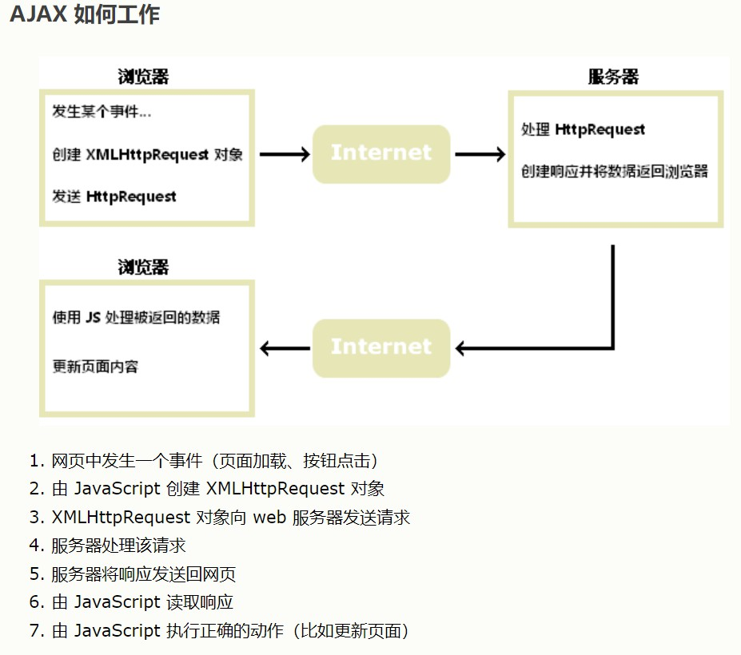

# Ajax

<br/>

## 1、概述

- Ajax，全称 Asynchronous JavaScript And XML（异步的 JavaScript 和 XML）。
- Ajax 不是新的编程语言，而是一种使用现有标准的新方法（一种套路）。
- Ajax 是一个令人误导的名称。Ajax 应用程序可能使用 XML 来传输数据，但将数据作为纯文本或 JSON 文本传输也同样常见。
- Ajax 最大的优点是在不重新加载整个页面的情况下，可以与服务器交换数据已达到更新部分网页内容。





---

### 2、JavaScript 原生 Ajax

- 核心`XMLHttpRequest`对象：[https://www.w3school.com.cn/js/js_ajax_http.asp](https://www.w3school.com.cn/js/js_ajax_http.asp)

- 发送 HTTP 请求：[https://www.w3school.com.cn/js/js_ajax_http_send.asp](https://www.w3school.com.cn/js/js_ajax_http_send.asp)

- 接收 HTTP 响应：[https://www.w3school.com.cn/js/js_ajax_http_response.asp](https://www.w3school.com.cn/js/js_ajax_http_response.asp)

```html
<!DOCTYPE html>
<html lang="zh">
<head>
    <meta charset="UTF-8">
    <title>Ajax</title>
</head>
<body>
<div>
    <input type="button" id="doAjax" value="使用 JS 原生 Ajax 请求数据"/>
</div>
<script>
    // 点击按钮
    document.getElementById("doAjax").onclick = function () {
        let xhr;

        // 1、创建 XMLHttpRequest 对象
        // 兼容性写法
        if (window.XMLHttpRequest) {
            // 用于现代浏览器的代码
            xhr = new XMLHttpRequest();
        } else {
            // 应对老版本 IE 浏览器的代码
            xhr = new ActiveXObject("Microsoft.XMLHTTP");
        }

        // 2、监听 XMLHttpRequest 对象的 readyState 属性，以处理 HTTP 响应
        xhr.onreadystatechange = function() {
            if (xhr.readyState === 4 && xhr.status === 200) {
                let ajaxTestResult = xhr.responseText;
                console.log(JSON.parse(ajaxTestResult));
            }
        };

        // 请求的 URL
        let ajaxTestUrl = 'http://poetry.apiopen.top/sentences';
        // 请求的方法
        let ajaxTestMethod = 'GET';
        // 是否异步，一般为 true 异步
        let ajaxTestAsync = true;

        // 3、发送 HTTP 请求
        // 此处是 GET 请求
        xhr.open(ajaxTestMethod, ajaxTestUrl, ajaxTestAsync);
        // GET 的时候，send 方法不需要带参数
        xhr.send();
    };
</script>
</body>
</html>
```

```html
<!DOCTYPE html>
<html lang="zh">
<head>
    <meta charset="UTF-8">
    <title>Ajax</title>
</head>
<body>
<div>
    <input type="button" id="doAjax" value="使用 JS 原生 Ajax 请求数据"/>
</div>
<script>
    // 点击按钮
    document.getElementById("doAjax").onclick = function () {
        let xhr;

        // 1、创建 XMLHttpRequest 对象
        // 兼容性写法
        if (window.XMLHttpRequest) {
            // 用于现代浏览器的代码
            xhr = new XMLHttpRequest();
        } else {
            // 应对老版本 IE 浏览器的代码
            xhr = new ActiveXObject("Microsoft.XMLHTTP");
        }

        // 2、监听 XMLHttpRequest 对象的 readyState 属性，以处理 HTTP 响应
        xhr.onreadystatechange = function() {
            if (xhr.readyState === 4 && xhr.status === 200) {
                let ajaxTestResult = xhr.responseText;
                console.log(JSON.parse(ajaxTestResult));
            }
        };

        // 请求的 URL
        let ajaxTestUrl = 'https://freecityid.market.alicloudapi.com/whapi/json/alicityweather/briefforecast3days';
        // 请求的方法
        let ajaxTestMethod = 'POST';
        // 是否异步，一般为 true 异步
        let ajaxTestAsync = true;

        // 3、发送 HTTP 请求
        xhr.open(ajaxTestMethod, ajaxTestUrl, ajaxTestAsync);

        // setRequestHeader 设置 HTTP 请求报文的报文首部
        xhr.setRequestHeader("Authorization", "APPCODE xxxxx");
        xhr.setRequestHeader("Content-Type", "application/x-www-form-urlencoded");

        // POST 的时候，send 方法可以有参数，参数将被放入 HTTP 请求报文的报文主体中
        xhr.send("token=xxxx&cityId=284609");
    };
</script>
</body>
</html>
```

---

### 3、jQuery Ajax

- 编写常规的 Ajax 代码并不容易，因为不同的浏览器对 Ajax 的实现并不相同。这意味着您必须编写额外的代码对浏览器进行测试。jQuery 对原生的 Ajax 进行封装，使得开发的时候，无需再考虑兼容性方面等问题。

- [https://www.w3school.com.cn/jquery/jquery_ajax_get_post.asp](https://www.w3school.com.cn/jquery/jquery_ajax_get_post.asp)（`$.get()`和`$.post()`）

- [https://www.w3school.com.cn/jquery/ajax_ajax.asp](https://www.w3school.com.cn/jquery/ajax_ajax.asp)（`$.ajax()`）

```html
<!DOCTYPE html>
<html lang="zh-CN">
<head>
    <meta charset="UTF-8">
    <title>Ajax</title>
</head>
<body>
<input type="button" id="test_ajax" value="jQuery Ajax" />

<script src="https://cdn.bootcdn.net/ajax/libs/jquery/3.6.0/jquery.js"></script>
<script>
    $("#test_ajax").on('click', function() {
        let ajaxTestUrl = "http://poetry.apiopen.top/sentences";

        // $.get(url, callback); GET 请求
        $.get(ajaxTestUrl, function(data, status) {
            if (status === 'success') {
                console.log(data);
                console.log(status);
            }
        });
    });
</script>
</body>
</html>
```

```html
<!DOCTYPE html>
<html lang="zh-CN">
<head>
    <meta charset="UTF-8">
    <title>Ajax</title>
</head>
<body>
<input type="button" id="test_ajax" value="jQuery Ajax" />

<script src="https://cdn.bootcdn.net/ajax/libs/jquery/3.6.0/jquery.js"></script>
<script>
    $("#test_ajax").on('click', function() {
        let ajaxTestUrl = "https://api.apiopen.top/getJoke";

        // $.post(url, data, callback);
        // $.post() 默认使用的 HTTP 请求首部 Content-Type: application/x-www-form-urlencoded
        // 参数 data 的代码书写形式 键值字符串 或 JSON
        $.post(ajaxTestUrl, "type=text&page=2&count=5", function(data, status) {
            if (status === 'success') {
                console.log(data);
                console.log(status);
            }
        });
    });
</script>
</body>
</html>
```

```html
<!DOCTYPE html>
<html lang="zh-CN">
<head>
    <meta charset="UTF-8">
    <title>Ajax</title>
</head>
<body>
<input type="button" id="test_ajax" value="jQuery Ajax" />

<script src="https://cdn.bootcdn.net/ajax/libs/jquery/3.6.0/jquery.js"></script>
<script>
    $("#test_ajax").on('click', function() {
        let ajaxTestUrl = "https://api.apiopen.top/getJoke";

        $.post(ajaxTestUrl, {type: "text", page: 3, count: 5}, function(data, status) {
            if (status === 'success') {
                console.log(data);
                console.log(status);
            }
        });
    });
</script>
</body>
</html>
```

```html
<!DOCTYPE html>
<html lang="zh">
<head>
    <meta charset="UTF-8">
    <title>Ajax</title>
</head>
<body>
<input type="button" value="jQuery Ajax" id="test_ajax" />

<script src="https://cdn.bootcdn.net/ajax/libs/jquery/3.6.0/jquery.js"></script>
<script>
    $("#test_ajax").on('click', function() {

        let url = "http://poetry.apiopen.top/sentences";

        $.ajax({
            url: url,
            type: 'GET',
            success: function(response) {
                console.log(response);
            },
            error: function(error) {
                console.log(error);
            }
        });

    })
</script>
</body>
</html>
```

```html
<!DOCTYPE html>
<html lang="zh">
<head>
    <meta charset="UTF-8">
    <title>Ajax</title>
</head>
<body>
<input type="button" value="jQuery Ajax" id="test_ajax" />

<script src="https://cdn.bootcdn.net/ajax/libs/jquery/3.6.0/jquery.js"></script>
<script>
    $("#test_ajax").on('click', function() {

        let url = "https://freecityid.market.alicloudapi.com/whapi/json/alicityweather/briefforecast3days";

        $.ajax({
            async: true,

            url: url,
            type: 'POST',
            headers: {
                Authorization: 'APPCODE xxx'
            },
            contentType: 'application/x-www-form-urlencoded',
            data: 'token=xxxx&cityId=284609',

            success: function(response) {
                console.log(JSON.parse(response));
            },
            error: function(error) {
                console.log(error);
            }
        });

    })
</script>
</body>
</html>
```

```html
<!DOCTYPE html>
<html lang="zh">
<head>
    <meta charset="UTF-8">
    <title>Ajax</title>
</head>
<body>
<input type="button" value="jQuery Ajax" id="test_ajax" />

<script src="https://cdn.bootcdn.net/ajax/libs/jquery/3.6.0/jquery.js"></script>
<script>
    $("#test_ajax").on('click', function() {

        let url = "https://freecityid.market.alicloudapi.com/whapi/json/alicityweather/briefforecast3days";

        $.ajax({
            async: true,

            url: url,
            type: 'POST',
            headers: {
                Authorization: 'APPCODE b8334e2c6bfe4673afdfba5a9308b909'
            },
            contentType: 'application/x-www-form-urlencoded',
            data: {
                token: '677282c2f1b3d718152c4e25ed434bc4',
                cityId: '284609'
            },

            success: function(response) {
                console.log(JSON.parse(response));
            },
            error: function(error) {
                console.log(error);
            }
        });

    })
</script>
</body>
</html>
```

---

### 4、其他的 HTTP 库

Axios：[https://axios-http.com](https://axios-http.com)
