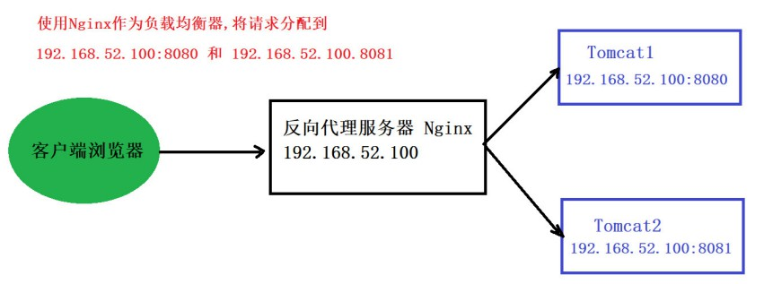
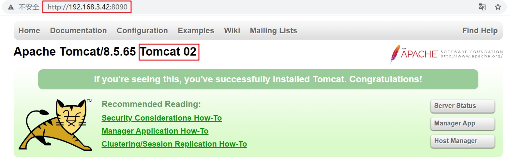
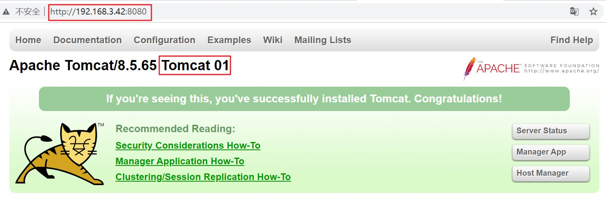
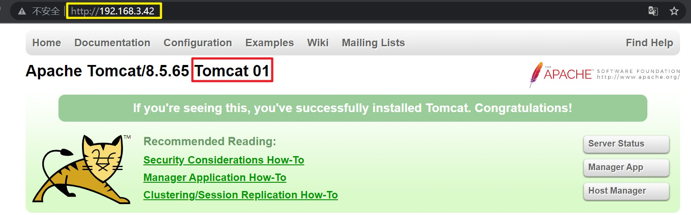
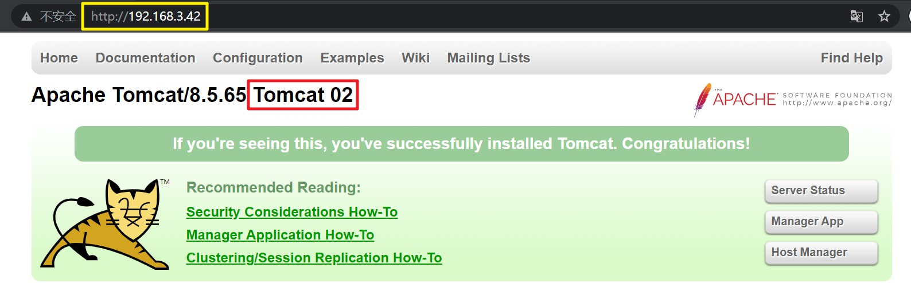
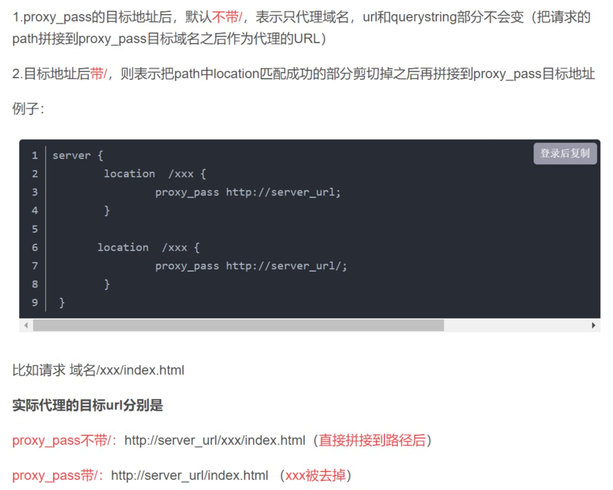

# 使用 Nginx 实现负载均衡

<br/>

## 1、概述





- 负载均衡，就是在多服务器的情况下，有效的对客户端请求进行“分流”，降低每台服务器所面临的“压力”，始终能够对外提供可靠的服务。
- Nginx 是一个常用的负载均衡器，先将请求拦截，再根据配置将请求分发到其所代理的服务器。所以“负载均衡”的基础是“反向代理”。
- Nginx 负载均衡只是面对高并发场景的一种手段**之一**。面对高并发的场景，往往是需要多种手段相结合。

---

## 2、举例

- 使用 Nginx 实现一个简单的负载均衡。一台服务器（`192.168.3.42`，虚拟机举例）上部署了两个 Tomcat，同时也部署了一个 Nginx，使用 Nginx 对这两个 Tomcat 进行负载均衡。

- 1、准备两个 Tomcat，修改配置使得两个的端口不一样，使得两个 Tomcat 能够同时启动。同时对 Tomcat 默认的欢迎页面进行一定的修改，使得能够区分 Nginx 将请求转到了哪一台服务器。








- 2、Nginx 配置文件：

```nginx
worker_processes  1;


events {
	worker_connections  1024;
}


http {
	include       mime.types;
	default_type  application/octet-stream;
	sendfile        on;
	keepalive_timeout  65;

    # 负载均衡的关键，在其中配置被代理的服务器的 IP 地址、端口等
	upstream mytomcat {
		server 192.168.3.42:8080;
		server 192.168.3.42:8090;
	}

	server {
		listen       80;
		server_name  localhost; # localhost（本机） 指 Nginx 所在主机，等价于 192.168.3.42

		location / {
			proxy_pass http://mytomcat;
		}
	}
}
```

- 3、使用浏览器访问`http://192.168.3.42`，然后刷新（为使效果更加明显，可以使用“无痕模式”）：








可以看到每一次刷新，实际上访问到的是不同的 Tomcat。这样就实现了一个简单的负载均衡。

---

## 3、常见负载均衡策略

- 1、轮询策略：Nginx 负载均衡所使用的默认策略。每个请求按照时间顺序逐一分配到不同的服务器（轮番分配）。如果某一个服务器下线，Nginx 能够自动剔除。

- 2、权重策略：也称 weight。指在 Nginx 配置文件中通过配置被代理服务器的 weight，根据 weight 分配请求。权重越高分配的请求越多，权重越低，请求越少。默认的 weight 为1。

```nginx
worker_processes  1;


events {
	worker_connections  1024;
}


http {
	include       mime.types;
	default_type  application/octet-stream;
	sendfile        on;
	keepalive_timeout  65;

	upstream mytomcat {
		server 192.168.3.42:8080 weight=30; # 此处配置 weight
		server 192.168.3.42:8090 weight=70;
	}

	server {
		listen       80;
		server_name  localhost;

		location / {
			proxy_pass http://mytomcat;
		}
	}
}
```

- 3、IP Hash 策略：每个请求按访问 IP 的 Hash 结果分配，这样每个访客固定访问一个后端服务器，可以解决前面几种策略面临的 Session 不共享的问题。

```nginx
worker_processes  1;

events {
	worker_connections  1024;
}

http {
	include       mime.types;
	default_type  application/octet-stream;
	sendfile        on;
	keepalive_timeout  65;

	upstream mytomcat {
		ip_hash; # 此处配置
		server 192.168.3.42:8080;
		server 192.168.3.42:8090;
	}

	server {
		listen       80;
		server_name  localhost;

		location / {
			proxy_pass http://mytomcat;
		}
	}
}
```

---

## 4、注意事项

[https://blog.csdn.net/weixin_42170236/article/details/109315541](https://blog.csdn.net/weixin_42170236/article/details/109315541)


